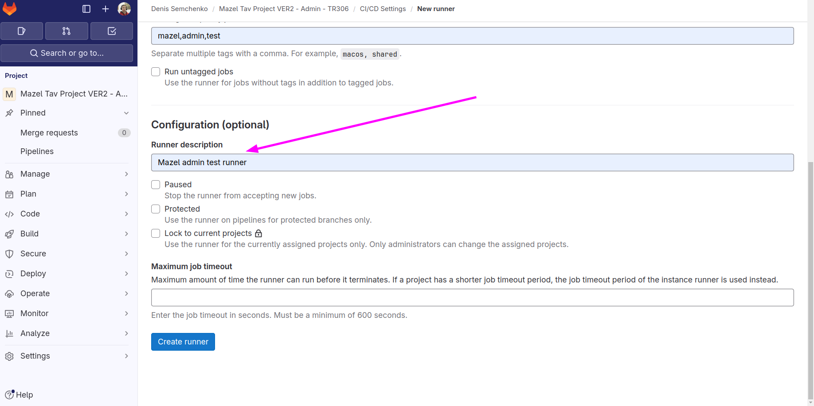

# GitLab CI/CD

- [GitLab CI/CD](#gitlab-cicd)
  - [Example setup for Syn](#example-setup-for-syn)
    - [Configure your `.gitlab-ci.yml`](#configure-your-gitlab-ciyml)
    - [Create a runner on GitLab and on the server and connect them](#create-a-runner-on-gitlab-and-on-the-server-and-connect-them)
    - [Create a Docker runner](#create-a-docker-runner)

## Example setup for Syn

### Configure your `.gitlab-ci.yml`

```yaml
image: alpine:latest

default:
  # Tags are VERY important! Your runner won't pick up jobs without the matching tag!
  tags:
    - staging

stages:
  - deploy

deploy_to_staging:
  stage: deploy
  before_script:
    - apk update && apk add --no-cache openssh-client
    - eval $(ssh-agent -s)
    - chmod 600 $SSH_PRIVATE_KEY
    - ssh-add $SSH_PRIVATE_KEY
    - mkdir -p ~/.ssh
    - chmod 700 ~/.ssh
    - ssh-keyscan -H $VM_IPADDRESS >> ~/.ssh/known_hosts

  script:
    - ssh -v $SSH_USER@$VM_IPADDRESS "cd /home/ubuntu/syncoss-tr415-frontend/ && ./deploy.sh"

  only:
    - staging
```

This config is basically logging into a remote server and running a script

```bash
#!/bin/bash

# Exit on any error
set -e

echo Deployment starts...

echo Fetching latest changes...
git switch staging
git pull origin staging

echo Loading nvm...
source /home/ubuntu/.nvm/nvm.sh

echo Installing dependencies...
/home/ubuntu/.nvm/versions/node/v20.12.1/bin/yarn install --immutable

echo Building the project...
/home/ubuntu/.nvm/versions/node/v20.12.1/bin/yarn build

echo Restarting the pm2 process...
if pm2 restart front; then
  echo "PM2 process 'front' has been restarted successfully."
else
  echo "PM2 process 'front' not found. Starting a new process..."
  pm2 stop front || true
  pm2 delete front || true
  pm2 save
  pm2 start 'yarn start' -n 'front' -i max
  pm2 save
fi

echo Deployment finished successfully!
```

### Create a runner record on GitLab

Go the the GitLab project and click on `Settings` -> `CI/CD` -> `Runners` -> `New project runner`




Use the suggested command to register your runner with you authentication token - leave the page open for later


---

### Create a Docker runner and register it with the GitLab runner record

You should create a process that will phisically run your pipeline. The easiest way is with Docker.

You can (and probabply should) create it on the same machine as your project (Dev or Staging server).

```bash
docker run -d --name gitlab-runner --restart always \
  -v /srv/gitlab-runner/config:/etc/gitlab-runner \
  -v /var/run/docker.sock:/var/run/docker.sock \
  gitlab/gitlab-runner:latest
```

Then register the runner with the command you got from the GitLab UI.

```bash
gitlab-runner register  --url https://gitlab.itcraftlab.com  --token glrt-n9XCz523CHZFjYBwsRV4
```

The info to enter is:

```bash
# Enter the GitLab instance URL
https://gitlab.itcraftlab.com

# Enter a name for the runner
syn-staging

# Enter an executor
docker

# Enter the default Docker image
alpine:latest
```

This basically means that you created a Docker runner (from the `gitlab-runner` image) which uses a Docker executor inside (for example from `alpine:latest` or `node:20` image).


Done. To access the configuration, go to your docker container and edit the `config.toml` file. Also add the remote host to the list of known hosts (from inside you container).

```bash
docker exec -it gitlab-runner bash
# Your can get or edit your configs here
cat /etc/gitlab-runner/config.toml
# Add the remote host to the list of known hosts
ssh -T git@gitlab.itcraftlab.com # yes
```

---

### Set the env variables for your `.gitlab-ci.yml` on GitLab: `Project Settings - CI/CD - Variables`.

Usually you'd want to set these variables:

```
SSH_PRIVATE_KEY
SSH_USER
VM_IPADDRESS
```
