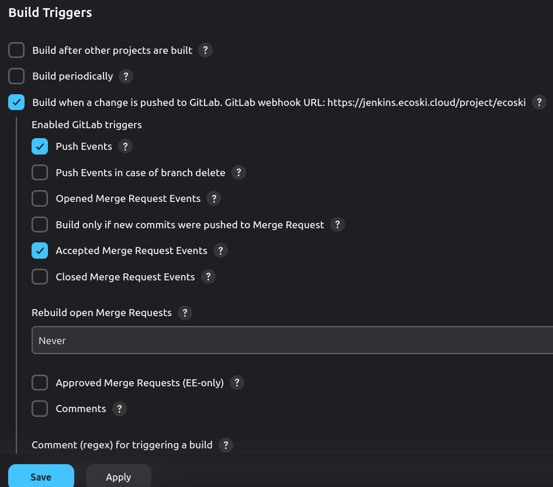
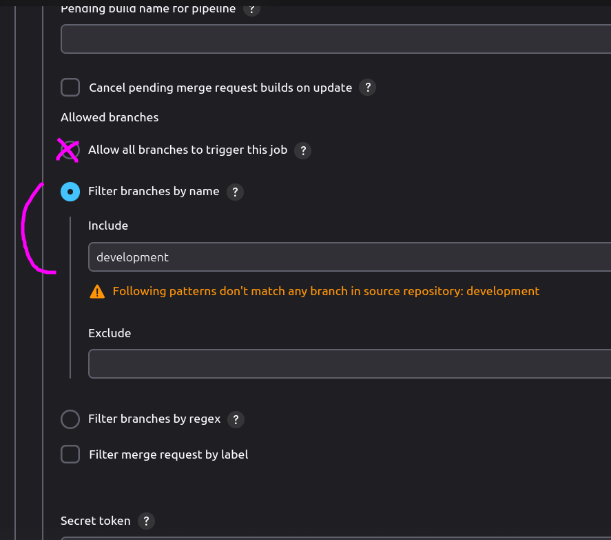
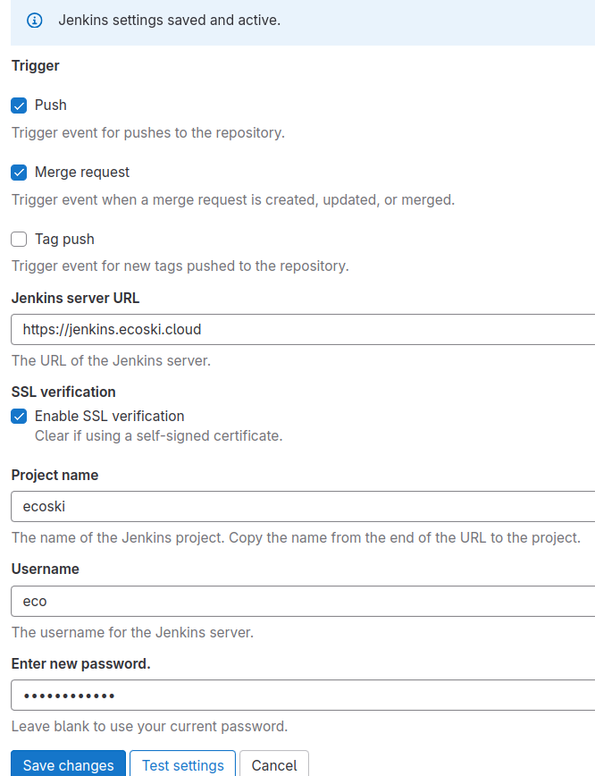

# Jenkins

- [Jenkins](#jenkins)

---

## Jenkins on Docker

1. Use this instruction starting with [step 4](https://www.jenkins.io/doc/book/installing/docker/) to create a running Jenkins container.
2. Log in to the container and get the initial password:

```bash
docker exec jenkins cat /var/jenkins_home/secrets/initialAdminPassword
03b9d81da2cf4327b641d6eb6e133b41
# If there is no such file, then your container was created previously and there are some remnants remaining. Clean up everything and try again
```

Open `http://localhost:8080/` in your browser and paste the password from the logs.

**In practice, you'd run your Jenkins on a server and access it via the server's IP address.**

Create a user and install the plugins (the recommended ones + `SSH Agent` + `Pipeline Stage View`).

---

## Creating a new pipeline

### Jenkins Dashboard

1. Go to `Configure Jenkins -> Plugins -> Available` and install the `GitLab` and `GitLab Authenticate` (and possibly `GitLab API`) plugins. Generally you'd usually also want `SSH Agent` and `Stage View`.
2. Go to Credentials (near the Profile) and add your GitLab credentials as **SSH Username with private key**. Make sure to add your creds to the global scope (otherwiser you'll have to change the default scope in the pipeline configuration).
3. Go to `New Item -> Pipeline` and configure it.
   1. Use `Pipeline script from SCM`, set your GitLab repository URL, and select the credentials you've just added.
   2. In the `Build Triggers` section, check `Build when a change is pushed to GitLab`.



Under the Advanced section:



### GitLab

1. Go to your project's `Settings -> Integrations` and choose `Jenkins`. Configre everything. If your project URL in Jenkins looks like this: `https://jenkins.ecoski.cloud/job/ecoski/`, then fill everything this way:



### Jenkinsfile

1. Create `Jenkinsfile` in the root of your project. Example:

```groovy
pipeline {
  agent any

  environment {
    GIT_URL = 'git@gitlab.itcraftlab.com:denis.semchenko/ecoski-mvp-snow-app-tr427-web.git'
    GIT_BRANCH = 'development'
    GIT_CREDENTIALS_ID = 'ecoski-gitlab'

    SSH_OPTIONS = "-o StrictHostKeyChecking=no"

    SERVER_NAME = 'Dev Server'
    SERVER_USER = 'ubuntu'
    SERVER_HOST = 'ec2-16-16-157-152.eu-north-1.compute.amazonaws.com'
    SERVER_CREDENTIALS_ID = 'ecoski-dev'

    APP_DIR = '/home/ubuntu/ecoski-mvp-snow-app-tr427-web/'
    APP_SCRIPT = 'deploy.sh'
  }

  stages {
    stage('Checkout') {
      steps {
        git url: "${GIT_URL}",
            branch: "${GIT_BRANCH}",
            credentialsId: "${GIT_CREDENTIALS_ID}"
      }
    }

    stage('Deploy') {
      steps {
        sshagent(credentials: ["${SERVER_CREDENTIALS_ID}"]) {
          sh """
            ssh ${SSH_OPTIONS} ${SERVER_USER}@${SERVER_HOST} \
            bash -l -c \
            "${APP_DIR}${APP_SCRIPT}"
          """
        }
      }
    }
  }
}
```

This config triggers `deploy.sh` - example:

```bash
#!/bin/bash
set -e  # Exit on any error

echo "Deployment starts..."
cd /home/ubuntu/ecoski-mvp-snow-app-tr427-web

echo "Fetching latest changes..."
git switch development
git pull origin development

# Without this step, `yarn` and `pm2` won't be available
echo "Loading nvm..."
source ~/.nvm/nvm.sh

echo "Installing dependencies..."
yarn install --immutable

echo "Building the project..."
yarn build

echo "Restarting/starting pm2 process..."
if ! pm2 restart front; then
  echo "PM2 process 'front' not found. Starting a new process..."
  pm2 stop front || true  # Gracefully stop if running
  pm2 delete front || true  # Remove old process if exists
  pm2 start "yarn start" --name front -i max
fi
pm2 save

echo "Deployment finished successfully!"
```

---

## Issues

### Host key verification issue

When you create a new pipeline and try to run it, you might get this error:


This happens because this is the first time the client (Jenkins) is trying to access the host.

To fix this, enter the Jenkins container and run the following command:

```bash
ssh -T git@gitlab.itcraftlab.com # or the host you're trying to access
# Press 'yes' when asked
```

### `Jenkinsfile` or `deploy.sh` seem to ignore updates

I had a problem: changes I made to `Jenkinsfile` or `deploy.sh` weren't applied. I didn't understand that:

1. In my configuration the `feature/cicd` branch was initially pulled and `Jenkinsfile` was read from there, even though `deploy.sh` was working with the `development` branch. So `Jenkinsfile` was NOT from `development`!
2. `build.sh` was from `development` but as the pipeline was failing, it was effectively never updated. So I didn't realize the changes I'm pushing to `feature/cicd` were not being applied. I had to merge the needed `deploy.sh` to `development` and manually pull it on Dev - after that the pipeline started working.

---
