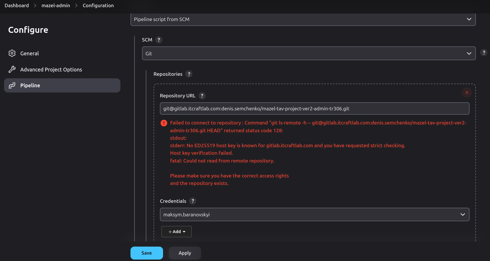

# Jenkins

- [Jenkins](#jenkins)

---

## Learn by Example

### Jenkins Node + React tutorial

1. Fork `https://github.com/jenkins-docs/simple-node-js-react-npm-app`

## Create a Jenkins container

Create this `Dockerfile`:

```Dockerfile
FROM jenkins/jenkins

USER root

RUN apt-get update && \
    apt-get install -y curl && \
    curl -sL https://deb.nodesource.com/setup_20.x | bash - && \
    apt-get install -y nodejs

# The following 2 blocks can be skipped if you don't need to access private repositories or you're solve this later

# Add gitlab.itcraftlab.com to known hosts to avoid host key verification issues
RUN mkdir -p /var/jenkins_home/.ssh && \
    ssh-keyscan gitlab.itcraftlab.com > /var/jenkins_home/.ssh/known_hosts

# Fix permissions
RUN chown -R jenkins:jenkins /var/jenkins_home/.ssh && \
    chmod 700 /var/jenkins_home/.ssh && \
    chmod 600 /var/jenkins_home/.ssh/known_hosts

USER jenkins
```

Build the image from the directory with the `Dockerfile`:

```bash
docker build -t jenkins .

docker run -d -p 8080:8080 -p 50000:50000 --name jenkins -v jenkins_home:/var/jenkins_home jenkins

# Copy the password
docker exec jenkins cat /var/jenkins_home/secrets/initialAdminPassword
03b9d81da2cf4327b641d6eb6e133b41

# If there is no such file, then your container was created previously and there are some remnants remaining. Clean up everything and try again
```

Open `http://localhost:8080/` in your browser and paste the password from the logs.

Create a user and install the plugins (the recommended ones + Node.js plugin + `ssh-agent` + `pipeline-stage-view`).

---

Why weren't we just using the default `jenkins/jenkins` image? It doesn't have Node.js installed by default. We CAN use it but you'll have to enter the container and install Node.js manually.

---

### Issues

#### Host key verification issue

When you create a new pipeline and try to run it, you might get this error:



This happens because this is the first time the client (Jenkins) is trying to access the host.

To fix this, enter the Jenkins container and run the following command:

```bash
ssh -T git@gitlab.itcraftlab.com # or the host you're trying to access
# Press 'yes' when asked
```
