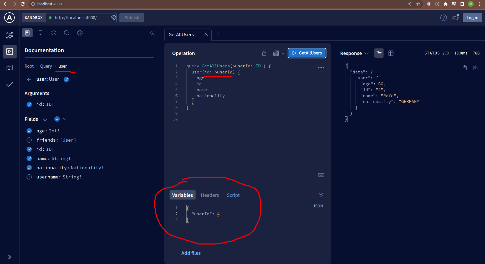

# GraphQL

- [GraphQL](#graphql)
  - [Learn by trying](#learn-by-trying)
    - [Basics](#basics)
    - [Types](#types)
    - [Books \& Authors example](#books--authors-example)
    - [Mutations](#mutations)
  - [Apollo](#apollo)
    - [Arguments](#arguments)

---

## Learn by trying

### Basics

GQL basically uses **a single endpoint**. The query is sent as a POST request with the query in the body. The response is JSON.

```bash
npm i express express-graphql graphql
```

```js
const express = require('express');
const { graphqlHTTP } = require('express-graphql');
const { GraphQLSchema, GraphQLObjectType, GraphQLString } = require('graphql');
const app = express();

const schema = new GraphQLSchema({
  query: new GraphQLObjectType({
    name: 'HelloWorld',
    fields: () => ({
      message: {
        type: GraphQLString,
        resolve: () => 'Hello World',
      },
    }),
  }),
});

app.use(
  '/hello-world',
  graphqlHTTP({
    graphiql: true,
    schema,
  })
);

app.listen(5000, () => console.log('The server is running on port 5000'));
```

Open `localhost:5000/hello-world` it's a **GQL playground**. You can use it or Postman to send requests.

Run the following:

```graphql
query {
  message
}
```

Note that by default GQL runs `query` (basicaly GET) if no other operation is specified. You can also use `mutation` (basically POST) to post the data.

Output:

```json
{
  "data": {
    "message": "Hello World"
  }
}
```

Note the dedicated `Postman` collection.

Also note this [public API](https://github.com/trevorblades/countries) for studying.

---

### Types

GraphQL has 5 scalar types:

```graphql
type User {
  id: ID # non-human-readable string
  name: String
  age: Int
  height: Float
  isMarried: Boolean
}
```

---

### Books & Authors example

```js
const { GraphQLSchema, GraphQLObjectType, GraphQLString, GraphQLList, GraphQLInt, GraphQLNonNull } = require('graphql');
const { authors, books } = require('./data/book-data');

const AuthorType = new GraphQLObjectType({
  name: 'Author',
  description: 'This represents an author of a book',
  fields: () => ({
    id: { type: GraphQLNonNull(GraphQLInt) },
    name: { type: GraphQLNonNull(GraphQLString) },
    books: {
      type: new GraphQLList(BookType),
      resolve: (author) => books.filter((book) => book.authorId === author.id),
    },
  }),
});

const BookType = new GraphQLObjectType({
  name: 'Book',
  description: 'This represents a book written by an author',
  fields: () => ({
    id: { type: GraphQLNonNull(GraphQLInt) },
    name: { type: GraphQLNonNull(GraphQLString) },
    authorId: { type: GraphQLNonNull(GraphQLString) },
    author: {
      type: AuthorType,
      resolve: (book) => authors.find((author) => author.id === book.authorId),
    },
  }),
});

const RootQueryType = new GraphQLObjectType({
  name: 'Query',
  description: "Root Query (you'll see this in the docs)",
  fields: () => ({
    book: {
      type: BookType,
      description: 'A Single Book',
      args: {
        id: { type: GraphQLInt },
      },
      resolve: (parent, args) => books.find((book) => book.id === args.id),
    },
    books: {
      type: new GraphQLList(BookType),
      description: 'List of All Books',
      resolve: () => books,
    },
    author: {
      type: AuthorType,
      description: 'A Single Author',
      args: {
        id: { type: GraphQLInt },
      },
      resolve: (parent, args) => authors.find((author) => author.id === args.id),
    },
    authorsByName: {
      type: new GraphQLList(AuthorType),
      description: 'A Single Author by name',
      args: {
        name: { type: GraphQLString },
      },
      resolve: (parent, args) =>
        authors.filter((author) => author.name.toLowerCase().includes(args.name.toLowerCase())),
    },
    authors: {
      type: new GraphQLList(AuthorType),
      description: 'List of All Authors',
      resolve: () => authors,
    },
  }),
});

const schema = new GraphQLSchema({
  query: RootQueryType,
});
```

---

### Mutations

The GraphQL version of POST/PUT/DELETE is called a mutation. Mutations are used to create, update, or delete data in the back end

```js
const RootMutationType = new GraphQLObjectType({
  name: 'Mutation',
  description: 'Root Mutation (you will see this in the docs)',
  fields: () => ({
    addBook: {
      type: BookType,
      description: 'Add a book',
      args: {
        name: { type: GraphQLNonNull(GraphQLString) },
        authorId: { type: GraphQLNonNull(GraphQLInt) },
      },
      resolve: (parent, args) => {
        const book = { id: books.length + 1, name: args.name, authorId: args.authorId };
        books.push(book);
        return book;
      },
    },
    addAuthor: {
      type: AuthorType,
      description: 'Add an author',
      args: {
        name: { type: GraphQLNonNull(GraphQLString) },
      },
      resolve: (parent, args) => {
        const author = { id: authors.length + 1, name: args.name };
        authors.push(author);
        return author;
      },
    },
  }),
});

const schema = new GraphQLSchema({
  query: RootQueryType,
  mutation: RootMutationType,
});
```

---

## Apollo

Apollo is a GraphQL client that allows you to easily query the exact data you need from a GraphQL server. In addition to fetching and mutating data, Apollo analyzes your queries and their results to construct a client-side cache of your data, which is kept up to date as further queries and mutations are run, fetching more results from the server.

```bash
npm install @apollo/server graphql

```

### Arguments

// TODO: add an explanation

```ts
type Query {
  user(id: ID!): User
}

export default {
  Query: {
    user: (_, { id }) => UserList.find((user) => user.id === Number(id)),
  }
}
```

