# Kubernetes

- [Kubernetes](#kubernetes)
  - [Intro](#intro)
    - [Commands cheat sheet](#commands-cheat-sheet)
  - [Components](#components)
    - [Master node](#master-node)
    - [Worker nodes](#worker-nodes)
    - [Pod](#pod)
      - [Deployments](#deployments)
    - [Service and Ingress](#service-and-ingress)
    - [ConfigMap and Secret](#configmap-and-secret)
    - [Volume](#volume)
    - [StatefulSet](#statefulset)
  - [Configuration](#configuration)
    - [etcd](#etcd)
    - [`kubectl`](#kubectl)
  - [MiniKube](#minikube)
  - [Practice](#practice)
    - [`kbs-demo`](#kbs-demo)

---

## Intro

K8s helps you to manage multiple (hundreds or even thousands) containers in different environments (physical, virtual, cloud, etc.)

Widely used with microservices because managing them manually is hard.

K8s provides:

- High availability (no downtime)
- Scalability and high performance (you can scale is up and down as needed)
- Disaster recovery (backup and restore)

K8s cluster has:

- A **master node**
- Many worker **nodes**

Each node has a **kubelet** that communicates with the master node.

Each node has different apps deployed on it. For example, the number of Docker containers on each node can be different depending on the current load.

<details>
<summary>Basic architecture</summary>

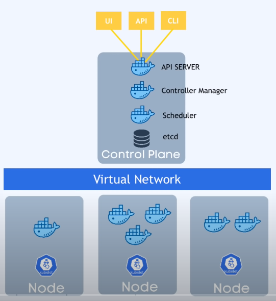

</details>

---

### Commands cheat sheet

Pods

```bash
# Create a pod
kubectl create -f <pod-config-file>

# Create a pod from an image
kubectl run <pod-name> --image=my-image

# Get all pods in the default namespace
kubectl get po

# Get all pods in all namespaces
kubectl get po --all-namespaces

# Get all pods in a specific namespace
kubectl get po -n <namespace>

# Get detailed information about a pod
kubectl describe po <pod-name>

# Get logs from a pod
kubectl logs <pod-name>

# Execute a command in a pod
kubectl exec -it <pod-name> -- <command>

# Delete a pod
kubectl delete po <pod-name>
```

Deployments

```bash
# Create a deployment
kubectl create -f <deployment-config-file>

# Create a deployment from an image
kubectl create deployment <deployment-name> --image=my-image

# Get all deployments in the default namespace
kubectl get deploy

# Scale a deployment
kubectl scale --replicas=4 deployment/<deployment-name>

# Update a deployment (rolling update)
kubectl set image deployment/<deployment-name> <container-name>=my-new-image

# Get detailed information about a deployment
kubectl describe deploy <deployment-name>

# Delete a deployment
kubectl delete deploy <deployment-name>
```

Services

```bash
# Create a service
kubectl create -f <service-config-file>

# Expose deployment as a service
kubectl expose deployment <deployment-name> --type=NodePort --port=80

# Get all services in the default namespace
kubectl get svc

# Get detailed information about a service
kubectl describe svc <service-name>

# Delete a service
kubectl delete svc <service-name>
```

Namespaces

```bash
# Create a namespace
kubectl create namespace <namespace-name>

# Get all namespaces
kubectl get ns

# Get detailed information about a namespace
kubectl describe ns <namespace-name>

# Switch to a namespace
kubectl config set-context --current --namespace=<namespace-name>

# Delete a namespace
kubectl delete ns <namespace-name>
```

Secrets

```bash
# Create a secret
kubectl create secret generic <secret-name> --from-literal=<key>=<value>

# Get all secrets in the default namespace
kubectl get secret

# Get detailed information about a secret
kubectl describe secret <secret-name>

# Delete a secret
kubectl delete secret <secret-name>
```

---

## Components

<details>
<summary>Components</summary>

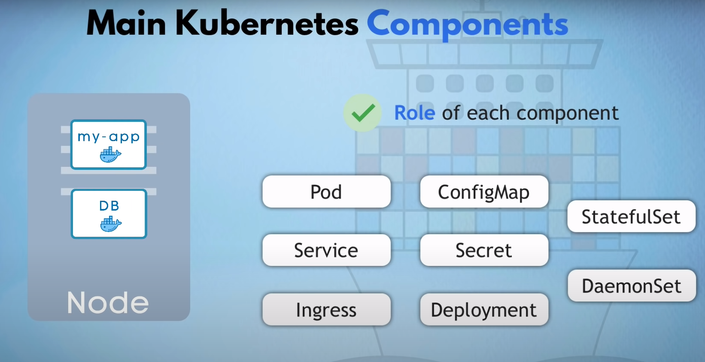

</details>

### Master node

Manages:

- **API Server** - entrypoint to k8s cluster
- **Controller Manager** - watches the state of the cluster and makes changes to bring it to the desired state
- **Scheduler** - intelligently assigns work to nodes based on the load and available resources
- **etcd** - key-value store that stores the state of each node in the cluster
- **Virtual Network** - network that connects all the nodes in the cluster

<details>
<summary>Master node</summary>

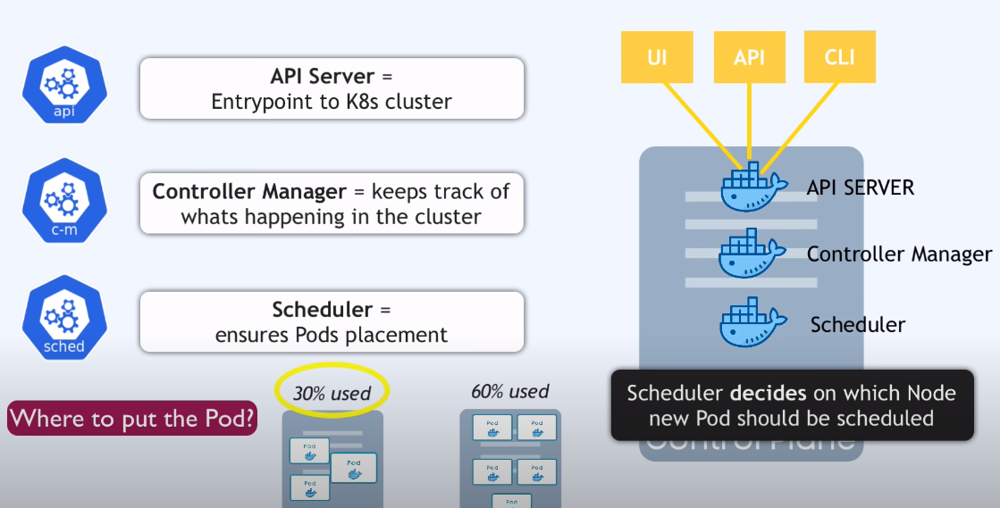

</details>

It's crucial to have **multiple** master nodes: if one goes down, the other can take over.

---

### Worker nodes

Use much more resources than master nodes.

---

### Pod

- Smallest unit in k8s, similar to Docker container
- Abstraction over a container (as we aren't required to use Docker)
- Usually 1 app per pod
- Each pod gets itw own IP address

Poda are **ephemeral** - they can be created and destroyed at any time. If a pod dies, a new one is created and gets a new IP address. To address this issue, we use **Services**.

#### Deployments

In practice, we work not with pods, but with **Deployments**. Deployments are used to manage **Replica sets**.

The Deployment is:

- Abstraction over a pod, a blueprint
- Used to manage multiple **replicas** of the same pod
- Used for stateless applications

<details>
<summary>Replica</summary>

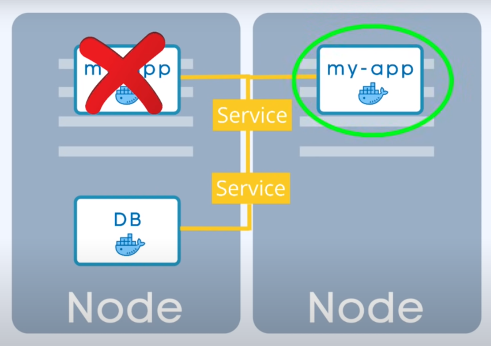

</details>

Example deployment:

```yaml
apiVersion: apps/v1
kind: Deployment
metadata:
  name: nginx-deployment
  labels:
    app: nginx
spec:
  replicas: 3
  selector:
    matchLabels:
      app: nginx
  # Blueprint for the pods
  template:
    metadata:
      labels:
        app: nginx
    spec:
      containers:
        - name: mongodb
          image: mongo:7
          ports:
            - containerPort: 27017
```

We can assign **Labels** to pretty much anything. They are not unique - they are used **to group** objects together.
All Pod replicas will have the same label.

---

### Service and Ingress

Service:

- Permanent IP address for a pod
- Loosely coupled with pods: if a pod dies, the service will still work and will maintain the same IP address
- There are 2 types of services:
  - **ClusterIP** or internal (default) - only accessible within the cluster
  - **NodePort** - accessible from outside the cluster

Ingress:

- Routes traffic to services based on the URL
- Acts as a reverse proxy

As Services act like a static IP, We can have replicas of the same pod connected to the same Service.

---

### ConfigMap and Secret

ConfigMap:

- Stores global configuration data that can be used by pods
- Plain text, used for non-sensitive data
- Can be used to store environment variables, etc.

Secret:

- Similar to ConfigMap, but stores sensitive data
- base64 encoded
- Encrypted (not by default, must be configured!)

In practice, it means that we define `myapp-secret.yaml` and `myapp-config.yaml` files and reference them everywere we need.

---

### Volume

- Similar to Docker volumes
- Used to store data that needs to persist even if the pod is destroyed
- Can be used to share data between pods
- Can get data from different sources:
  - host machine
  - cloud storage
  <!-- - Different types of volumes:
  - **EmptyDir** - created when a pod is created and destroyed when the pod is destroyed
  - **HostPath** - mounts a directory from the host machine to the pod
  - **PersistentVolume** - used to store data that needs to persist even if the pod is destroyed
  - **PersistentVolumeClaim** - used to claim a PersistentVolume -->

**K8s doesn't manage data persistance!** You are responsible for backing up your data, replicating and storing it securely and reliably.

<details>
<summary>Storage</summary>

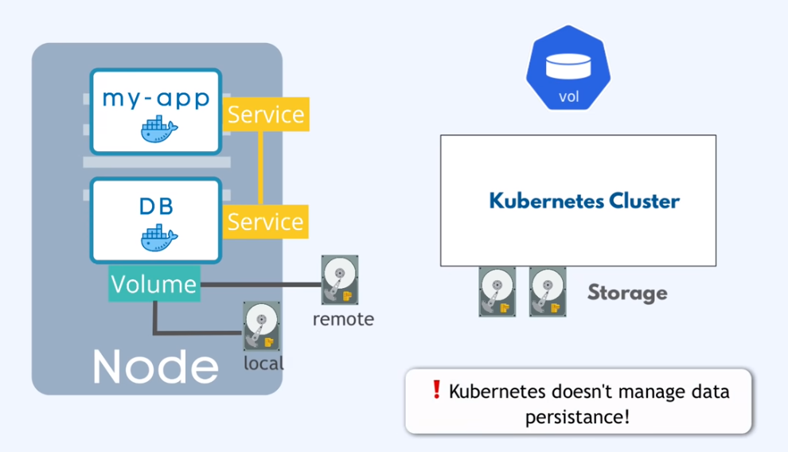

</details>

---

### StatefulSet

- StatefulSets are used to manage stateful applications
- Databases should be created by StatefulSets, not Deployments
- Using StatefulSet can be tedious, so often databases live outside Kubernetes

---

## Configuration

To access our K8s cluster, we use Control Plane. To access it, we can use different clients:

- **kubectl** - command line tool
- **Dashboard** - web UI
- **API** - REST API

Requests are sent in JSON or YAML format.

<details>
<summary>K8s is declarative: we declare the desired state of the cluster, and K8s makes changes to bring the cluster to that state.</summary>

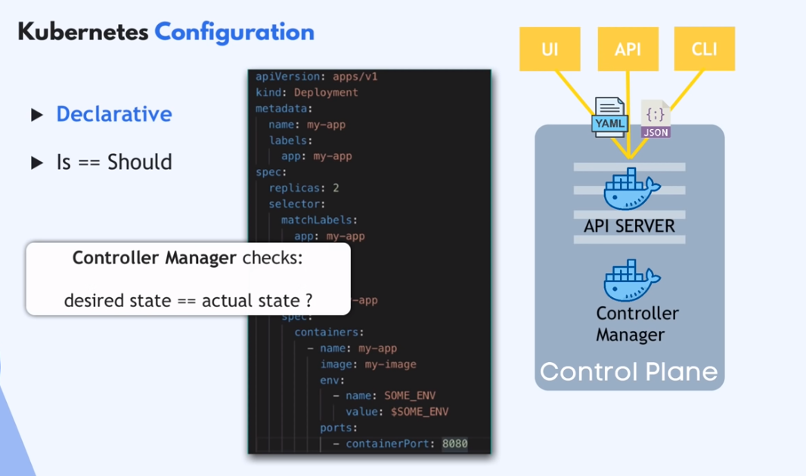

</details>

Each configuration file has 3 parts:

- **Metadata**
- **Spec**
  - is kind-specific (different for different kinds)
- **Status**
  - automatically generated by K8s and shows the current state of the object. K8s compares the desired state with the current state and makes changes to bring the current state to the desired state.
  - gets the data from **etcd**

<details>
<summary>Spec</summary>

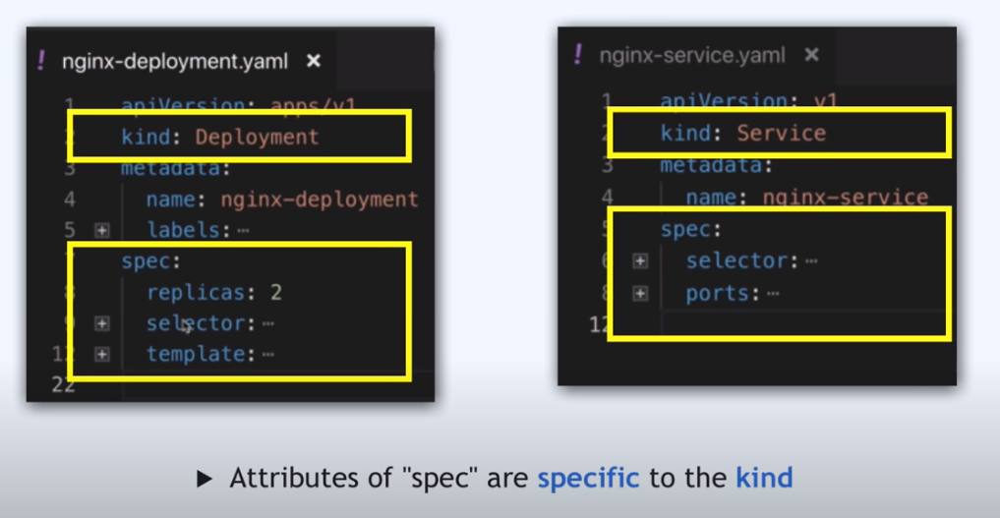

</details>

<details>
<summary>Status</summary>

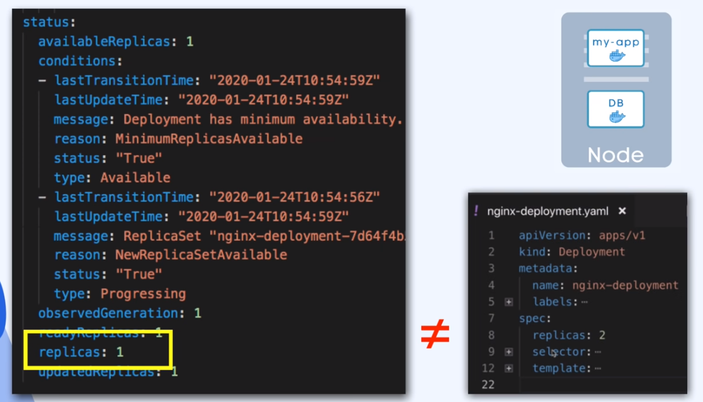

</details>

---

### etcd

- Key-value store
- Stores the current state of each component within the cluster
- Stores the desired state of the cluster

---

### `kubectl`

Command line tool used to interact with the K8s cluster

---

## MiniKube

- A tool to run a single-node K8s cluster on your local machine for learning and testing
- Master and worker nodes are on the same machine
- Has Docker pre-installed inside
- can run as
  - container
  - VM

<details>
<summary>Test cluster</summary>

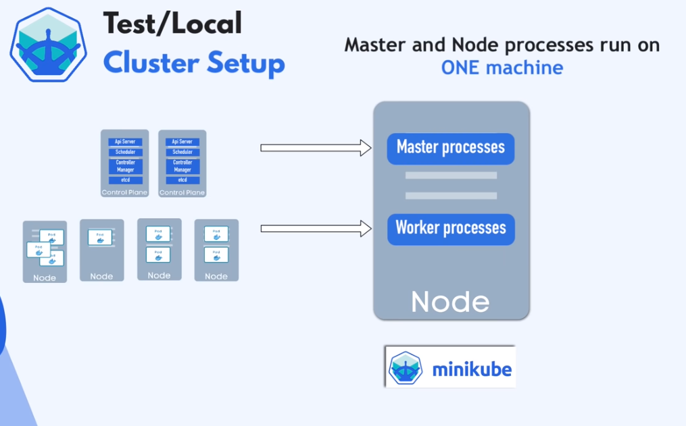

</details>

Install [minikube](https://minikube.sigs.k8s.io/docs/start/) and [kubectl](https://kubernetes.io/docs/tasks/tools/install-kubectl-linux/)

We'll use `kubectl` to configure the cluster and `minikube` to run it.

```bash
minikube status

minikube start

kubectl config current-context
# Should return `minikube`. If not, you can set it with
# kubectl config use-context minikube

minikube ip # e.g. 192.168.49.2

# Delete and recreate the cluster
minikube delete
minikube start
```

---

## Practice

### `kbs-demo`

<details>
<summary>Components overview</summary>

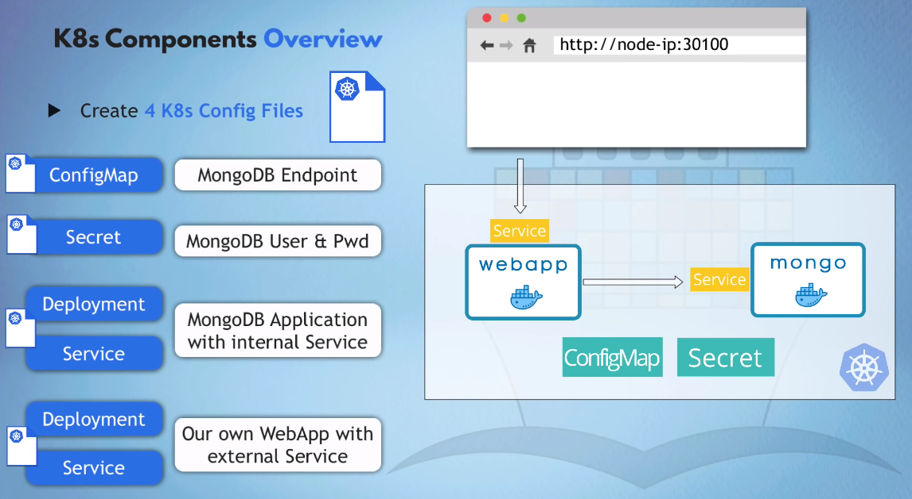

</details>

Create config files:

- `mongo-config.yaml` - ConfigMap for MongoDB
- `mongo-secret.yaml` - Secret for MongoDB
- `mongo.yaml` - Deployment and Service in one file as they belong together
- `webapp.yaml` - Deployment and Service for the webapp

For the templates, search the documentation. For example, type `deployment` in the search bar and find [this page](https://kubernetes.io/docs/concepts/workloads/controllers/deployment/)

<details>
<summary>Webapp expects this data as environment variables</summary>

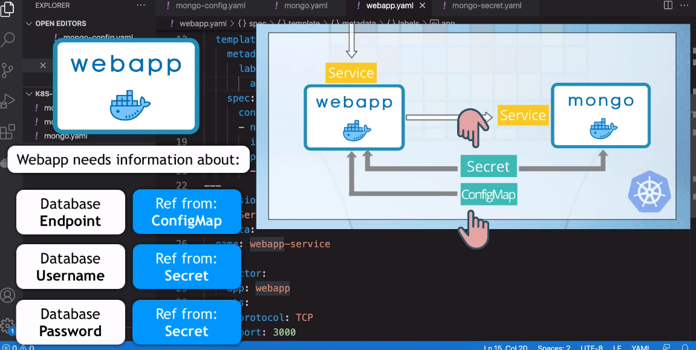

</details>

Once the 4 files mentioned above are configured, we run them:

```bash
# Load config files to the cluster
kubectl apply -f mongo-secret.yaml
kubectl apply -f mongo-config.yaml
kubectl apply -f mongo.yaml
kubectl apply -f webapp.yaml

# Check the status
kubectl get all
kubectl get svc # Service
kubectl get secret
kubectl get configmap
kubectl get pod
kubectl get node # Currently we only have one with minikube

kubectl get node -o wide # More info for any of the previous commands

# `kubectl describe` == `docker inspect`
kubectl describe service webapp-service
kubectl describe pod mongo-deployment-6cc9b7c7cf-vwjsv

# Logs
kubectl logs mongo-deployment-6cc9b7c7cf-vwjsv # Add `-f` to attach

# Get IP of the node (currently we only have one)
minikube ip # 192.168.49.2
```
