# MIcroservices

- [MIcroservices](#microservices)
  - [Nest](#nest)
    - [`./nest-example` project](#nest-example-project)
    - [Request-response message style](#request-response-message-style)
  - [Kafka](#kafka)
    - [`./kafka` project](#kafka-project)
  - [Nest Udemy project](#nest-udemy-project)
    - [Preparation](#preparation)
    - [Project setup](#project-setup)
    - [Passport](#passport)
    - [JWT Strategy](#jwt-strategy)
    - [18 - Microservices](#18---microservices)
    - [19 - Stripe setup](#19---stripe-setup)
    - [22 Notifications](#22-notifications)
    - [24 Google Cloud Engine Setup](#24-google-cloud-engine-setup)
    - [25 - Productionize and Push Dockerfile](#25---productionize-and-push-dockerfile)
    - [27. Automated CI/CD with CloudBuild](#27-automated-cicd-with-cloudbuild)
    - [28. Helm and Kubernetes](#28-helm-and-kubernetes)
    - [29. Mongo Atlas](#29-mongo-atlas)
    - [30 Kubernetes Services \& Env Variables](#30-kubernetes-services--env-variables)

---

## Nest

### `./nest-example` project

This example project is based on [this](https://youtu.be/C250DCwS81Q?si=-3CpNUCDdCoiB48n) video.

### Request-response message style

For this type of interactions there are 2 types of channels:

- Request channel
- Response channel

**Example**: send values 1,2,3 and receive them back on the receiving side

1st microservice:

```ts
// Controller
@Get('/analytics')
getAnalytics() {
  return this.appService.getAnalytics()
}

// Service
import { from, map } from 'rxjs'

// This method will log all the values but only return the last one
getAnalytics() {
  return from(this.analyticsClient.send('get_analytics', {})).pipe(
    map((data) => {
      console.log(data)
      return data
    })
  )
}
```

2nd microservice:

```ts
// Controller
@MessagePattern('get_analytics')
getAnalytics() {
  return this.appService.getAnalytics()
}

// Service
import { interval, map, takeWhile } from 'rxjs'

getAnalytics() {
  return interval(1000).pipe(
    takeWhile((count) => count <= 2),
    map((count) => count + 1)
  )
}
```

---

## Kafka

### `./kafka` project

This example project is based on [this](https://youtu.be/JJEKPqSlXvk?si=-U92G9EfsWJwFd7H) video.

In the `kafdrop` folder we have a `docker-compose.yml` file that will start a Kafka and Kafdrop containers. Open `localhost:9000` to see the Kafka UI.

---

## Nest Udemy project

[Udemy course](https://www.udemy.com/course/nestjs-microservices-build-deploy-a-scaleable-backend)

The completed project source code is located [here](https://github.com/mguay22/sleepr). There are commits in that repository that follow along with the project.

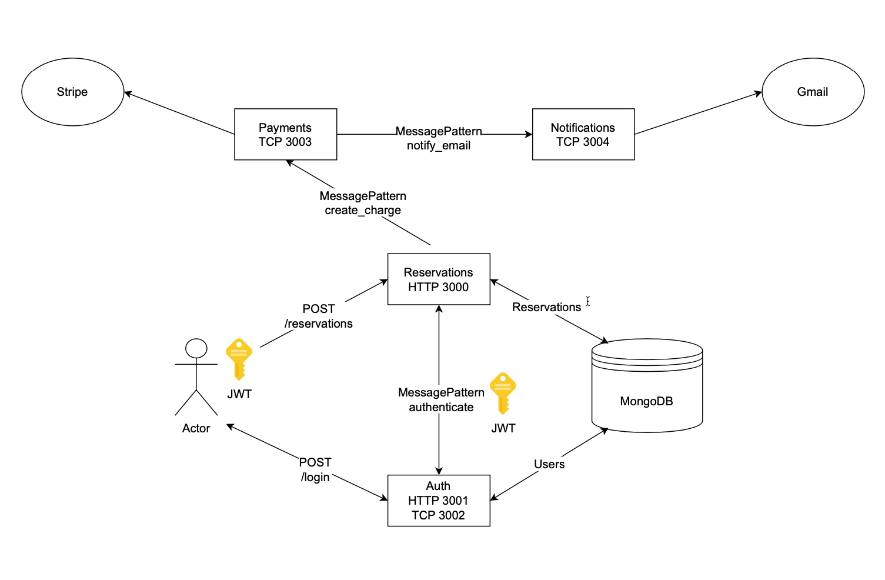

### Preparation

1. Enable `pnpm` using Corepack

```bash
# In the project folder
corepack enable pnpm
corepack use pnpm@latest
```

2. Install Docker

3. Install Google Cloud CLI [for Ubuntu](https://cloud.google.com/sdk/docs/downloads-snap)

```bash
snap remove google-cloud-sdk
snap install google-cloud-cli --classic

nano ~/.bashrc

# Add this line at the end of the file
source /snap/google-cloud-cli/current/completion.bash.inc
# Save the file and exit

source ~/.bashrc
```

4. Install [kubectl](https://kubernetes.io/docs/tasks/tools/install-kubectl-linux/) and [Minikube](https://minikube.sigs.k8s.io/docs/start)

5. Install Nest CLI

```bash
npm i -g @nestjs/cli
```

### Project setup

```bash
nest new sleepr
cd sleepr
pnpm run start
```

We'll create a **monorepo** where we'll have shared modules.

```bash
nest g library common
```

Install some basic packages

```bash
pnpm i mongoose @nestjs/mongoose @nestjs/config joi
```

Create a module and select the `common` library (you can check the `nest-cli.json` file to see the available libraries)

```bash
nest g module database -p common
```

Now we can remove `common.service`, `common.controller` and `common.module` from the `common` library as each of our microservices will import the common modules they need.

Now we can create a `config` module

```bash
nest g module config -p common
```

Connect our `config.module` and `database.module` to the `app.module`. Don't forget the index files.

Btw, update `tsconfig.json` to be able to use `@app/common` paths:

```json
"paths": {
  "@app/common": [
    "libs/common/src"
  ],
  "@app/common/*": [
    "libs/common/src/*"
  ]
}
```

Define the DB abstract schema dn repository in the `database` module.

---

Now create a new app

```bash
nest g app reservations
```

In `nest-cli.json` remove the `sleepr` app and add the `reservations` app as it will be our default app. Also remove the `sleepr` library (the folder)

Connect the `DatabaseModule` to the `ReservationsModule` and create a `reservation` resource.

```bash
nest g resource reservations # Select the `reservations` app
```

Now replace the top-level `reservations.module`, `controller` and `service` with all the generated files - this is what we'll work with from now on.

Add validation and logging:

```bash
pnpm i class-validator class-transformer nestjs-pino pino-http pino-pretty
```

Now let's create a `logger` module

```bash
nest g module logger -p common
```

Add the `LoggerModule` to the `ReservationsModule` and create a `logger` service.

---

```bash
nest g app auth

nest g module users -p auth
nest g controller users -p auth
nest g service users -p auth
```

Create the repo, schema and service for the `users` module.

Try running your newly created app:

```bash
pnpm start:dev auth
```

---

### Passport

```bash
pnpm i @nestjs/passport passport passport-local && pnpm i -D @types/passport-local
pnpm i @nestjs/jwt passport-jwt bcryptjs && pnpm i -D @types/passport-jwt @types/bcryptjs
```

Create dedicated `.env` for each app

---

### JWT Strategy

```bash

```

Create `JWTStrategy` and `JwtAuthGuard`.

---

### 18 - Microservices

Now we need to apply our guard to the `reservation` app. And to do that, we have to start adding microservices.

```bash
pnpm i @nestjs/microservices
```

In our `auth` app, we'll convert it to hybrid app (handles both incoming HTTP requests and requests over our microservices layer).

We'll also create a common `AuthGuard` that will be used in both apps. So this guard will be put to the `libs/common` folder as it should be available for all apps.

---

### 19 - Stripe setup

```bash
nest g app payments
pnpm i stripe
```

Go to [Stripe](https://dashboard.stripe.com/test/dashboard), register, create an account and get the API keys.

Click `New Business` in the top left corner and create a new product.

---

### 22 Notifications

```bash
nest g app notifications
```

To create Google `OAuth` credentials, go to [Google Cloud Console](https://console.cloud.google.com/).

Create new project, go to `APIs & Services` -> `Credentials` -> `OAuth Consent Screen` and fill in the required fields. Add a test user (yourself) as **external** user.

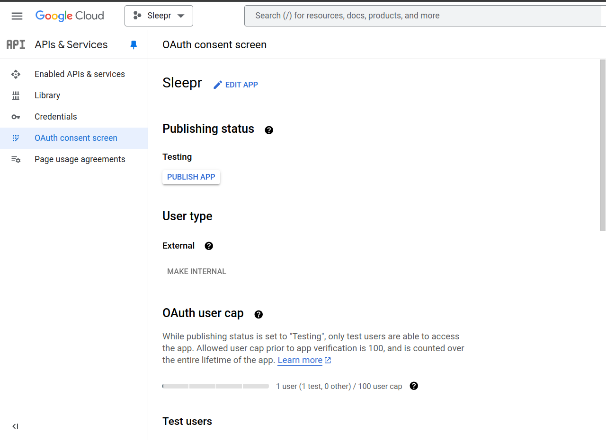

Add a test user (yourself) once again.

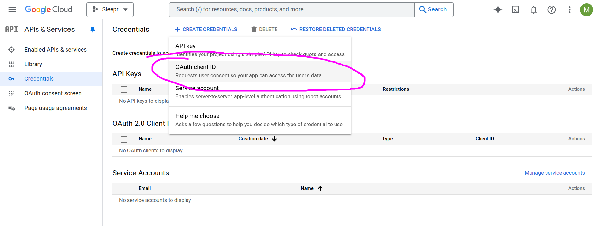

Choose `Web application` and add the `Authorized redirect URIs` (for example `https://developers.google.com/oauthplayground`)

Copy your credentials to the project

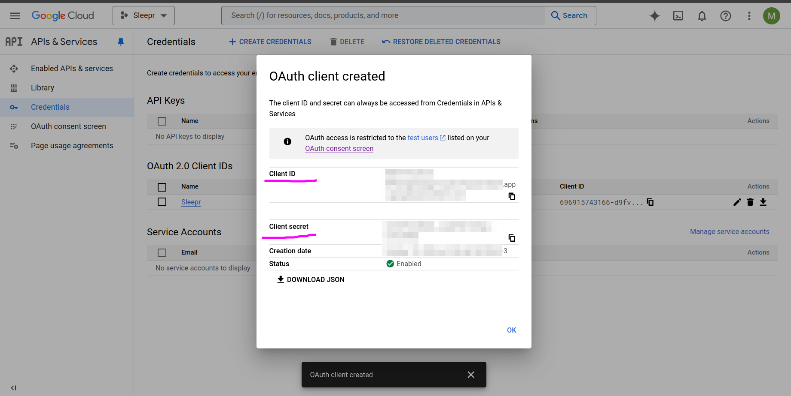

Go to [OAuth Playground](https://developers.google.com/oauthplayground) and select the `Google OAuth2 API v2` and `https://www.googleapis.com/auth/gmail.send` scope.

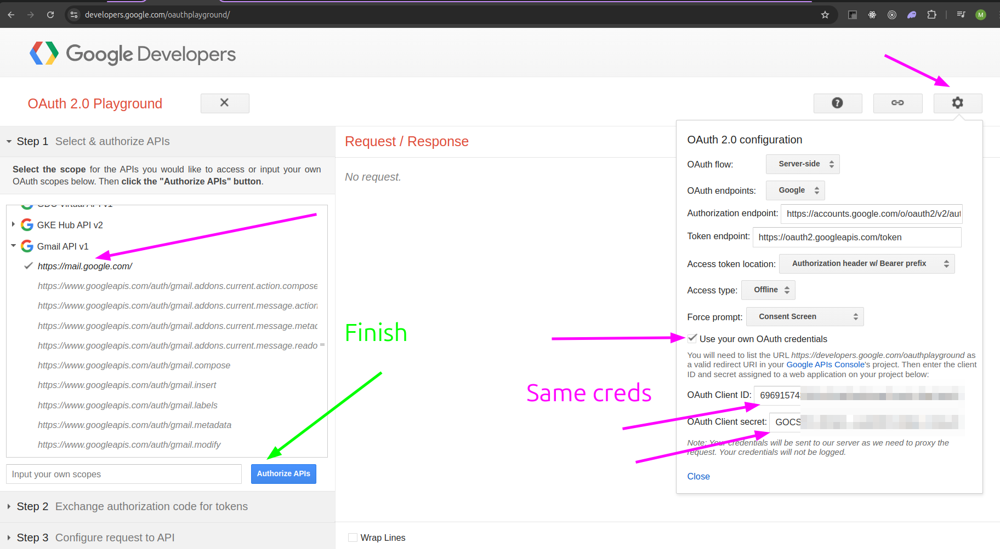

Proceed, choose your account and allow the permissions.

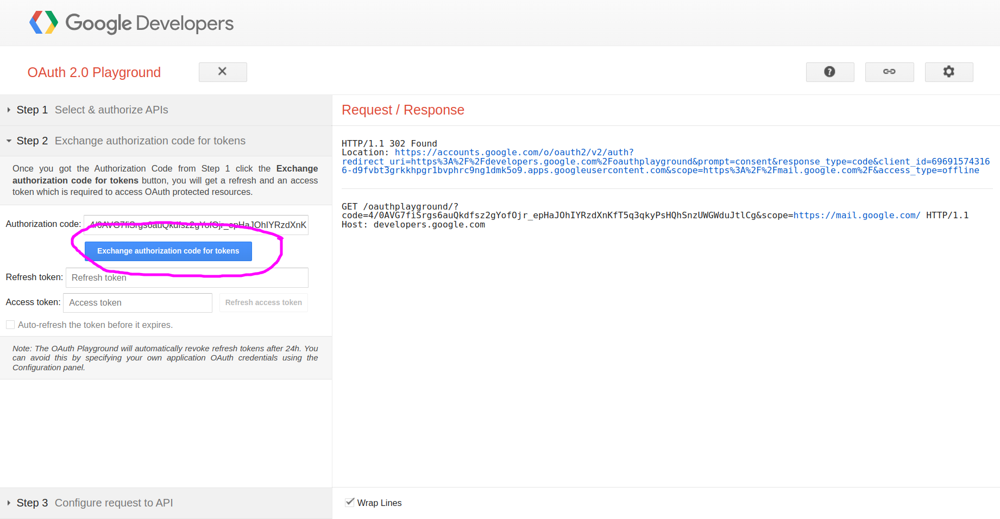

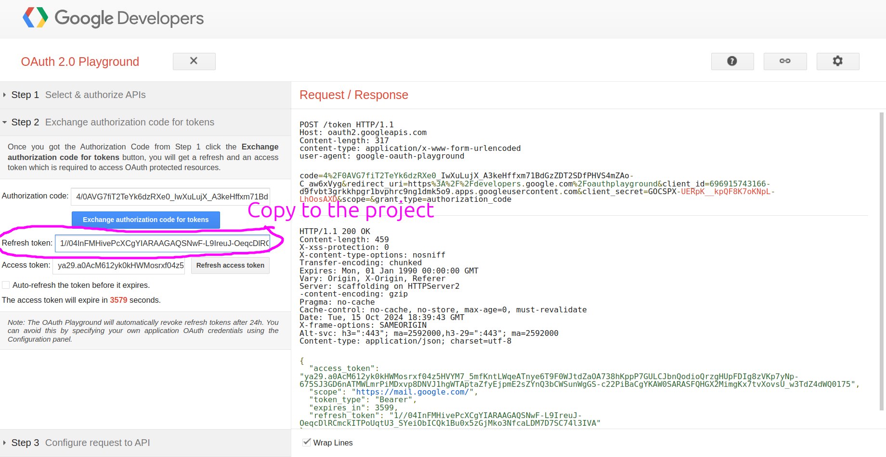

Done. Now create a new user using the same email as the one you used for the OAuth. Logic as this user and create a reservation - you'll receive an email.

---

### 24 Google Cloud Engine Setup

Go to `Google Cloud Console -> Container Registry` and enable the API.

Also enable `Contaier Artifact Registry`. Go to it and create a repository for each of our apps (4 total). We'll push our Docker images to these repositories.

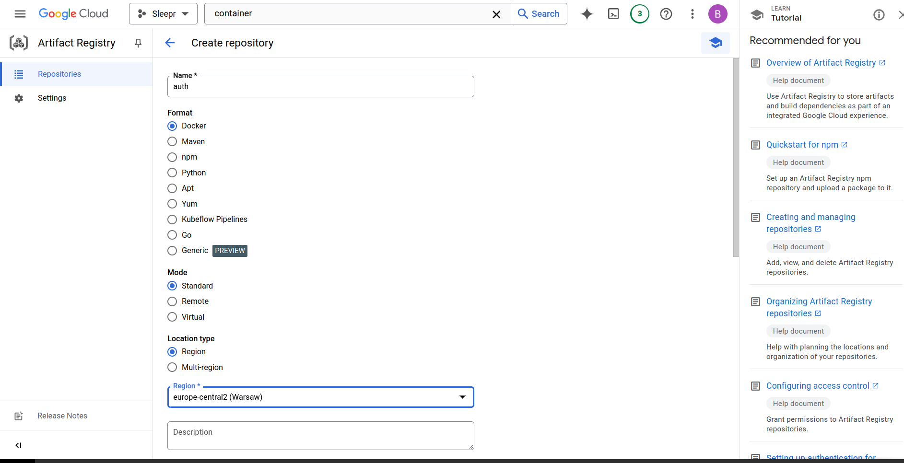

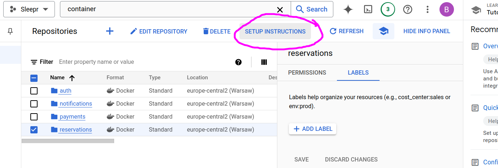

Install `Google Cloud SDK`: [link](https://cloud.google.com/sdk/docs/install-sdk), login and set the project.

```bash
gcloud config configurations create sleepr

gcloud config set project sleepr-439209 # Your project ID
```

Follow the instructions here

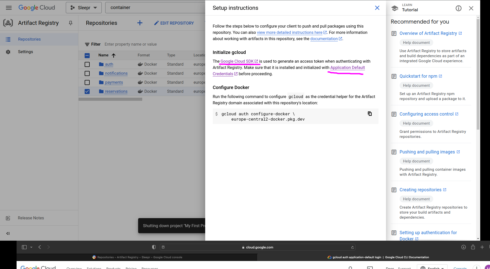

```bash
gcloud auth application-default login

gcloud artifacts repositories list
#Listing items under project sleepr-439209, across all locations.

                                                                    #ARTIFACT_REGISTRY
#REPOSITORY     FORMAT  MODE                 DESCRIPTION  LOCATION         LABELS  ENCRYPTION          CREATE_TIME          UPDATE_TIME          SIZE (MB)
#auth           DOCKER  STANDARD_REPOSITORY               europe-central2          Google-managed key  2024-10-20T13:10:42  2024-10-20T13:12:03  0
#notifications  DOCKER  STANDARD_REPOSITORY               europe-central2          Google-managed key  2024-10-20T13:11:48  2024-10-20T13:12:06  0
#payments       DOCKER  STANDARD_REPOSITORY               europe-central2          Google-managed key  2024-10-20T13:11:21  2024-10-20T13:12:09  0
#reservations   DOCKER  STANDARD_REPOSITORY               europe-central2          Google-managed key  2024-10-20T13:08:44  2024-10-20T13:12:11  0
```

Copy and paste the command from the screenshot above:

```bash
gcloud auth configure-docker \
    europe-central2-docker.pkg.dev
```

Build the images with local tags:

```bash
docker build -t auth -f apps/auth/Dockerfile .
docker build -t payments -f apps/payments/Dockerfile .
docker build -t reservations -f apps/reservations/Dockerfile .
docker build -t notifications -f apps/notifications/Dockerfile .
```

Copy the URI from the `gcloud artifacts repositories list` command and tag the images and use it:

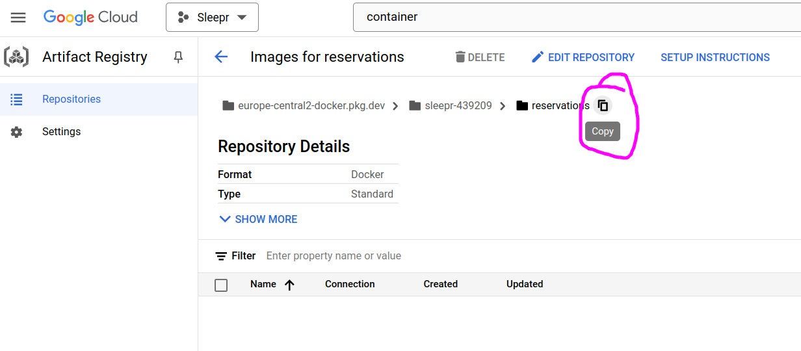

Tag the images for Artifact Registry (including the registry path (`europe-central2-docker.pkg.dev/sleepr-439209`), repository (e.g. `auth`) and tag (`production`)):

```bash
docker tag auth europe-central2-docker.pkg.dev/sleepr-439209/auth/production # We added the `/production` part at the end
docker tag payments europe-central2-docker.pkg.dev/sleepr-439209/payments/production
docker tag reservations europe-central2-docker.pkg.dev/sleepr-439209/reservations/production
docker tag notifications europe-central2-docker.pkg.dev/sleepr-439209/notifications/production
```

Push the images:

```bash
docker image push europe-central2-docker.pkg.dev/sleepr-439209/auth/production
docker image push europe-central2-docker.pkg.dev/sleepr-439209/payments/production
docker image push europe-central2-docker.pkg.dev/sleepr-439209/reservations/production
docker image push europe-central2-docker.pkg.dev/sleepr-439209/notifications/production
```

Verify the images are in the registry:

```bash
gcloud artifacts docker images list europe-central2-docker.pkg.dev/sleepr-439209/reservations
gcloud artifacts docker images list europe-central2-docker.pkg.dev/sleepr-439209/auth
gcloud artifacts docker images list europe-central2-docker.pkg.dev/sleepr-439209/payments
gcloud artifacts docker images list europe-central2-docker.pkg.dev/sleepr-439209/notifications
```

---

### 25 - Productionize and Push Dockerfile

Update our `Dockerfile`-s to only copy what each app needs.

```Dockerfile
FROM node:alpine AS build

WORKDIR  /usr/src/app

COPY package*.json ./
COPY pnpm-lock.yaml ./
# Updates here
COPY tsconfig*.json ./

RUN npm i -g pnpm

RUN pnpm i

# Updates here - we only copy the necessary files
COPY apps/payments apps/payments
COPY libs libs
# Updates here - install app-specific dependencies as well
RUN cd apps/payments && pnpm i

RUN pnpm run build

# The rest is unchanged...
```

Create a `package.json` for every app and move their specific dependencies there from the global `package.json`.

Then rebuild, tag and push the images:

```bash
docker build -t payments -f apps/payments/Dockerfile .
docker tag payments europe-central2-docker.pkg.dev/sleepr-439209/payments/production
docker push europe-central2-docker.pkg.dev/sleepr-439209/payments/production

# Repeat for the other apps
```

---

### 27. Automated CI/CD with CloudBuild

Create a `cloudbuild.yaml` file in the root of the project.

Enable the `Cloud Build API` in the Google Cloud Console.

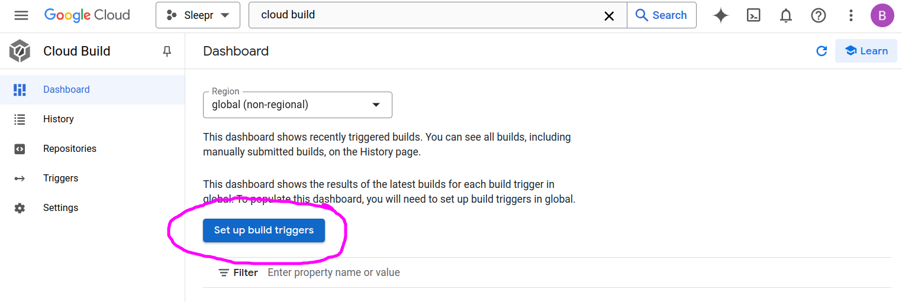

---

### 28. Helm and Kubernetes

1. Install [Helm](https://helm.sh/)

```bash
mkdir k8s
cd k8s
helm create sleepr
```

2. Delete the contents of the `templates` folder clean up the `values.yaml` file.
3. Create deployment and make sure there's always a pod running for each of our apps.

```yaml
kubectl create deployment auth --image=europe-central2-docker.pkg.dev/sleepr-439209/auth/production --dry-run=client -o yaml > deployment.yaml
```

4. Adjust the `deployment.yaml` file

```yaml
apiVersion: apps/v1
kind: Deployment
metadata:
  labels:
    app: auth
  name: auth
spec:
  replicas: 1
  selector:
    matchLabels:
      app: auth
  template:
    metadata:
      labels:
        app: auth
    spec:
      containers:
        - image: europe-central2-docker.pkg.dev/sleepr-439209/auth/production
          name: auth
```

5. Move this file to the `k8s/sleepr/templates/auth` folder
6. Run

```bash
cd sleepr
helm install sleepr .

# Check the status
kubectl get po

# You might see something like this
# NAME                   READY   STATUS             RESTARTS   AGE
# auth-84dbfd974-ln7bj   0/1     ImagePullBackOff   0          3m28s

# You can see the reason for this is that the image is private
kubectl describe po auth-84dbfd974-ln7bj
```

7. Create credentials for Kubernetes to pull the images:

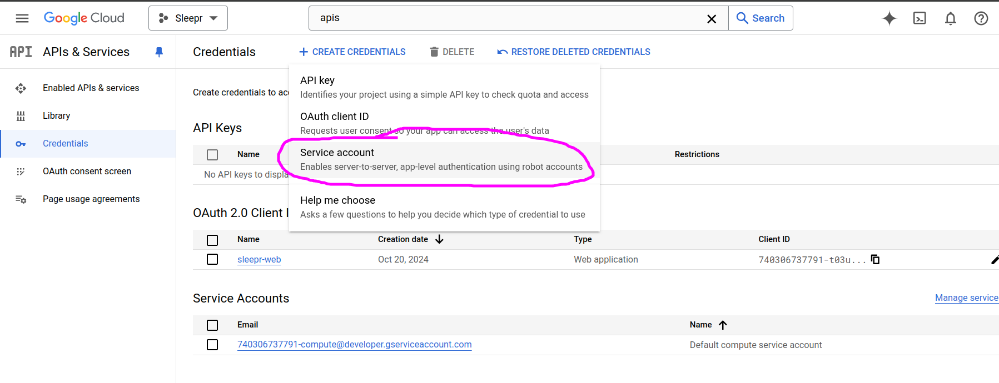

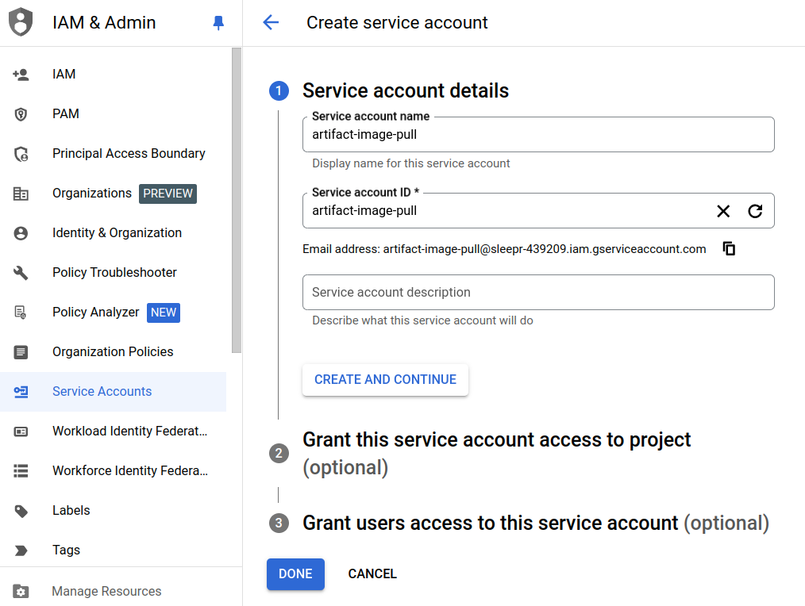

Role: Artifact Registry -> Artifact Registry Reader

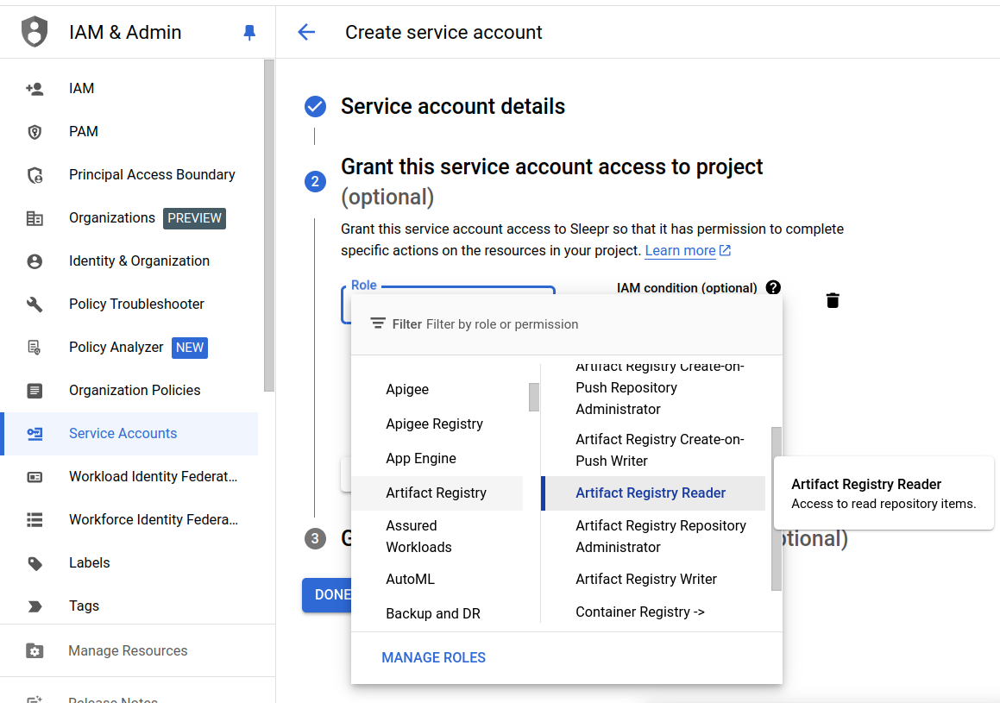

After creation, enter the newly created service account and create a key for it.

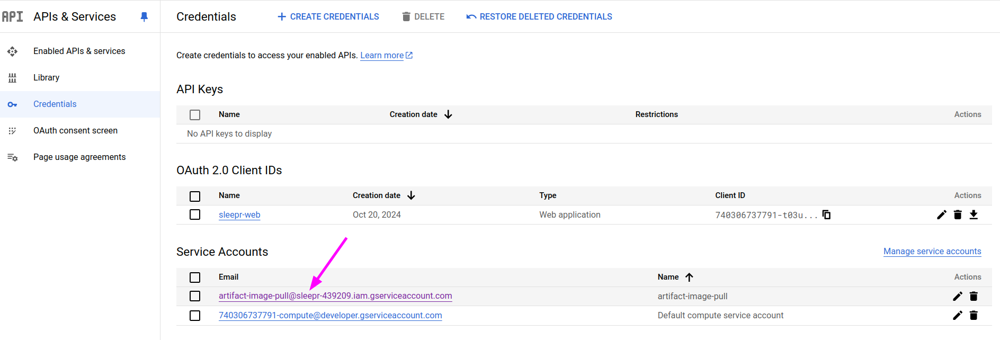

Create a new JSON key and download it.

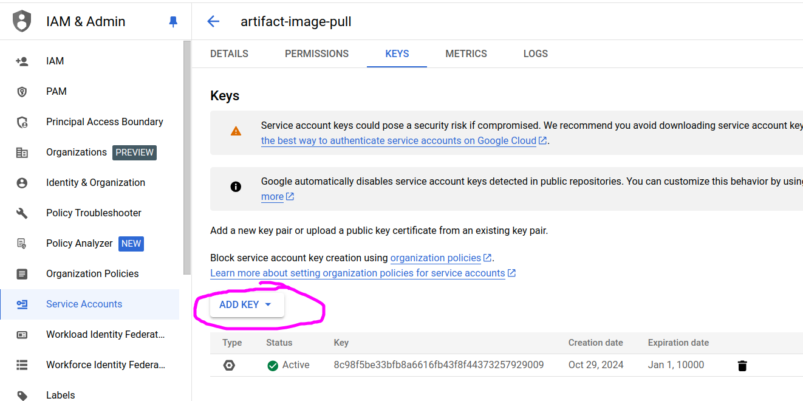

8. Create a secret in Kubernetes (get the --docker-server from the `Artifact Registry - Setup instructions` page):

```bash
kubectl create secret docker-registry gcr-json-key \
  --docker-server=europe-central2-docker.pkg.dev \
  --docker-username=_json_key \
  --docker-password="$(cat ./sleepr-439209-8b78089e4961.json)" \
  --docker-email=kostortitus@gmail.com
```

Now we have to add our key to the default service account so it's actually used.

```bash
kubectl patch serviceaccount default -p '{"imagePullSecrets": [{"name": "gcr-json-key"}]}'

kubectl rollout restart deployment auth
```

Repeat points 3-5 for the other apps.

Upgrade the Helm chart to include the other apps:

```bash
cd k8s/sleepr
helm upgrade sleepr .
```

---

### 29. Mongo Atlas

Create a new cluster in [Mongo Atlas](https://www.mongodb.com/cloud/atlas). Create a new user and add it to the cluster.

```bash
kubectl create secret generic mongodb \
  --from-literal=connectionString=mongodb+srv://sleeprnestapp:<pass>@sleepr.ptlyl.mongodb.net/?retryWrites=true&w=majority&appName=Sleepr

# Verify the secret
kubectl get secrets
# NAME                           TYPE                             DATA   AGE
# gcr-json-key                   kubernetes.io/dockerconfigjson   1      21h
# mongodb                        Opaque                           1      16s
# sh.helm.release.v1.sleepr.v1   helm.sh/release.v1               1      21h
# sh.helm.release.v1.sleepr.v2   helm.sh/release.v1               1      21h
```

Modify the `deployment.yaml` files to include the `mongodb` secret and the `MONGO_URI` environment variable.

Update helm chart values:

```bash
cd k8s/sleepr
helm upgrade sleepr .
# Release "sleepr" has been upgraded. Happy Helming!
# NAME: sleepr
# LAST DEPLOYED: Thu Nov  7 20:11:58 2024
# NAMESPACE: default
# STATUS: deployed
# REVISION: 3
# TEST SUITE: None
```

---

### 30 Kubernetes Services & Env Variables

Create an additional secret for `notifications` app:

```bash
kubectl create secret generic google \
  --from-literal=clientSecret=GOC... \
  --from-literal=refreshToken=1//...
```

Update the `deployment.yaml` file for the `notifications` app to include the `google` secret and the `GOOGLE_CLIENT_SECRET` and `GOOGLE_REFRESH

```bash
helm upgrade sleepr .
# Release "sleepr" has been upgraded. Happy Helming!
# NAME: sleepr
# LAST DEPLOYED: Thu Nov  7 21:42:56 2024
# NAMESPACE: default
# STATUS: deployed
# REVISION: 6
# TEST SUITE: None

kubectl get po
# NAME                            READY   STATUS                       RESTARTS         AGE
# auth-54c9c76986-lqpj4           0/1     CreateContainerConfigError   0                75m
# auth-84dbfd974-vbqjr            0/1     CrashLoopBackOff             53 (21s ago)     23h
# notifications-fb6ddf456-9fl9m   1/1     Running                      0                39s   <<<<<< HERE
# payments-86f65955fc-84nl5       0/1     CrashLoopBackOff             52 (4m59s ago)   23h
# reservations-6455b8f647-ms2vn   0/1     Error                        56 (5m23s ago)   23h
# reservations-77459968f9-rwmhc   0/1     CreateContainerConfigError   0                91m

# Now it shows standard Nest logs
kubectl logs notifications-fb6ddf456-9fl9m
# [Nest] 1  - 11/07/2024, 7:42:59 PM     LOG [NestFactory] Starting Nest application...
# [Nest] 1  - 11/07/2024, 7:42:59 PM     LOG [InstanceLoader] LoggerModule dependencies initialized +14ms
# [Nest] 1  - 11/07/2024, 7:42:59 PM     LOG [InstanceLoader] ConfigHostModule dependencies initialized +0ms
# [Nest] 1  - 11/07/2024, 7:42:59 PM     LOG [InstanceLoader] LoggerModule dependencies initialized +0ms
# [Nest] 1  - 11/07/2024, 7:42:59 PM     LOG [InstanceLoader] ConfigModule dependencies initialized +0ms
# [Nest] 1  - 11/07/2024, 7:42:59 PM     LOG [InstanceLoader] NotificationsModule dependencies initialized +6ms
# [19:42:59.068] INFO (1): Nest microservice successfully started {"context":"NestMicroservice"}
```

Now we want to create a Service for our Notifications app so other apps can communicate with it.

```bash
kubectl create service clusterip notifications --tcp=3000 --dry-run=client -o yaml > service.yaml
# Remove the unneeded parts and proceed

cd k8s/sleepr
helm upgrade sleepr .

kubectl get svc
# NAME            TYPE        CLUSTER-IP       EXTERNAL-IP   PORT(S)    AGE
# kubernetes      ClusterIP   10.96.0.1        <none>        443/TCP    9d
# notifications   ClusterIP   10.105.233.247   <none>        3000/TCP   44s   <<<<<< HERE
```

Add env data to the `deployment.yaml` file for the `payments` app.

Create a secret for the `payments` app:

```bash
kubectl create secret generic stripe /
  --from-literal=apiKey=sk_test_51J...
```

Update the `deployment.yaml` file for the `payments` app to include the `stripe` secret and the `STRIPE_API_KEY` environment variable.

Upgrade the Helm chart:

```bash
cd k8s/sleepr
helm upgrade sleepr .
```

Eventually you'll have to see the app running:

```bash
kubectl logs payments-76f49bbdf-2vfzz
# [Nest] 1  - 11/07/2024, 9:15:46 PM     LOG [NestFactory] Starting Nest application...
# [Nest] 1  - 11/07/2024, 9:15:46 PM     LOG [InstanceLoader] LoggerModule dependencies initialized +12ms
# [Nest] 1  - 11/07/2024, 9:15:46 PM     LOG [InstanceLoader] ConfigHostModule dependencies initialized +0ms
# [Nest] 1  - 11/07/2024, 9:15:46 PM     LOG [InstanceLoader] LoggerModule dependencies initialized +1ms
# [Nest] 1  - 11/07/2024, 9:15:46 PM     LOG [InstanceLoader] ConfigModule dependencies initialized +0ms
# [Nest] 1  - 11/07/2024, 9:15:46 PM     LOG [InstanceLoader] ClientsModule dependencies initialized +0ms
# [Nest] 1  - 11/07/2024, 9:15:46 PM     LOG [InstanceLoader] PaymentsModule dependencies initialized +3ms
# [21:15:46.232] INFO (1): Nest microservice successfully started {"context":"NestMicroservice"}
```

For `auth` app we need to create a secret for the `JWT_SECRET`:

```bash
kubectl create secret generic jwt --from-literal=jwtSecret=Q6BTLX...
```

Modify the `deployment.yaml` file for the `auth` app to include all the needed variables.

Upgrade the Helm chart:

```bash
cd k8s/sleepr
helm upgrade sleepr .

# Verify the pod is running
kubectl get po
# NAME                            READY   STATUS                       RESTARTS       AGE
# auth-86c87d79b7-jp6sc           1/1     Running                      0              49s
# notifications-fb6ddf456-9fl9m   1/1     Running                      0              108m
# payments-76f49bbdf-2vfzz        1/1     Running                      0              15m
# reservations-6455b8f647-ms2vn   0/1     CrashLoopBackOff             73 (56s ago)   25h
# reservations-77459968f9-rwmhc   0/1     CreateContainerConfigError   0              3h19m

kubectl logs auth-86c87d79b7-jp6sc
# [Nest] 1  - 11/07/2024, 9:30:46 PM     LOG [NestFactory] Starting Nest application...
# [Nest] 1  - 11/07/2024, 9:30:46 PM     LOG [InstanceLoader] LoggerModule dependencies initialized +15ms
# [Nest] 1  - 11/07/2024, 9:30:46 PM     LOG [InstanceLoader] DatabaseModule dependencies initialized +0ms
# [Nest] 1  - 11/07/2024, 9:30:46 PM     LOG [InstanceLoader] MongooseModule dependencies initialized +0ms
# [Nest] 1  - 11/07/2024, 9:30:46 PM     LOG [InstanceLoader] ConfigHostModule dependencies initialized +0ms
# [Nest] 1  - 11/07/2024, 9:30:46 PM     LOG [InstanceLoader] LoggerModule dependencies initialized +0ms
# [Nest] 1  - 11/07/2024, 9:30:46 PM     LOG [InstanceLoader] ConfigModule dependencies initialized +0ms
# [Nest] 1  - 11/07/2024, 9:30:46 PM     LOG [InstanceLoader] JwtModule dependencies initialized +17ms
# [Nest] 1  - 11/07/2024, 9:30:47 PM     LOG [InstanceLoader] MongooseCoreModule dependencies initialized +965ms
# [Nest] 1  - 11/07/2024, 9:30:47 PM     LOG [InstanceLoader] MongooseModule dependencies initialized +3ms
# [Nest] 1  - 11/07/2024, 9:30:47 PM     LOG [InstanceLoader] UsersModule dependencies initialized +2ms
# [Nest] 1  - 11/07/2024, 9:30:47 PM     LOG [InstanceLoader] AuthModule dependencies initialized +0ms
# [21:30:47.398] INFO (1): Nest microservice successfully started {"context":"NestMicroservice"}
# [21:30:47.411] INFO (1): AuthController {/auth}: {"context":"RoutesResolver"}
# [21:30:47.413] INFO (1): Mapped {/auth/login, POST} route {"context":"RouterExplorer"}
# [21:30:47.413] INFO (1): UsersController {/users}: {"context":"RoutesResolver"}
# [21:30:47.413] INFO (1): Mapped {/users, GET} route {"context":"RouterExplorer"}
# [21:30:47.413] INFO (1): Mapped {/users, POST} route {"context":"RouterExplorer"}
# [21:30:47.415] INFO (1): Nest application successfully started {"context":"NestApplication"}
```

Generate a service for our Payments deployment

```bash
cd k8s/sleepr/templates/payments
```

Create a service for the `auth` app:

```bash
kubectl create service clusterip auth --tcp=3002,3003 --dry-run=client -o yaml > service.yaml
```

Add env values to the `reservations` app and upgrade the Helm chart. You should see all 4 apps running.

```bash
kubectl get po
# NAME                            READY   STATUS    RESTARTS   AGE
# auth-86c87d79b7-jp6sc           1/1     Running   0          21m
# notifications-fb6ddf456-9fl9m   1/1     Running   0          128m
# payments-76f49bbdf-2vfzz        1/1     Running   0          36m
# reservations-587c9696b5-fpwx2   1/1     Running   0          11s
```
