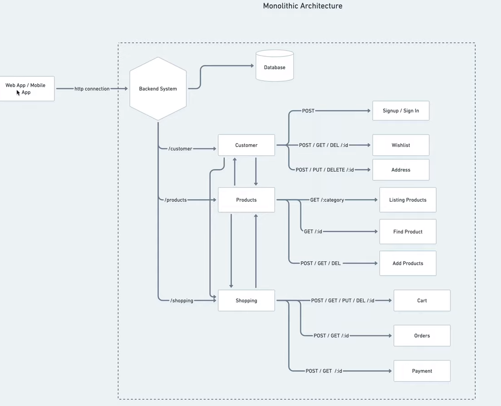
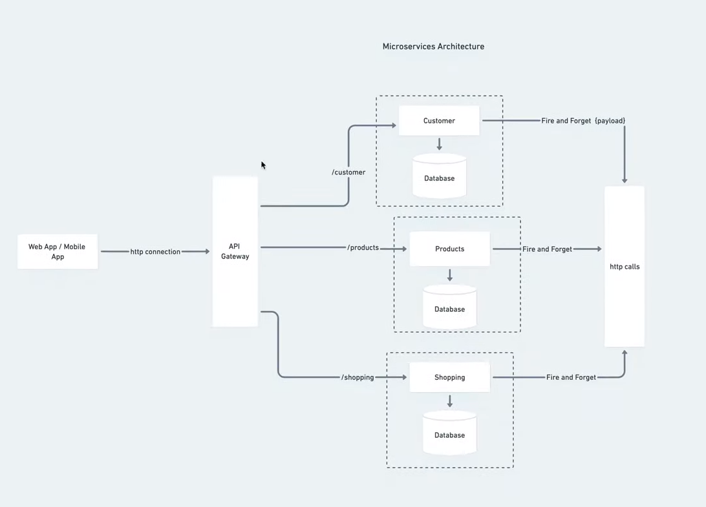

# MIcroservices

- [MIcroservices](#microservices)
  - [Monolithic vs Microservices](#monolithic-vs-microservices)
  - [Nest](#nest)

---

## Monolithic vs Microservices

Monolithic architecture:

If one of the services fails, the entire application fails

Microservices architecture:

If one of the services fails - only that service fails, the rest of the application continues to work

---

## Nest

See the `nest-example` sample project. It's based on [this](https://youtu.be/C250DCwS81Q?si=-3CpNUCDdCoiB48n) video with minor adjustments.
