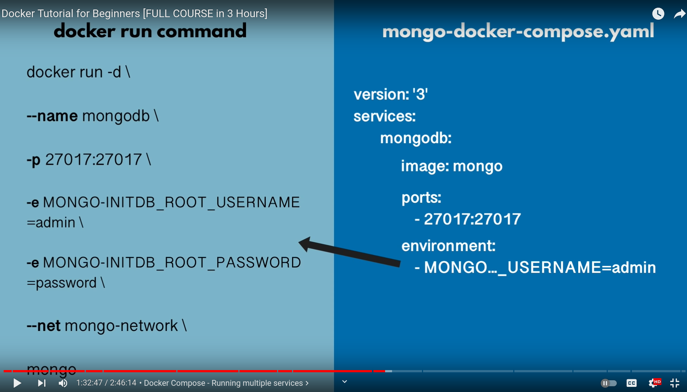

# Docker

---

## Links

1. [Docker hub](https://hub.docker.com)

## Basics

### Intro

Normally you'll have a `Dockerfile` in your project. It stores instructions for building your Docker image.

Example of `Dockerfile`:

```dockerfile
# The name of the image (local or on hub.docker.com)
FROM node
# Path IN THE CONTAINER where most of the subsequent commands will be executed
WORKDIR /app  
# Copy everything from the current local directory to the `/app` folder IN THE CONTAINER 
COPY package.json /app
# Execute when a container is CREATED
RUN npm i
# Copy everything else - our code
COPY . .
# Optional parameter showing what ports will be used inside the image - doesn't do anything in practice
EXPOSE 80
# Execute when a container based on this image is STARTED
CMD ["node", "index"]
```

1. **Build the Image**

```bash
# `-t` is tag
docker build . -t test
```

2. **Create and start a new Container** over the specified Image **in the attached mode** by default (meaning we're listening to the output of that container). Copy the generated `id` at the bottom of the output (e.g. `a76adbaedb79`) and type

```bash
docker run -it --init -p 5000:80 40ed76e52694

# `-it`: interactive
# `-p`: local port (in the browser):exposed port (in the app)
```

Your server should be running.

**NB**: Type `Ctrl + q` to exit the input mode if you need.

---

Mongo and mongo-express:

```bash
# Create network
docker network create mongo-network

# Mongo
docker run -d \
-p 27017:27017 \
-e MONGO_INITDB_ROOT_USERNAME=admin \
-e MONGO_INITDB_ROOT_PASSWORD=password \
--name mongodb \
--net mongo-network \
mongo

# Mongo-express
docker run -d \
-p 8081:8081 \
-e ME_CONFIG_MONGODB_ADMINUSERNAME=admin \
-e ME_CONFIG_MONGODB_ADMINPASSWORD=password \
--net mongo-network \
--name mongo-express \
-e ME_CONFIG_MONGODB_SERVER=mongodb \
mongo-express
```



---

#### Images are read-only!

To **apply your changes in the code**, restarting a Container is not enough. Remember that your code is **getting copied** into the Image. So it's basically a **snapshot**.

We need to **rebuild** our code into a new Image. So steps `1.` and `2.` over again.

---

### Utility commands

```bash
docker ps     # running containers
docker ps -a  # all containers (including stopped ones)
docker images # images
```

Delete unused images. Also can read [this](https://www.digitalocean.com/community/tutorials/how-to-remove-docker-images-containers-and-volumes-ru)

```bash
docker system prune

# Alternatively, something like 
# docker rmi $(docker images -a -q)

docker stop relaxed_poitras   # stop the container by ID or name
docker start bbf462dce545     # start the container
docker kill bbf462dce545      # kill the container

docker logs amazing_chaplygin -f  # show logs (-f = follow)
docker start amazing_chaplygin && docker logs amazing_chaplygin -f  # Start a previously stopped Container && see the logs
```

---

### Images and Containers

A **single Image** usually contains **multiple Containers**.

Image is a **template** that contains the code / tools / runtimes. 

Container runs and execudes the code. The code is stored in the image **once** and is **shared** among the containers in that image.

---

### `Dockerfile`

```dockerfile
# Provide a template for your Image
# The name should be either installed locally under that name or to exist on `hub.docker.com`
FROM node:14
# Path to the working directory in the Container where all the commands (e.g. COPY) will be executed
WORKDIR /app
# Tells Docker what files and folders to copy to the Image
# arg1: copy from the current local folder
# arg2: copy to the selected Image folder; `./` and `/app` will be the same in this context
COPY . /app
# Runs some commands when an Image is created
RUN npm i
# Runs some commands when a Container starts
CMD ["node", "app.mjs"]
```

Each command is a **layer** and is getting executed from top to bottom. They are also getting **cached** - you can see that by running `docker build .` multiple times - the subsequent ones run much faster.

If any layer changes, **all layers after it re-run as well and don't use cached results** as they can't be sure the result will be the same anymore.

The last layer is getting added once your `CMD` command runs. This step is done by Container.

We can upgrade the `Dockerfile` above. Now it runs `npm i` every time when we re-build our Image. This is excessive.

```dockerfile
FROM node:14

WORKDIR /home/node/backend

COPY package.json /app

RUN npm i

COPY . /app

EXPOSE 80

CMD ["node", "app.mjs"]
```

Now we copy our code to the Image **after** all the dependencies are set, so the layers above **don't re-run**.

---

### Networks

Images inside a container can communicate by names if they are within the same network - it's convenient.

```bash
docker network ls

docker network create mongo-network
```

---

### Attached and detached mode

Attached mode translates the Container output to the console automatically.

- `docker run` is using the **attached** (`-a`) mode by default
- `docker start` is using the **detached** (`-d`) mode by default

Use `docker attach dreamy_hugle` to attach to the running Container.

The other way to access this data is to inspect `docker logs`.

---

## Connect Node+TS to Docker

1. Add `"build": "tsc -w &"` to `scripts` in `package.json`
2. Expose `9229` port (the debugging port)
3. Run this script in `Dockerfile`

```dockerfile
FROM node:14

WORKDIR /app

COPY package.json .

RUN npm i

COPY . .

# Run our command from `scripts` in `package.json`
RUN npm run build

EXPOSE 5000
EXPOSE 9229

CMD ["node", "lib/server"]
```

---

### Compose

Replaces multiple `docker build` and `docker run` commands with a **config file** to start all that services.

When you use `docker compose`, the network is created automatically.

Use the `docker.compose.yml` (`yaml`) file to configure your application’s services. 

Then, with a single command, you create and start all the services from your configuration.

```bash
docker-compose up
docker-compose stop
docker-compose restart
docker-compose down

# Rebuild the container
docker-compose up --build -V 

# Rebuild an `api` service
docker-compose up --build -V api

# Without logs
docker-compose up --build -d -V api

# Also with container names / id
```

My commands:

```bash
# 1. Build `mongo` and `mongo-express` containers
docker-compose up -d mongo mongo-express

# 2. Rebuild and start `api` service (and other services if you have any)
docker-compose up --build -V api
```

---


## Development vs Production

We create 2 files:

- `docker-compose.yml` - for production
- `docker-compose.override.yml` - for development

---


