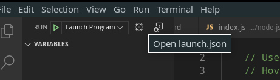
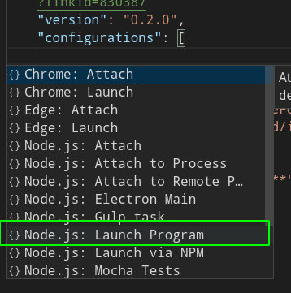
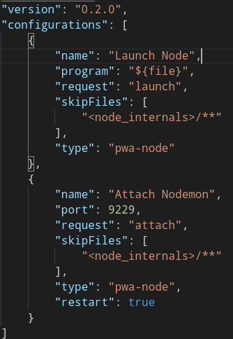
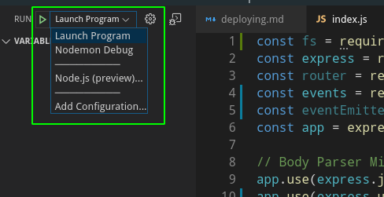
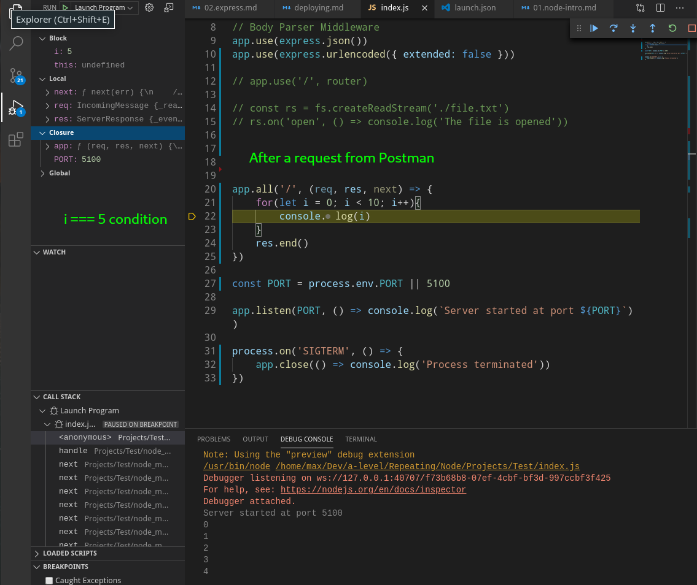
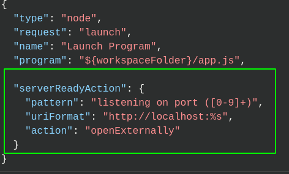

# Node.js Intro

- [Node.js Intro](#nodejs-intro)
	- [Creating new project](#creating-new-project)
	- [Nodemon](#nodemon)
	- [`npm`](#npm)
		- [Install packages](#install-packages)
		- [`package.json`](#packagejson)
		- [`dependencies` and `devDependencies`](#dependencies-and-devdependencies)
		- [Uninstalling packages](#uninstalling-packages)
		- [Upgrade packages](#upgrade-packages)
		- [`npm list`](#npm-list)
		- [App versions](#app-versions)
		- [Custom commands](#custom-commands)
- [Debugging](#debugging)
- [`ngrok`](#ngrok)
- [Heroku](#heroku)
- [Process manager](#process-manager)
	- [StrongLoop](#strongloop)

## Creating new project

Every `node` project should contain the `package.json` file storing all the dependencies. To create it, type: 

```bash
# basic
npm init

# skip questions
npm init -y
```

***

To run server, type in the project folder `node %your_server_file%`

```bash
# assuming you created `index.js` as your main server file
node index
```

***

When you want to move your project (to a host or somewhere), you don't need to bring all the modules with you, just copy your `package.json` and run 

```
npm install
```

It will install all the dependencies listed there. 

***


## Nodemon

Program that automaticlly reloads your server after you make changes to the files and save them:

```bash
# install globally
sudo npm i -g nodemon

# use it instead of `node` to run your server
nodemon index
```

***


## `npm`

### Install packages

Install packages using 

```bash
# local install
npm install express
npm i express			# shortcut

# global install
npm i -g typescript

# install as devDependency
npm install --save-dev jasmine-node
npm i -D jasmine-node	# shortcut
```

***

### `package.json`

Node uses two files to track connected modules.

1. `package.json` is a manifest of your app, it stores all the technical data about dependencies and other stuff. You can send this file to another computer, call `npm install` and all dependencies will be installed according to this file.

2. `pachage-lock.json` stores the exact current versions of all the dependencies and their dependencies. This guarantees that the project you finished will work the same in the future (with all the same packages versions). The dependencies versions will be updated in the package-lock.json file when you run `npm update`.

The minimal configuration of `package.json`:

```json
{
  "name": "MyApp",
  "version": "1.0.0"
}
```

***


### `dependencies` and `devDependencies`

There are 2 kinds of dependencies:

1. `dependencies` stores the **production** dependencies. They are needed for the app to function when released (e.g. express).
2. `devDependencies` stores the dependencies that are only needed during the development (tools for testing, logging, etc.)

```json
{
  "name": "modulesapp",
  "version": "1.0.0",
  "dependencies": {
    "express": "^4.17.1",
    "react": "^16.9.0",
    "react-dom": "^16.9.0"
  },
  "devDependencies": {
    "jasmine-node": "^3.0.0"
  }
}
```

***


### Uninstalling packages

To uninstall singe package, use `npm uninstall express` or `npm uninstall -D express` if you installed it as `devDependency`.

`npm install` updates modules in the project in line with what is written in `package.json`, so we can add or remove anything from there and then simply run `npm install` to apply the changes.

`--save` is now deprecated, it added packages as a dependencies in `package.json` which is now automatic (previously `npm install` only installed modules into `node_modules` but you had to add them as dependencies manually). 

***


### Upgrade packages

To install major upgrades (that can be non-backwards-compatible) run:

```
npm install -g npm-check-updates
ncu -u
npm update
```

If this doesn't work, try this to hard-upgrade global package to the latest: 

```bash
sudo npm i typescript@latest -g
```

***


### `npm list`

Your dependencies (and their dependencies) list. With depth 0 - only those you requested explicitly. 

```bash
npm list
npm list --depth 0
```

***


### App versions

E.g. `2.7.12`

When you make a new release, you follow the rules:

- you up the major version when you make incompatible API changes
- you up the minor version when you add functionality in a backward-compatible manner
- you up the patch version when you make backward-compatible patches (e.g. bug fixes)

Adding **caret `^`** makes `npm install` install the last available **minor** version. E.g. `"express": "^4.17.1"` will set the latest `4.x.x` express (<5.0.0).

***

Usually you would want ot install packages locally to avoid problems when updating packages. You can install globally pachages that work as executable commands: `create-react-app`, `nodemon`, etc.

***


### Custom commands

We can define our own commands and actions. 

**package.json**

```json
{
  "name": "modulesapp",
  "version": "1.0.0",
  "scripts" : {
    "start" : "node app.js",
    "dev" : "node app.js Tom 26"
  }
}
```

Here we make possible to run different commands depending on whether it's the development or the release version. 

`start`, `test` and some others can be run right off but the others should be called via `run` beforehand:

```bash
# for production
npm start 

# for dev
npm run dev
```


# Debugging

Links:
- https://youtu.be/yFtU6_UaOtA
- https://code.visualstudio.com/docs/editor/debugging

The `--inspect` command enables the simplest begugging. 

There are two debugging modes in VS Code: 
1. `launch` - run your program (start your server) in the debugger mode. 
2. `attach` - attach debugger to an already running program / server (as you do in the browser DevTools to an existing webpage).
***

To start debugging, press `F5`. 

If this is your first run, open `launch.json`. 



Press `ctrl + space` to open the IntelliSence suggestions. Choose `Node.js: Launch Program`.



Then configure the correct path to your start-file (app.js or index.js). You can use special variables:
- `${workspaceFolder}` - current opened folder
- `${file}` - current active file in the editor
- and others


My current settings: 



Now by pressing `F5` you'll start debugging (choose the routine you just created if you need) 



The bottom panel will turn orange and the control panel will appear at the top.


***

Start your server running `nodemon --inspect index`, then continue in the browser. This implies using web sockets. 

Add this to set an **automatic opening of the page** (like in create-react-app): 




***


# `ngrok`

Simple tool to broadcasting your localhost to the web. Install it (available from the AUR): https://dashboard.ngrok.com/get-started/setup

1. Run your project on the **localhost** (`nodemon` or **Live Server**)
2. Open Terminal and type `ngrok http 5000` or whatever port your project is using on the **localhost**. 
3. Copy `http` or `https` link and use it for accessing your localhosted project remotely. Expires in 24 h.

***


# Heroku

Init heroku app. Git remote will be created and added to this local git repository.

```
heroku create
```

Save the addresses returned - this is your app's page with a generated name:

- `https://salty-hollows-12809.herokuapp.com/`
- `https://git.heroku.com/salty-hollows-12809.git`

Check if the remote was added:

```
git remote -v
```

If you can't see `heroku` there, add it manually:

```
heroku git:remote -a salty-hollows-12809
```

You can rename it (optional):

```
git remote rename heroku new-name
```

Add the `Procfile` file (without extension) to the root of your project. It will be run on server to determine how to run your app. This should be its content:

```
web: node index.js
```

Add, commit and push your project to the remote the usual way.

```
git add
git commit
git push heroku master
```

Ensure you have at least one instance of the app running: 

```
heroku ps:scale web=1
```

Test your website by the provided address or by the shortcut: `heroku open`.

If you encounter problems, try creating a new clean git repository. 
***


# Process manager

## StrongLoop

Enables automatic restart of your server/app if it crashes.


