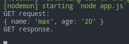
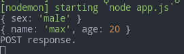

# Node Basics

- [Node Basics](#node-basics)
	- [First Run](#first-run)
	- [Details](#details)
		- [Modules](#modules)
		- [Module Wrapper Function](#module-wrapper-function)
		- [`global`](#global)
	- [App params](#app-params)
	- [HTTP Requests from Node](#http-requests-from-node)
		- [**`https.request`**`(options[, callback])`](#httpsrequestoptions-callback)
			- [**`https.get`**`(url, options)`](#httpsgeturl-options)
		- [Examples](#examples)
			- [Basic GET](#basic-get)
			- [Basic POST](#basic-post)
			- [The NASA picture of the day example](#the-nasa-picture-of-the-day-example)
	- [Shell commands with Node](#shell-commands-with-node)
	- [`process.env`](#processenv)
	- [Notifications](#notifications)

---

## First Run

Basic server (`app.js`):

```js
const http = require('http')
const PORT = process.env.PORT || 5000

const server = http.createServer((req, res) => {
	res.end('end')
})

server.listen(PORT, () => {
	console.log('Server is running on port ', PORT)
})
```

Run it in the project folder:

```bash
# assuming you've already installed `nodemon`
nodemon app
```

Open in a browser: `localhost:5000`

---

## Details

### Modules

Modules are separate script files that you export and import. See the corresponding lesson in the JS section about **modules**.

To **export**: `module.exports = obj`

To **import**: `const obj = require('./obj')`

```javascript
// person.js
class Person {
	constructor(name, age) {
		this.name = name
		this.age = age
	}

	greet() {
		console.log(`My name is ${this.name} and I'm ${this.age}`)
	}
}

module.exports = Person
```

```javascript
// index.js
const Person = require('./person')
const person1 = new Person('Alex', 30)
person1.greet()
```

---

```js
const greeting1 = require('./greeting.js')
const greeting2 = require('./greeting.js')

console.log(greeting1 === greeting2) // true
```

---

We may refer not only to the module files but also to the module folders if they have the `index.js` file that represents them:

```js
/* Project structure:
welcome
	index.js
	morning.js
	evening.js
app.js
*/

// morning.js
module.exports = 'Good morning'

// evening.js
module.exports = `Good evening`

// index.js
module.exports = {
	getMorningMessage() {
		console.log(require('./morning'))
	},
	getEveningMessage() {
		console.log(require('./evening'))
	}
}

// app.js
const welcome = require(`./welcome`)
// there's not `welcome` module but this still works because the folder `module` has `index.js` inside
console.log(welcome.getEveningMessage()) // Good evening
```

---

### Module Wrapper Function

The content of the modules is actually wrapped with a special function:

```javascript
;(function (exports, require, module, __filename, __dirname) {
	// your module
})
```

We can check it using `console.log`:

```javascript
// person.js
console.log(__filename, '\n', __dirname)

// Output:
// /home/max/Dev/a-level/Repeating/Node/Crash Course/01-intro/person.js
// /home/max/Dev/a-level/Repeating/Node/Crash Course/01-intro
```

---

### `global`

Special object storing all global variables and functions, accessible from any module. Similar to `window` in browsers.

```js
// script.js
global.date = new Date()

// app.js
console.log(global.date) // our date even without import
```

---

## App params

When we launch our app from the command line, we can pass **parameters** to it: They are then accessible from **`process.argv`**.

- `process.argv[0]` - path to **`node`** itself
- `process.argv[1]` - path to the **app**
- `process.argv[2], [3], ...` - parameters for the app

```bash
# call the app this way
nodemon app arg1 arg2
```

```js
console.log(process.argv)
/* [
  '/usr/bin/node',
  '/home/max/Dev/Study/NODE/Projects/Test/app.js',
  'arg1',
  'arg2'
] */
```

---

## HTTP Requests from Node

There are 2 main ways to send HTTP requests:

- vanilla `http.request()`
- the 3rd-party `axios` module

Here we'll see the vanilla way. Axios is described in another chapter [3rd-party modules](04.third-party-modules.md#axios)

1. https://nodejs.org/api/http.html#http_http_request_options_callback - http basis
2. https://nodejs.org/api/https.html#https_https_request_options_callback - https addition
3. https://nodejs.dev/learn/making-http-requests-with-nodejs - some examples

---

### **`https.request`**`(options[, callback])`

For `http` requests you use the `http` module, the same stands for `https`. You can use any notation of the two above (url, options or both).

Callback receives a single argument - response object (of class `http.IncomingMessage`)

There's a huge list of `options`, you can see it in the [docs](https://nodejs.org/api/http.html#http_http_request_url_options_callback). The most important ones are:

- `method` - default: `GET`
- `port` - default: `80` for **http** and `443` for **https**
- `host` / `hostname` - e.g. `google.com`, default: `localhost`
- `path` - request path, e.g. `/index.html?page=12`
- `port` - port
- `headers` - an object with headers

Returns a **Writable Streams** (of class`http.ClientRequest`). **You write data to this stream** when performing `POST` requests. **Errors** will be emitted on this object if any occurs.

---

Events that will generally trigger:

1. `socket`
2. `response` / `error`. If `response`, then:
   1. `data` - 0+ times on the `res`
   2. `end` - on the `res`
3. `close`

---

#### **`https.get`**`(url[, options][, callback])`

An alias for GET requests with `method: GET` set and `req.end()` being called automatically.

---

### Examples

#### Basic GET

1. Server Client sends GET
2. Server handler handles it and responds
3. Server Client console.logs the response

As `localhost` runs on **http** (not https), we use exactly it, but there's no difference with **https** as you'll see later.

```js
const http = require('http')
const express = require('express')
const app = express()

app.get('/get', (req, res, next) => {
	console.log(`GET request:`)
	console.log(req.query)
	res.send('GET response.')
})

app.use(express.static('./public'))

app.listen(5000)

// ===== Client =====

const options = {
	path: '/get?name=max&age=20',
	port: 5000
}

// Prepare a request
const request = http.request(options, (res) => {
	const chunks = []

	res.on('readable', () => {
		let chunk
		while ((chunk = res.read()) !== null) {
			chunks.push(chunk)
		}
	})

	res.on('end', () => {
		console.log(chunks.join(''))
	})

	res.on('error', (err) => {
		console.error(err)
	})
})

request.end() // Send the request
```



---

#### Basic POST

```js
const http = require('http')
const express = require('express')
const app = express()

app.use(express.json())
app.use(express.urlencoded({ extended: false }))

app.post('/post', (req, res, next) => {
	console.log(req.query)
	console.log(req.body)
	res.send('POST response.')
})

app.use(express.static('./public'))

app.listen(5000)

// ===== Client =====

const postData = JSON.stringify({
	name: 'max',
	age: 20
})

const options = {
	method: 'POST',
	path: '/post?sex=male', // query params can be used as well
	port: 5000,
	headers: {
		'Content-Type': 'application/json',
		'Content-Length': postData.length // not mandatory
	}
}

// Prepare a request
const request = http.request(options, (res) => {})

request.write(postData)

request.end() // Send the request
```



---

**PUT** and **DELETE** are no different from **POST**, just change `options.value`.

---

#### The NASA picture of the day example

Take a picture of the day from the [NASA](https://api.nasa.gov) and save it locally on the server

```js
const https = require('https')
const express = require('express')
const fs = require('fs')
const path = require('path')

const { Transform, pipeline } = require('stream')
const app = express()
const PORT = process.env.PORT || 5000

// Function to get date in the needed format
Date.prototype.toIsoString = function () {
	const tzo = -this.getTimezoneOffset(),
		dif = tzo >= 0 ? '+' : '-',
		pad = function (num) {
			const norm = Math.floor(Math.abs(num))
			return (norm < 10 ? '0' : '') + norm
		}
	return (
		this.getFullYear() +
		'-' +
		pad(this.getMonth() + 1) +
		'-' +
		pad(this.getDate()) +
		'T' +
		pad(this.getHours()) +
		':' +
		pad(this.getMinutes()) +
		':' +
		pad(this.getSeconds()) +
		dif +
		pad(tzo / 60) +
		':' +
		pad(tzo % 60)
	)
}

// We'll make request to the yesterday's pic because we might get an error requesting the pic of the current date which hasn't come yet in the US
let yesterday = new Date()
yesterday.setDate(new Date().getDate() - 1)
yesterday = yesterday.toIsoString().slice(0, 10)

https
	// Get the response from NASA with metadata
	.get(
		`https://api.nasa.gov/planetary/apod?date=${yesterday}&api_key=aLz45v2YYaamCxGhFaZMCkwPfRXqpEqAlOjx9i8A`,
		(res) => {
			const chunks = []

			res.on('readable', () => {
				let chunk
				while ((chunk = res.read()) !== null) {
					chunks.push(chunk)
				}
			})

			res.on('end', () => {
				global.nasaData = JSON.parse(chunks.join(''))
				console.log(global.nasaData)

				// Get the pic using the NASA metadata
				https.get(global.nasaData.url, (response) => {
					if (
						!response.statusCode === 200 ||
						!/image\/.+/.test(response.headers['content-type'])
					) {
						return console.error('Not image or status is not 200!')
					}

					// Solution 1. Transform is Duplex: first we write the incoming data to it, then we read the whole buffer from it and write to the disk
					const img = new Transform()

					response.on('readable', () => {
						let chunk
						while ((chunk = response.read()) !== null) {
							img.push(chunk)
						}
					})

					response.on('end', () => {
						const fileName = path.join(__dirname, 'apod.jpg')
						fs.promises.writeFile(fileName, img.read()).catch(console.error)
						console.log('done')
					})

					response.on('error', (err) => next(err))

					// // Solution 2.
					// pipeline(
					// 	response,
					// 	fs.createWriteStream(path.join(__dirname, 'apod.jpg')),
					// 	(err) => {
					// 		if (err) next(err)
					// 		console.log('done')
					// 	}
					// )
				})
			})
		}
	)
	.on('error', (err) => console.error(err))

app.listen(PORT)
```

---

## Shell commands with Node

https://stackabuse.com/executing-shell-commands-with-node-js/

Use the `child_process` module's internal methods:

1. `exec (shell_command, cb)` for lightweight commands with little output

```js
const { exec } = require('child_process')

exec('ls -la', (error, stdout, stderr) => {
	if (error) {
		console.log(`error: ${error.message}`)
		return
	}
	if (stderr) {
		console.log(`stderr: ${stderr}`)
		return
	}
	console.log(`stdout: ${stdout}`)
})
```

2. `spawn (shell_command)` for heavier tasks as it executes a command **in a new process**. It used **streams** so you use their listeners:

```js
const { spawn } = require('child_process')

const ls = spawn('ls', ['-la']) // arguments are separated in an array

ls.stdout.on('data', (data) => {
	console.log(`stdout: ${data}`)
})

ls.stderr.on('data', (data) => {
	console.log(`stderr: ${data}`)
})

ls.on('error', (error) => {
	console.log(`error: ${error.message}`)
})

ls.on('close', (code) => {
	console.log(`child process exited with code ${code}`)
})
```

The key difference between `exec()` and `spawn()` is how they return the data. As `exec()` stores all the output in a buffer, it is more memory intensive than `spawn()`, which streams the output as it comes.

Generally, if you are not expecting large amounts of data to be returned, you can use `exec()` for simplicity. Good examples of use-cases are creating a folder or getting the status of a file. However, if you are expecting a large amount of output from your command, then you should use `spawn()`. A good example would be using command to manipulate binary data and then loading it in to your Node.js program.

---

## `process.env`

Special file that stores your important application-wide **constants**.

1. Set up an utility package: `npm i dotenv`
2. Create a `.env` file in the root of your project. Fill it with constants you need. Don't use quotes (`"`, `'`) - your value will be transformed `toString` implicitly. See an example below.
3. Add this file to `.gitignore` - it shouldn't be in repos
4. Call `require('dotenv').config('./.env');` somewhere at the top of your `server` or `index` file
5. Now you can refer to these constants in the code

Example file:

```
SMS_FLY_LOGIN=380675503980
SMS_FLY_PASSWORD=Grand1305

PORT=3000
```

---

## Notifications

1. https://www.npmjs.com/package/node-notifier
2. https://stackabuse.com/sending-notifications-with-node-notifier-mac-windows-linux/

We can send cross-platform native notifications using the `node-notifier` module.

```bash
npm i node-notifier
```

```js
const notifier = require('node-notifier')

notifier.notify('Message')
```

Advanced example:

```js
const notifier = require('node-notifier')
const path = require('path')

notifier.notify(
	{
		title: 'My awesome title',
		message: 'Hello from node, Mr. User!',
		icon: path.join(__dirname, 'uploads', 'cat'), // Absolute path (doesn't work on balloons)
		sound: true, // Only Notification Center or Windows Toasters
		wait: true // Wait with callback, until user action is taken against notification, does not apply to Windows Toasters as they always wait or notify-send as it does not support the wait option
	},
	function (err, response, metadata) {
		// Response is response from notification
		// Metadata contains activationType, activationAt, deliveredAt
	}
)

notifier.on('click', function (notifierObject, options, event) {
	console.log('Use clicked the notification!')
	// Triggers if `wait: true` and user clicks notification
})

notifier.on('timeout', function (notifierObject, options) {
	console.log("User didn'n touch the notification!")
	// Triggers if `wait: true` and notification closes
})
```

More tweaking is available for specific platforms (Win 10 and Mac).
