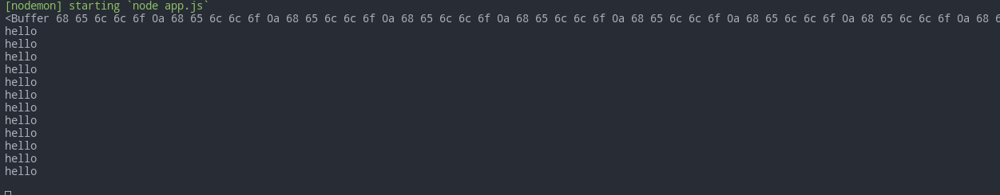
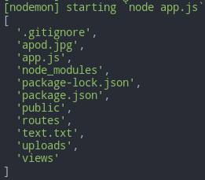

# Core Modules Reference

- [Core Modules Reference](#core-modules-reference)
- [`crypto`](#crypto)
	- [Hash](#hash)
- [`events`](#events)
	- [Methods](#methods)
		- [**`emit`**`(type[, ...args])`](#emittype-args)
		- [**`on`**`(type, listener[, options])`](#ontype-listener-options)
		- [**`off`**`(type, listener)`](#offtype-listener)
		- [**`once`**`(type, listener[, options])`](#oncetype-listener-options)
		- [**`removeListener`**`(eventName, listener)`](#removelistenereventname-listener)
		- [**`removeAllListeners`**`([type])`](#removealllistenerstype)
		- [**`listenerCount`**`(type)`](#listenercounttype)
		- [**`eventNames`**`()`](#eventnames)
		- [**`listeners`**`(type)`](#listenerstype)
		- [**`prependListener`**`(type, listener)`](#prependlistenertype-listener)
	- [Error handling](#error-handling)
		- [Async errors](#async-errors)
	- [List of events](#list-of-events)
- [`http`](#http)
	- [Events](#events-1)
	- [Methods](#methods-1)
		- [`http.`**`createServer`**`((req, res) => {})`](#httpcreateserverreq-res--)
- [`fs`](#fs)
	- [Methods](#methods-2)
		- [**`mkdir`**` (path[, options])`](#mkdir-path-options)
		- [**`rm`**` (path[, options])`](#rm-path-options)
		- [**`writeFile`**` (file, data[, options])`](#writefile-file-data-options)
		- [**`appendFile`**` (path, data[, options], callback)`](#appendfile-path-data-options-callback)
		- [**`readFile`**` (path[, options])`](#readfile-path-options)
		- [**`open`**`(path[, flags[, mode]], (err, rd) => {})`](#openpath-flags-mode-err-rd--)
		- [**`rename`**` (oldPath, newPath)`](#rename-oldpath-newpath)
		- [**`watch`**` (filename, options)`](#watch-filename-options)
		- [**`stat`**`(path, (err, stats) => {})`](#statpath-err-stats--)
		- [**`readdirSync`**`(path[, options], (err, files) => {})`](#readdirsyncpath-options-err-files--)
- [`os`](#os)
- [`path`](#path)
- [`util`](#util)
	- [Methods](#methods-3)
		- [**`promisify`**` (original)`](#promisify-original)
		- [**`isWeakMap`** `(value)`, **`isRegExp`** `(value)`, ...](#isweakmap-value-isregexp-value-)

***

# `crypto`

Crypthgraphic features. Also its browser version [crypto-browserify](https://www.npmjs.com/package/crypto-browserify).

```js
const crypto = require('crypto')
```

## Hash

https://nodejs.org/api/crypto.html#crypto_crypto_createhash_algorithm_options

Hash is made in 3 actions that can be chained:

1. Prepare your hash algorithm (`md5`, `sha1`, `sha256`, `sha512`, etc.)
2. Use it (on `string`, `Buffer`, `TypedArray`, `DataView`)
3. Output the result in `'hex'`, `'base64'` or `''` (for Buffer) format

```js
// String

const hash = crypto.createHash('sha512').update('Hello, World!').digest('hex')
console.log(hash)	
// 374d794a95cdcfd8b35993185fef9ba368f160d8daf432d08ba9f1ed1e5abe6cc69291e0fa2fe0006a52570ef18c19def4e617c33ce52ef0a6e5fbe318cb0387

// File

const hash = crypto.createHash('sha256')
const r = fs.createReadStream(
	'James Kitcher & Adam Taylor - The Spirit Within-ZscCG-_WuH0.webm'
)
let data = []

r.on('readable', () => {
	let chunk
	while ((chunk = r.read()) !== null) {
		data.push(chunk)
	}
})
r.on('end', () => {
	console.log(hash.update(data.join('')).digest('hex'))
})
```

For the Client (didn't check it):

```js
async function sha1(str) {
	const buf = Uint8Array.from(unescape(encodeURIComponent(str)), c => c.charCodeAt(0)).buffer
	const digest = await crypto.subtle.digest('SHA-1', buf)
	const raw = String.fromCharCode.apply(null, new Uint8Array(digest))
	return raw	// 20-символьная строка
	// or
	return btoa(raw)	// base64
}
```

# `events`

All events in Node are descendents of `EventEmitter`

```javascript
const EventEmitter = require('events')
const emitter = new EventEmitter()

emitter
	.on('boo', function (...args){
		console.log(args)	// will fire 3 times
	})
	.once('boo', () => {
		console.log('once')	// will fire 1 time
	})

emitter.emit('boo', 'arg1', 'arg2')
emitter.emit('boo', 'arg1', 'arg2')
emitter.emit('boo', 'arg1', 'arg2')
```


***


## Methods

### **`emit`**`(type[, ...args])`

Emit an event for all set up listeners to catch it. Arbitrary set of arguments can be passed for handlers. 

Returns `true` if the event had listeners and `false` otherwise.

### **`on`**`(type, listener[, options])`

Sets a regular listener.

### **`off`**`(type, listener)`

Removes a listener.

### **`once`**`(type, listener[, options])`

Sets listener that will only fire once and disappear. 

### **`removeListener`**`(eventName, listener)`

Removes the specified handler (if multiple instances were attached, must be called multiple times to remove them all).

### **`removeAllListeners`**`([type])`

If *type* is specified, removes all registered listeners of this type, otherwise - **all** listeners altogether.

### **`listenerCount`**`(type)`

Returns the number of listeners of the type.

### **`eventNames`**`()`

Returns an array of **types** for which there are listeners registered.

### **`listeners`**`(type)`

Returns a copy of the handlers array for the type.

### **`prependListener`**`(type, listener)`

Adds a listener at the **beginning** of the listeners array (the default behavior is to add them to the end).

***

All of the above methods (except `emit`) return the `emitter` instance they are called upon. Thus, can be chained.

When an **ordinary** listener function is called, `this === emitter`

The EventEmitter calls all listeners **synchronously** in the order in which they were registered. We can enforce **asynchronity** using `setImmediate(callback)`.

The values the handlers return are **ignored**.

***


## Error handling

Add the `error` handler to your emitter.

```js
emitter.on('error', err => {
	console.log('There was an error: ', err)
})

emitter.emit('error', new Error('whoops!'))
// Prints: whoops! there was an error
```

You can also add `uncaughtException` handler to `process` to handle uncaught errors. 

```js
process.on('uncaughtException', (err) => {
	console.log('Uncaught error: ', err)
})
```

***

### Async errors

```js
const emitter = new EventEmitter({ captureRejections: true })

emitter.on('something', async (value) => {
	throw new Error('kaboom')
})

emitter.on('error', console.log)

emitter.emit('something')
```

***


## List of events

There is no "single list of events in node" since different events and related to different modules, streams, etc. So you are gonna see them in the corresponding lessons.

***


# `http` 

## Events

| Type       | Description                                                                                                                                           |
| ---------- | ----------------------------------------------------------------------------------------------------------------------------------------------------- |
| `abort`    | Emitted when the request has been aborted by the client.                                                                                              |
| `response` | Emitted when a response is received to this request. This event is emitted only once.                                                                 |
| `timeout`  | Emitted when the underlying socket times out from inactivity. This only notifies that the socket has been idle. The request must be aborted manually. |
| `close`    | Emitted when the server closes.                                                                                                                       |
| `request`  | Emitted each time there is a request. There may be multiple requests per connection.                                                                  |
| `finish`   | Response headers and body have been sent completely.                                                                                                  |

***

## Methods

### `http.`**`createServer`**`((req, res) => {})`

Callback is callbed when server received all the headers for the request. 

`req` is a Readable stream, `res` - Writable one. See [streams](11.streams.md) for details.

You can gather chunks manually using something like this:

```js
http.createServer((request, response) => {
  	const chunks = [];
  	request.on('data', chunk => chunks.push(chunk));
  	request.on('end', () => {
    	const data = Buffer.concat(chunks);
    	console.log('Data: ', data);
  	})
})
```

Or you can use a module that will do everything for you:

```js

```

***


# `fs`

**ATTENTION! USE `fs-extra` INSTEAD!** It has **everything** from the `fs` module **plus** smart promisification (if no callback attached where it should be) and extra features.

https://www.npmjs.com/package/fs-extra

***

File System operations - files, folders, etc.

You can either require the regular lib or the **promosified** one. The latter is preferable. 

```javascript
// regular lib
const fs = require('fs')

// promisified lib
const fs = require('fs/promises')
```

**Further we'll only use the promisified version**. So no callbacks!

***


## Methods

### **`mkdir`**` (path[, options])`

Create a directory. Possible options:

- `recursive: boolean` - default is `false`, if `true` - create all the parent directories as well (`/one/two/actualDirectory`)
- `mode: string|integer` - permission and sticky bits (not supported in Windows), default is `777`

```js
const express = require('express')
const app = express()
const fs = require('fs/promises')

let dir = __dirname + '/newFolder/inner'

fs.mkdir(dir, { recursive: true })
	.then(() => fs.appendFile(dir + '/file.txt', 'hello\n'))
	.catch(console.error)

app.listen(5000)
```

***

### **`rm`**` (path[, options])`

Removes files and directories. 

Options:

- `force` - When true, exceptions will be ignored if path does not exist. Default: ``false`.
- `recursive` - If `true`, perform a recursive removal. In recursive mode operations are retried on failure. Default: `false`.
- `retryDelay` and `maxRetries` adjust retries for recursion

```js
fs.promises.rm(
	__dirname + '/folderWithFiles', 
	{ recursive: true, force: true }
)
	.catch(console.error)
```

***

### **`writeFile`**` (file, data[, options])`

Write data to a file. Replace the file if it already exists.

It is **unsafe** to use `fsPromises.writeFile()` multiple times on the same file **without waiting** for the Promise to be resolved (or rejected).

Options:

- `encoding`: default is `utf8`
- `mode`: default is `666`
- `flag`: default is `w`. See [ref](https://nodejs.org/api/fs.html#fs_file_system_flags)

If `options` is a string, then it specifies the encoding.

```javascript
fs.writeFile(dir + '/file.txt', 'utf8', 'hello\n'))
	.catch(console.error)
```

Use `{ flag: 'a' }` option to **append** to the file instead of rewriting it from scratch. 

***

### **`appendFile`**` (path, data[, options], callback)`

Append data to a file. Create the file if it doesn't exist.

Options:

- `encoding`: default is `utf8`
- `mode`: default is `666`
- `flag`: default is `a`. See [ref](https://nodejs.org/api/fs.html#fs_file_system_flags)

If `options` is a string, then it specifies the encoding.

```javascript
fs.appendFile(dir + '/file.txt', 'hello\n')
	.catch(console.error)
```


So, we `writeFile` and then afterwards (in the callback) we `appendFile` to the already existing file.

***

### **`readFile`**` (path[, options])`

Read the entire contents of a file.

The Promise is resolved with the contents of the file. 

If no encoding is specified, the data is returned as a Buffer object.

If `options` is a string, then it specifies the encoding.

Options:

- `encoding`: default is `null`
- `flag`: default is `r`. See [ref](https://nodejs.org/api/fs.html#fs_file_system_flags)

```javascript
const express = require('express')
const app = express()
const path = require('path')
const fs = require('fs/promises')

let dir = __dirname + '/newFolder/inner'

fs.mkdir(dir, { recursive: true })
	.then(() => fs.appendFile(dir + '/file.txt', 'hello\n'))
	.then(() => fs.readFile(dir + '/file.txt')) // read as a Buffer
	.then((res) => console.log(res))
	.then(() => fs.readFile(dir + '/file.txt', 'utf8')) // read as a string
	.then((res) => console.log(res))
	.catch(console.error)

app.listen(5000)
```



***

### **`open`**`(path[, flags[, mode]], (err, rd) => {})`

`fs.open` is used as a combination of the 3 previous methods (**write, append, read**): you open a file and then you can perform multiple actions on it instead of performing 1 action and closing the file immediately. 

Choose what actions are you going to perform on the file using the [FS flags](https://nodejs.org/api/fs.html#fs_file_system_flags):

Flag|What for|Stream position|If file doesn't exist
-|-|-|-
`r`|reading|beginning|exception
`r+`|reading and writing|beginnig|exception
`a`|appending|end|file is created
`a+`|reading and appending|end|file is created
`ax`/`ax+`|same|same|error
`w`|writing|beginning|file is created
`w+`|reading and writing|beginning|file is created
`wx`/`wx+`|same|same|error

Default **mode** is `0o666` (readable and writable).

After you opened the file, use `fs.read()` and `fs.write()` on the **file descriptor** you got.

Remember: here you have to **manually close** the file after you finished working with it - `fs.close()`. Just close it after the other async actions on this file has finished (await) or you might have unexpected results. 

*No examples since I haven't tested it.*

***

### **`rename`**` (oldPath, newPath)`

Rename `oldPath` to `newPath` and resolves the Promise with no arguments upon success.

In the case that newPath already exists, it will be overwritten. 

```javascript
const express = require('express')
const app = express()
const fs = require('fs/promises')

let dir = __dirname + '/old'

fs.mkdir(dir)
	.catch(console.error)
	.then(() => fs.rename(dir, __dirname + '/new'))
	.catch(console.error)

app.listen(5000)

```

***

### **`watch`**` (filename, [options][, listener])`

Watches for changes in the file or directory. 

See [ref](https://nodejs.org/api/fs.html#fs_class_fs_fswatcher)

***

### **`stat`**`(path, (err, stats) => {})`

Asynchronously get file stats. 

When we receive our `stats` object with results, we would usually want to check these characteristics of the file:

- `stats.size`
- `stats.isFile()` / `stats.isDirectory()`

An optional parameter `bigint: true` can be passed to require the returned data as **bigint**. 

```js
fs.stat('app.js', (err, stats) => {
	if (err) return console.log(err)
	console.log(stats)
})
```

***

### **`readdirSync`**`(path[, options], (err, files) => {})`

Reads the contents of a directory - names of files and folders.



***


# `os`

https://nodejs.org/api/os.html

Operating System utilities.

```javascript
const os = require('os')

// Platform
console.log(os.platform())	// linux

// Release
console.log(os.release())	// 5.5.19-1-MANJARO

// CPU architecture
console.log(os.arch())		// x64

// An array of objects with info about every CPU Core
console.log(os.cpus())		// [...]

// Free memory in bytes
console.log(os.freemem())	// 6354751488

// Total memory in bytes
console.log(os.totalmem())	// 12529405952

// Home directory
console.log(os.homedir())	// /home/max

// Time the system is running in seconds
console.log(os.uptime())	// 16346
```

***


# `path`

https://nodejs.org/api/path.html

Directory and file paths.


```javascript
const path = require('path')

// Project directory

console.log(__dirname)	
// /home/max/Dev/Study/NODE/Projects/test


// Current file

console.log(__filename)	
// /home/max/Dev/Study/NODE/Projects/test/app.js


// Basename

console.log(path.basename(__filename))	
// app.js
console.log(path.basename(__filename, '.js'))	// exclude extension
// app


// Current directory

console.log(path.dirname(__filename))	
// /home/max/Dev/Study/NODE/Projects/test


// Extension name

console.log(path.extname(__filename))	
// .js


// Create a path object from a string

console.log(path.parse(__filename))
/* {
	root: '/',
	dir: '/home/max/Dev/Study/NODE/Projects/test',
	base: 'app.js',
	ext: '.js',
	name: 'app'
} */


// Concatenate paths

console.log(path.join(__dirname, 'NEW', 'hello.html'))	
// /home/max/Dev/Study/NODE/Projects/test/NEW/hello.html


// A relative path from one path to another

console.log(path.relative('/home/max', '/tmp'))
// ../../tmp
```

***


# `util`

https://nodejs.org/api/util.html

Utility module

```js
const util = require('util')
```

***


## Methods

### **`promisify`**` (original)`

Takes a function following the common error-first callback style, i.e. taking an `(err, value) => ... ` and returns a version that returns promises.

It assumes that original is a function taking a **callback** as its **final argument** in all cases. 

```js
const pipeline = util.promisify(require('stream').pipeline)

// now instead of providing a callback as the last argument, you simply attach a handler via `.then()` or `await`.
```

`callbackify(original)` does the opposite thing: turns async function into the regular one (e.g. taking `(err, value)` as the last argument).

***

### **`isWeakMap`** `(value)`, **`isRegExp`** `(value)`, ...

A wide range of checks for various advanced JS and Node object types. 

***

