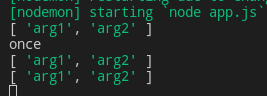
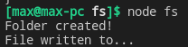
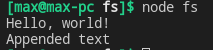
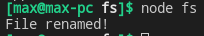
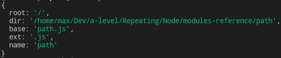

# Core Modules Reference

- [Core Modules Reference](#core-modules-reference)
	- [`events`](#events)
		- [Methods](#methods)
			- [**`emit`**`(type[, ...args])`](#emittype-args)
			- [**`on`**`(type, listener[, options])`](#ontype-listener-options)
			- [**`off`**`(type, listener)`](#offtype-listener)
			- [**`once`**`(type, listener[, options])`](#oncetype-listener-options)
			- [**`removeListener`**`(eventName, listener)`](#removelistenereventname-listener)
			- [**`removeAllListeners`**`([type])`](#removealllistenerstype)
			- [**`listenerCount`**`(type)`](#listenercounttype)
			- [**`eventNames`**`()`](#eventnames)
			- [**`listeners`**`(type)`](#listenerstype)
			- [**`prependListener`**`(type, listener)`](#prependlistenertype-listener)
		- [Error handling](#error-handling)
			- [Async errors](#async-errors)
		- [List of events](#list-of-events)
	- [HTTP](#http)
		- [Events](#events-1)
	- [`fs`](#fs)
		- [callback](#callback)
		- [`mkdir` (path[, options], callback)](#mkdir-path-options-callback)
		- [`rmdir` (path, [options], callback)](#rmdir-path-options-callback)
		- [`writeFile` (file, data[, options], callback)](#writefile-file-data-options-callback)
		- [`appendFile` (path, data[, options], callback)](#appendfile-path-data-options-callback)
		- [`readFile` (path[, options], callback(err, data) )](#readfile-path-options-callbackerr-data-)
		- [rename (oldPath, newPath, callback)](#rename-oldpath-newpath-callback)
		- [`unlink` (path, callback)](#unlink-path-callback)
		- [`watch` (filename, options), `unwatch` (filename, listener)](#watch-filename-options-unwatch-filename-listener)
	- [`os`](#os)
		- [platform()](#platform)
		- [release()](#release)
		- [arch()](#arch)
		- [cpus()](#cpus)
		- [freemem()](#freemem)
		- [totalmem()](#totalmem)
		- [homedir()](#homedir)
		- [uptime()](#uptime)
	- [`path`](#path)
		- [basename (path)](#basename-path)
		- [dirname (path)](#dirname-path)
		- [extname (path)](#extname-path)
		- [parse (path)](#parse-path)
		- [join (path1, path2, ... )](#join-path1-path2--)
		- [relative (path1, path2)](#relative-path1-path2)
	- [Util](#util)
		- [Sources](#sources)
		- [**`promisify`**` (original)`](#promisify-original)
		- [**`isWeakMap`** `(value)`, **`isRegExp`** `(value)`](#isweakmap-value-isregexp-value)

***

## `events`

All events in Node are descendents of `EventEmitter`

```javascript
const EventEmitter = require('events')
const emitter = new EventEmitter()

emitter
	.on('boo', function (...args){
		console.log(args)	// will fire 3 times
	})
	.once('boo', () => {
		console.log('once')	// will fire 1 time
	})

emitter.emit('boo', 'arg1', 'arg2')
emitter.emit('boo', 'arg1', 'arg2')
emitter.emit('boo', 'arg1', 'arg2')
```



***


### Methods

#### **`emit`**`(type[, ...args])`

Emit an event for all set up listeners to catch it. Arbitrary set of arguments can be passed for handlers. 

Returns `true` if the event had listeners and `false` otherwise.

#### **`on`**`(type, listener[, options])`

Sets a regular listener.

#### **`off`**`(type, listener)`

Removes a listener.

#### **`once`**`(type, listener[, options])`

Sets listener that will only fire once and disappear. 

#### **`removeListener`**`(eventName, listener)`

Removes the specified handler (if multiple instances were attached, must be called multiple times to remove them all).

#### **`removeAllListeners`**`([type])`

If *type* is specified, removes all registered listeners of this type, otherwise - **all** listeners altogether.

#### **`listenerCount`**`(type)`

Returns the number of listeners of the type.

#### **`eventNames`**`()`

Returns an array of **types** for which there are listeners registered.

#### **`listeners`**`(type)`

Returns a copy of the handlers array for the type.

#### **`prependListener`**`(type, listener)`

Adds a listener at the **beginning** of the listeners array (the default behavior is to add them to the end).

***

All of the above methods (except `emit`) return the `emitter` instance they are called upon. Thus, can be chained.

When an **ordinary** listener function is called, `this === emitter`

The EventEmitter calls all listeners **synchronously** in the order in which they were registered. We can enforce **asynchronity** using `setImmediate(callback)`.

The values the handlers return are **ignored**.

***


### Error handling

Add the `error` handler to your emitter.

```js
emitter.on('error', err => {
	console.log('There was an error: ', err)
})

emitter.emit('error', new Error('whoops!'))
// Prints: whoops! there was an error
```

You can also add `uncaughtException` handler to `process` to handle uncaught errors. 

```js
process.on('uncaughtException', (err) => {
	console.log('Uncaught error: ', err)
})
```

***

#### Async errors

```js
const emitter = new EventEmitter({ captureRejections: true })

emitter.on('something', async (value) => {
	throw new Error('kaboom')
})

emitter.on('error', console.log)

emitter.emit('something')
```

***


### List of events

There is no "single list of events in node" since different events and related to different modules, streams, etc. So you are gonna see them in the corresponding lessons.

***


## HTTP 

### Events

| Type       | Description                                                                                                                                           |
| ---------- | ----------------------------------------------------------------------------------------------------------------------------------------------------- |
| `abort`    | Emitted when the request has been aborted by the client.                                                                                              |
| `response` | Emitted when a response is received to this request. This event is emitted only once.                                                                 |
| `timeout`  | Emitted when the underlying socket times out from inactivity. This only notifies that the socket has been idle. The request must be aborted manually. |
| `close`    | Emitted when the server closes.                                                                                                                       |
| `request`  | Emitted each time there is a request. There may be multiple requests per connection.                                                                  |
| `finish`   | Response headers and body have been sent completely.                                                                                                  |

***


## `fs`

File System operations - files, folders, etc.

```javascript
const fs = require('fs')
```

***


### callback

For many methods below, `callback` functions will usually take one argument - a possible error object. 

```javascript
function callback(err){
	if(err) next(err)
	// ...
}
```

***


### `mkdir` (path[, options], callback)

Create a directory. Possible options:

- `recursive: boolean` - default is `false`, if `true` - create all the parent directories as well (`/one/two/actualDirectory`)
- `mode: string|integer` - permission and sticky bits (not supported in Windows), default is `777`

```js
fs.access('test', err => {
	if(!err) return

	// no such file or directory
	if(err.errno === -2){
		fs.mkdir(path.join(__dirname, 'test'), err => {
			if(err) throw err
		})
	} 
	// any other error
	else {
		throw err
	}
})
```

For sync folder creation use `mkdirSync`

***

### `rmdir` (path, [options], callback)

The same principle as directory creation.

```js
fs.access('test', err => {
	if(err) throw err

	fs.rmdir(path.join(__dirname, 'test'), err => {
		if(err) throw err
	})
})
```

***

### `writeFile` (file, data[, options], callback)

When file is a filename, asynchronously writes data to the file, replacing the file if it already exists. data can be a string or a buffer.

When file is a file descriptor, the behavior is similar to calling `fs.write()` directly (which is recommended).

```javascript
const fs = require('fs')
const path = require('path')

fs.mkdir(path.join(__dirname, '/test'), {}, err => {
	if(err) throw err
	console.log('Folder created!')
})

fs.writeFile(path.join(__dirname, '/test', 'hello.txt'), 'Hello, world!', {}, err => {
	if(err) throw err
	console.log('File written to...')
})
```



***

### `appendFile` (path, data[, options], callback)

Asynchronously append data to a file, creating the file if it does not yet exist. data can be a string or a Buffer.

```javascript
const fs = require('fs')
const path = require('path')

fs.writeFile(path.join(__dirname, '/test', 'hello.txt'), 'Hello, world!', {}, err => {

	fs.appendFile(path.join(__dirname, '/test', 'hello.txt'), '\nAppended text', {}, err => {
		if(err) throw err
		console.log('File written to...')	// triggers
	})
	
	if(err) throw err
	console.log('File written to...')	// also triggers
})

/* Output: 
Hello, world!
Appended text */
```


So, we `writeFile` and then afterwards (in the callback) we `appendFile` to the already existing file.

***

### `readFile` (path[, options], callback(err, data) )

Asynchronously reads a file.

```javascript
fs.readFile('01. Dreaming Wide Awake.mp3', (err, data) => {
	if(err){ 
		throw err
	}
	res.setHeader('Content-Type', 'audio/mpeg')
	res.end(data)
})
```



***

### rename (oldPath, newPath, callback)

Asynchronously rename file at oldPath to the pathname provided as newPath. In the case that newPath already exists, it will be overwritten. If there is a directory at newPath, an error will be raised instead. 

```javascript
const fs = require('fs')
const path = require('path')

fs.rename(path.join(__dirname, '/test/hello.txt'), path.join(__dirname, '/test/goodbye.txt'), err => {
	if(err) throw err
	console.log('File renamed!')
})
```




***

### `unlink` (path, callback)

Removes a file. Throws error if there's no file

```js
fs.access('test.txt', err => {
	if(err) throw err
	
	fs.unlink('test.txt', err => {
		if(err) throw err
	})
})
```

***

### `watch` (filename, [options][, listener]), `unwatch` (filename, listener)

Watches for changes in the file or directory. 

Callback receives 2 arguments: (eventtype, filename).

`change` event triggers when change happens. 

`unwatch` stops watching. If listener is specified, only that particular listener is removed. Otherwise, all listeners are removed.

***


## `os`

Operating System

```javascript
const os = require('os')
```
***


### platform()

```javascript
const os = require('os')
console.log(os.platform())	// linux
```
***


### release()

```javascript
const os = require('os')
console.log(os.release())	// 5.5.19-1-MANJARO
```
***


### arch()

CPU architecture

```javascript
const os = require('os')
console.log(os.arch())	// x64
```
***


### cpus()

Returns an array of objects with info about every CPU Core

```javascript
const os = require('os')
console.log(os.cpus())	// arr of objects
```
***


### freemem()

Free memory in bytes

```javascript
const os = require('os')
console.log(os.freemem())	// 6354751488
```
***


### totalmem()

Total memory in bytes

```javascript
const os = require('os')
console.log(os.totalmem())	// 12529405952
```
***


### homedir()

Home directory

```javascript
const os = require('os')
console.log(os.homedir())	// /home/max
```
***


### uptime()

Time the system is running in seconds

```javascript
const os = require('os')
console.log(os.uptime())	// 16346
```

***


## `path`

Directory and file paths.

```javascript
const path = require('path')

console.log(__filename)		// /home/max/Dev/a-level/Repeating/Node/modules-reference/path/path.js
```


### basename (path)

File name

```javascript
console.log(path.basename(__filename))	// path.js
```


### dirname (path)

Directory name

```javascript
console.log(path.dirname(__filename))	// /home/max/Dev/a-level/Repeating/Node/modules-reference/path/path.js
```


### extname (path)

Extension

```javascript
console.log(path.extname(__filename))	// .js
```


### parse (path)

Create path object

```javascript
console.log(path.parse(__filename))
```



### join (path1, path2, ... )

Concatenate paths

```javascript
console.log(path.join(__dirname, 'NEW', 'hello.html'))	// /home/max/Dev/a-level/Repeating/Node/modules-reference/path/NEW/hello.html
```

### relative (path1, path2)

Returns a relative path from one path to another

```javascript
path.relative('/data/orandea/test/aaa', '/data/orandea/impl/bbb')
// Returns: '../../impl/bbb'
```

***


## Util

### Sources

1. https://nodejs.org/api/util.html

Utility module

```js
const util = require('util')
```

***

### **`promisify`**` (original)`

Takes a function following the common error-first callback style, i.e. taking an `(err, value) => ... ` and returns a version that returns promises.

It assumes that original is a function taking a **callback** as its **final argument** in all cases. 

```js
const pipeline = util.promisify(require('stream').pipeline)

// now instead of providing a callback as the last argument, you simply attach a handler via `.then()` or `await`.
```

`callbackify(original)` does the opposite thing: turns async function into the regular one (e.g. taking `(err, value)` as the last argument).

***

### **`isWeakMap`** `(value)`, **`isRegExp`** `(value)`

A wide range of checks for various advanced JS and Node object types. 