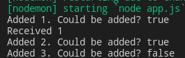

# Streams

- [Streams](#streams)
	- [Intro](#intro)
	- [Features](#features)
		- [Events](#events)
		- [Methods](#methods)
	- [Create](#create)
		- [Readable](#readable)
		- [Writable](#writable)

***

## Intro

Stream is a concept that allows **processing data by little pieces** or **chunks**.

Example: send file to the client **at once** and using **streams and chunks**

```js
// 1 - simply send a file
async function sendFile(req, req, next) {
	fs.readFile('01. Dreaming Wide Awake.mp3', (err, data) => {
		if (err) {
			throw err
		}
		res.end(data)
	})
}

// 2 - send a file using streams and chunks
async function sendFile(req, req, next) {
	const fileStream = fs.createReadStream('path to file')
	res.contentType('application/pdf')
	fileStream.pipe(res)
}
```

***


## Features

There are 4 types of streams in node:

1. `Readable` - read (**req**)
2. `Writable` - write (**res**)
3. `Duplex` - both
4. `Transform` - a variation of duplex allowing to change data


***


### Events

Event|Description
-|-
`stream.on('data', callback)`|When new chunk of data arrives
`readable`|
`close`|
`end`|
`finish`|

***


### Methods

Metod|Description
`stream.destroy()`|

***


## Create

There are 2 ways to create stream:

```js
const { Readable } = require('stream')

// 1 - constructor
const myReadable = new Readable(opt)

// 2 - class extension
class myReadable extends Readable {
	constructor(opt){
		super(opt)
	}

	_read(size){}
}
```

We'll use the 2nd way. Either way, it takes a set of options. Some of them:

- `hightWaterMark` - max **buffer** size in bytes. Reading continues after the buffer is **empty** again (after `pipe`, `resume` or after processing the `data` event)
- `_read()` - protected method called implicitly until `highWaterMark` is reached. 
- `push()` - adds data to the **buffer**. Returns `false` if the buffer is full, `true` - otherwise. 

***


### Readable

Example: 

```js
const { Readable } = require('stream')

class Counter extends Readable {
	constructor(opt){
		super(opt)

		this._max = 100
		this._index = 0
	}

	_read(){
		this._index += 1
		if(this._index > this._max){
			this.push(null)
		} else {
			const buf = Buffer.from(`${this._index}`, 'utf8')
			console.log(`Added ${this._index}. Could be added? ${this.push(buf)}`)
		}
	}
}

const counter = new Counter({ highWaterMark: 2 })
console.log(`Received ${counter.read()}`)	// change this later
```



What happened here? 

1. In `new Counter({ highWaterMark: 2 })` we set the size of our inner buffer to **2 bytes**. Thus, it can store **2** of 1-byte (`utf8`) characters. 
2. `counter.read()` starts reading. 
   1. It writes '1' to the buffer.
   2. `Readable.push` - `return true` - can continue
   3. Repeat **1-2** for '2' 
   4. When the stream tries to write '3', `Readable.push()` will `return false` and the stream will wait until the **buffer** is empty. We don't have the buffer emptying yet, so the reading stops here. 

Let's add buffer emptying. Change the last line to this:

```js
counter.on('data', chunk => {
	console.log(`Received: ${chunk}`)
})
```

Now it counts from 1 to 100.

***


### Writable 

```js
const { Writable } = require('stream')

class myWritable extends Writable {
  	constructor(opt) {
    	super(opt)
  	}

  	_write(chunk, encoding, callback) {}
}
```

Similar to Readable:

- 