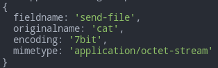
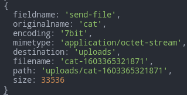
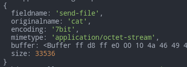
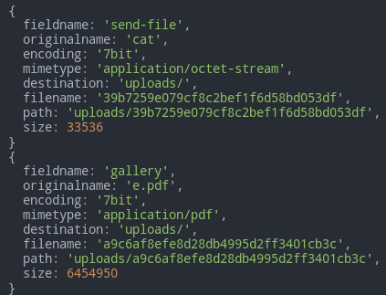

# Third-party Modules

- [Third-party Modules](#third-party-modules)
- [`bluebird`](#bluebird)
- [Mime types](#mime-types)
	- [`mime`](#mime)
	- [Methods](#methods)
		- [`mime.`**`getType`**`(pathOrExtension)`](#mimegettypepathorextension)
		- [`mime.`**`getExtension`**`(type)`](#mimegetextensiontype)
		- [`mime.`**`define`**`(typeMap[, force = false])`](#mimedefinetypemap-force--false)
	- [`mmmagic`](#mmmagic)
- [`multer`](#multer)
	- [Warning](#warning)
	- [Intro](#intro)
	- [**`multer`**`([opts])`](#multeropts)
		- [`storage`](#storage)
			- [File Info](#file-info)
			- [`DiskStorage`](#diskstorage)
			- [`MemoryStorage`](#memorystorage)
		- [`limit`](#limit)
		- [`fileFilter`](#filefilter)
	- [Methods](#methods-1)
		- [`upload`**`.single`**` (filename)`](#uploadsingle-filename)
		- [**`.array`**` (fieldname[, maxCount])`](#array-fieldname-maxcount)
		- [**`.fields`**` (fields)`](#fields-fields)
		- [**`.none`**` ()`](#none-)
		- [**`.any`**` ()`](#any-)
	- [Error handling](#error-handling)
- [Validation and Sanitization](#validation-and-sanitization)
	- [`validator`](#validator)
		- [Client](#client)
		- [Methods](#methods-2)
	- [`express-validator`](#express-validator)
		- [Validation and Sanitization Chain API](#validation-and-sanitization-chain-api)
		- [Middleware](#middleware)
			- [**`check`**`([field, message])`](#checkfield-message)
			- [**`oneOf`**`(validationChains[, message])`](#oneofvalidationchains-message)
		- [Validation Chain API](#validation-chain-api)
			- [**`bail`**`()`](#bail)
			- [**`custom`**`(validator)`](#customvalidator)
			- [**`customSanitizer`**`(sanitizer)`](#customsanitizersanitizer)
			- [**`exists`**`([options])`](#existsoptions)
			- [**`if`**`(condition)`](#ifcondition)
			- [**`isArray`**`([options])`](#isarrayoptions)
			- [**`isString`**`()`](#isstring)
			- [**`not`**`()`](#not)
			- [**`notEmpty`**`()`](#notempty)
			- [**`optional`**`(options)`](#optionaloptions)
			- [**`run`**`(req[, options])`](#runreq-options)
			- [**`withMessage`**`(message)`](#withmessagemessage)
		- [Result Handlers](#result-handlers)
			- [**`matchedData`**`(req [, options])`](#matcheddatareq--options)
			- [**`validationResult`**`()`](#validationresult)
			- [**`result.isEmpty`**`()`](#resultisempty)
			- [`result.`**`array`**`([options])`](#resultarrayoptions)
			- [`result.`**`mapped`**`([options])`](#resultmappedoptions)
			- [**`result.throw`**`()`](#resultthrow)

***


# `bluebird`

Advanced Promise module.

http://bluebirdjs.com/docs/api-reference.html - docs

The most useful function there - `promisifyAll`

***


# Mime types

There are several modules available for working with **mime types**:

- `mimd-db`
- `mime-types`
- `mime`
- `mmmagic` - tries to detect the mime type by data inspection

***

## `mime`

https://www.npmjs.com/package/mime

For browser: 

```js
<script src="https://wzrd.in/standalone/mime@latest"></script>
<script>
mime.getType(...); // etc.
<script>
```

For server:

```bash
npm i mime
```

```js
const mime = require('mime')
```

***

## Methods

### `mime.`**`getType`**`(pathOrExtension)`

```js
mime.getType('js')				// ⇨ 'application/javascript'
mime.getType('json')			// ⇨ 'application/json'
 
mime.getType('txt')				// ⇨ 'text/plain'
mime.getType('dir/text.txt')	// ⇨ 'text/plain'
mime.getType('dir\\text.txt')	// ⇨ 'text/plain'
mime.getType('.text.txt')		// ⇨ 'text/plain'
mime.getType('.txt')			// ⇨ 'text/plain'
```

***

### `mime.`**`getExtension`**`(type)`

```js
mime.getExtension('text/plain')					// ⇨ 'txt'
mime.getExtension('application/json')			// ⇨ 'json'
mime.getExtension('text/html; charset=utf8')	// ⇨ 'html'
```

***

### `mime.`**`define`**`(typeMap[, force = false])`

Define a new type mapping.

Use `force` parameter to overwrite the existing types.

```js
const express = require('express')
const app = express()
const mime = require('mime')

mime.define({ 'text/x-abc': ['abc', 'abcd'] })

console.log(mime.getType('abc'))	// ⇨ 'text/x-abc'
console.log(mime.getType('abcd'))	// ⇨ 'text/x-abc'
console.log(mime.getExtension('text/x-abc'))	// ⇨ 'abc'

app.listen(3000)
```

***


## `mmmagic`

https://www.npmjs.com/package/mmmagic

Tries to detect the mime type by data inspection. The answers are **not always correct!**

```bash
npm i mmmagic
```

```js
const mmm = require('mmmagic')
const Magic = mmm.Magic

const magic = new Magic(mmm.MAGIC_MIME_TYPE)
magic.detectFile('NEW COME - BRAHMA-FrTtrYXj2-c', (err, result) => {
	if (err) throw err
	console.log(result) // video/webm
})
```


# `multer`

https://www.npmjs.com/package/multer

## Warning

Make sure that you always handle the files that a user uploads. Never add `multer` as a global middleware since a malicious user could upload files to a route that you didn't anticipate. 

## Intro

Install

```bash
npm i multer
```

Basic usage

```js
const multer = require('multer')
const upload = multer({ dest: 'uploads/' })

router.post('/', upload.single('avatar'), (req, res, next) => {})
```

This will save a file uploaded via `<input type="file" name="avatar">` to `./uploads`. 

The file will be available from `req.file` or `req.files` (if multiple).

***


## **`multer`**`([opts])`

**Multer** must be initialized:

```js
const multer = require('multer')
const upload = multer({ dest: 'uploads/' })

router.post('/form', upload.single('send-file'))
```

`multer` is a constructor:


`upload` is an instance of it: 


Or just

```js
const multer = require('multer')
const upload = multer({ dest: 'uploads/' }).single('send-file')

router.post('/form', upload)
```


Optionally we can specify a parameter object with such fields:

| Field          | Description                                                                                                              |
| -------------- | ------------------------------------------------------------------------------------------------------------------------ |
| `dest`         | Path to a folder for saving files (`DiskStorage` is created automatically)                                               |
| `storage`      | A StorageEngine responsible for saving uploaded files. Takes presenedce over `dest` and overrides it if both are present |
| `fileFilter`   | Function to control which files are accepted                                                                             |
| `limits`       | Limits of the uploaded data                                                                                              |
| `preservePath` | Keep the full path of files instead of just the base name                                                                |

If no `dest` or `storage` specified, MemoryStorage is created automatically.

***


### `storage`

Sets the Storage Engine. Takes precedence over `dest` if both are used.

#### File Info

Each file loaded with `multer` can contain such fields:

| Key            | Description                                 | Note          |
| -------------- | ------------------------------------------- | ------------- |
| `fieldname`    | Field name specified in the form            |
| `originalname` | Name of the file on the user's computer     |
| `encoding`     | Encoding type of the file                   |
| `mimetype`     | Mime type of the file                       |
| `size`         | Size of the file in bytes                   |
| `destination`  | The folder to which the file has been saved | DiskStorage   |
| `filename`     | The name of the file within the destination | DiskStorage   |
| `path`         | The full path to the uploaded file          | DiskStorage   |
| `Buffer`       | A Buffer of the entire file                 | MemoryStorage |

***

#### `DiskStorage`

The disk storage engine gives you full control on storing files to disk.

There are two options available:

- `destination` - determines within which folder the uploaded files should be stored. Can be a function or a string (e.g. `destination: 'uploads'`). If none is provided, the OS default directory for temporary files will be used.
- `filename` - determine the saved file's names. If none is provided, a random name will be used. 

**NB**: multer will **not** append any file extension automatically. Also, you **should** create a directory for saving files yourself if you provide `destination` as a function.

Both functions receive 3 parameters:

1. `req` - request object
2. `file` - some file and field info available at this point
3. `cb (null, filePath | fileName)` - callback

```js
const storage = multer.diskStorage({
	destination: function (req, file, cb) {
		console.log(file)		// <--- Uploaded file info
		cb(null, '/tmp/my-uploads')
	},
	filename: function (req, file, cb) {
		cb(null, file.originalname + '-' + Date.now())
	}
})

const upload = multer({	storage })

router.post(
	'/form', 
	upload.single('send-file'), 
	(req, res, next) => { 
		console.log(req.file)	// <--- Saved file info
	}
)
```

File info from the storage callback:



Uploaded file has the same info + more:



***

#### `MemoryStorage`

Stores the files in memory as `Buffer` objects. It doesn't have any options and **doesn't get saved anywhere automatically** - hangs only in memory.

```js
const fs = require('fs')
const { Readable } = require('stream')
const { pipeline } = require('stream/promises')

const storage = multer.memoryStorage()
const upload = multer({ storage })

router.post(
	'/form', 
	upload.single('send-file'), 
	(req, res, next) => {
		console.log(req.file)	// <--- File

		const r = Readable.from(req.file.buffer)
		const w = fs.createWriteStream(`uploads/${req.file.originalname}`)

		await pipeline(r, w)
	}
)
```

The file info will contain a field called `buffer` that contains the entire file.



***


### `limit`

Specifies the size limits of the following optional properties:

| Key             | Description                                                             | Default   |
| --------------- | ----------------------------------------------------------------------- | --------- |
| `fieldNameSize` | Max field name size                                                     | 100 bytes |
| `fieldSize`     | Max field value size (in bytes)                                         | 1MB       |
| `fields`        | Max number of non-file fields                                           | Infinity  |
| `fileSize`      | For multipart forms, the max file size (in bytes)                       | Infinity  |
| `files`         | For multipart forms, the max number of file fields                      | Infinity  |
| `parts`         | For multipart forms, the max number of parts (fields + files)           | Infinity  |
| `headerPairs`   | For multipart forms, the max number of header key=>value pairs to parse | 2000      |

Specifying the limits can help protect your site against denial of service (DoS) attacks.

***


### `fileFilter`

Set this to a function to control which files should be uploaded and which should be skipped.

```js
function fileFilter(req, file, cb) {
	// The function should call `cb` with a boolean to indicate if the file should be accepted

	// To reject this file pass `false`, like so:
	cb(null, false)

	// To accept the file pass `true`, like so:
	cb(null, true)

	// You can always pass an error if something goes wrong:
	cb(new Error('I don\'t have a clue!'))
}
```

***


## Methods

### `upload`**`.single`**` (filename)`

Accept a single file with from the input with `name="fieldname"`. The single file will be stored in `req.file`.

Returns a middleware function (with (un)modified `req`, `res`, `next` parameters), as well as the rest of the methods described below.

```js
router.post('/form', upload.single('send-file'))
```

***

### **`.array`**` (fieldname[, maxCount])`

Accept an array of files from the input with `name="fieldname"`. Optionally **error out** if more than `maxCount` files are uploaded. The array of files will be stored in `req.files`.

```js
router.post('/form', upload.array('send-file', 2))
```

***

### **`.fields`**` (fields)`

Accept a mix of files from different inputs.

```html
<input type="file" name="avatar" />
<input type="file" name="gallery" multiple />
```

```js
router.post(
	'/form',
	upload.fields([
		{ name: 'avatar', maxCount: 1 },
		{ name: 'gallery' }
	])
)
```

***

### **`.none`**` ()`

Accept only text fields. If any file upload is made, error with code "LIMIT_UNEXPECTED_FILE" will be issued.

***

### **`.any`**` ()`

Accepts all files. An array of files will be stored in `req.files`.

Only use this function on routes where you are handling the uploaded files. See the [Warning](#warning)

```js
router.post('/form', upload.any(), (req, res, next) => {
	req.files.forEach((file) => console.log(file))
})
```



***


## Error handling

Multer delegetes errors to Express. If you have more control, you can perform custom checks of the kind: 

```js
if (err instanceof multer.MulterError) {
	// A Multer error occurred when uploading.
} else if (err) {
	// An unknown error occurred when uploading.
} else {
	// Everything went fine
}
```

***


# Validation and Sanitization

**Validation** - checks of the input data that return `true/false`.
Ensures that the incoming data is overall correct. 

**Sanitization** - changes to the input data to bring it to some standardized form (toLowerCase, trim spaces, etc.) work with it further.

***


## `validator`

https://github.com/validatorjs/validator.js

This library validates and sanitizes **strings only**, anything else is **error**!  Do `input + ''` or `${input}` if you're not sure. 

```bash
npm i validator
```

```js
const validator = require('validator')

validator.isEmail('foo@bar.com') // true
```

***


### Client

Use it to validate input on the client side (but you still **must** validate on the server side anyway!)

```html
<script src="validator.min.js"></script>
<script>
	validator.isEmail('foo@bar.com') // true
</script>
```

***


### Methods

Full list: https://github.com/validatorjs/validator.js#validators

**Validators**:

```js
// equals (str1, str2)
console.log(validator.equals('true', 'true'))	// true


// isEmpty (str [, options])
console.log(validator.isEmpty(' '))		// false
console.log(validator.isEmpty(''))		// true


// isLength (str [, options])
console.log(validator.isLength('', { min: 1, max: 16 }))	// false
console.log(validator.isLength('kuku', { min: 1, max: 16 }))	// true


// isEmpty (str [, options])
// options: { ignore_whitespace:false }
console.log(validator.isEmpty(''))		// true


// isIn (str, values)
console.log(validator.isIn('ku', ['mama', 'papa', 'kukareku', 'ku']))	// true -> only thanks to the last one


// matches (str, pattern)
console.log(validator.matches('Hello, Dolly!', /\w+/))	// true


// isEmail (str [, options])
console.log(validator.isEmail('max@bar.com'))	// true


// isMobilePhone (str[, locale [, options]])
// default locale is `any`
console.log(validator.isMobilePhone('0954321000', 'uk-UA'))		// true
console.log(validator.isMobilePhone('380954321000', 'uk-UA'))	// true
console.log(
	validator.isMobilePhone('380954321000', 'uk-UA', { strictMode: true })
) // false
console.log(
	validator.isMobilePhone('+380954321000', 'uk-UA', { strictMode: true })
) // true


// isBoolean (str)
console.log(validator.isBoolean(true)))		// true


// isDate (input [, options])
console.log(validator.isDate('2000-20-10'))	// false
console.log(validator.isDate('2000-01-01'))	// true


// isHash (str, algorithm)
console.log(validator.isHash('2ac2b01f3f15671f4be4f1816c639d45', 'md5'))	// true
console.log(validator.isHash('2ac2b01f3f15671f4be4f1816c639d45', 'sha1'))	// false


// isInt (str [, options])
console.log(validator.isInt('15', { min: 10, max: 20 }))	// true
console.log(validator.isInt('15', { min: 10, max: 2 }))		// false


// isIP (str [, version])
console.log(validator.isIP('192.168.0.1', 4))	// true
console.log(validator.isIP('192.168.0.1', 6))	// false


// isPort (str)
console.log(validator.isPort('80800'))	// false
console.log(validator.isPort('8080'))	// true


// isMACAddress (str)
console.log(validator.isMACAddress('01-02-03-04-05-ab'))	// true


// isLowercase (str)
// isUppercase (str)
console.log(validator.isLowercase('MAZAFAKA'))	// false
console.log(validator.isUppercase('MAZAFAKA'))	// false


// isMimeType (str)
console.log(validator.isMimeType('text/plain'))	// true
```

**Sanitizers**:

```js
// blacklist (input, chars) - remove characters that appear in the blacklist
// `chars` will be used in RegExp so some symbols need to be escaped
console.log(validator.blacklist('[Hello, Dolly!]', '\\[\\],!'))	
// Hello Dolly


// whitelist - remove characters that DON'T appear in the whitelist
// `chars` will be used in RegExp so some symbols need to be escaped
console.log(validator.whitelist('Hello, Dolly!', 'hell'))	// ellll


// escape (input) - replace <, >, &, ', " and / with HTML entities.
// unescape - the opposite
console.log(validator.escape('<script>Malicious code</script>'))
// &lt;script&gt;Malicious code&lt;&#x2F;script&gt;


// trim (input [, chars]); ltrim; rtrim;
console.log(`"${validator.trim(' Hello World ')}"`)
// "Hello World"
console.log(`"${validator.ltrim(' Hello World ', ' Hell')}"`)
// "o World "


// normalizeEmail (email [, options])
// A lot of options for specific email-providers available
console.log(validator.normalizeEmail('MAX.BAR@gmail.com'))
// maxbar@gmail.com


// toDate (input) - converts to Date or null. Validate before using
// toInt - same
// toFloat - same
```

***


## `express-validator`

https://express-validator.github.io/docs/

`express-validator` is an Express wrapper over `validator` making possible to call its functions as middleware (and adding some new methods).

Install:

```bash
npm i express-validator
```

***


### Validation and Sanitization Chain API

1. https://express-validator.github.io/docs/validation-chain-api.html
2. https://express-validator.github.io/docs/sanitization-chain-api.html

A middleware which should be passed to an Express route handler.

You can add as many validators and sanitizers to a chain as you need.

When the middleware runs, it will run each validator or sanitizer **in the order** they were specified.

```js
app.post(
	'/create-user', 
	[
		// input name="email"
		check('email').normalizeEmail().isEmail(),
		// input name="date-of-birth"
		check('date-of-birth').isISO8601().toDate()
	],
	(req, res, next) => {}
)
```

For Validation and Sanitization Chain you can use **any methods** available in the `validator` module **plus** several additional in `express-validator` (see the links above). They will have a little changed shape though. See examples.

***


### Middleware 

#### **`check`**`([field, message])`

Returns a **validation chain** for one or more fields. They may be located in any of the following request objects:

- `req.body`
- `req.cookies`
- `req.headers`
- `req.params`
- `req.query`

If any of the fields are present in more than one location, then all instances of that field value must pass the validation.

This function **modifies `req` filling it** with the **results of validation** that can be obtained in the next middleware function (notably via `validationResult(req)` and `matchedData(req)`). 

`message` param is responsible for the message to send to return is the check fails (default is `Invalid value`).

Single field:

```js
app.post(
	'/',
	[
		// input name="message"
		check('message')
			.isLength({ min: 1 })
			.withMessage('Message is required')
			.trim(),
		// input name="email"
		check('email')
			.isEmail()
			.withMessage('That email doesn‘t look right')
			.bail()
			.trim()
			.normalizeEmail()
	],
	(req, res, next) => {})
```

Array of fields:

```js
app.post(
	'/',
	// the same checks for `input name="message"` & `input name="email"`
	check(['message', 'email'])
		.isLength({ min: 1 })
		.trim(),
	(req, res, next) => {})
```

***

There are also methods for the specific fields (from the list above):

- `body ([fields, message])`
- `cookie ([fields, message])`
- `header ([fields, message])`
- `param ([fields, message])`
- `query ([fields, message])`

Same as `check([fields, message])`, but only checking the specific field.

***

#### **`oneOf`**`(validationChains[, message])`

Basically `Array.prototype.some` for validation chains.

Params:

- an array of validation chains (made by `check` and its variations) or an array of arrays of validation chains (for grouping)
- optional message to use if all chains failed

```js
app.post(
	'/',
	oneOf([
		check('handsome').equals('true'),
		check('money').isLength({ min: 9 }).isInt({ min: 100500 })
	]),
	(req, res, next) => {
		console.log(req.query)
		// { handsome: 'false', money: '999999999' }
		try {
			const errors = validationResult(req)
			// will throw if `errors` is not empty
			errors.throw()
			// otherwise - ok
			res.send('At least 1 validation chain fully succeded')
		} catch (err) {
			err.errors.forEach((item) => console.log(item.nestedErrors))
			res.status(400).send('None of the chains fully passed validation chains')
		}
	}
)

// Response:
// At least 1 validation chain fully succeded
```

If none of the validation chains succeeded, check `errors.nestedErrors`

***


### Validation Chain API

#### **`bail`**`()`

Stops running validations if any of the previous ones have failed. Useful to prevent a custom validator that touches a database or external API from running when you know it will fail.

Can be used multiple times in the same validation chain if needed.

Returns the current validation chain (can be chainged).

```js
app.post('/', [
  check('username')
    .isEmail()
    .bail()
    // If username is not an email, checkBlacklistedDomain will never run
    .custom(checkBlacklistedDomain)
    .bail()
    // If username is not an email or has a blacklisted domain, checkEmailExists will never run
    .custom(checkEmailExists)
])
```

***

#### **`custom`**`(validator)`

Adds a custom validator to the current validation chain.

`validator (value, { req, location, path })` - the custom validator function. Params:

- `value` - the actual received value from the input
- `req` - Request object
- `location` - query || body ...
- `path` - `name` of the input

To indicate the field **valid**:

- return any **truthy** value
- return **Promise.resolve**('any value - doesn't matter')

To indicate the field **invalid**:

- return any **falsy** value
- return **Promise.reject**('any value - doesn't matter')
- **throw** new Error

Custom validator for the password confirmation:

```js
app.post(
	'/',
	[
		check('password').exists(),
		check('passwordConfirmation').custom((value, { req, location, path }) => value === req.body.password)
	])
```

***

#### **`customSanitizer`**`(sanitizer)`

Adds a custom sanitizer to the current validation chain. 

It must synchronously return the new value - this value will be taken as a sanitized value from the user input. 

`sanitizer(value, { req, location, path })` - custom sanitization function.

```js
app.get(
	'/:id',
	param('id').customSanitizer((value, { req }) => Number(value))
)
```

***

#### **`exists`**`([options])`

Checks the existence of the current field in the request. Any value except `undefined` is acceptable. 

Returns the current validation chain (can be chained).

Options can customize the behavior: 

- `checkNull` - if `true`, will consider `null` unacceptable
- `checkFalsy` - if `true`, will consider `'', 0, false, null` unacceptable

You can test it in Postman turning on and off the field you checks.

***

#### **`if`**`(condition)`

Adds a condition for deciding if validation should continue on a field or not.

Condition may be a validation chain returned by `check` (and similar functinos) or `condition`

Returns the current validation chain (can be chained).

***

#### **`isArray`**`([options])`

Options: `min`, `max` - array length.

***

#### **`isString`**`()`

Same

***

#### **`not`**`()`

Negates the result of the next validator.

```js
check('weekday').not().isIn(['sunday', 'saturday'])
```

***

#### **`notEmpty`**`()`

Not empty if the length is 1+

```js
check('username').notEmpty()
```

***

#### **`optional`**`(options)`

Marks the current validation chain as optional.

***

#### **`run`**`(req[, options])`

Runs the current validation chain in an imperative way.

Options include `dryRun: boolean` - to know if the request has any problems, without them being accounted among other request errors (`req` is not modified).

```js
app.post('/create-user', async (req, res, next) => {
	await check('email').isEmail().run(req)
	await check('password').isLength({ min: 6 }).run(req)

	const result = validationResult(req)
	if (!result.isEmpty()) {
		return res.status(400).json({ errors: result.array() })
	}

	// user can be created now!
})
```

***

#### **`withMessage`**`(message)`

Sets the error message for the previous validator.

***


### Result Handlers

https://express-validator.github.io/docs/matched-data-api.html

https://express-validator.github.io/docs/validation-result-api.html

#### **`matchedData`**`(req [, options])`

Gather matched data into an object of key-value pairs that weren't dropped during validation.

Options:

- `includeOptionals`: if set to `true`, the returned value includes optional data. Defaults to `false`.
- `onlyValidData`: if set to `false`, the returned value includes data from fields that didn't pass their validations. Defaults to `true`.
- `locations`: an array of locations to extract the data from. The acceptable values include `body, cookies, headers, params and query`. Defaults to `undefined`, which means all locations.

**Returns** an object of data that express-validator has validated or sanitized.

```js
const { matchedData } = require('express-validator')

// Suppose the request looks like this:
// req.query = { from: '2017-01-12' }
// req.body = { to: '2017-31-12' }

app.post('/room-availability', check(['from', 'to']).isISO8601(), (req, res, next) => {
	const queryData = matchedData(req, { locations: ['query'] })
	const bodyData = matchedData(req, { locations: ['body'] })
	const allData = matchedData(req)
	console.log(queryData)	// { from: '2017-01-12' }
	console.log(bodyData)		// { to: '2017-31-12' }
	console.log(allData)		// { from: '2017-01-12', to: '2017-31-12' }
})
```

You may want to have **optional** values among the required ones.

If they are not included, some databases might understand that you don't want to update those values, so it's useful to set them to `null` or `""`.

```js
// Suppose the request looks like this:
// req.body = { name: 'John Doe', bio: '' }

app.post('/update-user', [
  check('name').not().isEmpty(),
  check('bio').optional({ checkFalsy: true }).escape(),
], (req, res, next) => {
	const requiredData = matchedData(req, { includeOptionals: false })
	const allData = matchedData(req, { includeOptionals: true })
	console.log(requiredData)	// { name: 'John Doe' }
	console.log(allData)		// { name: 'John Doe', bio: '' }
})
```

***


#### **`validationResult`**`()`

Extracts the validation errors from a request and makes them available in a `Result` object.

```js
const { validationResult } = require('express-validator')

const result = validationResult(req)
if(!result.isEmpty()){
	// handle errors
}
```

***

#### **`result.isEmpty`**`()`

Returns a boolean indicating whether this result object contains no errors at all.

***

#### `result.`**`array`**`([options])`

Gets all validation errors contained in this result object.

The same as `result.errors`.

***

#### `result.`**`mapped`**`([options])`

Basically `Object.entries` but only gets the first errors for each field.

***

#### **`result.throw`**`()`

If this result object has errors, then this method will throw an exception decorated with the same validation result API.

```js
try {
  	validationResult(req).throw()
  	// Oh look at ma' success! All validations passed!
} catch (err) {
  	console.log(err.mapped())	// Oh noes!
}
```

***


