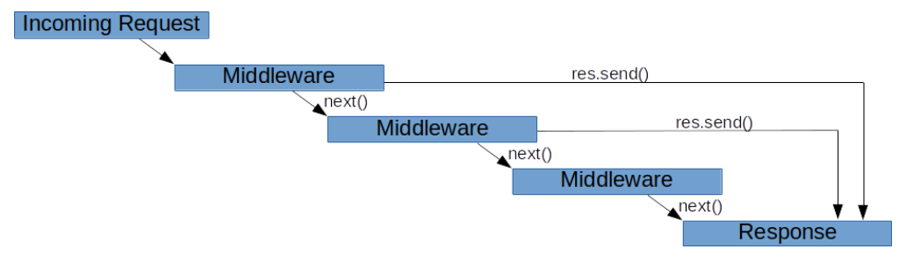
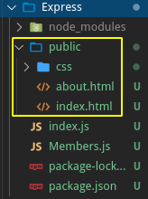
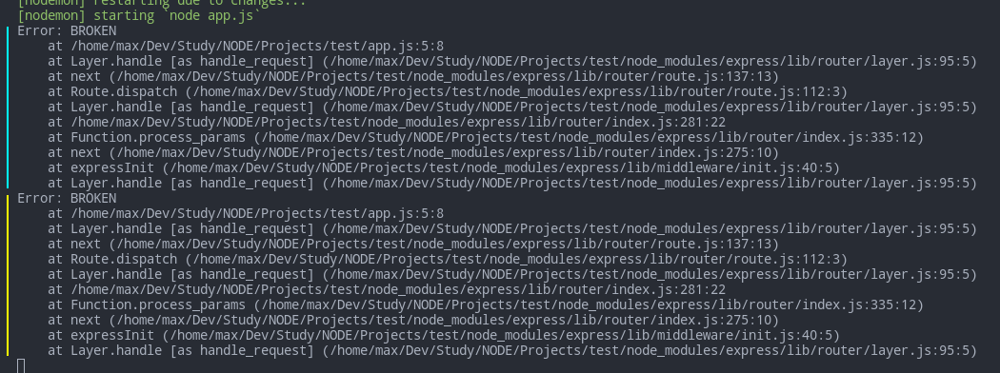
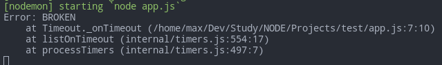
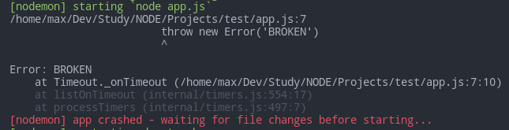

# Express Middleware

- [Express Middleware](#express-middleware)
	- [Sources](#sources)
	- [Intro](#intro)
	- [Important Middleware in Express](#important-middleware-in-express)
		- [Static folder](#static-folder)
		- [Body parser](#body-parser)
		- [Routing](#routing)
		- [Validators](#validators)
		- [Receiving files and FormData](#receiving-files-and-formdata)
	- [Creating Middleware](#creating-middleware)
		- [Async handlers](#async-handlers)
	- [Error Handling](#error-handling)
		- [Sync Errors](#sync-errors)
		- [Async Errors](#async-errors)
		- [Async built-in functions](#async-built-in-functions)
		- [Simplifications](#simplifications)
		- [Custom Error Middleware](#custom-error-middleware)

***

## Sources

1. https://developer.okta.com/blog/2018/09/13/build-and-understand-express-middleware-through-examples
2. f

***


## Intro

Middleware functions are the intermediate handlers that have access to the request object `req`, the response object `res`, and the `next` middleware function in the application’s request-response cycle.

Middleware functions can:

- Execute any code.
- Make changes to the `request` and the `response` objects.
- End the request-response cycle.
- Call the `next` middleware function in the stack.

If a middleware function doesn't have the first `path` parameter provided, it will be called for **every** request.

If the current middleware function does not end the `request-response cycle`, it must call the `next` middleware function. Otherwise, the request will be left hanging.



```javascript
app.use((req, res, next) => {
	// full URL of the request
	console.log(`${req.protocol}://${req.get('host')}${req.originalUrl}`)
	next() // call the next middleware
})
```

**See more in the [routing](routing.md) chapter.**

***

We can chain middleware handlers into sub-stacks using comma and use arrays of handlers:

```javascript
// app.js
app.use(
	'/',
	require('./middle1'),
	require('./middle2'),
	[handler1, handler2],
	(req, res, next) => {}
)
```

***

**Important note!** `res.send()` or `res.json()` does not equal `return`: it doesn't finish the function execution! This means that omitting `else` might result in error. Either always use `else` for the rest of the callback after `if`, or just add `return` in the `if` to actually finish the function.

***


## Important Middleware in Express

### Static folder

Middleware that returns pages requested by `page.html`-like request automatically:

```javascript
app.use(express.static(path.join(__dirname, 'public')))
```

- Requests to `/` and `/index.html` will be responded with `public/index.html`.
- Requests to `/about.html` will be responded with `public/about.html`.



***

### Body parser

To be able to use request bodies from `req.body` we should use a body parser middleware before that:

```javascript
// app.js
app.use(express.json())
app.use(express.urlencoded({ extended: false }))
```

To parse `FormData`, use [multiparty](https://www.npmjs.com/package/multiparty)

To handle incoming files (from `<input type="file">`), use [multer](https://www.npmjs.com/package/multer) (see the corresponding lesson).

***


### Routing

See the corresponding [lesson](07.routing.md)

***


### Validators

Use the third-party middleware. See the corresponding [lesson](04.third-party-modules.md#validation-and-sanitization) about `validator` and `express-validator`.

***


### Receiving files and FormData

`multer` handles sent files. 

`multyparty` handles `FormData`. 

See the corresponding [lesson](04.third-party-modules.md#multer)

***


## Creating Middleware

The basic requirements to middleware are:

1. Accepts 3 parameters
2. The 3rd one is a function
3. Call that function to pass execution

```js
const express = require('express')
const app = express()

function myMid(a, b, c) {
	console.log('Mid worked')
	c()
}

app.get('/', myMid, (req, res, next) => {
	res.send('End')
})

app.listen(3000)
```

***


### Async handlers

You can use async handlers freely. Just `try..catch` them to handle the async errors and pass them to Express.

```javascript
app.use('/', async (req, res, next) => {
	try {
		await new Promise((resolve, reject) => setTimeout(reject, 1000))
		res.end('Ok')
	} catch (err) {
		res.end('Error happened!') // handle yourself
		next(err) // throw to the Express default handler to catch it
	}
})
```

***


## Error Handling

### Sync Errors

Express catches all sync errors that occur while running route handlers and middleware. 

```js
const express = require('express')
const app = express()

app.get('/', (req, res, next) => {
	throw new Error('BROKEN')
})

app.listen(3000)
```

How do we know the app didn't crush? We send 2 requests and receive 2 responses (notifying about the error) - this means the server is still listening and responding.



***

### Async Errors

Async errors should be caught manually and thrown to Express using `next(err)`.

```js
const express = require('express')
const app = express()

app.get('/', async (req, res, next) => {
	try {
		throw new Error('BROKEN')
	} catch (err) {
		next(err)
	}
})

app.listen(3000)
```

If you don't catch this error, your server **won't** crush but the client **will** hang w/o response.

***

The same stands for the planned code

```js
const express = require('express')
const app = express()

app.get('/', (req, res, next) => {
	setTimeout(() => {
		try {
			throw new Error('BROKEN')
		} catch (err) {
			next(err)
		}
	}, 1000)
})

app.listen(3000)
```

The app survived



If you don't catch this error, your app **will** crush



***

In case of nested async and planned code, you should catch errors on the deepest level

```js
const express = require('express')
const app = express()

app.get('/', (req, res, next) => {
	setTimeout(() => {
		new Promise((resolve, reject) => {
			try {
				throw new Error('BROKEN')
			} catch (err) {
				next(err)
			}
		})
	}, 1000)
})

app.listen(3000)
```

If you don't catch this error, the client **will** hang. 

***


### Async built-in functions

Errors go to the `err` parameter - pass it to Express via `next(err)`

```js
const express = require('express')
const app = express()
const fs = require('fs')

app.get('/', function (req, res, next) {
	fs.readFile(
		'/file-does-not-exist',
		function (err, data) {
			if (err) {
				next(err)
			} else {
				res.send(data)
			}
		}
	)
})

app.listen(3000)
```

If you don't catch this error, it will **silently fail** to work and you'll never know it. 

***


### Simplifications

If the callback has only 1 argument - `err`, you can **simplify** the code:

```js
fs.writeFile('/inaccessible-path', 'data', next)

// the same for Promises - just pass `next` to the `.catch` block
Promise.resolve()
	.then(() => { throw new Error('BROKEN') })
	.catch(next)
```

You can also **simplify** it if you rely on a chain of handlers and your starting handlers didn't intent to end the client-server interaction:

```js
const express = require('express')
const app = express()
const fs = require('fs')

app.get(
	'/',
	(req, res, next) => {
		fs.readFile(
			'/maybe-valid-file', 'utf-8',
			(err, data) => {
				// no need for `if(err) next(err); else ...
				res.locals.data = data
				next(err)
			})
	},
	(req, res) => {
		res.locals.data = res.locals.data.split(',')[1]
		res.send(res.locals.data)
	}
)

app.listen(3000)
```

***


### Custom Error Middleware

Express has a built-in default error handler. But you can write your own behavior for it. Just create a middleware not with 3 but with 4 parameters at the end of the middleware chain. The first param gets the error object.

```js
app.use((err, req, res, next) => {
  // middleware functionality here
})
```

Complete example with one handler

```js
const express = require('express')
const app = express()

app.get('/', (req, res, next) => {
	next(new Error('I am passing you an error!'))
})

// if you make 3 params here instead of 4 - this handler will not be called but the Express' default one will
app.use((err, req, res, next) => {
	// to indicate this handler worked and not the Express' default one
	console.log('ACHTUNG!') 

	console.log(err)
	// always make this check or you can produce another error
	if (!res.headersSent) {
		res.status(500).send(err.message)
	}
})

app.listen(3000)
```

We can also use several handlers for different errors

```js
const express = require('express')
const app = express()

app.get('/nonexistent', (req, res, next) => {
	const err = new Error('I couldn\'t find it.')
	err.httpStatusCode = 404
	next(err)
})

app.get('/problematic', (req, res, next) => {
	const err = new Error('I\'m sorry, you can\'t do that, Dave.')
	err.httpStatusCode = 304
	next(err)
})

// Handles 404 errors
app.use((err, req, res, next) => {
	if (err.httpStatusCode === 404) {
		res.sendStatus(400)
	}
	next(err)
})

// Handles 304 errors
app.use((err, req, res, next) => {
	if (err.httpStatusCode === 304) {
		res.sendStatus(304)
	}
	next(err)
})

// This handler will catch all middleware errors - but it only goes through `if` in case when none of the previous handlers has yet responded to the client
app.use((err, req, res, next) => {
	console.log(err)
	if (!res.headersSent) {
		res.sendStatus(err.httpStatusCode || 500)
	}
})

app.listen(3000)
```