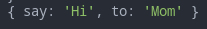
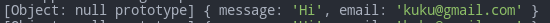
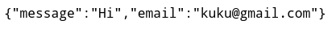

# Handling Form Data

This lesson has also server-side code.

- [Handling Form Data](#handling-form-data)
	- [Sources](#sources)
	- [Client](#client)
		- [`GET`](#get)
		- [`POST`](#post)
	- [Server](#server)
		- [`GET`](#get-1)
		- [`POST`](#post-1)
			- [Without files](#without-files)
			- [With files](#with-files)
		- [Full example](#full-example)

***

## Sources

1. https://developer.mozilla.org/en-US/docs/Learn/Forms/Sending_and_retrieving_form_data - basics
2. https://www.sitepoint.com/forms-file-uploads-security-node-express/ - nice tutorial
3. https://www.npmjs.com/package/multer - multer module

***

## Client

HTML form can have the following attributes (related to sending data):

- `action="site.com"` - url of the request (default is '/')
- `method="GET|POST"` - http method (default is GET)
- `enctype="multipart/form-data"` - sets "Content-Type", use this if you send files (default is json)

Files are **binary** data, whereas all other data is **text** data.

```html
<form action="/form" method="post" enctype="multipart/form-data">
	<input type="text" name="msg" />
	<input type="file" name="send-file" />
	<button type="submit">Submit</button>
</form>
```

***


### `GET`

Has **no body** and all the data is encoded in the **URL parameters** (`"application/x-www-form-urlencoded"`).

```html
<form action="http://foo.com">
	<input type="text" name="say" value="Hi">
	<input type="text" name="to" value="Mom">
	<button type="submit">Submit</button>
</form>
```

You'll see `foo.com/?say=Hi&to=Mom` in the address bar after you submit the form.

HTTP request: 

```http
GET /?say=Hi&to=Mom HTTP/2.0
Host: foo.com
```

***

### `POST`

Sends data using **body** of the request.

```html
<form action="http://foo.com" method="post">
	<input type="text" name="say" value="Hi">
	<input type="text" name="to" value="Mom">
	<button type="submit">Submit</button>
</form>
```

HTTP request:

```http
POST / HTTP/2.0
Host: foo.com
Content-Type: application/x-www-form-urlencoded
Content-Length: 13

say=Hi&to=Mom
```

Node.js either extracts data from `req` using streams or from `req.body` using Express body-parsing middleware:

```js
app.use(express.json())
app.use(express.urlencoded({ extended: false }))
```

***


## Server

Usually the request-response loop looks this way:

1. **Client** (req: GET) => **Server**
2. **Server** (res: the page with a form) => **Client** (this can be done via the static folder).
3. **Client** (req: POST data) => **Server**
4. **Server** (validates and sanitizes data, then do somwthing with it if it's ok)
5. **Server** (res: success message with redirect or failure message) => **Client**

***


### `GET`

Node.js extracts data from URL using `req.query` and `req.params`.

The idead is **you expect cetrain fields** and simply extract data from them. 

```js
router.get('/form', (req, res, next) => {
	console.log(req.query)
	res.send(req.query)
})
```



***


### `POST`

#### Without files

Get your data from `req.body` (don't forget your body-parsing middleware!). Validate and sanitize it before responding. See the lesson about [validation]('./../04.third-party-modules.md#validation-and-sanitization) for details. 

```html
<form action="/form" method="POST">
	// data from these fields will be validated and sanitized
	<input type="text" name="message" value=" Hi " />
	<input type="email" name="email" value="KUKU@gmail.com" />
	<button type="submit">Submit</button>
</form>
```

```js
router.post(
	'/form',
	validationMiddleware,
	(req, res, next) => {
		console.log(req.body)
		res.send(req.body)
	}
)
```





***


#### With files

We use **`multer`** (see the correspondins lesson) for handling multipart data. 

```html
<form action="/form" method="POST" enctype="multipart/form-data">
	<input type="text" name="message" value=" Hi " />
	<input type="email" name="email" value="KUKU@gmail.com" />
	<input type="file" name="send-file" />
	<button type="submit">Submit</button>
</form>
```

Server (router.js)

```js
const multer = require('multer')
const upload = multer({ dest: 'uploads/' })

router.post(
	'/form',
	upload.single('send-file'),
	(req, res, next) => {
		console.log(req.file)
		console.log(req.body)
		res.send(req.body)
	}
)
```

The sent file is automatically saved to the `uploads/` folder by the multer middleware. 

The uploaded file can be accessed from `req.file` while the rest of the form data is in `req.body` as usual. 

***


### Full example

Client

```pug
.form-header
  h2 Send us a message
form(method='post' action='/' novalidate='')
  .form-field
    label(for='message') Message
    textarea#message.input(name='message' rows='4' autofocus='')
  .form-field
    label(for='email') Email
    input#email.input(name='email' type='email' value='')
  .form-actions
    button.btn(type='submit') Send
```

Server (app.js)

```js
const http = require('http')
const express = require('express')
const fs = require('fs')
const util = require('util')
const validator = require('validator')

const app = express()
const server = http.createServer(app)
const PORT = process.env.PORT || 5000
const pipeline = util.promisify(require('stream').pipeline)

app.use([
	// body-parsers
	express.json(),
	express.urlencoded({
		extended: false
	}),
	// static folder
	express.static(__dirname),
	// routes
	('/', require('./routes/routes')),
	// error handling middleware: we'll only get here if anything else doesn't respond first
	(req, res, next) => {
		res.status(404).send("Sorry can't find that!")
	},
	(err, req, res, next) => {
		console.error(err.stack)
		res.status(500).send('Something broke!')
	}
])

app.set('views', './views')
app.set('view engine', 'pug')

server.listen(PORT, () => console.log(`The app is running on port `, PORT))
```

Server (routes/routes.js)

```js
const express = require('express')
const router = express.Router()
const {
	check,
	validationResult,
	matchedData
} = require('express-validator')

router.get('/', (req, res, next) => {
	res.render('index')
})

router.post('/',
	// validators and sanitizers middleware
	[
		check('message')
		.isLength({
			min: 1
		})
		.withMessage('Message is required')
		.trim(),
		check('email')
		.isEmail()
		.withMessage('That email doesn‘t look right')
		.bail()
		.trim()
		.normalizeEmail()
	], (req, res, next) => {
		res.send(matchedData(req))
	})

module.exports = router
```

***

