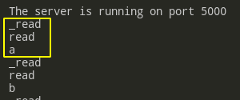

# Streams

- [Streams](#streams)
  - [Intro](#intro)
  - [Stream Creation](#stream-creation)
    - [`fs.`**`createReadStream`**`(path[, options])`](#fscreatereadstreampath-options)
    - [`fs.`**`createWriteStream`**`(path[, options])`](#fscreatewritestreampath-options)
    - [`stream.`**`Readable.from`**`(iterable, [options])`](#streamreadablefromiterable-options)
  - [Readable](#readable)
    - [Reading Modes](#reading-modes)
    - [Readable Events](#readable-events)
      - [`r.on(`**`'data'`**`, (chunk) => {})`](#rondata-chunk--)
      - [`r.on('`**`readable'`**`, () => {})`](#ronreadable---)
      - [`r.on(`**`'end'`**`)`](#ronend)
      - [`r.on(`**`'close'`**`)`](#ronclose)
    - [Readable Methods](#readable-methods)
      - [`r.`**`read`** `([size])`](#rread-size)
      - [`r.`**`resume`**`()`](#rresume)
      - [`r.`**`pipe`** `(destination[, options])`](#rpipe-destination-options)
      - [`stream.`**`pipeline`**`(source[, ...transforms], destination, cb)`](#streampipelinesource-transforms-destination-cb)
    - [Readable Details](#readable-details)
  - [Writable](#writable)
    - [Writable Events](#writable-events)
      - [`w.on(`**`'close'`**`)`](#wonclose)
      - [`writable.on(`**`'drain'`**`)`](#writableondrain)
      - [`writable.on(`**`'finish'`**`)`](#writableonfinish)
      - [`writable.on(`**`'pipe'`**`)`](#writableonpipe)
      - [`writable.on(`**`'unpipe'`**`)`](#writableonunpipe)
    - [Writable Methods](#writable-methods)
      - [`writable.`**`write`**`(chunk, encoding)`](#writablewritechunk-encoding)
      - [`writable.`**`cork`**`()`](#writablecork)
      - [`writable.`**`uncork`**`()`](#writableuncork)
      - [`writable.`**`end`**`([chunk[, encoding]][, callback])`](#writableendchunk-encoding-callback)
      - [`writable.`**`destroy`**`([error])`](#writabledestroyerror)
  - [Duplex](#duplex)
  - [Buffering](#buffering)
  - [Implementing streams](#implementing-streams)
    - [Implementing Writable](#implementing-writable)
    - [Implementing Readable](#implementing-readable)
  - [Examples](#examples)
    - [Reading via `for..await`](#reading-via-forawait)
    - [Reading and writing on the fly](#reading-and-writing-on-the-fly)
      - [Basic manual reading and writing](#basic-manual-reading-and-writing)
      - [Complete manual reading and writing](#complete-manual-reading-and-writing)
      - [Piping](#piping)
  - [Stream Implementstion](#stream-implementstion)

---

## Intro

The first thing to know when you start learning streams: their components live in **2** Node modules:

- [fs](https://nodejs.org/api/fs.html)
- [stream](https://nodejs.org/api/stream.html)

You should have both pages always opened when you learn streams.

---

**Why do we need streams?**

Imagine you want to send a file to a user like this:

```js
const http = require('http')
const fs = require('fs')

const server = http.createServer(function (req, res) {
	fs.readFile(__dirname + '/data.txt', function (err, data) {
		res.end(data)
	})
})
server.listen(8000)
```

The problem is: it buffers the **entire file before sending it**! And it is loaded into the memory fully each time before sending it to another client. This is an unacceptable waste of resources.

Also, the user won't receive any content until this file is buffered to the memory on the server.

---

Stream is a concept that allows **processing data by little pieces** or **chunks**.

There are 4 types of streams in node:

- `Readable` - for reading
- `Writable` - for writing
- `Duplex` - for both
  - `Transform` - a variation of duplex allowing to change data

Examples:

- `req`, `process.stdin` - Readable streams
- `res`, `process.stdout` - Writable streams
- `websocket` - Duplex stream

---

## Stream Creation

There're 3 main ways to create a stream that we gonna use:

### `fs.`**`createReadStream`**`(path[, options])`


---

### `fs.`**`createWriteStream`**`(path[, options])`


---

### `stream.`**`Readable.from`**`(iterable, [options])`

An utility method for creating readable streams out of **iterators**.

```js
const { Readable } = require('stream')

function* generate() {
	for (let i = 0; i < 1000; i++) {
		yield i
	}
}

const r = Readable.from(generate())

r.on('readable', () => {
	let chunk
	while ((chunk = r.read()) !== null) {
		console.log(chunk)
	}
})
```

---

## Readable

### Reading Modes

There are 3 modes for `Readable` streams:

- **flowing mode**: data is read automatically and poured as quickly as possible.
- **paused mode**: `stream.read()` mush be called explicitly to read chunks of data from the stream.
- **object mode**: allows stream to push arbitrary data, not just strings and buffers (`{ objectMode: true }` option is required on creation). Rarely used.

`Readable` streams begin in **paused** mode but can be switched to the **flowing** one by:

- adding the `data` event listener
- `stream.resume()`
- `stream.pipe()`

Switch back to **paused**:

- if there're no pipe destinations - `stream.pause()`
- if there're pipe destinations - remove them (`stream.unpipe()`)

---

`readable.readableFlowing === null|false|true`

When `null` - no reading mechanism is provided, so data is not being read.

---

### Readable Events

#### `r.on(`**`'data'`**`, (chunk) => {})`

The old way ot reading data. When the stream is in **flowing mode** (e.g. when the `data` listener is attached), chunks of data are passes as soon as possible. The drawback is that you cannot actually control the flow - it just pours in.

```js
const readable = getReadableStreamSomehow()
readable.on('data', (chunk) => {
	console.log(`Received ${chunk.length} bytes of data.`)
})
readable.on('end', () => {
	console.log('There will be no more data.')
})

/* ...
Received 65536 bytes of data.
Received 36595 bytes of data.
There will be no more data. */
```

Don't use it, use **`'readable' + .read()`** instead.

---

#### `r.on('`**`readable'`**`, () => {})`

The difference with `'data'` is that the stream is in the **paused** mode. We control the flow calling `r.read()` explicitly.

Emitted when there is data available to be read from the stream. We use `chunk = r.read()` to get the next **chunk of data**.

Will also be emitted at the end, just before the `end` event (`stream.read()` will return `null`).

```js
const readable = getReadableStreamSomehow()
const chunks = []
r.on('readable', function () {
	let chunk

	while (true) {
		chunk = this.read()

		if (chunk === null) {
			break
		}

		console.log(chunk)
		chunks.push(chunk)
	}
})

r.on('end', function () {
	console.log('End')
	console.log(chunks.join(''))
})
```

If both `'readable'` and `'data'` are used at the same time, `'readable'` takes precedence in controlling the flow, i.e. `'data'` will be emitted only when `stream.read()` is called. The `readableFlowing` property would become `false`. If there are `'data'` listeners when `'readable'` is removed, the stream will start flowing, i.e. `'data'` events will be emitted without calling `.resume()`.

---

#### `r.on(`**`'end'`**`)`

Emitted when there is no more data to be consumed from the stream. Emitted only once when all the data is **completely successfully consumed**.

#### `r.on(`**`'close'`**`)`

Emitted when the stream and any of its underlying resources (a file descriptor, for example) have been closed.

May not only happen after the correct and expected `'end'` but also after unexpected error (e.g. the client left and the connection was broken).

---

### Readable Methods

#### `r.`**`read`** `([size])`

Returns data from the internal buffer:

- return the **chunk** of data if available
- If no data available, returns `null`

If `r.setEncoding()` was used to set the default encoding, then the chunk of data will be passed as a `string`, otherwise - as a `Buffer`.

`size` specifies how many bytes to read (should be **< 1 GB**). **If none is set, all of the data will be returned** (see the NASA apod API example in another lesson).

**NB**: When reading a **large file**, `.read()` may return `null`, having consumed all buffered content so far, but there is still more data to come **not yet buffered**. In this case a new `'readable'` event will be emitted when there is more data in the buffer. Finally the `'end'` event will be emitted when there is no more data to come.

Therefore to read a file's whole contents from a readable, it is necessary to collect chunks across **multiple** `'readable'` events:

```js
// You cannot define it inside the 'readable' - it will be called not once but multiple times rewriting your chunks!
const chunks = []

readable.on('readable', () => {
	let chunk
	while ((chunk = readable.read()) !== null) {
		chunks.push(chunk)
	}
})

readable.on('end', () => {
	const content = chunks.join('')
	// do something with it
})
```

---

#### `r.`**`resume`**`()`

Switches a readable stream into the **flowing mode**. Often used to fully consume the data from a stream without actually processing any of that data:

```js
getReadableStreamSomehow()
	.resume() // turn on flowing
	.on('end', () => {
		// no `data` handler attacked so nothing is read
		console.log('Reached the end, but did not read anything.')
	})
```

Has **no effect** if there is a `'readable'` event listener attached.

---

#### `r.`**`pipe`** `(destination[, options])`

Attaches a `Writable` stream to the `Readable`, causing it to switch automatically into the **flowing mode** and push all of its data to the attached `Writable` (handling backpressure!)

It is also possible to attach multiple `Writable` streams to a single `Readable` one.

Returns a reference to the **destination** stream making it possible to **chain** pipes if it is a `Duplex` or a `Transform` stream.

```js
const r = fs.createReadStream('01. Dreaming Wide Awake.mp3')

const w1 = fs.createWriteStream('clone1.mp3')
const w2 = fs.createWriteStream('clone2.mp3')

r.pipe(w1)
r.pipe(w2)
```

**There is a problem with pipes**. If the `Readable` stream emits an **error** during processing, the `Writable` destination is **not closed** automatically: you'll have to manually close each stream in order to prevent memory leaks.

**Don't ever do this:**

```js
http.createServer((req, res) => {
	fs.createReadStream(__filename).pipe(res)
})
```

If the client closes connection before the transfer is over, or any other error occurs, the stream will **not end automatically**! It will hang forever.

The better way to pipe something is `pipeline`.

---

#### `stream.`**`pipeline`**`(source[, ...transforms], destination, cb)`

A newer and better way to do pipes. It forwards errors and cleans up automatically.

Example with **transforming**:

```js
const fs = require('fs')
const zlib = require('zlib')

const { pipeline } = require('stream')

pipeline(
	fs.createReadStream('archive.tar'),
	zlib.createGzip(),
	fs.createWriteStream('archive.tar.gz'),
	(err) => {
		if (err) {
			console.error('Pipeline failed.', err)
		} else {
			console.log('Pipeline succeeded.')
		}
	}
)
```

Add **promisification**:

```js
const util = require('util')
const fs = require('fs')
const zlib = require('zlib')

const pipeline = util.promisify(require('stream').pipeline)

run()

async function run() {
	try {
		await pipeline(
			fs.createReadStream('archive.tar'),
			zlib.createGzip(),
			fs.createWriteStream('archive.tar.gz')
		)
		console.log('Pipeline succeeded.')
	} catch (err) {
		console.error('Pipeline failed.', err)
	}
}
```

And use **async generators**:

```js
const fs = require('fs')

run()

async function run() {
	try {
		await pipeline(
			fs.createReadStream('lowercase.txt'),
			/* this function works as a Transformer changing the passed stream and passing it further*/
			async function* (source) {
				source.setEncoding('utf8') // Work with strings rather than `Buffer`s.
				for await (const chunk of source) {
					yield chunk.toUpperCase()
				}
			},
			fs.createWriteStream('uppercase.txt')
		)
		console.log('Pipeline succeeded.')
	} catch (err) {
		console.error('Pipeline failed.', err)
	}
}
```

---

### Readable Details

TO REWORK

Under the hood, `Readable` streams repeatedly calls the **private** `_read()` method that **pushes chunks** of data into the stream.

```js
const { Readable } = require('stream')

class AlphabetReadable extends Readable {
	_char = 97

	// should `this.push(...)` data or null
	_read() {
		console.log('_read')
		if (this._char > 'z'.charCodeAt(0)) {
			// 122
			this.push(null) // end of streaming
		}
		setTimeout(() => {
			this.push(String.fromCharCode(this._char++))
		}, 100) // a, b, c, ...
	}
}

const ar = new AlphabetReadable()

ar.on('readable', function () {
	let chunk
	while (true) {
		// `read()` calls `_read()` and returns the result
		// It it's `null` - end of the stream
		chunk = this.read()
		if (chunk === null) {
			break
		}
		console.log('read')
		console.log(chunk.toString())
	}
})

process.stdin.on('readable', function () {
	var buf = process.stdin.read(3)
	console.dir(buf)
	process.stdin.read(0)
})
```



See `Stream Implementstion` for more details.

---

## Writable

### Writable Events

#### `w.on(`**`'close'`**`)`

Emitted when the stream and any of its underlying resources (e.g. a file descriptor) have been closed. The event indicates that **no more events will be emitted**, and **no further computation will occur**.

A `Writable` stream will always emit the `'close'` event if it is created with the `emitClose` option.

---

#### `writable.on(`**`'drain'`**`)`

If a call to `stream.write(chunk)` returns `false`, the `'drain'` event will be emitted when it is appropriate to resume writing data to the stream.

See `writable.write` and `Examples` chapters for examples.

---

#### `writable.on(`**`'finish'`**`)`

Emitted after the `stream.end()` method has been called, and all data has been flushed to the underlying system.

---

#### `writable.on(`**`'pipe'`**`)`

Emitted when the `r.pipe()` or `pipeline` is called, adding this `writable` to its set of destinations.

---

#### `writable.on(`**`'unpipe'`**`)`

Emitted when the `stream.unpipe()` method is called on a `Readable` stream, removing this `Writable` from its set of destinations.

Also emitted in case this `Writable` stream emits an **error** when a `Readable` stream pipes into it.

---

### Writable Methods

#### `writable.`**`write`**`(chunk[, encoding][, callback])`

**TLDR**

1. Use it to write to the stream.
2. Set `on.('error')` handler to track errors.
3. Stop writing as it begins to return `false` (buffer is full) and resume after `on.('drain')` (buffer is empty).

Writes some data to the stream, and calls the supplied `callback` once the data has been fully handled. If an `error` occurs, the callback may or may not be called with the error as its first argument. To reliably detect write errors, add a listener for the `'error'` event. The `callback` is called asynchronously and before `'error'` is emitted.

Returns `true` if the internal buffer is less than the `highWaterMark`. Otherwise - `false`, further attempts to write data to the stream should stop until the `'drain'` event is emitted. While a stream is not draining, calls to `write()` will **buffer chunk**, and return `false`.

Once all currently buffered chunks are drained (accepted for delivery by the operating system), the `'drain'` event will be emitted.

It is recommended that once `write()` returns `false`, **no more chunks be written** until the `'drain'` event is emitted. While calling `write()` on a stream that is not draining is allowed, Node.js will buffer all written chunks until maximum memory usage occurs, at which point it will abort unconditionally. Even before it aborts, high memory usage will cause poor garbage collector performance and high RSS (which is not typically released back to the system, even after the memory is no longer required). Since TCP sockets may never drain if the remote peer does not read the data, writing a socket that is not draining may lead to a remotely exploitable vulnerability.

```js
const w = fs.createWriteStream(path.join(__dirname, 'output'))

run()

async function run() {
	for (let i = 0; i < 1000; i++) {
		const isDrained = w.write(Buffer.from(`${i}\n`, 'utf8'))

		if (!isDrained) {
			// wait until this event fires once
			await events.once(w, 'drain')
		}
	}
}
```


---

#### `writable.`**`cork`**`()`

Forces all written data to be buffered in memory. The buffered data will be flushed when either the `stream.uncork()` or `stream.end()` methods are called.

Don't use without implementing `writable._writev()`.

---

#### `writable.`**`uncork`**`()`

Flushes all data buffered since stream.cork() was called. It is recommended that calls to `writable.uncork()` be deferred using `process.nextTick()`.

If the `writable.cork()` method is called multiple times on a stream, **the same number of calls** to `writable.uncork()` must be called to flush the buffered data.

```js
stream.cork()
stream.write('some ')
stream.write('data ')
process.nextTick(() => stream.uncork())
```

---

#### `writable.`**`end`**`([chunk[, encoding]][, callback])`

Signals that no more data will be written to the `Writable`. The optional `chunk` and `encoding` arguments allow one final additional chunk of data to be written immediately before closing the stream.

---

#### `writable.`**`destroy`**`([error])`

Destroy the stream. Optionally emit an `'error'` event, and emit a `'close'` event (unless `emitClose` is set to `false`).

This immediately destroys the stream. Use `end()` instead if data should flush before close, or wait for the `'drain'` event before destroying the stream.

---

## Duplex

Stream that can both read and write. It has 2 separate buffers for reading and writing. Also, both `read()` and `write()` methods should be implemented.

---

## Buffering

Both `Writable` and `Readable` streams will store data in an internal buffer:

- `writable.writableBuffer`
- `readable.readableBuffer`

`highWaterMark` defines the buffer size.

Data is buffered in `Readable` streams when the implementation calls `stream.push(chunk)`. If the consumer does not call `stream.read()`, the data will sit in the internal queue until it is consumed. Once the buffer reaches `highWaterMark`, it stops reading new data (stops `readable._read()`).

Data is buffered in `Writable` streams when the `writable.write(chunk)` method is called repeatedly. Once the buffer reaches `highWaterMark`, `writable.write(chunk)` starts to return `false`.

The `highWaterMark` option is a threshold, not a limit: it dictates the amount of data that a stream buffers before it stops asking for more data. It **does not enforce** a strict memory limitation in general (but this can be coded).

`pipe` and `pipeline` manage limiting buffering themselves.

---

## Implementing streams

https://nodejs.org/api/stream.html#stream_api_for_stream_implementers

We can not only use the built-in streams that will pipe data from one source to the other. We can implement our own custom stream with unusual (e.g. transforming) behavior.

**None** of the mentioned below **underscored** function should be called directly - they will be called by the stream itself.

### Implementing Writable

`new stream.Writable([options])`

Options:

To create our own implementation, we have to:

1. Create an instance of `stream.Writable()`
2. Add the mehods:
   1. **`_write (chunk, encoding, cb)`** - **mandatory**, implements the behavior of our stream
   2. **`_writev (chunks, cb)`** - needed for streams that can accept multiple chunks at once; each element of the array of chunks should be `{ chunk: ... , encoding: ... }`
   3. **`_construct (cb)`** - scheduled in the next tick by the stream constructor, delaying any other _underscored_ calls until `cb` is called. Useful for async initialization.
   4. **`_final (cb)`** - will be called before the stream closes, delaying the `'finish'` event until callback is called. This is useful to close resources or write buffered data before a stream ends.
   5. **`_destroy (err, cb)`** - called internally by `destroy()`
3. Put some data into our stream!

**What is `cb()`?** This callback function plays the role of `resolve/reject` - you call it to indicate the end of the function execution. Pass `err` to it if you encountered one.

---

**Basic Example**: create a Writable stream that adds `!!!` to the end of each chunk while appending them to the file.

**Enter some data into the console and then check the created file**

```js
const fs = require('fs')
const path = require('path')
const util = require('util')
const stream = require('stream')
const pipeline = util.promisify(stream.pipeline)
const { Readable, Writable } = stream

const w = new Writable()

// Our stream implementation that will write chunks to a file adding '!!!' to each chunk
w._write = (chunk, encoding, cb) => {
	const writableToDisk = fs.createWriteStream(
		path.join('uploads', `written.txt`),
		{ flags: 'a' }
	)

	// For some reason, chunks add `\n` at the end, so we cut it and then reattach after our addition
	const data = chunk.slice(0, chunk.length - 1) + '!!!\n'
	writableToDisk.write(data, (err) => {
		if (err) {
			return console.error(err)
		}
		console.log('Written!')
	})

	// Calling callback is equal to `resolve()`
	cb()
}

// Pipe data from the console input to our custom stream
pipeline(process.stdin, w)
```

---

**More advanced Example**: we can create a **class** to easier create instances of our stream. The **alternative way** is to pass the `options` object with these exact methods (and other properties) implemented (see refs)

```js
const fs = require('fs')
const path = require('path')
const util = require('util')
const stream = require('stream')
const pipeline = util.promisify(stream.pipeline)

const { Readable, Writable } = stream

class MyWritable extends Writable {
	constructor(filename) {
		super()
		this.filename = filename
	}

	_construct(cb) {
		fs.open(this.filename, 'a', (err, fd) => {
			if (err) {
				cb(err)
			} else {
				this.fd = fd
				cb()
			}
		})
	}

	_write(chunk, encoding, next) {
		const data = chunk.slice(0, chunk.length - 1) + ' !!!\n'

		fs.write(this.fd, data, (err, bytesWritten, buffer) => {
			if (err) {
				return console.error(err)
			}
			console.log('Written!')
		})

		next()
	}

	_destroy(err, cb) {
		if (this.fd) {
			fs.close(this.fd, (er) => cb(er || err))
		} else {
			cb(err)
		}
	}
}

const w = new MyWritable(path.join(__dirname, 'uploads', 'text.txt'))

pipeline(process.stdin, w)
```

---

### Implementing Readable

`new stream.Readable([options])`

Options: 

Similar to the Writable above. Methods to implement:

1. **`_read (size)`** - **mandatory**. `size` is advisoty, there's no need to wait until `size` bytes are available before calling `stream.push(chunk)`. Empty data doesn't trigger it. The idea is:
   1. When there's data available from the resource, call `_read()`
   2. It should trigger the flow of multiple `this.push(chunk)`. When one of them returns `false`, the reading stops.
   3. Repeat 1-2.
2. **`_construct (cb)`** - the same as for `Writable`
3. **`_destroy (err, cb)`** - the same as for `Writable`

If you encountered an **Error**, call `this.destroy(err)`

This **example** reads the text file and adds 'Peace!' at the end of each chunk.

```js
const fs = require('fs')
const path = require('path')
const util = require('util')
const stream = require('stream')
const pipeline = util.promisify(stream.pipeline)

const { Readable, Writable } = stream

class MyReadable extends Readable {
	constructor(options) {
		super(options)
		this.filename = options.filename
	}

	_construct(cb) {
		fs.open(this.filename, (err, fd) => {
			if (err) {
				cb(err)
			} else {
				this.fd = fd
				cb()
			}
		})
	}

	_read(size) {
		fs.read(
			this.fd,
			{
				buffer: Buffer.alloc(size),
				length: size
			},
			(err, bytesRead, buffer) => {
				if (err) {
					console.error(err)
					this.destroy(err)
				} else {
					this.push(
						bytesRead > 0 ? `${buffer.slice(0, bytesRead - 1)} Peace!\n` : null
					)
				}
			}
		)
	}

	_destroy(err, cb) {
		if (this.fd) {
			fs.close(this.fd, (er) => cb(er || err))
		} else {
			cb(err)
		}
	}
}

const r = new MyReadable({
	filename: path.join(__dirname, 'uploads', 'text.txt')
})

pipeline(r, process.stdout)
```

---

## Examples

### Reading via `for..await`

```js
const r = fs.createReadStream(
	path.join(__dirname, '01.Dreaming Wide Awake.mp3')
)

run()

async function run() {
	try {
		let sumSize = 0
		for await (const chunk of r) {
			console.log(chunk) // 2 chunks of 64 kB
			sumSize += chunk.length
			// break before the end
			if (sumSize >= 100000) {
				break
			}
		}
	} catch (err) {
		// destroy the stream if something went wrong, so it won't hold memory
		r.destroy()
		console.error(err)
	}
}

// won't fire as reading was not completed
r.on('end', () => {
	console.log('end')
})

// will fire anyway
r.on('close', () => {
	console.log('close')
})
```

---

### Reading and writing on the fly

#### Basic manual reading and writing

Here there're 2 examples of the most basic reading and writing on the fly.

```js
const fs = require('fs')
const path = require('path')

const r = fs.createReadStream(
	path.join(__dirname, 'uploads', "01. Lustra - Scotty doesn't know.mp3")
)
const w = fs.createWriteStream(path.join(__dirname, 'uploads', 'output'))

// copyFileEvent(r, w) // option 1
copyFileIter(r, w) // option 2

function copyFileEvent(origin, destination) {
	origin.on('data', (chunk) => {
		destination.write(chunk)
	})
}

async function copyFileIter(origin, destination) {
	for await (const chunk of origin) {
		destination.write(chunk)
	}
}
```

---

#### Complete manual reading and writing

The problem with the two examples above is that they don't handle backpressure in any way. Both reading and writing buffers can overflow which leads to excessive memory consumption. So here we check if both streams are ready to proceed before processing the next chunk of data.

```js
const fs = require('fs')
const path = require('path')
const events = require('events')

const r = fs.createReadStream(
	path.join(__dirname, 'uploads', "01. Lustra - Scotty doesn't know.mp3")
)
const w = fs.createWriteStream(path.join(__dirname, 'uploads', 'output'))

run(r, w)

async function run(origin, dest) {
	try {
		for await (const chunk of origin) {
			isDrained = dest.write(chunk)
			// if the writing buffer is full - await until it's empty
			if (!isDrained) {
				await events.once(dest, 'drain')
			}
		}
	} catch (err) {
		origin.destroy()
		dest.destroy()
		console.error(err)
	}
}
```

**Node.js dev**'s solution:

```js
const stream = require('stream')
const { Readable, once } = stream
const { promisify } = require('util')
const finished = promisify(stream.finished)

run(r, w)

async function run(origin, dest) {
	try {
		const write = buildWrite(dest)
		for await (const chunk of origin) {
			await write(chunk)
		}
		await finished(dest)
	} catch (err) {
		origin.destroy(err)
		dest.destroy(err)
		console.error(err)
	}
}

function buildWrite(stream) {
	let streamError = null
	stream.on('error', (err) => {
		streamError = err
	})

	return function (chunk) {
		if (streamError) {
			return Promise.reject(streamError)
		}

		const isDrained = stream.write(chunk)

		if (!isDrained) {
			return once(stream, 'drain')
		}

		return Promise.resolve()
	}
}
```

---

#### Piping

The recommended way. `pipeline` handles **backprassure** by itself.

```js
const stream = require('stream')
const util = require('util')
const pipeline = util.promisify(stream.pipeline)

const r = fs.createReadStream('01.Dreaming Wide Awake.mp3')
const w = fs.createWriteStream('output')

run(r, w)

async function run(origin, dest) {
	try {
		await pipeline(origin, dest)
	} catch (err) {
		origin.destroy()
		dest.destroy()
		console.error(err)
	}
}
```

---

## Stream Implementstion

You can create your own streams that will work similar to generators. You can do it in 2 ways.

1st way: via the constructor with options:

```js
const { Duplex } = require('stream')

const inoutStream = new Duplex({
	write(chunk, encoding, callback) {
		console.log(chunk.toString())
		callback()
	},

	read(size) {
		this.push(String.fromCharCode(this.currentCharCode++))
		if (this.currentCharCode > 90) {
			this.push(null)
		}
	}
})

inoutStream.currentCharCode = 65

process.stdin.pipe(inoutStream).pipe(process.stdout)
```

2nd way: Declare a new JavaScript class that extends one of the four basic stream classes (`stream.Writable`, `stream.Readable`, `stream.Duplex`, or `stream.Transform`).

```js
const { Duplex } = require('stream')
const events = require('events')

class Counter extends Duplex {
	constructor(opt) {
		super(opt)

		this._max = 1000
		this._index = 0
	}

	_read() {
		this._index += 1

		if (this._index > this._max) {
			this.push(null)
		} else {
			const buf = Buffer.from(`${this._index}`, 'utf8')

			this.push(buf)
		}
	}

	_write(chunk, encoding, callback) {
		console.log(chunk.toString())

		callback()
	}
}

const counter = new Counter({
	readableHighWaterMark: 2,
	writableHighWaterMark: 2
})

;(async () => {
	let chunk = counter.read()

	while (chunk !== null) {
		const canWrite = counter.write(chunk)

		console.log(`Can we write bunch of data? ${canWrite}`)

		if (!canWrite) {
			await events.once(counter, 'drain')
			console.log('drain event fired.')
		}

		chunk = counter.read()
	}
})()
```

---

The new stream class must then implement one or more specific methods, depending on the type of stream being created:

| Use-case                                      | Class       | Method(s) to implement                         |
| --------------------------------------------- | ----------- | ---------------------------------------------- |
| Reading only                                  | `Readable`  | `_read()`                                      |
| Writing only                                  | `Writable`  | `_write()`, `_writev()`, `_final()`            |
| Reading and writing                           | `Duplex`    | `_read()`, `_write()`, `_writev()`, `_final()` |
| Operate on written data, then read the result | `Transform` | `_transform()`, `_flush()`, `_final()`         |

---

**NB**: you implement **public** methods (e.g. `read()`) when you create a stream from the existing class with `options` but you implement **private** methods (e.g. `_read()`) when you create a stream via the class extension.
