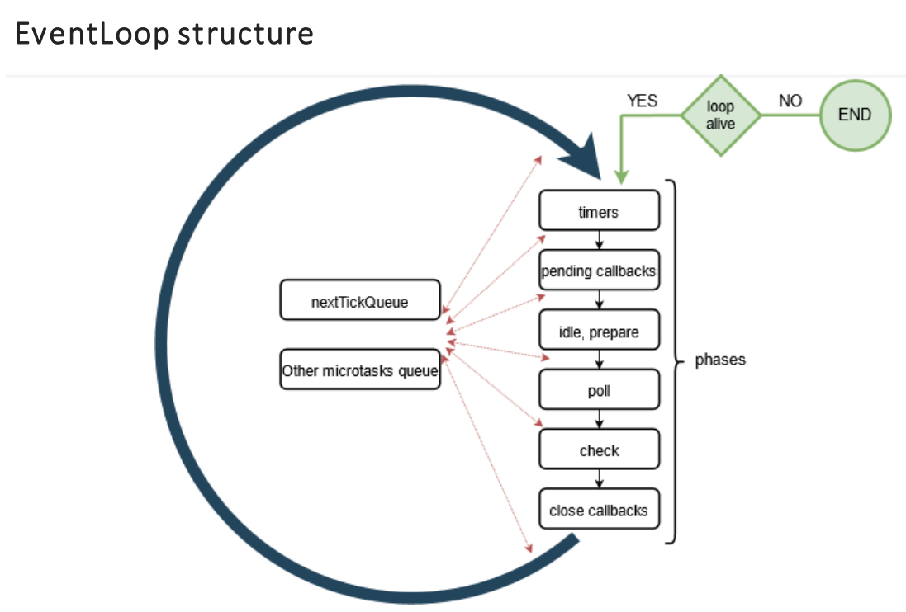

# Event Loop

- [Event Loop](#event-loop)
  - [Sources](#sources)
  - [Theory](#theory)
    - [Intro](#intro)
    - [Queues](#queues)
    - [Details](#details)
    - [Phases of the Loop](#phases-of-the-loop)
      - [`Timers`](#timers)
      - [`Pending callbacks`](#pending-callbacks)
      - [`Idle, prepare`](#idle-prepare)
      - [`Poll`](#poll)
      - [`Check`](#check)
      - [`Close callbacks`](#close-callbacks)
  - [Examples](#examples)
    - [Threadpool](#threadpool)
    - [`setImmediate()` vs `setTimeout()` vs `nextTick`](#setimmediate-vs-settimeout-vs-nexttick)

***

## Sources

1. https://d1ujii9cn3t0u4.cloudfront.net/uploads/epam_production/speech/7446/4737d1c4-4b25-4784-a61d-cd8597e2d543/Eventloop%20in%20NodeJS.pdf - slides
2. https://www.youtube.com/watch?v=7f787SsgknA - video for the slides
3. https://nodejs.org/en/docs/guides/event-loop-timers-and-nexttick/ - tutorial p. 1
4. https://nodejs.org/en/docs/guides/dont-block-the-event-loop/ - tutorial p. 2
5. https://blog.logrocket.com/a-complete-guide-to-the-node-js-event-loop/
6. https://nodejs.dev/learn/the-nodejs-event-loop


***


## Theory

### Intro

Node.js is based on the Chrome's V8 JS Engine. It uses **event-driven, non-blocking** I/O model.

When we run `node` process:

1. A Thread in OS is created
2. The Event Loop is generated inside of the Thread
3. The program code executes
4. Event Loop runs

Every iteration of the Event Loop is called a **Tick**.

Event Loop doesn't run endlessly. It has some internal checks which decide whether it should run the next Tick or exit. 



***

### Queues

There're several queues:

- **Microtask** (priority) queues (on the left) run **before and between** every phase of the macrotask queue:
  - first, "nextTick queue" runs `nextTick` callbacks
  - then, "other microtasks queue" runs Promise handlers
- **Macrotask** queue (on the right) is not homogeneous - different types of macrotasks get into different **phases** of it. It runs top-down and both **microtask** queues run between each phase.

**Microtask** queues can enqueue new microtasks which will execute **on the current Tick**. Be careful and don't starve your loop!

**Macrotask** queue is controlled by the library written in C - `libuv`. 


***

### Details

1. When you run your program, a **Thread** in OS is created for it. Inside of it, the **Event Loop** is created. Your progam runs its sync code to the end. During this process, some tasks are scheduled for the future (event callbacks, promises, timers, etc.). These are getting into their corresponding phases and queues of the upcoming Event Loop **Tick**.
2. When all sync code has been executed, new Tick of the Event Loop starts.
3. First, 2 **Microtask queues** (on the left) execute starting with "nextTick queue". 
4. After Microtask queues have finished all their tasks (no limits here), the Loop starts walking phases of the **Macrotask queue** top-down.
5. **After each phase** both Microtask Queues are checked and executed if there's something in there. 
6. Some code may be scheduled to the next Tick of the Loop. In this case the Loop will run again right after the current iteration.
7. When the Loop ends, it checks if there's anything planned for the next Tick. If it is, then the next iteration of the Loop happens (steps 3-6). This will continue as long as needed to finish all tasks. 
8. Finally all tasks are finished. The Loop performs a check, ensures there's no more tasks and exits.

Between Ticks, Node.js checks if it is waiting for any asynchronous I/O or timers and shuts down cleanly if there're none.

***


### Phases of the Loop

#### `Timers`

`setTimeout()` and `setInterval()` callbacks.

#### `Pending callbacks`

Executes I/O callbacks that are **not** urgent and can be deferred to the next loop iteration. E.g. `ECONNREFUSED` error will be reported here.

#### `Idle, prepare`

Only used internally (e.g. before starting to work with files).

#### `Poll`

I/O operations execute here (e.g. working with files, streams, etc.). The majority of callbacks execute here (in fact, all of them except those scheduled specifically in other phases).

This phase can take some time, so it always has system-dependent **hard limit** of time it can block execution.

It behaves this way:

- If the Poll queue **is not empty**, iterate over its queue of callbacks executing them synchronously until the queue is finished or the **hard limit** is reached.
- If the Poll queue **is empty** - check the next (`Check`) phase:
  - If it **is not empty**, jump to it. 
  - If it **is empty**, wait for callbacks to be added to the Poll queue and execute them immediately (unless there're scheduled timers - no waiting in thie case).

Callbacks that didn't have enough time to execute (because of the **hard limit**) on the current Tick, are getting scheduled to the next one. 

#### `Check`

`setImmediate()` callbacks run here. Use this method to enqueue callbacks **to the current Tick**.

#### `Close callbacks`

Close callbacks, e.g. `socket.on('close', cb)`. Also, immediate termination calls are handled here.

***


## Examples

Example 1

```js
const fs = require('fs')

console.log('START')

setTimeout(() => console.log('setTimeout 1'), 0)	// A

setImmediate(() => console.log('setImmediate'))		// B

fs.readFile(__filename, () => {						// C
	setTimeout(() => console.log('readFile setTimeout'), 0)		// D
	setImmediate(() => console.log('readFile setImmediate'))	// E
	process.nextTick(() => console.log('readFile nextTick'))	// F
})

Promise.resolve()
	.then(() => {									// G
		console.log('Promise')	
		process.nextTick(() => console.log('Promise nextTick'))	// H
})

process.nextTick(() => console.log('nextTick'))	// I

setTimeout(() => console.log('setTimeout 2'), 0)	// J

console.log('END')
```

Output: 

```bash
START
END
nextTick
Promise
Promise nextTick
setTimeout 1
setTimeout 2 
setImmediate
readFile nextTick
readFile setImmediate
readFile setTimeout
```

When we run our program, the Event Loop is created but remains idle. **Sync** code executes and adds all **async** operations (callbacks, promises, timers) to the corresponding queues and phases.
 
0. Sync code runs:
   1. 1st `console.log` runs
   2. `setTimeout` (A) is scheduled to the "Timers" phase
   3. `setImmediate` (B) is scheduled to the "Check" phase
   4. `readFile` (C) is scheduled to the "Poll" phase
   5. `Promise.resolve()` runs immediately as it's sync code. It schedules its handler (G) to the "other Microtasks" queue
   6. `process.nextTick` (I) is scheduled to the "nextTick queue" - it will run first after sync code finishes
   7. `setTimeout` (J) is scheduled to the "Timers" phase
   8. 2nd `console.log` runs
1. The **1st** iteration of the Loop **begins**.
   1. Both Microtask queues execute:
      1.  `nextTick` (I) runs
      2.  `Promise` handler inside (G) runs
      3.  `Promise nextTick` (H) is scheduled and executed immediately as new Microtasks get into the current Tick
   2. "Timers" phase. `setTimeout 1` and `setTimeout 2` run
   3. Both Microtask queues execute. Nothing here
   4. "Pending callbacks" phase. Nothing here
   5. Both Microtask queues execute. Nothing here
   6. "Idle, prepare" phase. This is an utility stage, we don't have direct access to it. 
   7. Both Microtask queues execute. Nothing here.
   8. "Poll" phase. `readFile` starts. It reads the file and schedules the callback to the next iteration "Poll". 
   9.  Both Microtask queues execute. Nothing here.
   10. "Check" phase. `setImmediate` (B) executes. 
   11. Both Microtask queues execute. Nothing here.
   12. "Close callbacks" phase. Nothing here.
   13. Both Microtask queues execute. Nothing here.
2.  The **2nd** iteration of the Loop **begins**. 
    1. Both Microtask queues execute. Then all the phases from "Timers" down to "Poll".
    2. "Poll" phase. The callback (C) executes and adds 3 async actions to the corresponding queues:
       1. `setTimeout` (D) goes to "Timers"
       2. `setImmediate` (E) goes to "Check"
       3. `nextTick` (F) goes to "nextTick queue"
    3.  Both Microtask queues execute. `nextTick` (F) executes.
    4.  "Check" phase. `setImmediate` (E) executes.
    5.  Both Microtask queues execute. Nothing here.
3.  The **3rd** iteration of the Loop **begins**. 
    1.  "Timers" phase. `setTimeout` (D) executes. The rest of the phases are empty. A check for whether to continue the Loop is performed and returns `false` - no scheduled callbacks and tasks anymore. The Loop ends. 

***


### Threadpool

**Q**: Is Node completely single-threaded?

**A**: Not exactly. V8 runs on a single Thread, but many modules run on top of C/C++ libs that can benefit from multi-threading (e.g. the `fs` module async functions, `zlib` compression, `crypto`, `dns`).

Node.js uses a small number of Threads to handle many clients. In Node.js there are two types of Threads: 

- one Event Loop (aka the main Loop, main Thread, event Thread, etc.),
- and a pool of *k* Workers in a Worker Pool (aka the Threadpool).

Threadpool can be used to run user code and get notified in the loop thread. Its default size is 4 but can be changed (`process.env.UV_THREADPOOL_SIZE`) to any value up to 128.

So the main thread sends some code to the Threadpool for execution and then retreives the result.

Example: this program finds hashes 4 times. And makes this using multi-threading! 

```js
const crypto = require('crypto')
const util = require('util')

const start = process.hrtime()

for(let i = 0; i < 4; i++){
	crypto.pbkdf2('secretPassword', 'salt', 100000, 512, 'sha512', err => {
		if(err) throw err
		const end = process.hrtime(start)
		console.log(util.format('crypto %d start %d end %d execute %d', i, end[0], end[1], end[0] + end[1] / 1e9))
	})
}
```


As you can see, all 4 calculations have been made in parallel (and even changed places). As soon as they are finished, they go to the Event Loop (the "Pending callbacks" phase).

We can't directly control the Thread Pool from Node as it's written in C++ and lies below.


***

### `setImmediate()` vs `setTimeout()` vs `nextTick`

They are similar but differ in details:

- `setImmediate()` executes a task after the current "Poll" phase.
- `setTimeout()` schedules a task to the "Timers" phase to be executed after a minimum threshold in ms has elapsed.
- `process.nextTick()` fires as soon as the current phase of the Loop finishes.

In essence, the names should be swapped: `process.nextTick()` fires more immediately than `setImmediate()`, but this is an artifact of the past which is unlikely to change.

So `nextTick` is always ahead. But the order in which `setTimeout` and `setImmediate` are executed will vary depending on the context:

1. If we run the following script which is **not within an I/O cycle** (i.e. the main module), the order in which the two timers are executed is **non-deterministic**, as it is bound by the performance of the process:

```js
setTimeout(() => {
	console.log('timeout')
}, 0)
  
setImmediate(() => {
	console.log('immediate')
})

process.nextTick(() => {
	console.log('nextTick')
})
```

```
nextTick
timeout
immediate
```

```
nextTick
immediate
timeout
```

2. If you move the two calls **within** an I/O cycle, `setImmediate` will **always** be ahead of `setTimeout`

```js
const fs = require('fs')

fs.readFile(__filename, () => {
  setTimeout(() => {
    console.log('timeout')
  }, 0)
  setImmediate(() => {
    console.log('immediate')
  })
  process.nextTick(() => {
		console.log('nextTick')
  })
})
```

The order is strict: 

```
nextTick
immediate
timeout
```

***

`nextTick` is not a part of any phase of the Event Loop, it lives in the Microtask Queue and executes after the current operation (current phase of the Loop) as soon as possible.

So the callbacks in the `nextTick` will execute during the **current Loop run, before the next phase of it**. 

This can create some **bad** situations because it allows you to "starve" your I/O by making recursive or simply long to process `process.nextTick()` calls, which prevents the event loop from reaching the poll phase, so **be careful using it**. 

**Avoid using it if possible**. Using `setImmediate` is safer.

You might only need it in some rare cases: 

```js
const EventEmitter = require('events')
const util = require('util')

function MyEmitter() {
  EventEmitter.call(this)

  process.nextTick(() => {
    this.emit('event')				// <--- HERE
  })
}
util.inherits(MyEmitter, EventEmitter)

const myEmitter = new MyEmitter()
myEmitter.on('event', () => {
  console.log('an event occurred!')
})
```

If you simply called `this.emit('event')`, you wouldn't catch it as the `on.('event', ...)` callback has not been installed yet. So here we defer emitting the event to the closest appropriate time.

***
