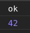
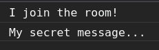

# Socket.io

- [Socket.io](#socketio)
	- [Sources](#sources)
	- [Intro](#intro)
	- [Install & Run](#install--run)
	- [Events](#events)
		- [`socket.emit (eventName, message)`](#socketemit-eventname-message)
		- [`socket.volatile.emit (eventName, message)`](#socketvolatileemit-eventname-message)
	- [Broadcasting](#broadcasting)
		- [To all connected clients: `io.emit ()`](#to-all-connected-clients-ioemit-)
		- [... except the sender: `socket.broadcast.emit ()`](#-except-the-sender-socketbroadcastemit-)
	- [Events](#events-1)
		- [`socket.on('connect')`](#socketonconnect)
		- [`socket.on('connect_error')`](#socketonconnect_error)
		- [`socket.on('disconnecting')`](#socketondisconnecting)
		- [`socket.on('disconnect')`](#socketondisconnect)
		- [`io.on('connection')`](#ioonconnection)
	- [Client details](#client-details)
		- [`socket.id`](#socketid)
		- [`socket.connected`](#socketconnected)
		- [`socket.rooms`](#socketrooms)
		- [Offline behavior](#offline-behavior)
	- [Server details](#server-details)
		- [Middleware](#middleware)
		- [`socket.id`, `socket.to()`](#socketid-socketto)
		- [`socket.rooms`](#socketrooms-1)
		- [Additional attributes](#additional-attributes)
		- [Sending credentials](#sending-credentials)
		- [CORS](#cors)
		- [Error handling](#error-handling)
	- [Rooms](#rooms)
		- [Private messages](#private-messages)
	- [Cheat Sheet](#cheat-sheet)

***

## Sources

1. https://socket.io

***

## Intro

A popular cross-platform WebSocket framework. Uses WS, long polling and other features to ensure a reliable connection. 

It's **not** a WebSocket server, they are **not compatible!** You should connect to **http**, not **ws** - and then `socket.io` will upgrade the connection itself if possible.

A heartbeat mechanism is implemented at the Engine.IO level, allowing both the server and the client to know when the other one is not responding anymore.

***

## Install & Run

```bask
npm i socket.io
```

Basic example:

```js
const express = require('express')
const app = express()
const server = require('http').createServer(app)
const path = require('path')
const io = require('socket.io')(server)

const PORT = process.env.PORT || 5000

io.on('connection', (socket) => {
	console.log('a user connected')

	socket.on('chat message', (msg) => {
		console.log(`msg: ${msg}`)
	})

	socket.on('disconnect', () => {
		console.log('user disconnected')
	})
})

app.use(express.static(path.join(__dirname, 'public')))

server.listen(PORT)
```

```html
<!DOCTYPE html>

<body>
	<form name="myform">
		<input type="text" name="msg" value="Hello, World!"><br>
		<button type="submit">Submit</button>
	</form>

	<script src="/socket.io/socket.io.js"></script>
	<script>
		const socket = io()
		// No URL is needed since by default it's trying to connect to the host that served the page

		$form = document.forms.myform
		$form.addEventListener('submit', e => {
			e.preventDefault()
			// Emit a custom event to listen to it on the server side
			socket.emit('chat message', $form.elements.msg.value)
			$form.elements.msg.value = ''
		})
	</script>
</body>
```

***


## Events

This is the main way of communication.

To send messages, we **emit** events on one side and **listen** for them on another.

`socket` instance inherits from `EventEmitter`.

**NB**: These methods are available both on Server and Client!

- `socket.on('evt', cb)`
- `once`
- `off`
- `onAny`
- `prependAny`
- `offAny`

***

### `socket.emit (eventName, message)`

**From the Server to the Client**:

```js
// server-side
io.on("connection", (socket) => {
  socket.emit("hello", "world")
})

// client-side
socket.on("hello", (arg) => {
  console.log(arg)	// world
})
```

**From the Client to the Server**:

```js
// client-side
socket.emit("hello", "world")

// server-side
io.on("connection", (socket) => {
  socket.on("hello", (arg) => {
    console.log(arg)	// world
  })
})
```

***

You can send **any number of arguments**, and **all serializable datastructures** are supported, including binary objects like `objects`, `Buffer` or `TypedArray`. **No need** to `JSON.stringify()` / `JSON.parse()` on objects - it will be done automatically.

```js
// server-side
io.on("connection", (socket) => {
  socket.emit("hello", 1, "2", { 3: '4', 5: Buffer.from([6]) })
})

// client-side
socket.on("hello", (arg1, arg2, arg3) => {
  console.log(arg1)	// 1
  console.log(arg2)	// "2"
  console.log(arg3)	// { 3: '4', 5: ArrayBuffer (1) [ 6 ] }
})
```

**Map** and **Set** are not serializable and must be manually turned into arrays of values:

```js
const serializedMap = [...myMap.entries()]
const serializedSet = [...mySet.keys()]
```

***

If you add a **callback** as the last argument, it will be called after the receiver **acknowledges** the event:

```js
// Client send
socket.emit('ack', 42, {
	name: 'value'
}, (status, id) => {
	console.log(status)
	console.log(id)
})

// Server acknowledges the event by calling `cb`
io.on('connection', (socket) => {
	socket.on('ack', (arg1, arg2, cb) => {
		console.log(arg1)
		console.log(arg2)
		cb('ok', 42)
	})
})

// Client is notified about this (see the screenshot from the browser)
```



Example with `setTimeout`. Try uncomment the Server-side `cb()` to see the difference: one callback or another will be called depending on whether the server **acknowledged** the event or not.

```js
// Client
function withTimeout(onSuccess, onTimeout, timeout) {
	let called = false

	const timer = setTimeout(() => {
		if (called) return
		called = true
		onTimeout()
	}, timeout)

	return (...args) => {
		if (called) return
		called = true
		clearTimeout(timer)
		onSuccess.apply(this, args)
	}
}

socket.emit("hello", withTimeout(
	(response) => {
		console.log(`Success! ${response}`)
	},
	() => {
		console.log("Timeout!")
	},
	1000
))

// Server 
io.on('connection', (socket) => {
	socket.on('hello', (cb) => {
		// cb('ok')
	})
})
```

***

### `socket.volatile.emit (eventName, message)`

Events that will only be emitted if the connection is ready (useful for real-time applications, games, etc.). 

If the server is **not online** right now, they will **not be sent** but instead just **dropped**.

```js
socket.volatile.emit("hello", "might or might not be received")
```

***

## Broadcasting

https://socket.io/docs/v3/broadcasting-events/

### To all connected clients: `io.emit ()`

We broadcast messages **on behalf of the Server**

```js
io.on('connection', (socket) => {
	socket.on('chat message', (msg) => {
		io.emit('chat message', msg)
	})
})
```

### ... except the sender: `socket.broadcast.emit ()`

We broadcast messages **on behalf of the message sender**

```js
io.on('connection', (socket) => {
	socket.on('chat message', (msg) => {
		socket.broadcast.emit('chat message', 'Hi to everybody except me!')
	})
})
```

***


## Events

None of the following events should be emitted explicitly, you just **listen** to them.

The following are both Client and Server events.

### `socket.on('connect')`

Fired by the Socket instance upon connection / reconnection.

**Don't** register event handlers in the `connect` handler itself, as a new handler will be registered every time the Socket reconnects:

```js
// BAD
socket.on("connect", () => {
  socket.on("data", () => {})
})

// GOOD
socket.on("connect", () => {})
socket.on("data", () => {})
```

***

### `socket.on('connect_error')`

Fired when the server does not accept the connection.

You need to manually reconnect. You might need to update the credentials.

```js
socket.on("connect_error", () => {
	setTimeout(() => {
		socket.auth.token = "abcd"	// If `auth` is a function, don't set it manually
		socket.connect()
	}, 1000)
})
```

***

### `socket.on('disconnecting')`

Fired right before `disconnect` - you have the last chance to gather some data from the socket (the set of rooms, etc.)

***

### `socket.on('disconnect')`

Fired upon disconnection.

```js
socket.on("disconnect", (reason) => {})
```

***

### `io.on('connection')`

This is a Server event which is fired when the new Client connects for the first time and an instance of `socket` created as a bridge to him. Usually you would register your Server event handlers inside of it. 

```js
io.on('connection', (socket) => {
	socket.on('getRooms', cb)
	socket.on('postMessage', cb)
	// ...
})
```

***


## Client details

You can find the local version of the client script here: `node_modules/socket.io-client/dist/socket.io.js`

`const socket = io()` registers `io` as a global variable. It can accept an object with a lot of options 


In case your front is not served from the same domain as your server, you have to pass the URL of your server.

```js
const socket = io('https://server-domain.com')
```

***

### `socket.id`

Each new connection is assigned a random 20-characters identifier which is synced with the value on the server-side.

This can be used for **private messaging**.

Server:

```js
io.on("connection", (socket) => {
  console.log(socket.id)	// x8WIv7-mJelg7on_ALbx
})
```

Client:

```js
socket.on("connect", () => {
  console.log(socket.id)	// x8WIv7-mJelg7on_ALbx
})

socket.on("disconnect", () => {
  console.log(socket.id)	// undefined
})
```

***

### `socket.connected`

Describes whether the socket is currently connected to the server.

```js
socket.on("connect", () => {
  console.log(socket.connected)	// true
})

socket.on("disconnect", () => {
  console.log(socket.connected)	// false
})
```

***

### `socket.rooms`

A **Set** of rooms (groups) this socket belongs to.

***

### Offline behavior

By default, any event emitted while the Socket is not connected will be buffered until reconnection.

While useful in most cases (when the reconnection delay is short), it could result in a huge spike of events when the connection is restored.

There are several solutions to prevent this behavior. The suggested one:

```js
socket.on("connect", () => {
  socket.sendBuffer = []
})
```

See more in the docs.

***

## Server details

Socket.io uses the `ws` WebSocket server by default. Other servers can be used as well! 

Basic usage: 

```js
const server = require('http').createServer()
const options = {
	maxHttpBufferSize: 1e6 // default max message size in bytes
}
const io = require('socket.io')(server, options)

io.on('connection', socket => {
	socket.on('msg', msg => {
		console.log(msg)
	}
	socket.on('addRoom', cb)
})

server.listen(3000)
```

With https:

```js
const fs = require('fs')
const server = require('https').createServer({
  key: fs.readFileSync('/tmp/key.pem'),
  cert: fs.readFileSync('/tmp/cert.pem')
})
const options = {}
const io = require('socket.io')(server, options)

io.on('connection', socket => {})

server.listen(3000)
```

***

### Middleware

A middleware function is a function that gets executed **once** for every incoming connection.

Can be useful for:

- logging
- authentication / authorization
- rate limiting

A middleware function has access to the Socket instance and the next middleware function.

```js
io.use((socket, next) => {
  if (isValid(socket.request)) {
    next()
  } else {
    next(new Error("invalid"))
  }
})

io.use((socket, next) => {
	next(new Error('Err!'))	
	// The connection is refused and the client receives the `connect_error` event
))

// Will never be called as the previous one returned an error
io.use((socket, next) => {))
```

You should **always** call `next()`, otherwise your connection will be left hanging.

***

### `socket.id`, `socket.to()`

The same as the Client, see above.

Upon creation, the Socket joins the room identified by its own id, which means you can use it for **private messaging**:

```js
io.on("connection", socket => {
  socket.on("private message", (anotherSocketId, msg) => {
    socket.to(anotherSocketId).emit("private message", socket.id, msg)
  })
})
```

***

### `socket.rooms`

A reference to the **room** the Socket is currently in.

```js
io.on("connection", (socket) => {
  console.log(socket.rooms)	// Set { <socket.id> }
  socket.join("room1")
  console.log(socket.rooms)	// Set { <socket.id>, "room1" }
})
```

***

### Additional attributes

You can attach any attribute to the Socket instance and use it later (just don't overwrite the existing ones).

```js
// in a middleware
io.use(async (socket, next) => {
  try {
    const user = await fetchUser(socket)
    socket.user = user
  } catch (e) {
    next(new Error("unknown user"))
  }
})

io.on("connection", (socket) => {
  console.log(socket.user)

  // in a listener
  socket.on("set username", (username) => {
    socket.username = username
  })
})
```

***

### Sending credentials

The Client can send credentials with the `auth` option

```js
const socket = io({
  auth(cb){
    cb({
      token: "abc"
    })
  }
})
```

Those credentials can be accessed in the **handshake** object on the Server:

```js
io.use((socket, next) => {
  const token = socket.handshake.auth.token
  // ...
})
```

***

### CORS

You need to explicitly enable CORS.

```js
// server-side
const io = require('socket.io')(httpServer, {
	cors: {
		origin: 'https://example.com',
		methods: ['GET', 'POST'],
		allowedHeaders: ['my-custom-header'],
		credentials: true
	}
})

// client-side
const io = require('socket.io-client')
const socket = io('https://api.example.com', {
	withCredentials: true,
	extraHeaders: {
		'my-custom-header': 'abcd'
	}
})
```

This also applies to `localhost` if you Web App and your Server are served on different ports.

```js
const io = require('socket.io')(httpServer, {
	cors: {
		origin: 'http://localhost:8080',
		methods: ['GET', 'POST']
	}
})

httpServer.listen(3000)
```

***

### Error handling

```js
io.on('connection', (socket) => {
	socket.on('list items', async (callback) => {
		try {
			const items = await findItems()
			callback({
				status: 'OK',
				items
			})
		} catch (e) {
			callback({
				status: 'NOK'
			})
		}
	})
})
```

***


## Rooms

Arbitrary channel that sockets can `join` and `leave`. It can be used to broadcast events to a subset of clients:

**Rooms are a server-only concept!** Clients don't have any access to it.

Join & Leave

```js
io.on('connection', (socket) => {
	socket.join('some room')
	// socket.leave('some room')
})
```

Send a message to the room

```js
// It can be several rooms at once
io.to('room1').to('room2').to('room3').emit('some event')
// Broadcast to the room on behalf of a certain user (he hmself won't receive this event)
socket.to('some room').emit('some event')
```

Don't break these chains as `to` doesn't return any object, it just modifies the parameter in `socket/io`!

In case of serveral rooms, **union** is performed: each user will only get the message **once** - even if he's a member of multiple rooms that receive the event.

On `disconnect` sockets `leave` all the channels automatically, no need to do it manually.

***

Full example:

1. Some users `join` the room, the others - don't.
2. At some point, we **emit** some event `to` our **room**.
3. Despite **all** users have the event handler, **it will only be sent to the ones who are the members of the room**, so only **them** will receive this event 

Use 2+ duplicate tabs to test it: join the room in one tab and don't - in another. Then send a message: you'll see it in the tab that joined the room and won't see in the one that didn't

```js
const express = require('express')
const app = express()
const server = require('http').createServer(app)
const path = require('path')
const io = require('socket.io')(server)
const PORT = process.env.PORT || 5000

io.on('connection', (socket) => {
	socket.on('I want to join!', () => {
		socket.join('secret room')
	})
	socket.on('secret msg', (room, msg) => {
		// Users own room + maybe the `secret room`
		// E.g. Set(2) { 'wvuSq8ugyDzMTqPuAAAd', 'secret room' }
		console.log(socket.rooms)
		io.to(room).emit('secret msg', msg)
	})
})

app.use(express.static(path.join(__dirname, 'public')))
server.listen(PORT)
```

```html
<!DOCTYPE html>

<form name="myform">
	<button type="button" id="join">Join the secret room...</button>
	<input type="text" id="text"><br>
	<button type="submit">Submit</button>
</form>

<script src="/socket.io/socket.io.js"></script>
<script>
	const socket = io()
	const $join = document.getElementById('join')
	const $text = document.getElementById('text')

	$join.onclick = () => {
		console.log('I join the room!')
		socket.emit('I want to join!')
	}

	document.forms.myform.onsubmit = () => {
		event.preventDefault()
		socket.emit('secret msg', 'secret room', $text.value)
	}

	socket.on('secret msg', msg => {
		console.log(msg)
	})
</script>
```

That's what the members of the group will see:



Non-members will see nothing.

***

### Private messages

Private messages are not different from sending messages to rooms.

Every user is identified by by a random, unguessable, **unique ID**.

**Each socket automatically joins a room identified by its own id.** The same way as in **Linux** every user is a member of the **group** named by his own name. So we just send a message to this group (with one user in it by default).

```js
// Server
io.on("connection", socket => {
	console.log(socket.id)		// 'cwkLCKzOoVJboBaKAAAB'
	console.log(socket.rooms)	// Set(1) { 'cwkLCKzOoVJboBaKAAAB' }

  socket.on("private message", (anotherSocketId, msg) => {
    socket.to(anotherSocketId).emit("private message", socket.id, msg)
  })
})

// Client
socket.emit('private message', 'Z0qeRpDAq_lWJEJmAAAF', $text.value)

// This handler will fire for the user with ID === 'Z0qeRpDAq_lWJEJmAAAF' (or all users of this room if more than one)
socket.on('private message', msg => {
	console.log(msg)
})
```

***

## Cheat Sheet

```js
io.on('connection', (socket) => {
	// sending to the client
	socket.emit('hello', 'can you hear me?', 1, 2, 'abc')

	// sending to all clients except sender
	socket.broadcast.emit('broadcast', 'hello friends!')

	// sending to all clients in "game" room except sender
	socket.to('game').emit('nice game', "let's play a game")

	// sending to all clients in "game1" and/or in "game2" room, except sender
	socket.to('game1').to('game2').emit('nice game', "let's play a game (too)")

	// sending to all clients in "game" room, including sender
	io.in('game').emit('big-announcement', 'the game will start soon')

	// sending to all clients in namespace "myNamespace", including sender
	io.of('myNamespace').emit(
		'bigger-announcement',
		'the tournament will start soon'
	)

	// sending to a specific room in a specific namespace, including sender
	io.of('myNamespace').to('room').emit('event', 'message')

	// sending to individual socketid (private message)
	io.to(socketId).emit('hey', 'I just met you')

	// WARNING: `socket.to(socket.id).emit()` will NOT work, as it will send to everyone in the room
	// named `socket.id` but the sender. Please use the classic `socket.emit()` instead.

	// sending with acknowledgement
	socket.emit('question', 'do you think so?', (answer) => {})

	// sending without compression
	socket.compress(false).emit('uncompressed', "that's rough")

	// sending a message that might be dropped if the client is not ready to receive messages
	socket.volatile.emit('maybe', 'do you really need it?')

	// sending to all clients on this node (when using multiple nodes)
	io.local.emit('hi', 'my lovely babies')

	// sending to all connected clients
	io.emit('an event sent to all connected clients')
})
```