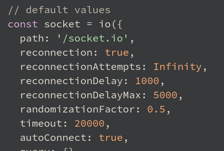

# Socket.io

- [Socket.io](#socketio)
	- [Sources](#sources)
	- [Intro](#intro)
	- [Install & Run](#install--run)
	- [Sending messages](#sending-messages)
		- [`socket.emit (eventName, message)`](#socketemit-eventname-message)
		- [`socket.send (msg)`](#socketsend-msg)
	- [Broadcasting](#broadcasting)
		- [To everybody: `io.emit (eventName, message)`](#to-everybody-ioemit-eventname-message)
		- [To everybody except the sender: `socket.broadcast.emit (eventName, message)`](#to-everybody-except-the-sender-socketbroadcastemit-eventname-message)
	- [Receiving messages on the Client](#receiving-messages-on-the-client)
	- [Events](#events)
		- [`connect`](#connect)
		- [`connect_error`](#connect_error)
		- [`disconnect`](#disconnect)
	- [Client details](#client-details)
		- [Socket#id](#socketid)
		- [Socket#connected](#socketconnected)
		- [Offline behavior](#offline-behavior)
	- [Server details](#server-details)
		- [Middleware](#middleware)
		- [Socket#id](#socketid-1)
		- [Socket#rooms](#socketrooms)
		- [Additional attributes](#additional-attributes)
		- [Sending credentials](#sending-credentials)
	- [Complete example](#complete-example)

***

## Sources

1. https://socket.io

***

## Intro

A popular cross-platform WebSocket framework. Uses WS, long polling and other fallback features to ensure a reliable connection. 

It's **not** a WebSocket server, they are **not compatible!** You should connect to **http**, not **ws** - and then `socket.io` will upgrade the connection itself if possible.

A heartbeat mechanism is implemented at the Engine.IO level, allowing both the server and the client to know when the other one is not responding anymore.

Any serializable data structures can be emitted, including `ArrayBuffer`, `Blob` and `Buffer` (on the server).

***

## Install & Run

```bask
npm i socket.io
```

Basic example:

```js
const express = require('express')
const app = express()
const server = require('http').createServer(app)
const path = require('path')
const io = require('socket.io')(server)

const PORT = process.env.PORT || 5000

io.on('connection', (socket) => {
	console.log('a user connected')

	socket.on('chat message', (msg) => {
		console.log(`msg: ${msg}`)
	})

	socket.on('disconnect', () => {
		console.log('user disconnected')
	})
})

app.use(express.static(path.join(__dirname, 'public')))

server.listen(PORT)
```

```html
<!DOCTYPE html>

<body>
	<form name="myform">
		<input type="text" name="msg" value="Hello, World!"><br>
		<button type="submit">Submit</button>
	</form>

	<script src="/socket.io/socket.io.js"></script>
	<script>
		const socket = io()
		// No URL is needed since by default it's trying to connect to the host that served the page

		$form = document.forms.myform
		$form.addEventListener('submit', e => {
			e.preventDefault()
			// Emit a custom event to listen to it on the server side
			socket.emit('chat message', $form.elements.msg.value)
			$form.elements.msg.value = ''
		})
	</script>
</body>
```

***


## Sending messages

### `socket.emit (eventName, message)`

**From the Server to the Client**:

```js
// server-side
io.on("connection", (socket) => {
  socket.emit("hello", "world")
})

// client-side
socket.on("hello", (arg) => {
  console.log(arg)	// world
})
```

**From the Client to the Server**:

```js
// client-side
socket.emit("hello", "world")

// server-side
io.on("connection", (socket) => {
  socket.on("hello", (arg) => {
    console.log(arg)	// world
  })
})
```

You can send **any number of arguments**, and all serializable datastructures are supported, including binary objects like `objects`, `Buffer` or `TypedArray`.

```js
// server-side
io.on("connection", (socket) => {
  socket.emit("hello", 1, "2", { 3: '4', 5: Buffer.from([6]) })
})

// client-side
socket.on("hello", (arg1, arg2, arg3) => {
  console.log(arg1)	// 1
  console.log(arg2)	// "2"
  console.log(arg3)	// { 3: '4', 5: ArrayBuffer (1) [ 6 ] }
})
```

**No need** to `JSON.stringify()` / `JSON.parse()` on objects - it will be done automatically.

Map and Set are not serializable and must be manually turned into arrays of values:

```js
const serializedMap = [...myMap.entries()]
const serializedSet = [...mySet.keys()]
```

***

### `socket.send (msg)`

A simple version of the previous. Receive messages through the `message` event.

Client:

```js
socket.send('Hello!')
```

Server:

```js
socket.on('message', data => {
  console.log(data)
})
```

***

## Broadcasting

You broadcast from a Server to Clients.

### To everybody: `io.emit (eventName, message)`

This message broadcasts to everybody.

Server: we receive a message and broadcast it to everybody on behalf of the **server**

```js
io.on('connection', (socket) => {
	socket.on('chat message', (msg) => {
		io.emit('chat message', msg) // broadcast
	})
})
```

### To everybody except the sender: `socket.broadcast.emit (eventName, message)`

This message broadcasts to everybody **except** the original sender.

Server: we receive a message and broadcast it on behalf of the **message sender**

```js
io.on('connection', (socket) => {
	socket.on('chat message', (msg) => {
		socket.broadcast.emit('chat message', 'Hi to everybody except me!') // broadcast
	})
})

```

***

## Receiving messages on the Client

Client (yes, you can do `.on()` here now)

```js
socket.on('chat message', renderMessage)

function renderMessage(data) {
	const message = document.createElement('article')
	$messages.prepend(message)
	message.innerHTML = `<b>${data.nick}:</b> ${data.msg}`
}
```

You can add `localStorage.debug = 'socket.io-client:socket'` on the Client to log every event to the console.

***


## Events

None of the following events should be emitted explicitly.

### `connect`

Fired by the Socket instance upon connection / reconnection.

**Don't** register event handlers in the `connect` handler itself, as a new handler will be registered every time the Socket reconnects:

Client:

```js
// BAD
socket.on("connect", () => {
  socket.on("data", () => {})
})

// GOOD
socket.on("connect", () => {})
socket.on("data", () => {})
```

***

### `connect_error`

Fired when the server does not accept the connection.

You need to manually reconnect. You might need to update the credentials.

```js
socket.on("connect_error", () => {
	setTimeout(() => {
		socket.auth.token = "abcd"	// If `auth` is a function, don't set it manually
		socket.connect()
	}, 1000)
})
```

***

### `disconnect`

Fired upon disconnection.

```js
socket.on("disconnect", (reason) => {})
```

***


## Client details

You can find the local version of the client script here: `node_modules/socket.io-client/dist/socket.io.js`

`const socket = io()` registers `io` as a global variable. It can accept an object with a lot of options 



In case your front is not served from the same domain as your server, you have to pass the URL of your server.

```js
const socket = io('https://server-domain.com')
```

***

### Socket#id

Each new connection is assigned a random 20-characters identifier which is synced with the value on the server-side.

Server:

```js
io.on("connection", (socket) => {
  console.log(socket.id)	// x8WIv7-mJelg7on_ALbx
})
```

Client:

```js
socket.on("connect", () => {
  console.log(socket.id)	// x8WIv7-mJelg7on_ALbx
})

socket.on("disconnect", () => {
  console.log(socket.id)	// undefined
})
```

***

### Socket#connected

This attribute describes whether the socket is currently connected to the server.

```js
socket.on("connect", () => {
  console.log(socket.connected)	// true
})

socket.on("disconnect", () => {
  console.log(socket.connected)	// false
})
```

***

### Offline behavior

By default, any event emitted while the Socket is not connected will be buffered until reconnection.

While useful in most cases (when the reconnection delay is short), it could result in a huge spike of events when the connection is restored.

There are several solutions to prevent this behavior. The suggested one:

```js
socket.on("connect", () => {
  socket.sendBuffer = []
})
```

***

## Server details

Socket.io uses the `ws` WebSocket server by default. Other servers can be used as well. 

Basic usage: 

```js
const server = require('http').createServer()
const options = {
	maxHttpBufferSize: 1e6 // default max message size in bytes
}
const io = require('socket.io')(server, options)

io.on('connection', socket => {})

server.listen(3000)
```

With https:

```js
const fs = require('fs')
const server = require('https').createServer({
  key: fs.readFileSync('/tmp/key.pem'),
  cert: fs.readFileSync('/tmp/cert.pem')
})
const options = {}
const io = require('socket.io')(server, options)

io.on('connection', socket => {})

server.listen(3000)
```

***

### Middleware

A middleware function is a function that gets executed once for every incoming connection.

Can be useful for:

- logging
- authentication / authorization
- rate limiting

A middleware function has access to the Socket instance and to the next registered middleware function.

```js
io.use((socket, next) => {
  if (isValid(socket.request)) {
    next()
  } else {
    next(new Error("invalid"))
  }
})

io.use((socket, next) => {
	next(new Error('Err!'))	
	// The connection is refused and the client receives the `connect_error` event
))

// Will never be called as the previous one returned an error
io.use((socket, next) => {))
```

You should **always** call `next()`, otherwise your connection will be left hanging.

***

### Socket#id

The same as the Client, see above.

Upon creation, the Socket joins the room identified by its own id, which means you can use it for **private messaging**:

```js
io.on("connection", socket => {
  socket.on("private message", (anotherSocketId, msg) => {
    socket.to(anotherSocketId).emit("private message", socket.id, msg)
  })
})
```

***

### Socket#rooms

This is a reference to the **rooms** the Socket is currently in.

```js
io.on("connection", (socket) => {
  console.log(socket.rooms)	// Set { <socket.id> }
  socket.join("room1")
  console.log(socket.rooms)	// Set { <socket.id>, "room1" }
})
```

***

### Additional attributes

You can attach any attribute to the Socket instance and use it later (just don't overwrite the existing ones).

```js
// in a middleware
io.use(async (socket, next) => {
  try {
    const user = await fetchUser(socket)
    socket.user = user
  } catch (e) {
    next(new Error("unknown user"))
  }
})

io.on("connection", (socket) => {
  console.log(socket.user)

  // in a listener
  socket.on("set username", (username) => {
    socket.username = username
  })
})
```

***

### Sending credentials

The Client can send credentials with the auth option

```js
const socket = io({
  auth(cb){
    cb({
      token: "abc"
    })
  }
})
```

Those credentials can be accessed in the **handshake** object on the Server:

```js
io.use((socket, next) => {
  const token = socket.handshake.auth.token
  // ...
})
```

***

