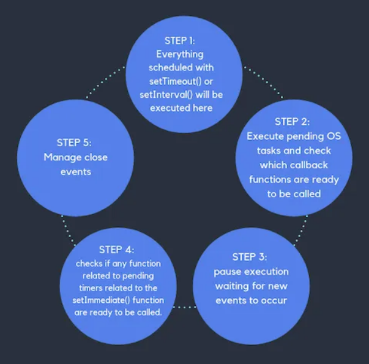
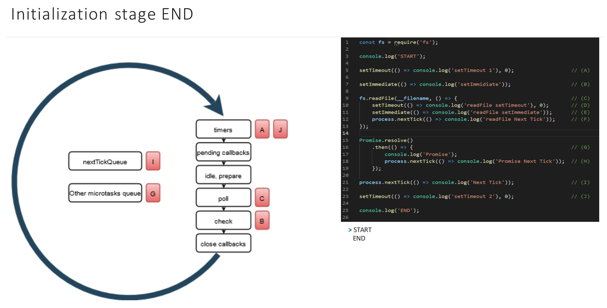

# Event Loop

- [Event Loop](#event-loop)
	- [Srouces](#srouces)
	- [Intro](#intro)
		- [Threadpool](#threadpool)
		- [Optimizations](#optimizations)
		- [`setImmediate()` vs `setTimeout()` vs `nextTick`](#setimmediate-vs-settimeout-vs-nexttick)

***

## Srouces

1. https://d1ujii9cn3t0u4.cloudfront.net/uploads/epam_production/speech/7446/4737d1c4-4b25-4784-a61d-cd8597e2d543/Eventloop%20in%20NodeJS.pdf - slides
2. https://www.youtube.com/watch?v=7f787SsgknA - video for the slides
3. https://nodejs.org/en/docs/guides/event-loop-timers-and-nexttick/ - tutorial p. 1
4. https://nodejs.org/en/docs/guides/dont-block-the-event-loop/ - tutorial p. 2
5. https://blog.logrocket.com/a-complete-guide-to-the-node-js-event-loop/
6. https://nodejs.dev/learn/the-nodejs-event-loop


***


## Intro

Node.js is based on the Chrome's V8 JS Engine. It uses **event-driven, non-blocking** I/O model.

Whenever we run a Node program, a `Thread` is automatically created. Thread is a unit of operations with some allocated hardware rerources to it.

Inside of thread, something called the `Event Loop` is generated. It decides which operations our only thread should be performing at any given point in time.



Every iteration of the Event Loop is called a `tick`.

***

**Q**: Does Event Loop run all the time?

**A**: **No**. As Event Loop is a *loop*, it has specific codtitions to determine if it should make another tick. It **does not** run during the execution of the regular synchronous code (like functions, loops, console.log, etc.).

***

Here's the basic idea: 

1. During the execution of the regular sync code, some tasks, callbacks, promises (async actions) are getting queued to their corresponding **phases** of the **upcoming tick**. 
2. Once sync code is finished, the Event Loop begins. 
3. It begins with executing the **Microtask Queues** (on the left on the pic). After they finish all their tasks, the Big Loop begins walking phases from the top to the bottom.
4. **After each phase** the Microtask Queue is checked and executed if there's something in there. 


Phases Overview: 

- **timers**: this phase executes callbacks scheduled by `setTimeout()` and `setInterval()`.
- **pending callbacks**: executes I/O callbacks deferred to the next loop iteration.
- **idle, prepare**: only used internally.
- **poll**: retrieve new I/O events; execute I/O related callbacks (almost all with the exception of close callbacks, the ones scheduled by timers, and setImmediate()). This phase behaves in a special way. It checks if something is in the next phases: if there is, it jumps there and execute them, then returns and executed itself. If there's nothing there, it executes itself and can idle a little on this phase before finishing the loop.
- **check**: `setImmediate()` callbacks are invoked here.
- **close callbacks**: some close callbacks, e.g. `socket.on('close', cb)`.

Between each run of the event loop, Node.js checks if it is waiting for any asynchronous I/O or timers and shuts down cleanly if there are not any.

***

Example:

```js
const fs = require('fs')

console.log('START')

setTimeout(() => console.log('setTimeout 1'), 0)	// A

setImmediate(() => console.log('setImmediate'))		// B

fs.readFile(__filename, () => {						// C
	setTimeout(() => console.log('readFile setTimeout'), 0)		// D
	setImmediate(() => console.log('readFile setImmediate'))	// E
	process.nextTick(() => console.log('readFile nextTick'))	// F
})

Promise.resolve()
	.then(() => {									// G
		console.log('Promise')	
		process.nextTick(() => console.log('Promise nextTick'))	// H
})

process.nextTick(() => console.log('nextTick'))	// I

setTimeout(() => console.log('setTimeout 2'), 0)	// J

console.log('END')
```

When we start execution, the Event Loop hasn't started working yet, the Engine just executes **sync** code and adds all **async** operations (callbacks, promises) to the corresponding queues:


1. Both `console.log`-s are executed, the async actions are scheduled in their corresponding queues. 
 


2. The **1st** run of the Loop **begins**.
3. The Microtask Queue executes. `nextTick` (I) is called.
4. Phase 1: timers. `Promise` (G) executes: adds `nextTick` (H) from its callback to the Microtask Queue and exits.
5. The Microtask Queue executes. `nextTick` (H) is called.
6. Phase 2: pending callbacks. Nothing here.
7. The Microtask Queue executes. Nothing here.
8. Phase 3: idle, prepare. This is an utility stage, we don't have direct access to it. 
9.  The Microtask Queue executes. Nothing here.
10. Phase 4: poll. This phase is special. It doesn't execute immediately but insteal checks if there's anything in the next phases. If there is - it goes there and executes them first (executing the Microtask Queue in between as usual). Thus, we leave this phase for some time and go forward. **It is not finished** but scheduled for now.
11. Phase 5: check. `setImmediate` (B) executes. 
12. The Microtask Queue executes. Nothing here.
13. Phase 6: closing callbacks. Nothing here.
14. The 1st iteration of the Loop ends here. 
15. The **2nd** run **begins** from the start going through all the phases again. 
16. Phase 5: poll. The callback (C) executes and adds 3 async actions to the corresponding queues. 
17. The Microtask Queue executes. `nextTick` (F) executes.
18. Phase 6: check. `setImmediate` (E) executes.
19. The 2nd iteration of the Loop ends here. 
20. The **3rd** run **begins** from the start going through all the phases again. 
21. Phase 1: timers. `setTimeout` (D) executes. The other phases are empty. The check for continuing the Loop is performed and returns false - no scheduled callbacks and tasks anymore. The Loop ends. 

Output: 

```
START
END
nextTick
Promise
Promise nextTick
setTimeout 1
setTimeout 2
setImmediate
readFile nextTick
readFile setImmediate
readFile setTimeout
```

***


### Threadpool

**Q**: Is Node completely single-threaded?

**A**: Not exactly. Node runs on a single thread, but some of the functions included in the Node.js standard lib do not (e.g. the `fs` module async functions, `zlib` compression, `crypto`, `dns`). The underlying libs are written in C/C++ and may take advantage of multy-threading. 

Node.js uses a **small number of threads** to handle many clients. In Node.js there are two types of threads: 

- one Event Loop (aka the main loop, main thread, event thread, etc.),
- and a pool of k Workers in a Worker Pool (aka the threadpool).

Threadpool can be used to run user code and get notified in the loop thread. Its default size is 4 but can be changed (process.env.UV_THREADPOOL_SIZE) to any value up to 128.

So the main thread send some code to the Threadpool for execution and then retreives the result.

Example: this program finds hash 4 times asynchronously. 

```js
const crypto = require('crypto')
const util = require('util')

const start = process.hrtime()

for(let i = 0; i < 4; i++){
	crypto.pbkdf2('secretPassword', 'salt', 100000, 512, 'sha512', err => {
		if(err) throw err
		const end = process.hrtime(start)
		console.log(util.format('crypto %d start %d end %d execute %d', i, end[0], end[1], end[0] + end[1] / 1e9))
	})
}
```


As you can see, all 4 calculations have been made in parallel (and even changed places). As soon as they are finished, they go to the Event Loop (the pending callbacks phase).


***


### Optimizations

See the corresponding lesson for details. In simple words: do your best to never block the Loop. 

***


### `setImmediate()` vs `setTimeout()` vs `nextTick`

They are similar but differ in details:

- `setImmediate()` executes a script once the current poll phase completes.
- `setTimeout()` schedules a script to be run after a minimum threshold in ms has elapsed.
- `process.nextTick()` fires immediately on the same phase of the Event Loop.

In essence, the names should be swapped: `process.nextTick()` fires more immediately than `setImmediate()`, but this is an artifact of the past which is unlikely to change.

So `nextTick` is always ahead. But the **order** in which `set`-s are executed will vary depending on the **context**:

1. If we run the following script which is not within an I/O cycle (i.e. the main module), the order in which the two timers are executed is non-deterministic, as it is bound by the performance of the process:

```js
setTimeout(() => {
	console.log('timeout')
}, 0)
  
setImmediate(() => {
	console.log('immediate')
})

process.nextTick(() => {
	console.log('nextTick')
})
```

```
$ node timeout_vs_immediate.js
nextTick
timeout
immediate
```

```
$ node timeout_vs_immediate.js
nextTick
immediate
timeout
```

2. If you move the two calls **within** an I/O cycle, the `immediate` callback is always executed earlier:

```js
const fs = require('fs');

fs.readFile(__filename, () => {
  setTimeout(() => {
    console.log('timeout')
  }, 0)
  setImmediate(() => {
    console.log('immediate')
  })
  process.nextTick(() => {
	console.log('nextTick')
  })
})
```

The order is strict: `setImmediate` **within an I/O cycle** is always ahead of `setTimeout`

```
nextTick
immediate
timeout
```

***

`nextTick` is not a part of any phase of the Event Loop, it lives in the Microtask Queue and executes after the current operation (current phase of the Loop) as soon as possible.

So the callbacks in the `nextTick` will execute during the **current Loop run, before the next phase of it**. 

This can create some **bad** situations because it allows you to "starve" your I/O by making recursive or simply long to process `process.nextTick()` calls, which prevents the event loop from reaching the poll phase, so **be careful using it**. 

**Avoid using it if possible. Use `setImmediate` instead.**

You might only need it in some rare cases: 

```js
const EventEmitter = require('events')
const util = require('util')

function MyEmitter() {
  EventEmitter.call(this)

  process.nextTick(() => {
    this.emit('event')				// <--- HERE
  })
}
util.inherits(MyEmitter, EventEmitter)

const myEmitter = new MyEmitter()
myEmitter.on('event', () => {
  console.log('an event occurred!')
})
```

If you simply called `this.emit('event')`, you wouldn't catch it as the `on.('event', ...)` callback has not been installed yet. So here we defer emitting the event to the closest appropriate time.

***


`Stack` - a LIFO queue (Last In, First Out).

Messages about to be executed are put into the Stack. The next message (task) will not be processed until the Stack is **empty**. 

`Message Queue` - a FIFO queue that stores different functions, input events, fetch results, etc.

When *setTimeout()* is called, the Browser or Node.js starts the timer. Once the timer expires, *callback* is put in the Message Queue.

The loop gives first processes everything it finds in the call stack **until it's empty** and then it goes to pick up things in the Message Queue and put them into the Stack.

Promises use the `Job Queue` which executes their result **as soon as possible** instead of putting them at the end of the line.

There is a nice analogy - a rollercoaster park: the Message Queue puts you at the back of the queue, behind all the other people, where you will have to wait for your turn, while the Job Queue is the fastpass ticket that lets you take a ride as soon as the last ride finished and the caret came back.

```js
const bar = () => console.log('bar')

const baz = () => console.log('baz')

const foo = () => {
  	console.log('foo')	// 1
  	setTimeout(bar, 0)	// 4
  	new Promise((resolve, reject) =>
    	resolve('should be right after baz, before bar')
  	).then(resolve => console.log(resolve))	// 3
  	baz()				// 2
}

foo()
```


