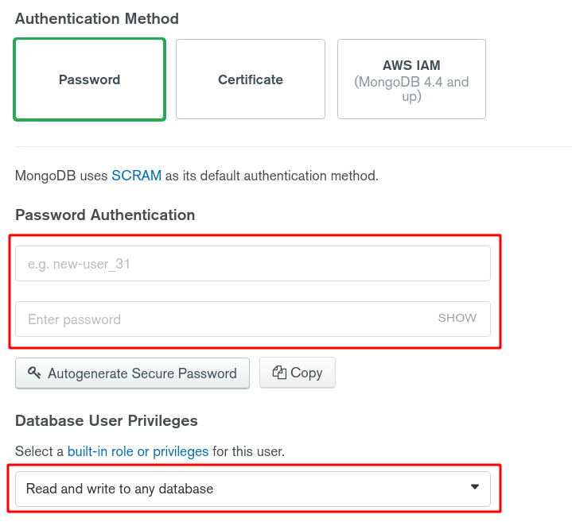
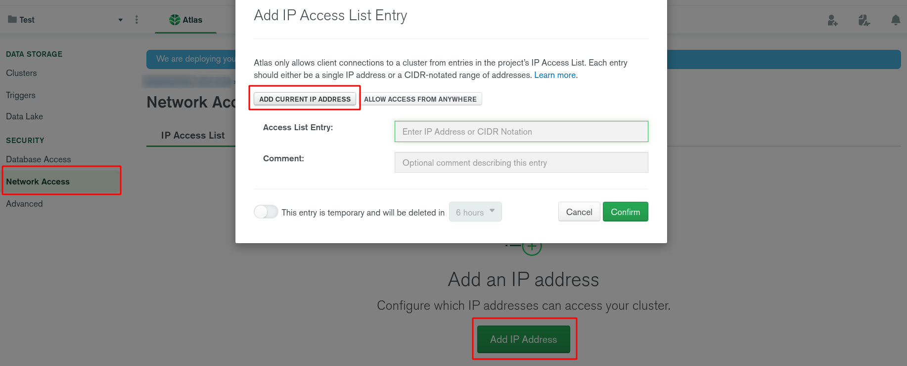
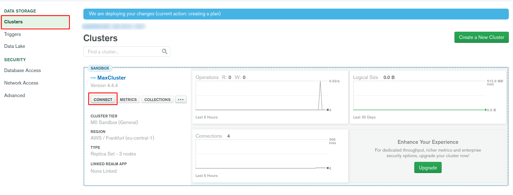
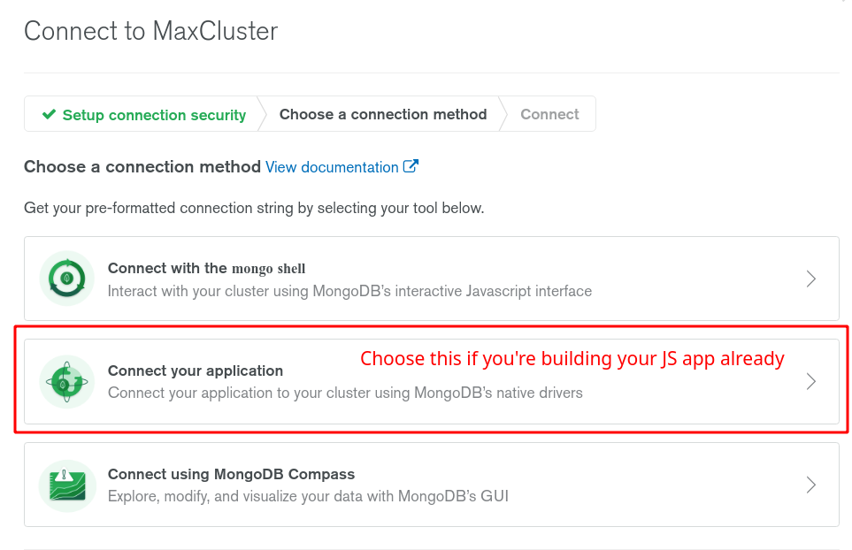

# MongoDB

- [MongoDB](#mongodb)
	- [Sources](#sources)
	- [Intro](#intro)
		- [Install & Run](#install--run)
	- [Basics](#basics)
		- [Database](#database)
		- [Basic commands](#basic-commands)
		- [Document](#document)
		- [Databases](#databases)
		- [Data types](#data-types)
	- [Practice](#practice)
		- [First training project](#first-training-project)
	- [Atlas](#atlas)

***

## Sources

1. https://docs.mongodb.com/manual/ - docs
2. https://youtu.be/-56x56UppqQ - tutorial traversy
3. https://youtu.be/8bE_PBRriyU - tutorial minin

***

## Intro

### Install & Run

1. Install: `mongodb-bin` and `mongodb-compass` (GUI) from AUR.
2. Start the server: `sudo systemctl start mongodb` in the shell.
3. Enter the interface of you choosing:
   - Type `mongo` in the shell
   - **or**
   - Open the `mongodb-compass` GUI you installed.
4. 

MongoDB is NoSQL database that stores data **not** in tables but **in the collections of documents**.

The format of storing data is `BSON`. It's similar to `JSON` but takes more spance and works faster.

Each **document** in Mongo has a unique identifier called `_id`. It will be generated unless explicitly set. 

***


## Basics

### Database

### Basic commands

Command|Description
-|-
`show dbs`|Show databases
`use test`|Use this DB, it will be created if not exists
`db`|Show the current DB
`show collections`|Show collections in the current DB
`show users`|Show all users in the current DB
`show profile`|Show the last `system.profile` records with time >= 1 ms
`show logs`|Show log names
`show log [name]`|Show the last log, default - `global`
`db.userMessages.max({ msg: 'hi', whom: 'max' })`|Insert a document in the collection 
`db.userMessages.find({ "_id" : ObjectId("5fbe2bc1c3b027decc1718f5"), "message" : "как успехи?", "whom" : "Max" })`|Find all objects from the collection that satisfy the condition
`db.userMessages.renameCollection('maxMessages')`|
`it`|The result of the last operation, used for further iteration
`DBQuery.shellBatchSize = 10`|Set up the number of elements to display by default

***


### Document

**Document** is a an object with a **unique** `_id` which consists of up to 128 symbols. Trying to insert a duplicate `_id` will result in Error. 

Document **name**:

- case-insensitive
- starts with a latter or `_`
- 63- symbols including latin letters, numbers, `_`, `-`, `!` 

It consists of **key-value pairs** similar to JSON.

Typical document:

```json
{
	"history": [
		{ "user": "Vlad", "message": "я тебе подарил ламбу" },
		{ "user": "Max", "message": "ооо, красавчик" }
	]
}
```

***

### Databases

To create a DB, you should also create an entry right after - otherwise the DB won't be created.

```bash
show dbs	# Show databases
use test	# Use this DB, it will be created if not exists
db 				# Show the current DB
```

***


### Data types

- `Null`
- `Array`
- `String`
- `Object`
- `Boolean`
- `Binary data`
- `Date` - stores date in the Unix format
- `Timestamp` - times
- `Double` - numeric float
- `Integer` - numeric integer
- `JavaScript` - data type for storing JS code
- `Min key / Max key` - is used for comparison
- `ObjectID` - document's **id**
- `Regular expression` - regexp
- `Symbol` - similar to **strings**, mostly used for languages with special symbols

***


## Practice

### First training project

https://youtu.be/-56x56UppqQ

```bash
show dbs					# Show databases
use test					# Use this DB, it will be created if not exists
db.myNewCollection1.insertOne( { x: 1 } )	# Example entry

db 								# test
show collections	# myNewCollection1

db.posts.drop()		# Drop the collection
db.dropDatabase()	# Delete the current DB

use acme					# New DB
db.createCollection('posts')	# New collection
show collections	# 'posts'

db.posts.insert({
	title: 'Post One', 
	body: 'Body of Post One',
	category: 'News',
	likes: 4,
	tags: ['news', 'events'],
	user: {
		name: 'John Doe',
		status: 'author'
	},
	date: Date()
})	# Insert one record

db.posts.insertMany([
  {
    title: 'Post Two',
    body: 'Body of post two',
    category: 'Technology',
    date: Date()
  },
  {
    title: 'Post Three',
    body: 'Body of post three',
    category: 'News',
    date: Date()
  },
  {
    title: 'Post Four',
    body: 'Body of post three',
    category: 'Entertainment',
    date: Date()
  }
])	# Insert multiple records
```

Note that we **don't have to** use the same fields for all records as in relational DBs. We can insert any data we want. 

```bash
db.posts.find().pretty()	# find all records
db.posts.find({ category: 'News' })	# find === WHERE 
db.posts.findOne({ category: 'News' })	# Return the first match
db.posts.find().sort({ title: -1 })	# Sort Descending
db.posts.find().sort({ title: 1 }).limit(2)	# Sort Ascending and Limit
db.posts.find({ category: 'News' }).count()	# Count

db.posts.find().forEach(function(doc) { print('Blog Post: ' + doc.title) })	# Loop + strings contatenation

# Updats the set field keeping the rest untouched
db.posts.update(
	{ title: 'Post Two' },
	{ $set: {
			title: 'Post Two',
			body: 'New body for post 2',
			date: Date()
		}
	},
	{
  	upsert: true
	}
)

# Increment
db.posts.update({title: 'Post One'}, { $inc: { likes: 2 } })

# Rename
db.posts.update(
	{ title: 'Post One' },
	{ $rename: { likes: 'views' }}
)
```

In relational DB, if we wanted to store **comments** for the **post**, we would create another table and a **foreign key** that connects them. 

In Mongo, we can just insert **comments** inside the **post** collection. 

```js
// Inserts new info into the record
db.posts.update({ title: 'Post One' }, 
{
	$set: {
		comments: [
			{ 
				user: 'John Williams',
				body: 'Comment One',
				date: Date()
			},
			{ 
				user: 'Jeremy Soule',
				body: 'Comment Two',
				date: Date()
			},
		]
	}
})
```

```bash
# Inserts new info into the record
db.posts.update({ title: 'Post One' }, 
{
	$set: {
		comments: [
			{ 
				user: 'John Williams',
				body: 'Comment One',
				date: Date()
			},
			{ 
				user: 'Jeremy Soule',
				body: 'Comment Two',
				date: Date()
			},
		]
	}
})

# Advanced find
db.posts.find({
	comments: {
		$elemMatch: {
			user: 'John Williams'
		}
	}
})

# Delete
db.posts.remove({ title: 'Post Four' })
```

Indices help to search text:

```bash
# Create new index for the field
db.posts.createIndex({
	title: 'text'
})

# Now we search: "Post O" (not zero!)
db.posts.find({
	$text: {
		$search: "\"Post O\""
	}
})
# Post One

db.posts.find({
	$text: {
		$search: "\"Post T\""
	}
})
# Post Two, Post Three
```

Let's see how to make **greater than**, **less than**. For this, we'll make a small update.

```bash
# Update
db.posts.update({ title: 'Post Two' }, { $set: { views: 10 }})

# >
db.posts.find({ views: { $gt: 6 }})
# Post Two

# >=
db.posts.find({ views: { $gte: 6}})
# Post One, Post Two


```

***


## Atlas

https://youtu.be/-56x56UppqQ?t=1817 - tutorial

A service for storing your DB **in the cloud**. 

1. Create an account on `https://cloud.mongodb.com` and log in.
2. Select a CLoud Provider, region and "M0 Sandbox" free plan, then confirm the creation of your cluster.
3. Wait a few minutes until it's established.
4. Create a new user.




5. Whitelist the IP from which you're gonna connect to the cloud. There will be a button for adding your current IP - click it.



6. Connect your local DB to the cloud using the preferred method of using the DB (1 and 3 for studying MongoDB and accessing it directly, 2 is for you JS app).





7. Follow the instructions for the method of your choosing. 
8. After you connected you app, you can see how changes made locally are visible from the web-interface and vice versa. You DB is now in the cloud. 