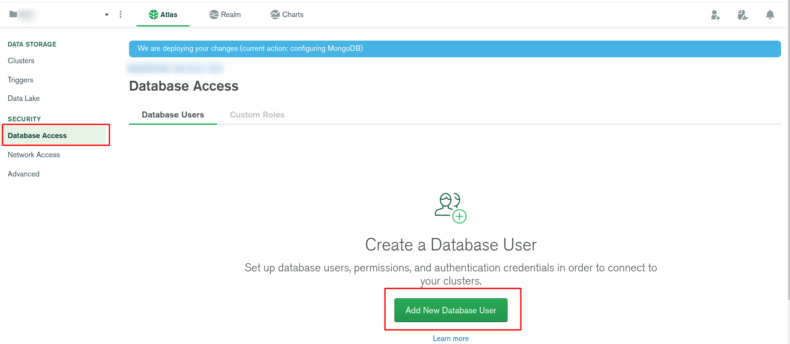

# MongoDB

- [MongoDB](#mongodb)
	- [Sources](#sources)
	- [Intro](#intro)
		- [Install & Run](#install--run)
	- [Compass & Atlas](#compass--atlas)
	- [Basics](#basics)
		- [Databases](#databases)
		- [Collections](#collections)
		- [Document](#document)
		- [Data types](#data-types)
			- [ObjectId](#objectid)
		- [Operators](#operators)
		- [JS](#js)
	- [Advanced](#advanced)
		- [Cursors](#cursors)
		- [Indexing](#indexing)
		- [Text Search](#text-search)
		- [Aggregation](#aggregation)
	- [Relationships](#relationships)
		- [Embedded](#embedded)
		- [Referenced](#referenced)
			- [DBRefs](#dbrefs)
	- [Administration](#administration)
		- [Performance](#performance)
		- [Replication](#replication)
		- [Sharding](#sharding)
		- [Backup](#backup)
		- [Deployment](#deployment)

***

## Sources

1. https://docs.mongodb.com/manual/reference/method/ - docs
2. https://youtu.be/-56x56UppqQ - tutorial traversy (basics)
3. https://tutorialspoint.com/mongodb/ - tutorial

***

## Intro

### Install & Run

1. Install: `mongodb-bin` and `mongodb-compass` (GUI) from AUR.
2. Start the server: `sudo systemctl start mongodb` in the shell.
3. Enter the interface of you choosing:
   - Type `mongo` in the shell
   - **or**
   - Open the `mongodb-compass` GUI you installed.

By default, the local Mongo server runs on the `27017` port, you can check this typing `lsof -i tcp:27017`

MongoDB is NoSQL database that stores data **not** in tables but **in the collections of documents**.

The format of storing data is `BSON`. It's similar to `JSON` but takes more spance and works faster.

Each **document** in Mongo has a unique identifier called `_id`. It will be generated unless explicitly set. 

***


## Compass & Atlas

These two tools are provided by the MongoDB developers.

**Compass** is a convenient front-end for MongoDb that you can use instead of the regular shell. 

**Atlas** is a service for storing your DB **in the cloud**. 

**(you can set it up later, when you're familiar with mongo)**

https://youtu.be/-56x56UppqQ?t=1817 - tutorial

1. Create an account on `https://cloud.mongodb.com` and log in.
2. Select a CLoud Provider, region and "M0 Sandbox" free plan, then confirm the creation of your cluster.
3. Wait a few minutes until it's established.
4. Create a new user.




5. Whitelist the IP from which you're gonna connect to the cloud. There will be a button for adding your current IP - click it.


6. Connect your local DB to the cloud using the preferred method of using the DB (1 and 3 for studying MongoDB and accessing it directly, 2 is for you JS app).


7. Follow the instructions for the method of your choosing. 
8. After you connected you app, you can see how changes made locally are visible from the web-interface and vice versa. You DB is now in the cloud. 

***


## Basics

Databases > Collections (kinda tables) > Documents (records)

### Databases

Command|Notes
-|-
`use mydb`|Use this DB (creaate it if needed). Requires at least one **collection** to be actually created.
`db`|Show the current DB
`show dbs`|Show the list of DBs
`db.stats ()`|DB statistics
`db.dropDatabase()`|Delete the current DB

```js
use test
db
show dbs

// Insert a collecton and a record so our DB will become visible
db.test.insert({ name: 'max' })
show dbs

db.dropDatabase()
```

***

### Collections

Collections store documents (records) and act as tables in relational DBs.

Methods|Notes
-|-
`db.createCollection (name, options)`|Creates a collection with specific options (see above)
`show collections`|Show the collection list
`db.myCollection.drop()`|Delete the collection. Returns `true` if the deletion was successful and `false` otherwise.

Options: 

- `capped: boolean` - makes the collection **capped** which means that it will be fixed-size and will overwrite the oldest entries and the new ones come in
- `size: number` - max size in bytes if `capped: true`
- `max: boolean` - max number of documents allowed if `capped: true`
- other fields including **validation**, **views**, etc, see the [ref](https://docs.mongodb.com/manual/reference/method/db.createCollection/)

Capped collections **guarantee** that documents will be in the order of insertion - unlike regular ones. 

You **cannot** delete documents from capped collections - you can only delete the collection itself! 

```js
use test
db.createCollection("mycollection")

// Max 5000 documents and 5 MB
db.createCollection("log", { capped : true, size : 5242880, max : 5000 } )
show collections

db.mycollection.drop()
show collections
```

***

You can create nested collections:

```js
// The main collection
db.deposit

// Nested collections don't harm the parent one in any way
db.deposit.investing.insertOne(...)
db.deposit.trading.insertOne(...)
```

***

https://docs.mongodb.com/manual/reference/method/db.collection.insertOne/ - docs

Collection **instance** methods (mostly for working with documents) look like this: `db.myCollection.insert (record)`

Methods|Notes
-|-
`findOne (query)`|Document interaction methods
`find (query, fields)`|`fields`' format: `{ 'age": true }` or `{ age: 1 }`
`findAndModify (options)`|
`insertOne (document)`|
`insertMany (documents)`|
`updateOne (filter, replacement, options)`|
`updateMany (filter, replacement, options)`|
`deleteOne (filter, options)`|
`deleteMany (filter, options)`|
`remove ({})`|== TRUNCATE (remove all records)
`replaceOne (filter, replacement, options)`|
`countDocuments (query, options)`|
`renameCollection (newName)`|Rename collection
`stats (options)`|Statistics about the collection.

To **update** fields, you need to use these operators:

- `$set` - set a value to the field
- `$unset` - delete a field

There're a few chainable methods: 

Chainable Methods|Notes
-|-
`pretty ()`|Prettify the output
`limit (n)`|Only return the first `n` records
`skip (n)`|Skip the first `n` records and return the rest
`sort (criteria)`|Criteria is an object with the fields to sort by: `{ name: 1, age: -1 }`; `1` == ascending, `-1` == descending
`allowDiskUse ()`|Allows `sort` to use more than default 100 MB of RAM for complex sorting

Mongo stores documents in arbitrary order, so if you sort by ununiruq criteria, you may get inconsistent results. For **consistent** sorting, you should include unique criteria in your parameters (e.g. `{ name: 1, _id: 1 }` instead of `{ name: 1 }`).

```js
// Insert Many Documents
db.users.insertMany([
	{ name: 'max', age: 22, gender: 'male', languages: ['en', 'ru', 'fr'] },
	{ name: 'anya', age: 25, gender: 'female', languages: ['ru'] },
	{ name: 'sasha', age: 19, gender: 'female', languages: ['ru', 'jp', 'en'] }
])

// Find all documents
db.users.find()
db.users.find({})

// Gather specific fields from all documents in the collection; prevent the `_id` from showing up
db.users.find({}, { age: true, _id: 0 })

// Gather specific fields from specific documents (find names of all girls)
db.users.find({ gender: 'female' }, { name: true })

// updateOne
db.users.updateOne(
  { name: 'max' },
  { $set: { name: 'vanya' } }
)

// updateMany
db.users.updateMany({}, { $set: { greedy: true, lazy: true }})

db.users.updateMany(
	{},
	{ $unset: { greedy: 1, lazy: 1 }}
)

// Will return the 2nd record out of 3
db.users.find().skip(1).limit(1)

// First, sort by gender DESC, then - by age ASC
db.users.find().sort({ gender: -1, age: 1 })

// Get the last inserted document
db.users.find().sort({ $natural: -1 }).limit(1)
```

***

### Document

**Document** is a an object of **key-value pairs** representing a **record**.

It has:

- unique `_id` (objectId)
- case insensitive **name** of up to 63 symbols that starts with a letter or `_` and consists of letters, numbers, `_`, `-`, `!`

Document can represent many records of different types of data - unlike relational DBs where tables store data of the same type.

Methods for interacting with documents live **as collection methods**: `db.collectionName.insertOne ()`. Thus, see the [collections](#collections) chapter.

***

### Data types

Data Type|Notes
-|-
`string`|The most commonly used datatype to store the data. Uses UTF-8
`int`|4-byte
`long`|8-byte
`decimal`|16-byte
`double`|Floating point
`bool`|
`null`|
`date`|8-byte, negative values represent the time before 1970. 
`timestamp`|8-byte. Mostly used internally, use `date` in your apps
`array`|
`object`|
`objectId`|Used for creating `_id`. Includes timestamp that can be extracted
`binData`|Binary data
`minKey`/`maxKey`|Are used for comparison
`javascript`|JS code
`regex`|

***

#### ObjectId

This datatype is used to store document `_id`s.

It consists of `12 hex` symbols and stores a timestamp.

```js
// Provide your own id
var myId = ObjectId('60534fd58aea6809c738baa0')

// Generate id
var myId = ObjectId()

// Extract a timestamp in the ISO format
myId.getTimestamp()
// 2021-03-18T13:17:57.000Z

// Convert to a string
var myStr = myId.toString()
// '60534fd58aea6809c738baa0'
```

***

### Operators

Operators return documents that:

Document [operators](https://docs.mongodb.com/manual/reference/operator/query/)|Notes
-|-
`$eq`, `$ne`|===, !==
`$gt`, `$gte`|>, >==
`$lt`, `$lte`|<, <==
`$in`, `$nin`|Match any / none values in an array
`$and`, `$or`|AND, OR
`$not`|!
`$nor`|Fail on both conditions
`$exists`|Have the specified field
`$type`|Field is of a certain type
`$regex`|RegExp
`$where`|Satisfy a JS expression
`$all`|Contains all the specified elements of the array
`$set`|Set a value to a field
`$unset`|Delete a field

Array [operators](https://docs.mongodb.com/manual/reference/operator/update-array/)|Notes
-|-
`$push`|Add an element to the end of the array
`$pull`|Remove all instances of a certain value
`$addToSet`|The same as `$push` but doesn't add duplicates
`$pop`|`$pop: { languages: 1 / -1 }` - `1` means "from the end", `-1` means "from the beginning" of the array
`$slice`|Used with **arrays** to select specific items, takes 2 params: offset and the number of elements (basically `skip` and `limit`). Negative offset means "from the end"

If you need to use several checks, just separate them with commas (which is the equivalent of AND). 

```js
db.users.find({ age: { $gt: 20 } })
// max, anya

db.users.find({ languages: 'en' })
// same -> vanya, sasha
db.users.find({ languages: { $eq: 'en' } })

db.users.find({ languages: { $all: [ 'en', 'ru' ] } })
// vanya -> only he knows both `en` and `ru`

// Get documents with a field `age` and return their `age` only
db.users.find({ age: { $exists: 1 } }, { age: 1, _id: 0 })
// { age: 19 }
// { age: 22 }
// { age: 25 }
// { age: 30 }

db.users.find({ $nor: [{ age: { $lt: 23 }}, { gender: 'male' }] })
// anya -> the only one that fails on both conditions

db.users.find({ name: { $regex: /^anya/ig }})
// anya

db.users.find({ name: { $regex: 'a', $options: 'ig' }, age: { $gte: 21 } })
// vanya, anya

db.players.find( { $where: function() {
   return (hex_md5(this.name) == "9b53e667f30cd329dca1ec9e6a83e994")
} } )
// The two examples are the same
db.players.find( {$expr: { $function: {
      body: function(name) { return hex_md5(name) == "9b53e667f30cd329dca1ec9e6a83e994"; },
      args: [ "$name" ],
      lang: "js"
} } } )

db.players.find{ tags: { $all: [ "ssl" , "security" ] }}
// The two examples are the same
db.players.find({ $and: [ { tags: "ssl" }, { tags: "security" } ] })

// $push
db.users.updateOne({ name: 'anya' }, { $push: { languages: 'es' } })
// Multiple elements
db.users.updateOne({ name: "anya" }, { $push: { languages: { $each: [ 'de', 'no', 'se' ] } }})

// $addToSet
db.users.updateOne({ name: 'max' }, { $addToSet: { languages: 'en' } })
// Doesn't add anything since it's already present

// $pop
db.users.updateOne({ name: 'max' }, { $pop: { languages: 1 } })

// The penultimate element of an array
db.users.find({ name: 'vanya' }, { languages: { $slice: [-2, 1] } })
```

***

### JS

You **can** use some JS features in mongo: 

- variables
- conditions
- loops
- functions
- etc.

You **can't** use any APIs and browser features: 

- DOM
- window (setTimeout, ...)
- etc.

***


## Advanced

### Cursors

https://docs.mongodb.com/manual/reference/method/cursor.hint/#cursor.hint

Results of the `find` and similar queries are called `cursor`. Basically arrays of documents.

Cursors work as **variables** or **subqueries**. You can save them and use later. 

Methods|Notes
-|-
`forEach (elem)`|Similar to arrays but the callback only has 1 argument - the current element
`map (elem)`|Same
`hasNext ()`|Check if there's a next item to iterate over
`next ()`|Iterate to the next element
`close ()`|Close a cursor and free server resources

```js
db.users.find().map(user => user.name )
// 'vanya'
// 'anya'
// 'sasha'
// 'Tom Benzamin'

var usersCursor = db.users.find()
while (usersCursor.hasNext()) {
  const user = usersCursor.next()
	if(user.age === 25){
  	print(`Username: ${user.name}, age: ${user.age}`)
		break
	}
}
usersCursor.close()
// 'Username: anya, age: 25'
```

***

### Indexing

Indexes are basically collections, documents in which are **already sorted** by some field or fields. They are returned in response for the corresponding query. 

Scanning indexed data is much more efficient than re-scan the whole collection in response to each query.

Just remember that indexes take disk space, so don't overuse them. Create them for the fields that you query often.

Indexes are **updated automatically**, so if we insert a new value to the collection - all indexes will take it into consideration.

Composite indexes consist of multiple fields. It simply means that documents are sorted by one field, then by another, etc.

Method|Notes
-|-
`createIndex (index, options)`|`index` - the same object as for `sort`; 1 = ASC, -1 = DESC; `options` are numerous, see the [docs](https://docs.mongodb.com/manual/reference/method/db.collection.createIndex/)
`createIndexes (criteria, options)`|Create multiple indexes
`getIndexes ()`|Get the list of all indexes
`dropIndex (index)`|Delete index 
`dropIndexes (criteria)`|Delete multiple indexes (or all of them - if you call it without params)
`hint (index)`|Chainable method used to enforce a specific query

Some `options`:

- `name: string` - custom name (by default it's generated: `age_-1`)
- `unique: boolean` - if `true`, will forbid inserting/updating values to key-value pairs that already exist. It's `true` for `_id` and `false` for other fields by default.
- `sparse: boolean` - if `true`, the index only references documents with the specified field. 
- `expireAfterSeconds: integer` - TTL in seconds for storing documents in the collection

```js
// Simple index
db.users.createIndex({ name: 1 })

// Composite index. This one sorts by name ASC, then by age DESC
db.users.createIndex({ name: 1, age: -1 })

// Now search for the selected fields
db.users.find({ name: 'anya' }).explain()

// Create multiple indexes
db.users.createIndexes([ { name: 1 }, { age: -1 } ])

// Drop index
db.users.dropIndex({ age: -1 })
```

This is how you know an index was used for the query:


***

Indexing can't be used with queries which use:

- RegExp or negation operators: `$nin`, `$not`, etc.
- Arithmetic operators: `$mod`, etc.
- `$where`

Also, there're certain limits: 

- index key limit
- up to 64 indexes per collection
- compound index can have up to 31 field indexed
- index name up to 125 symbols


***

### Text Search

1. Create `fieldName: 'text'` index.
2. Search it for text using the `$text` operator.
3. `$text` uses whitespaces and most punctuation as delimiters and performs logical OR on these parts of the string (tokens).
4. Use `""` for the exact phrase. You may need to escape them.
5. Use `-` to exclude the word.

```js
db.stores.insertMany([
	{ _id: 1, name: "Java Hut", description: "Coffee and cakes" },
	{ _id: 2, name: "Burger Buns", description: "Gourmet hamburgers" },
	{ _id: 3, name: "Coffee Shop", description: "Just coffee" },
	{ _id: 4, name: "Clothes Clothes Clothes", description: "Discount clothing" },
	{ _id: 5, name: "Java Shopping", description: "Indonesian goods" }
])

// Here we defined 2 firlds by which we want to search 
db.stores.createIndex({ name: 'text', description: 'text' })

// Find all documents with words "coffe" or "shop"
db.stores.find({ $text: { $search: 'coffee shop' } })
// { _id: 3, name: 'Coffee Shop', description: 'Just coffee' }
// { _id: 1, name: 'Java Hut', description: 'Coffee and cakes' }
// { _id: 5, name: 'Java Shopping', description: 'Indonesian goods' }

// Exact phrase: "coffee shop"
db.stores.find({ $text: { $search: '"coffee shop"' } })
// { _id: 3, name: 'Coffee Shop', description: 'Just coffee' }

// Search for "shop" but without "coffee"
db.stores.find({ $text: { $search: 'shop -coffee' } })
// { _id: 5, name: 'Java Shopping', description: 'Indonesian goods' }
```

For [other](https://docs.mongodb.com/manual/reference/text-search-languages/) languages you should specify the language:

```js
db.books.createIndex(
	{ content: 'text', author: 'text' },
	{ default_language: 'russian' }
)
```

Option for multiple language collection is also available, see the docs.

***

### Aggregation

https://docs.mongodb.com/manual/reference/method/db.collection.aggregate/ - docs

Aggregations operations get some data from the multiple source documents, process it several times (through a pipeline) and return the final grouped data. 

Methods|Notes
-|-
`aggregate (pipeline, options)`|Combine several operations (from the `pipeline` array) and return the resulting document(s)
`distinct (field)`|Group by a distinct field

Pipeline means that the output of the last operation is used as an input of the next one. 

Pipeline [operators](https://docs.mongodb.com/manual/meta/aggregation-quick-reference/)|Notes
-|-
`$match`|===
`$sum`|SUM
`$avg`|AVG
`$count`|COUNT
`$min`, `$max`|MIN, MAX
`$group`|Groups input documents by a specified identifier expression and applies the accumulator expression(s)
`$first`, `$last`|Get the first/last document from the source documents. Typically used after `sort`
`$limit`, `$skip`|LIMIT, skip
`$sort`|Only the order of the documents at the current stage changes
`$natural`|Used with `sort` to retrieve documents in the order they were inserted (or the opposite)

Other operators for including extra values, union, etc. are available.

```js
db.orders.insertMany([
	{ _id: 1, cust_id: "abc1", ord_date: ISODate("2012-11-02T17:04:11.102Z"), status: "A", amount: 50 },
	{ _id: 2, cust_id: "xyz1", ord_date: ISODate("2013-10-01T17:04:11.102Z"), status: "A", amount: 100 },
	{ _id: 3, cust_id: "xyz1", ord_date: ISODate("2013-10-12T17:04:11.102Z"), status: "D", amount: 25 },
	{ _id: 4, cust_id: "xyz1", ord_date: ISODate("2013-10-11T17:04:11.102Z"), status: "D", amount: 125 },
	{ _id: 5, cust_id: "abc1", ord_date: ISODate("2013-11-12T17:04:11.102Z"), status: "A", amount: 25 }
])

// 1) Get the documents with `status: "A"` -> 3 full records with the `amount` of 50, 100, 25
// 2) Group them by the `cust_id` field and summing their `amount` field during the merge. So we're getting objects of the kind: `_id: cust_id, total: <amount or sum of the merged amounts>`
// 3) Order the resulting documents by `total DESC`
db.orders.aggregate([
	{ $match: { status: "A" } },
	{ $group: { _id: "$cust_id", total: { $sum: "$amount" } } },
	{ $sort: { total: -1 } }
])
// [ { _id: 'xyz1', total: 100 }, { _id: 'abc1', total: 75 } ]

// Distinct
db.users.distinct('languages')
// [ 'en', 'fr', 'ge', 'jp', 'ru' ]

// Distinct ages + filter the clutter
db.users.distinct('age')
// [ null, 19, 22, 25, 30 ]
var ages = db.users.distinct('age')
var finalAges = ages.filter(age => age !== null)
finalAges
// [ 19, 22, 25, 30 ]

// COUNT(gender: 'female' AND age > 20)
db.users.count({ gender: 'female', age: { $gt: 20 } })
// 1 -> anya

// AVG of ages of everybody. The `match` section can be skipped here as it's empty anyway
db.users.aggregate([
	{ $match: {} },
	{ $group: { _id: null, avgAge: { $avg: '$age' } } }
])
// { _id: null, avgAge: 22 }

// SUM of ages of females only
db.users.aggregate([ 
	{ $match: { gender: 'female' } },
	{ $group: { _id: null, femaleAgeSum: { $sum: '$age' } } }
])
// { _id: null, femaleAgeSum: 44 }

// MAX age of females
db.users.findOne({ gender: 'female' }, { name: '$name', gender: '$gender', languages: '$languages', age: { $max: '$age' } })
// anya 25, ...

// 'ru' is the 1st one mentioned
db.users.find({ 'languages.0': 'ru' })
// anya
```

***


## Relationships

Relationships between documents can be modeled in 2 ways:

- `Embedded` implies that we embed the connected data inside the original document 
- `Referenced` means the classic approach: the main record will have the reference to the related ones that are stored **separately**.

Relationships can be:

- One-to-One
- One-to-Many
- Many-to-Many

***

### Embedded

Example of One-to-One - one person can have multiple addresses:

```js
db.users.insertOne({
	"_id":ObjectId("52ffc33cd85242f436000001"),
	"contact": "987654321",
	"dob": "01-01-1991",
	"name": "Tom Benzamin",
	"address": [
		{
			"building": "22 A, Indiana Apt",
			"pincode": 123456,
			"city": "Los Angeles",
			"state": "California"
		},
		{
			"building": "170 A, Acropolis Apt",
			"pincode": 456789,
			"city": "Chicago",
			"state": "Illinois"
		}
	]
})

// Query the addresses
db.users.findOne({ "name": "Tom Benzamin" })
```

**Pros**: easy to retreive and maintain the data.

**Cons**: if the embedded document keeps on growing too much, it can impact the performance.

***

### Referenced

```js
db.companies.insertOne({ name: 'Apple', year: 1976 })
db.employees.insertOne({ name: "Vlad", age: 28, company: "Apple" })

var user = db.employees.findOne({ name: 'Vlad' })

db.companies.findOne({ name: user.company })
// { _id: ObjectId("6054f4b5cd132809bd5ddbec"), name: 'Apple', year: 1976 }
```

We'll need 2 queries: 1st to fetch the `address_ids` and 2nd to fetch these addresses from the `address` collection:

```js
const result = db.users.findOne({"name":"Tom Benzamin"},{"address_ids":1})
const addresses = db.address.find({"_id":{"$in":result["address_ids"]}})
```

***

#### DBRefs

Automaticized version of the manual (referenced) relationship.

You should mostly use them if you need to connect documents from multiple collections. In most cases, manual referencing is a better choice.

DBRefs are documents that set the following fields:

- `$ref` - **collection** of the referenced document
- `$id` - **`_id`** of the referenced document
- `$db` - (optional and rarely used) **the database name** of the referenced document

The order of the fields **matters**!

```js
db.companies.deleteMany({})
db.employees.deleteMany({})

db.companies.insertOne({ name: 'Apple', year: 1976 })
var company = db.companies.findOne({ name: 'Apple' })

db.employees.insertOne({ name: 'Vlad', age: 28, company: { '$ref': 'companies', '$id': company._id, '$db': 'test' } })
var user = db.employees.findOne({ name: 'Vlad' })

// doesn't work...
db[user.company.$ref].findOne({ '_id': (user.company.$id) })
```

***


## Administration

### Performance

Method|Notes
-|-
`explain ()`|Chainable method allowing to get analytics about the query
`hint (index)`|Forces the specific index to use with the query for optimization

```js
db.users.find().explain()

db.users.find().hint({ age: -1 })
db.users.find().hint('age_-1')
db.users.find().hint( { $natural : -1 } )


```

***

### Replication

1. [The idea in simple words](https://youtu.be/UYlHGGluJx8)
2. [Detailed vid](https://youtu.be/Q2lJH156SUQ)
3. [Atricle](https://www.tutorialspoint.com/mongodb/mongodb_replication.htm)

In production, Mongo replicates your data between several nodes for raliability and accessibility purposes.


- **PRIMARY node**:
  - always only one
  - all writing is always done on this node
  - reading is usually done on this node
  - automatically shares the written data with secondary nodes
- **SECONDARY nodes**:
  - multiple (2+) secondary nodes that are synchronized with the primary one
  - **never** used for writing
  - can be used for reading (as the info stored is the same in all the nodes)
  - can share the written info with each other

During the malfunction or maintenance of the primary node, one of the secondary **becomes primary** via election between secondaary nodes. After the recovery, failed node becomes secondary. This happens automatically.

**Advantages**:

- your data is stored safely
- your data is available 24/7 - no downtime for maintenance
- automatic disaster recovery

***

There's a heartbeat check occuring periodically between the nodes.

Sometimes secondary nods can't elect a new primary node (e.g. when there's an even number of nodes voting). In this case, an Arbiter might be needed. Remember: arbiter is **not** a data node and it can't be the new primary node. 

***

1. Shutdown already running MongoDB server.

```bash
# For Manjaro
sudo systemctl stop mongodb
```

2. Edit the mongo config file:

```bash
sudo gedit /etc/mongodb.conf
```

Uncomment the `replication` line and add this info (you can choose any name in quotes):

```
replication:
	replSetName: "rs1"
```

3. Start the MongoDB server by specifying `--replSet` option.

```bash

```


***

### Sharding

Sharding is the process of storing data records across multiple machines to handle the data growth - **horizontal scaling**.

You add more machines to support data growth and the demands of read and write operations.

Typical **Sharded Cluster**:


- `Shards` are used to store data. In production, each shard is a separate replica set. 
- 3 `Config Servers` store the cluster's metadata and are used by `query routers` to target specific operations to specific shards. 
- `Query Routers` - are basically `mongo` instances. They process and target the operations to shards and then return results to the clients (above the Routers). 

***

### Backup

You can use `mongodump` and `mongorestore` for backups. I didn't try them.

***

### Deployment

https://www.tutorialspoint.com/mongodb/mongodb_deployment.htm
