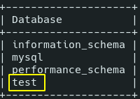
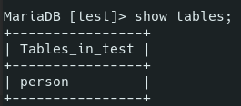
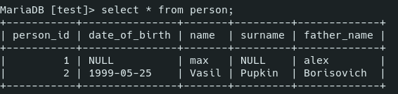
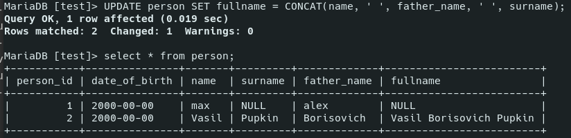

# MySQL

- [MySQL](#mysql)
	- [Sources](#sources)
	- [Theory](#theory)
		- [Connections](#connections)
		- [Terms](#terms)
		- [Types](#types)
		- [Indices](#indices)
	- [Installation and Running](#installation-and-running)
	- [Practice](#practice)
		- [Databases](#databases)
		- [Tables](#tables)
	- [Data manipulation](#data-manipulation)
		- [`select`](#select)
		- [Insert data](#insert-data)
		- [`UPDATE`](#update)
		- [`WHERE`](#where)
		- [`LIMIT`](#limit)
		- [`DELETE`](#delete)
		- [Auto Increment](#auto-increment)

***

## Sources

1. https://medium.com/@rshrc/mysql-on-manjaro-973e4bfc4f05
2. http://gitlab.a-level.com.ua/gitgod/PHP/src/master/ER-SQL.md
3. http://gitlab.a-level.com.ua/gitgod/PHP/src/master/SQL.md
4. http://gitlab.a-level.com.ua/gitgod/PHP/src/master/SQLHomeWork.md
5. https://dev.mysql.com/doc/refman/8.0/en/


***


## Theory 

MySQL is a **relational** (because data is stored in tables that are related to each other) database system. 

***


### Connections

- One to One (rare)
- One to Many (often): one post and many comments to it
- Many to Many: many posta and many tags

To handle "Many to Many" connection, we need an extra table.

***


### Terms

- **data value** - single value
- **record** - a **row** of data values
- **field** - a **column** of data values
- **entity** - a set of meaningful data (row, column, table, etc.)


***


### Types

Since databases are intent to store huge amounts of data, there are many types of data that you can use to store just the amount of data you need (and no more!).

Numeric:

Type|Description|Bytes
-|-|-
`TINYINT`|`-128` to `127`|1
`SMALLINT`|`-32768` to `32767`|2
`MEDIUMINT`|`-8388608` to `8388607`|3
`INT`|`-2147483648` to `2147483647`|4
`BIDINT`|`-9223372036854775808` to `9223372036854775807`|8
`FLOAT(p)`|Floating point number. Effective for mathematical calculations. If precision `p` is 0-24 - the data type is 4-byte `FLOAT`, if `p` is 25-53 - 8-byte `DOUBLE`|4, 8
`DECIMAL(digits, decimals)` == `NUMERIC`|Fixed point number, effective for calculations where the maximum precision is needed (e.g. with money). `DECIMAL(5,2)` can store values from `-999.99` to `999.99`|Varies

Any of the described types can be **unsigned** if you add the word: `UNSIGNED TINYINT`: 

***

String:

Type|Description|Bytes
-|-|-
`CHAR(size: 0-255)`|Fixed-length string, size is the max characters stored. `CHAR(30)` stores up to 30 characters. Trailing spaces **are** removed (you write `'ab '` and retreive `'ab'`).|size (<= 256 bytes)
`VARCHAR(size: 0-65535)`|Variable-length string. Can store 1- and 2-byte characters (specified by the **prefix** which takes 1 or 2 bytes). `65535` is the max length of **sum** of the all VARCHAR values in the `record`. Trailing spaces are **not** removed.|Varies

This is how it works in **non-strict** mode:


In **strict** mode, there will be an **error** because of the exceeding length. 

`VARCHAR` is more effective **memory-wise** but `CHAR` is more effective **speed-wise**. 

***

Text: 

Type|Bytes
-|-
`TINYTEXT`|up to255
`TEXT`|up to 65535
`MEDIUMTEXT`|up to 16777216
`LONGTEXT`|up to 4294967296

Text types are needed for storing **big** amounts of data. Also, **full-text search** is possible for these types. 

***

Date and time:

Type|Description
-|-
`DATE`|YYYY-MM-DD
`TIME`|HH:MM:SS
`DATETIME`|YYYY-MM-DD HH:MM:SS
`TIMESTAMP`|DATETIME that gets **automatically** filled and **updated** when the record if changed
`YEAR(2 | 4)`|Year in 2- or 4-digit format (use 4)

***

Other types:

Type|Description
-|-
`JSON`|

***


### Indices

Databases store huge amounts of data, so sorting it would be madness. Instead, it has lists of **indices** or **links** related to **records**. And these indices can be sorted easily. 

**Unsorted** search in 1000 records would take up to 1000 comparisons (computational complexity `O(n)`). 

**Sorted** arrays of data can be searched with a **binary search** (`O(log2(n))`). We'll need 10 comparisons to find data among 1000 records, 11 - for 2000, etc.

Indices can be created at any moment, not just at the table creation. 

***


## Installation and Running

For Manjaro:

1. `sudo pacman -S mysql` or `sudo pacman -S mariadb`
2. Pick the 1st option if you are promped to choose.
3. `sudo systemctl start mysqld`
4. If you got an error, type this: `sudo mysql_install_db --user=mysql --basedir=/usr --datadir=/var/lib/mysql`
5. `sudo systemctl start mysqld && sudo mysql_secure_installation`
6. You will be prompted to answer a few questions about whether to delete the default database or leave it be, and some others similar. 
7. Run `mysql -u root -p`. Enter the password you've chosen during the installation. 

To run it the other day you should:

1. enable the SQL server: `sudo systemctl start mysqld`
2. enter the database: `mysql -u root -p`

***


## Practice

### Databases

In the MySQL CLI every expression should end with a semicolon `;`

**Keywords** are case-insensitive. In many tutorials they are written in Upper-case.

Create new database and use it:

```sql
/* create new database */
CREATE DATABASE IF NOT EXISTS test;

/* show all databases */
show databases;

/* select a database to not write its name over and over */
use test;
```



***


### Tables

Information is stored in tables. **Create new table**:

```sql
CREATE TABLE IF NOT EXISTS person (
	person_id INT UNSIGNED AUTO_INCREMENT PRIMARY KEY,
	name      VARCHAR(64),
	surname   VARCHAR(64),
	father_name VARCHAR(64)
);
```

***

**Show tables**:

```sql
SHOW TABLES;
```



***

Show the table **structure**:

```sql
DESC person;
```


***

Show instruction **how to create** such a table:

```sql
SHOW CREATE TABLE person;
```

The result might be different from what we actually used because this is a generated query based on the *actual current* table structure. 

Useful when you want to create a copy of your table on another server (production). 

***

**Add a field**:

```sql
ALTER TABLE person ADD COLUMN date_of_birth DATE AFTER person_id;
```


***

**Add index**:

```sql
ALTER TABLE person ADD INDEX (date_of_birth);
```

***


## Data manipulation

### `select`

Show all records:

```sql
select * from person;
```

***

### Insert data

```sql
insert into person (name, father_name) values ('max', 'alex');
```

Don't touch the **autoincrement** field - it will grow by itself. The rest of the missed fields (`data_of_birth` and `surname` here) will be filled with default values (that can be set upon the table creation).

***

Clearer way ot inserting data:

```sql
insert into person set date_of_birth = '1999-05-25', name = 'Vasil', surname = 'Pupkin', father_name = 'Borisovich';
```



***

Insert **column**:

```sql
alter table person add column fullname varchar(255);
```

### `UPDATE`

Update **all** records:

```sql
update person set date_of_birth = '2000-00-00';
```

Update a column:

```sql
UPDATE person SET fullname = CONCAT(name, ' ', father_name, ' ', surname);
```



***

### `WHERE`

Used to filter records (similar to `if`). Usually used with `autoincrement` as a unique identifier.

```sql
UPDATE person SET date_of_birth = '1999-05-25' WHERE person_id = 2;
```

***

### `LIMIT`

Limits the amount of changed records. You can use it if you unsure of your changes.

```sql
UPDATE person SET date_of_birth = '1000-00-00' WHERE person_id > 0 LIMIT 1;
```

Only one record was changed:


***

### `DELETE`

Delete everything:

```sql
DELETE FROM person where person_id < 2;
```

Don't use without `WHERE` or `LIMIT` if you don't want to delete the whole table!

***

### Auto Increment

Allows a unique number to be generated automatically when a new record is inserted into a table. Often this is the primary key field that we would like to be created automatically every time a new record is inserted.

```sql
CREATE TABLE Persons (
    Personid int NOT NULL AUTO_INCREMENT,	/* auto increment */
    LastName varchar(255) NOT NULL,
    FirstName varchar(255),
    Age int,
    PRIMARY KEY (Personid)
);
```

The **default** value is 1 and will increment by 1 for each new record. You can set a **different** default value:

```sql
ALTER TABLE Persons AUTO_INCREMENT=100;
```

You **don't need** to set the value of the *auto increment* field when isert a new record into the table, it will be added automatically.

