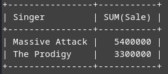
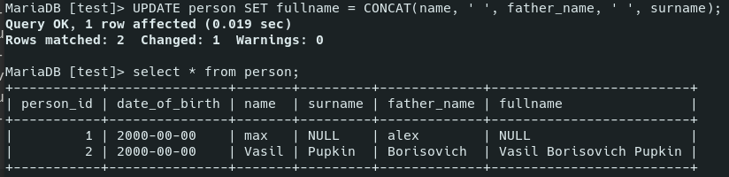

# MySQL

- [MySQL](#mysql)
	- [Sources](#sources)
	- [Installation and Running](#installation-and-running)
	- [Intro](#intro)
		- [Connections](#connections)
		- [Terms](#terms)
		- [Data Types](#data-types)
		- [Indices](#indices)
		- [Practice intro](#practice-intro)
		- [Comments](#comments)
		- [Square brackets](#square-brackets)
	- [Databases](#databases)
	- [Tables](#tables)
		- [`CREATE`](#create)
		- [`SHOW`](#show)
		- [`DESC`](#desc)
		- [`SHOW CREATE TABLE`](#show-create-table)
		- [`ALTER`](#alter)
	- [Operators](#operators)
	- [Data manipulation](#data-manipulation)
		- [Test subjects](#test-subjects)
			- [Planets](#planets)
			- [Planets2](#planets2)
			- [Artists](#artists)
		- [`INSERT`](#insert)
		- [`SELECT`, `FROM`](#select-from)
		- [`DISTINCT`](#distinct)
		- [`AS`](#as)
		- [`WHERE`](#where)
		- [`GROUP BY`](#group-by)
		- [`HAVING`](#having)
		- [`LIMIT`](#limit)
		- [`ORDER BY`](#order-by)
		- [`UPDATE`](#update)
		- [`DROP`, `DELETE`, `TRUNCATE`](#drop-delete-truncate)
		- [`VIEW`](#view)
	- [Attributes, Keys](#attributes-keys)
		- [`PRIMARY KEY`](#primary-key)
		- [`AUTO_INCREMENT`](#auto_increment)
		- [`UNIQUE`](#unique)
		- [`NOT NULL`](#not-null)
		- [`DEFAULT`](#default)
		- [`CHECK`](#check)
		- [`CONSTRAINT`](#constraint)
		- [`FOREIGN KEY`](#foreign-key)
		- [`JOIN`](#join)
		- [`UNION`](#union)
			- [Tables conjunction example](#tables-conjunction-example)
	- [Subqueries](#subqueries)
		- [Correlated subqueries](#correlated-subqueries)
		- [Examples](#examples)
	- [Functions](#functions)
		- [Aggregate functions](#aggregate-functions)
			- [`COUNT ()`](#count-)
			- [`AVG ()`](#avg-)
			- [`SUM ()`](#sum-)
			- [`MIN ()`, `MAX ()`](#min--max-)
		- [String](#string)
			- [`CONCAT (str1, str2, ...)`](#concat-str1-str2-)
			- [`CONCAT_WS (divider, str1, str2, ...)`](#concat_ws-divider-str1-str2-)
			- [`LENGTH (str)`](#length-str)
			- [`TRIM (str)`](#trim-str)
			- [`LTRIM (str)`](#ltrim-str)
			- [`RTRIM (str)`](#rtrim-str)
			- [`LOCATE (substr, str [, start])`](#locate-substr-str--start)
			- [`LEFT (str, length)`](#left-str-length)
			- [`RIGHT (str, length)`](#right-str-length)
			- [`SUBSTRING (str, start[, length])`](#substring-str-start-length)
			- [`SUBSTRING_INDEX (str, delimiter, count)`](#substring_index-str-delimiter-count)
			- [`REPLACE (str, replaced, replacement)`](#replace-str-replaced-replacement)
			- [`INSERT (str, start, length, insertion)`](#insert-str-start-length-insertion)
			- [`REVERSE (str)`](#reverse-str)
			- [`LOWER (str)`](#lower-str)
			- [`UPPER (str)`](#upper-str)
			- [`SPACE (number)`](#space-number)
			- [`REPEATE (str, count)`](#repeate-str-count)
			- [`LPAD (str, length, pad)`](#lpad-str-length-pad)
			- [`RPAD (str, length, pad)`](#rpad-str-length-pad)
		- [Number](#number)
			- [`ROUND (n, lengthFromPoint)`](#round-n-lengthfrompoint)
			- [`FLOOR`](#floor)
			- [`CEILING`](#ceiling)
			- [`TRUNCATE (n)`](#truncate-n)
			- [`ABS (n)`](#abs-n)
			- [`POWER (n, p)`](#power-n-p)
			- [`SQRT`](#sqrt)
			- [`SIGN (n)`](#sign-n)
			- [`RAND()`](#rand)
		- [Date and Time](#date-and-time)
			- [`NOW ()`](#now-)
			- [`CURDATE ()` | `CURRENT_DATE ()`](#curdate---current_date-)
			- [`CURTIME ()` | `CURRENT_TIME ()`](#curtime---current_time-)
			- [`UTC_DATE ()`](#utc_date-)
			- [`UTC_TIME ()`](#utc_time-)
			- [`DAYOFMONTH (date)`](#dayofmonth-date)
			- [`DAYOFWEEK (date)`](#dayofweek-date)
			- [`DAYOFYEAR (date)`](#dayofyear-date)
			- [`MONTH (date)`](#month-date)
			- [`YEAR (date)`](#year-date)
			- [`QUARTER (date)`](#quarter-date)
			- [`WEEK (date[, first])`](#week-date-first)
			- [`LAST_DAY (date)`](#last_day-date)
			- [`DAYNAME (date)`](#dayname-date)
			- [`MONTHNAME (date)`](#monthname-date)
			- [`HOUR (time)`](#hour-time)
			- [`MINUTE (time)`](#minute-time)
			- [`SECOND (TIME)`](#second-time)
			- [`EXTRACT (unit FROM datetime)`](#extract-unit-from-datetime)
			- [`DATE_ADD (date, INTERVAL expression unit)`](#date_add-date-interval-expression-unit)
			- [`DATE_SUB (date, INTERVAL expression unit)`](#date_sub-date-interval-expression-unit)
			- [`DATEDIFF (date1, date2)`](#datediff-date1-date2)
			- [`TO_DAYS (date)`](#to_days-date)
			- [`TIME_TO_SEC (time)`](#time_to_sec-time)
			- [`DATE_FORMAT (date, format)`](#date_format-date-format)
			- [`TIME_FORMAT (date, format)`](#time_format-date-format)
		- [Conditional functions](#conditional-functions)
			- [`CASE`](#case)
			- [`IF`](#if)
			- [`IFNULL`](#ifnull)
			- [`COALESCE`](#coalesce)
	- [SQL Injection](#sql-injection)
		- [Prepared statements](#prepared-statements)
	- [Normalization](#normalization)
		- [1st normal form](#1st-normal-form)
		- [2](#2)
		- [3](#3)
		- [3.5](#35)
		- [4](#4)
		- [5](#5)

***

## Sources

1. https://medium.com/@rshrc/mysql-on-manjaro-973e4bfc4f05
2. gitgod:
   1. http://gitlab.a-level.com.ua/gitgod/PHP/src/master/ER-SQL.md
   2. http://gitlab.a-level.com.ua/gitgod/PHP/src/master/SQL.md
   3. http://gitlab.a-level.com.ua/gitgod/PHP/src/master/SQLHomeWork.md
3. http://2sql.ru - nice tutorial
4. https://www.w3schools.com/sql/
5. https://dev.mysql.com/doc/refman/8.0/en/
6. https://www.sqltutorial.org
7. https://mariadb.com/kb/en/auto_increment/
8. https://www.techonthenet.com/mysql/tables/alter_table.php#:~:text=The%20syntax%20to%20drop%20a,of%20the%20table%20to%20modify.


***


## Installation and Running

Open the Terminal or MySQL Workbench and run these commands:

1. `sudo pacman -S mysql` or `sudo pacman -S mariadb`
2. Pick the 1st option if you are promped to choose.
3. `sudo systemctl start mysqld`
4. If you got an error, type this: `sudo mysql_install_db --user=mysql --basedir=/usr --datadir=/var/lib/mysql`
5. `sudo systemctl start mysqld && sudo mysql_secure_installation`
6. You will be prompted to answer a few questions about whether to delete the default database or leave it be, and some others similar. 
7. Run `mysql -u root -p`. Enter the password you've chosen during the installation. 

To run it the other day you should:

1. enable the SQL server: `sudo systemctl start mysqld`
2. enter the database: `mysql -u root -p`

***


## Intro 

MySQL is a **relational** (because data is stored in tables that are related to each other) database system. 

### Connections

- One to One (rare)
- One to Many (often): one post and many comments to it
- Many to Many: many posta and many tags

To handle "Many to Many" connection, we need an extra table.

***


### Terms

- **data value** - single value
- **record** - a **row** of data values
- **field** - a **column** of data values
- **entity** - a set of meaningful data (row, column, table, etc.)


***


### Data Types

Since databases are intent to store huge amounts of data, there are many types of data that you can use to store just the amount of data you need (and no more!).

**Numeric**

| Type                                     | Description                                                                                                                                                        | Bytes  |
| ---------------------------------------- | ------------------------------------------------------------------------------------------------------------------------------------------------------------------ | ------ |
| `TINYINT`                                | `-128` to `127`                                                                                                                                                    | 1      |
| `SMALLINT`                               | `-32768` to `32767`                                                                                                                                                | 2      |
| `MEDIUMINT`                              | `-8388608` to `8388607`                                                                                                                                            | 3      |
| `INT`                                    | `-2147483648` to `2147483647`                                                                                                                                      | 4      |
| `BIDINT`                                 | `-9223372036854775808` to `9223372036854775807`                                                                                                                    | 8      |
| `FLOAT(p)`                               | Floating point number. Effective for mathematical calculations. If precision `p` is 0-24 - the data type is 4-byte `FLOAT`, if `p` is 25-53 - 8-byte `DOUBLE`      | 4, 8   |
| `DECIMAL(digits, decimals)` == `NUMERIC` | Fixed point number, effective for calculations where the maximum precision is needed (e.g. with money). `DECIMAL(5,2)` can store values from `-999.99` to `999.99` | Varies |

Any of the described types can be **unsigned** if you add the word: `TINYINT UNSIGNED`: 

***

**Boolean**

Boolean as a type only exists in *PostgreSQL*. In MySQL or SQL Server use `BIT` or `BOOLEAN` (which is an alias for `TINYINT`) instead.

***

**String**

| Type                     | Description                                                                                                                                                                                                                             | Bytes               |
| ------------------------ | --------------------------------------------------------------------------------------------------------------------------------------------------------------------------------------------------------------------------------------- | ------------------- |
| `CHAR(size: 0-255)`      | Fixed-length string, size is the max characters stored. `CHAR(30)` stores up to 30 characters. Trailing spaces are **removed** (you write `'ab '` and retreive `'ab'`).                                                                 | size (<= 256 bytes) |
| `VARCHAR(size: 0-65535)` | Variable-length string. Can store 1- and 2-byte characters (specified by the **prefix** which takes 1 or 2 bytes). `65535` is the max length of **sum** of the all VARCHAR values in the `record`. Trailing spaces are **not** removed. | Varies              |

This is how it works in **non-strict** mode:


In **strict** mode, there will be an **error** because of the exceeding length. 

`VARCHAR` is more effective **memory-wise** but `CHAR` is more effective **speed-wise**. 

***

Text: 

| Type         | Max size   |
| ------------ | ---------- |
| `TINYTEXT`   | 255 bytes  |
| `TEXT`       | 65 kB      |
| `MEDIUMTEXT` | 16 MD	    |
| `LONGTEXT`   | 4 GB			  |

Text types are needed for storing **big** amounts of data. Also, **full-text search** is possible for these types. 

***

Date and time:

| Type          | Description                                                                            |
| ------------- | -------------------------------------------------------------------------------------- |
| `DATE`        | YYYY-MM-DD                                                                             |
| `TIME`        | HH:MM:SS                                                                               |
| `DATETIME`    | YYYY-MM-DD HH:MM:SS                                                                    |
| `TIMESTAMP`   | DATETIME that gets **automatically** filled and **updated** when the record if changed |
| `YEAR(2 or 4)` | Year in 2- or 4-digit format (use 4)                                                   |

***

Other types:

| Type   | Description |
| ------ | ----------- |
| `JSON` |

***


### Indices

Databases usually store huge amounts of data, so sorting it would be madness. Instead, it has lists of **indices** or **links** related to **records**. And these indices can be sorted easily. 

**Unsorted** search in 1000 records would take up to 1000 comparisons (computational complexity `O(n)`) to check every line. 

**Sorted** arrays of data can be searched with a **binary search** (`O(log2(n))`). We'll need 10 comparisons to find data among 1000 records, 11 - for 2000, etc.

Consider the following:

1. Indexing makes sense only for large tables with a lot of data. 
2. Updating a table with indexes takes more time than updating a table without (because the indexes also need an update). So, only create indexes on columns that will be frequently searched against.
3. Usually you'd want to index the columns that are often subjects of `WHERE`. If your queries mostly rely on ID, then indexing by ID you should.


***


### Practice intro

All expressions can be written in a **single line or in multiple lines** - doesn't matter. 

Every expression should end with a semicolon `;`

All **commands** are case-**insensitive** (`SELECT === select`). Here we gonna write them in UPPERCASE for distinction.

All **names** of the tables, fields, etc. are case-**sensitive** (`Planets !== planets`)

***

### Comments

```sql
-- Single-line

/* Multi-
line */
```

### Square brackets

You can use `[]` to wrap field names or other names that should be treated as just names, **not keywords**.

## Databases

First, we create a database and switch to it:

```sql
/* create new database */
CREATE DATABASE test;

/* show all databases */
show databases;

/* select a database to not write its name over and over */
use test;
```

***


## Tables

Information is stored in tables. 

### `CREATE`

Create a table.

```sql
CREATE TABLE Person (
	person_id INT UNSIGNED AUTO_INCREMENT PRIMARY KEY,
	username VARCHAR(64),
	surname VARCHAR(64),
	father_name VARCHAR(64)
);
```

If you want to use **special characters** in the table or the row name, you can use **backticks ``**. But it's better to avoid it. 

### `SHOW`

Show the list of your tables.

```sql
SHOW TABLES;
```

### `DESC`

Describe the structure of your table:

```sql
DESC person;
```


### `SHOW CREATE TABLE`

Show the instruction how to create such a table. 

**Be careful**: the result is **not** exactly what you need to type to create such a table. Particularly, you might need to delete **single quotes** around the table name and the field names. 

```sql
SHOW CREATE TABLE person;
```

***

### `ALTER`

Changes table or columns.

```sql
/* Add columns */

ALTER TABLE contacts
/* add after the column `contact_id` */
ADD last_name varchar(40) NOT NULL AFTER contact_id,	
/* make the 1st column */
ADD first_name varchar(35) NULL FIRST;	


/* Delete columns */

ALTER TABLE animals 
DROP COLUMN last_name, 
DROP COLUMN first_name;


/* Modify columns */

ALTER TABLE contacts
MODIFY last_name varchar(55) NULL AFTER contact_type,
MODIFY first_name varchar(30) NOT NULL;


/* Set default values */

ALTER TABLE Customers
ALTER COLUMN Age SET DEFAULT 22;


/* Add/remove PRIMARY KEY */

ALTER TABLE Products
ADD PRIMARY KEY (Id);

ALTER TABLE Products
DROP PRIMARY KEY;


/* Rename columns */

ALTER TABLE Person CHANGE COLUMN 
	name /* old name */
	firstname VARCHAR(64); /* new name and definition */
--[ FIRST | AFTER column_name ]


/* Rename a table */

ALTER TABLE table_name 
RENAME new_table_name;


/* Add index */

ALTER TABLE person 
ADD INDEX (date_of_birth);
```

***


## Operators

https://www.w3schools.com/sql/sql_operators.asp

Arithmetic|Description
-|-
`+`|Add	
`-`|Subtract	
`*`|Multiply	
`/`|Divide	
`%`|Modulo

Compound|Description
-|-
`+=`|Add equals
`-=`|Subtract equals
`*=`|Multiply equals
`/=`|Divide equals
`%=`|Modulo equals

Bitwise|Bitwise
-|-
`&`|Bitwise AND
`|`|Bitwise OR
`^`|Bitwise exclusive OR
`&=`|Bitwise AND equals
`^-=`|Bitwise exclusive equals
`|*=`|Bitwise OR equals

Comparison|Description
-|-
`=`|Equal to	
`>`|Greater than	
`<`|Less than	
`>=`|Greater than or equal to	
`<=`|Less than or equal to	
`<>` or `!=`|Not equal to

Logical|Example|Description
-|-|-
`OR`, `AND`, `NOT`|`SELECT * FROM Products WHERE Manufacturer  ='Samsung' OR NOT Price > 30000 AND ProductCount > 2;`|The priority: `NOT` > `AND` > `OR`. You can use brackets `()` to chenge it.
`ALL`|`WHERE Price > ALL (SELECT Price FROM Products WHERE Price > 500);`|TRUE if all of the subquery values meet the condition
`ANY`/`SOME` |`SELECT s1 FROM t1 WHERE s1 > ANY (SELECT s1 FROM t2);`|`ANY === SOME`
`BETWEEN`|`BETWEEN 20 AND 30`|Inclusive. 
`IN`|`IN ('Paris', 'London')`|TRUE if **in** the list of multiple possible values
`EXISTS`|See below|TRUE if the subquery returns at least 1 record. Doesn't actually return any records so it's **very effective** compared to alternatives
`LIKE`|`WHERE ProductName LIKE 'Galaxy%';`|TRUE if the operand matches a pattern. `%` means any substring from 0+ symbols, `_` means any 1 symbol. 
`REGEXP`|`WHERE ProductName REGEXP 'Phone|Galaxy'`|Similar to JS, see the docs
`IS NULL`|`WHERE ProductCount IS NOT NULL;`|Null or not null, that is the question

**Examples**

**`LIKE`, `OR`, `AND`**: find planets starting with 'N' or ending with 's' that don't have rings:

```sql
SELECT * FROM Planets WHERE (planet_name LIKE 'N%' OR planet_name LIKE '%s') AND has_rings = 0;
```


Use **`EXISTS`** to check if there's any Singer with Sale > 2 000 000. The task is pointless but aims to emphasize `EXISTS`, `ANY` and similar checks return `TRUE` or `FALSE` and nothing more.  

```sql
SELECT * FROM Artists
WHERE EXISTS (	-- The whole expression turns TRUE and basically drops any restrictions - all records will be returned
	SELECT * 
    FROM Artists 
    WHERE Sale > 2000000	-- TRUE, there's a 2300000 value
);
```

Returns all the records. The equivalent with **`ANY`**: 

```sql
SELECT * FROM Artists
WHERE 2000000 > ANY (SELECT Sale FROM Artists);	-- The whole expression turns TRUE and basically drops any restrictions
```

Use **`IN`** to check if we have the products in our list whose creator is a Chinese company. Then find all those which are **`NOT`** the Chinese ones. 

```sql
-- Initial data

CREATE TABLE Products (
	Id INT AUTO_INCREMENT PRIMARY KEY,
	ProductName VARCHAR(30) NOT NULL,
	Manufacturer VARCHAR(20) NOT NULL,
	ProductCount INT DEFAULT 0,
	Price DECIMAL NOT NULL);

CREATE TABLE Companies (
	CompanyName VARCHAR(32) PRIMARY KEY,
	Country VARCHAR(32)
);

INSERT INTO Products  (ProductName, Manufacturer, ProductCount, Price)
VALUES
	('Nokia 7.2', 'Nokia', 3, 71000),
	('iPhone 8', 'Apple', 3, 56000),
	('Redmi Note 9', 'Xiaomi', 4, 45000),
	('Galaxy S9', 'Samsung', 6, 56000),
	('Xperia', 'Sony', 2, 46000),
	('Honor 10', 'Huawei', 3, 26000);

INSERT INTO Companies 
VALUES 
	('Apple', 'US'),
	('Huawei', 'China'),
	('Nokia', 'Finland'),
	('Samsung', 'South Korea'),
	('Sony', 'Japan'),
	('Xiaomi', 'China');

-- Solution: CHinese companies

SELECT * FROM Products
WHERE Manufacturer IN (
	SELECT CompanyName FROM Companies 
	WHERE Country = 'China');

-- Solution: NOT CHinese companies

SELECT * FROM Products
WHERE Manufacturer NOT IN (
	SELECT CompanyName FROM Companies 
	WHERE Country = 'China');
```

***


## Data manipulation

### Test subjects

We gonna use several example tables. 

#### Planets

```sql
CREATE TABLE Planets (
  id SMALLINT UNSIGNED AUTO_INCREMENT,
  planet_name VARCHAR(64),
  radius MEDIUMINT UNSIGNED,
  sun_season FLOAT,
  opening_year SMALLINT,
  has_rings BOOLEAN,
  opener VARCHAR(64),
  PRIMARY KEY (id)
);

INSERT INTO Planets 
	(planet_name, radius, sun_season, opening_year, has_rings, opener) 
VALUES 
	('Mars', 3396, 687, 1659, 0, 'Christiaan Huygens'),
	('Saturn', 60268, 10759.22, NULL, 1, NULL),
	('Neptune', 24764, 60190, 1846, 1, 'John Couch Adams'),
	('Mercury', 2439, 115.88, 1631, 0, 'Nicolaus Copernicus'),
	('Venus', 6051, 243, 1610, 0, 'Galileo Galilei');
```

#### Planets2

```sql
CREATE TABLE Planets2 (
  id SMALLINT UNSIGNED AUTO_INCREMENT,
  planet_name VARCHAR(64),
  radius MEDIUMINT UNSIGNED,
  sun_season FLOAT,
  opening_year SMALLINT,
  has_rings BOOLEAN,
  opener VARCHAR(64),
  PRIMARY KEY (id)
);

INSERT INTO Planets2
	(planet_name, radius, sun_season, opening_year, has_rings, opener) 
VALUES 
	('Jupiter', 69911, 4380, 1610, 1, 'Galileo Galilei'),
	('Uranus', 25362, 30660, 1750, 1, NULL);
	
```

#### Artists

```sql
CREATE TABLE Artists ( 
	Singer VARCHAR(64), 
	Album VARCHAR(64), 
	Year SMALLINT, 
	Sale INT UNSIGNED);

INSERT INTO Artists 
	(Singer, Album, Year, Sale)
VALUES 
	('The Prodigy', 'Invaders Must Die', 2008, 1200000),
	('Drowning Pool', 'Sinner', 2001, 400000), 
	('Massive Attack', 'Mezzanine', 1998, 2300000), 
	('The Prodigy', 'Fat of the Land', 1997, 600000), 
	('The Prodigy', 'Music For The Jilted Generation', 1994, 1500000), 
	('Massive Attack', '100th Window', 2003, 1200000), 
	('Drowning Pool', 'Full Circle', 2007, 800000), 
	('Massive Attack', 'Danny The Dog', 2004, 1900000),('Drowning Pool', 'Resilience', 2013, 500000);
```

### `INSERT`

Insert data to a table. `INSERT INTO == INSERT`

```sql
/* Insert one or multiple values */

INSERT INTO targetTable 
	(firstname, surname) 
VALUES 
	('max', 'bar'),
	('vlad', 'kravich'),
	('alina', 'nosova')
FROM sourceTable;

	
/* Clearer way of inserting one value */

INSERT INTO targetTable
SET 
	date_of_birth = '1999-05-25', 
	firstname = 'Vasil', 
	surname = 'Pupkin', 
	father_name = 'Borisovich';
FROM sourceTable;
```

Don't touch the **autoincrement** field - it will grow by itself. The rest of the missed fields (`data_of_birth` and `surname` here) will be filled with default values (that can be set upon the table creation).

***


### `SELECT`, `FROM`

Your main tool for getting data from tables. 

`SELECT` and `FROM` are mandatory, the rest are optional.

```sql
SELECT
	<field1>
	<field2>
	<field3>
	...
FROM
	<table1>
	<table2>
	<table3>
	...		
GROUP BY
	<expression>
WHERE
	<cond>
ORDER BY
	<field1> ASC
	<field2> DESC
LIMIT
	N,M
```

Examples:

```sql
-- Show all records
SELECT * FROM Person;

-- Show the selected fields
SELECT id, username FROM Person;

-- Show the generated value
SELECT 
	ProductName, 
	Price * ProductCount AS TotalSum 
FROM Products; 
```

***

### `DISTINCT`

Used after `SELECT` to return only unique values. 

Inside a table, a column often contains many duplicate values; and sometimes you only want to list the different (distinct) values.

Example: get the list of singers (without repeats). 

Doesn't work right from the start:

```sql
SELECT Singer FROM Artists;
```


But works right With `DISTINCT`:

```sql
SELECT DISTINCT Singer FROM Artists;
```


Now get the number of Singers:

```sql
SELECT COUNT(DISTINCT Singer) FROM Artists;
```


***

There are actually more than one way to solve this task. Here's another solution:

```sql
SELECT Singer FROM Artists GROUP BY Singer;
```


(?) For some reason, the order of resulting records is different.

***

### `AS`

Aliases are used to give a table, or a column in a table, a temporary name, like a variable.

An alias only exists for the duration of the query.

You may apply it to any columns in your search results you need.

Without alias:

```sql
SELECT planet_name, opener FROM Planets;
```


With alias:

```sql
SELECT planet_name AS Planet, opener FROM Planets;
```


Complex alias **combined** of 3 fields: 

```sql
SELECT 
	CustomerName, 
	Address + ', ' + PostalCode + ' ' + City + ', ' + Country AS Address
FROM Customers;
```


***

### `WHERE`

Basically `if`. 

Text values mush be enclosed in single quotes `''`, numeric values must **not** be enclosed in quotes.

```sql
UPDATE Planets 
SET has_rings = 0 
WHERE planet_name IN ('Mars', 'Mercury' 'Venus');
```

***

### `GROUP BY`

Group by a column or several columns.

```sql
SELECT Singer, SUM(Sale) AS AllSales 
FROM Artists 
GROUP BY Singer;
```


***

### `HAVING`

Used after `GROUP BY` and works as `WHERE`. 

Example 1: find Singers who's total number os sales is > 2 000 000

```sql
SELECT Singer, SUM(Sale)
FROM Artists
GROUP BY Singer
	HAVING SUM(Sale) > 2000000;
```



Example 2: find Singers who had albums prior to 1995

```sql
SELECT Singer, MIN(Year) /* not `Year` but `MIN(Year)` ! */
FROM Artists 
GROUP BY Singer 
	HAVING MIN(Year) < 1995;
```

***

### `LIMIT`

Limits the number of used records. You can use it if you're unsure of your changes.

```sql
-- Get only the first 2 matches
SELECT * FROM Planets LIMIT 2;

-- Update just 1 record
UPDATE person 
SET date_of_birth = '1000-00-00' 
WHERE person_id > 0 LIMIT 1;
```

`LIMIT` can actually take 2 parameters: 

- offset = 0 by default - how many matches to skip from the start
- rowcount - this is the mandatory param we always use

Usually you would want to use it with `ORDER BY` - to get some specific part of sorted data.

```sql
-- Get the matches 3 and 4
SELECT * FROM Planets LIMIT 2, 2; 
```


***

### `ORDER BY`

Sort data. Can be `ASC` and `DESC`. 

Can be performed by several fields, in this case it sorts by the first field, then by the second (without breaking the first one), etc.

```sql
SELECT * FROM Planets 
ORDER BY 
	has_rings DESC, 
	radius ASC;
```

You can reference aliases:

```sql
SELECT planet_name AS Planets FROM Planets
ORDER BY
	Planets ASC;
```

***


### `UPDATE`

Update records. Don't use without `WHERE` or `LIMIT` or you will lose your data!

```sql
/* Update all records !!! */

UPDATE person 
SET date_of_birth = '2000-00-00';


/* Update records that meet the condition */

UPDATE person 
SET date_of_birth = '1999-05-25' 
WHERE person_id = 2;


/* Update a column */

UPDATE person 
SET fullname = CONCAT(name, ' ', father_name, ' ', surname);
```



***

### `DROP`, `DELETE`, `TRUNCATE`

Delete data in one way or another.

Don't use without `WHERE` or `LIMIT` or you will lose your data!

```sql
/* Delete the matching data */
DELETE FROM person WHERE person_id < 2;

/* Delete all the data */
TRUNCATE TABLE Persons;

/* Delete the table */
DROP TABLE test;
```

***

### `VIEW`

A virtual table based on the results of the query. 

A view contains rows and columns. The fields in a view are fields from one or more real tables.

A view always shows **up-to-date** data. The database engine recreates the data, using the view's SQL statement, every time a user queries a view.

Template:

```sql
CREATE VIEW view_name AS
SELECT column1, column2, ...
FROM table_name
WHERE condition;
```

Example: create a view for **ringed** planets only.

```sql
CREATE VIEW RingedPlanets AS 
	SELECT planet_name, radius
	FROM Planets
	WHERE has_rings = 1; 

SELECT * FROM RingedPlanets;
```


On no! We forgot the ringed planets from `Planets2`! Let's **update** our view using `CREATE OR REPLACE VIEW`:

```sql
CREATE OR REPLACE VIEW RingedPlanets AS 
	SELECT planet_name, radius
	FROM Planets
	WHERE has_rings = 1 
UNION
	SELECT planet_name, radius
	FROM Planets2
	WHERE has_rings = 1 ; 

SELECT * FROM RingedPlanets;
```


Use `DROP VIEW RingedPlanets;` to delete the view.

Generally, don't uveruse view as they are brittle and temporal.

***


## Attributes, Keys

### `PRIMARY KEY`

Serves as a unique identifier of each record in the table. 

**Natural** PK represents some real-world data (e.g. user passport or some unique ID) while **surrogate** PK is just a generated key that doesn't mean anything outside the DB.

It's always `UNIQUE` and `NOT NULL`.

There're 2 ways of setting it: right near the field and later.

```sql
-- 1
CREATE TABLE Customers (
  UserID INT PRIMARY KEY,
	Age INT 
);

-- 2
CREATE TABLE Customers (
  Id INT,
	Age INT,
	PRIMARY KEY(Id)
);
```

It can be **composite** and use several fields to identify the record. The following table can't have records with the same 'OrderId' and 'ProductId' values pair:

```sql
CREATE TABLE OrderLines (
	OrderId INT,
	ProductId INT,
	Quantity INT,
	Price DECIMAL,
	PRIMARY KEY(OrderId, ProductId)
);

-- OrderId = 33, ProductId = 42 -> OK
INSERT INTO OrderLines 
VALUES (33, 42, 1, 100);

-- `OrderId` = 33, different ProductId -> OK
INSERT INTO OrderLines 
VALUES (33, 64, 1, 125);

-- Again OrderId = 33, ProductId = 42 -> FAIL
INSERT INTO OrderLines 
VALUES (33, 42, 1, 125);
```

***

### `AUTO_INCREMENT`

Automatically **increments** the value of the new inserted records. 

Works only for **numeric types**. 

It must be some kind of a **key** (`PRIMARY KEY`, `UNIQUE`, etc.)

Each table can only have **one** `AUTO_INCREMENT` column. 

You **don't need** to set the value of the *auto increment* field when isert a new record into the table, it will be added automatically.

```sql
CREATE TABLE animals (
	ID INT PRIMARY KEY AUTO_INCREMENT,
	petName CHAR(30)
 );

INSERT INTO animals (petName) 
VALUES
	('dog'),('cat'),('penguin'),
	('fox'),('whale'),('ostrich');

SELECT * FROM animals;
```


***

### `UNIQUE`

Indicates that the field can only store unique values. 

Any number of fields can be `UNIQUE`.

```sql
-- 1st way
CREATE TABLE Customers (
	ID INT PRIMARY KEY AUTO_INCREMENT,
	Phone VARCHAR(20) UNIQUE
);

-- 2nd way
CREATE TABLE Customers (
	ID INT,
	Phone VARCHAR(20),
	UNIQUE(ID, Phone)
);
```

***

### `NOT NULL`

By default, fields will allow `NULL` values if no data was provided. 

We can set some fields to `NOT NULL`. This way you won't be able to insert new records skipping these values. 

`PRIMARY KEY` is always `NOT NULL`. 

```sql
CREATE TABLE Customers
(
    Id INT PRIMARY KEY AUTO_INCREMENT,
    Age INT,	-- NULL
    FirstName VARCHAR(20) NOT NULL,	-- NOT NULL
    LastName VARCHAR(20) NOT NULL,	-- NOT NULL
    Email VARCHAR(30) NULL,		-- NULL
    Phone VARCHAR(20) NULL		-- NULL
);

INSERT INTO Customers 
SET FirstName = 'Max', Email = 'max@bar.com';
```

We couldn't insert a new record:


***

### `DEFAULT`

Sets default values for new records. 

```sql
CREATE TABLE Customers (
	FirstName VARCHAR(20),
	Age INT DEFAULT 18
);

INSERT INTO Customers 
SET FirstName = 'max';

SELECT * FROM Customers;
```


***

### `CHECK`

Sets a restriction for the possible values range.

```sql
CREATE TABLE Customers (
	firstName VARCHAR(20),
	Age INT DEFAULT 18 CHECK(Age > 0 AND Age < 100)
);

INSERT INTO Customers
SET Age = 121;	-- Error!
```


As usual, the 2nd way of using it is at the end:

```sql
( 
	-- ...
	CHECK((Age > 0 AND Age < 100) AND (Email !='') AND (Phone !=''))
);
```

***

### `CONSTRAINT`

Using it, we can set names for our constraints. We can use them to delete or change these restrictions later.

```sql
CREATE TABLE Customers (
	Id INT AUTO_INCREMENT,
	Age INT,
	FirstName VARCHAR(20) NOT NULL,
	LastName VARCHAR(20) NOT NULL,
	Email VARCHAR(30),
	Phone VARCHAR(20) NOT NULL,
	CONSTRAINT customers_pk PRIMARY KEY(Id),
	CONSTRAINT customer_phone_uq UNIQUE(Phone),
	CONSTRAINT customer_age_chk CHECK(Age > 0 AND Age < 100)
);

-- Success
INSERT INTO Customers 
SET 
	FirstName = 'max', 
	LastName = 'bar', 
	Phone = 3805984723;

-- Fail
INSERT INTO Customers 
SET 
	FirstName = 'max', 
	LastName = 'bar', 
	Phone = 3805984723, 
	Age = 121;
```

***


### `FOREIGN KEY`

Establishes connections between tables and prevents invalid data insertion into the `FOREIGN KEY` column (it has to be one of the values contained in the referenced/parent table). 

`FOREIGN KEY` is set in the **child** table and refers to the `PRIMARY KEY` of the **parent** table.  

The tables are connected through their **constraints**:

- you **can't** update/delete the parent table if it breaks the link between the tables
- you **can't** insert a value into the child table that refers to a non-existent value in the parent table

***

`ON DELETE` and `ON UPDATE` directives set up actions to perform when the connected column from the parent table is changed or deleted:

- `CASCADE` - automatically change or delete records from the child table right after the parent table
- `SET NULL` - self-explainatory (the field should allow NULL)
- `RESTRICT` - rejects deleting or changing records in the parent table if they are referred in the child table
- `NO ACTION` - the same
- `SET DEFAULT` - sets the default value for the current column

***

Example:

```sql
-- Create the parent and the child table

CREATE TABLE Customers (
	Id INT PRIMARY KEY AUTO_INCREMENT,
	FirstName VARCHAR(20) NOT NULL,
	Phone VARCHAR(20) NOT NULL UNIQUE
);

CREATE TABLE Orders (
	Id INT PRIMARY KEY AUTO_INCREMENT,
	CustomerId INT,
	CreatedAt Date,
	CONSTRAINT FK_CustomerOrder FOREIGN KEY (CustomerId) REFERENCES Customers (Id) 
	ON UPDATE CASCADE ON DELETE SET NULL
);

-- Fill the tables with data:

INSERT INTO Customers 
	(FirstName, Phone)
VALUES 
	('petya', 3805984723),
	('masha', 3805857301);

INSERT INTO Orders 
	(CustomerId, CreatedAt)
VALUES 
	(2, NOW()),
	(2, NOW()),
	(1, NOW());

-- See the results

SELECT * FROM Customers;
SELECT * FROM Orders;

-- Error - no CustomerId = 3 in the parent table yet

INSERT INTO Orders 
	(CustomerId, CreatedAt)
VALUES 
	(3, NOW());
```

That's what we have now:


Now let's delete and update the referred records from the **parent** table:

```sql
-- Update one parent record

UPDATE Customers 
SET Id = 42
WHERE Id = 2;

-- Delete another parent record

DELETE FROM Customers 
WHERE Id = 1;

-- See the results

SELECT * FROM Customers;
SELECT * FROM Orders;
```


***

To add `FOREIGN KEY` afther the table is already created:

```sql
ALTER TABLE Orders
ADD 
	CONSTRAINT FK_CustomerOrder	/* optional */
	FOREIGN KEY (CustomerId) REFERENCES Customers(Id)
	ON MODIFY RESTRICT;
```

To drop it:

```sql
ALTER TABLE Orders
DROP FOREIGN KEY FK_CustomerOrder;
```

To change it, just drop + add.

***


### `JOIN`

Combine rows from two or more tables into a new table, based on a related column between them:

- `(INNER) JOIN`: Returns only the records that have matching values in both tables
- `LEFT JOIN`: Full left table + INNER JOIN
- `RIGHT JOIN`: INNER JOIN + full right table
- `FULL JOIN`: Returns all records from both tables (might not work)


It's preferable to use the `ON` alias instead of `WHERE` as a **join condition** - for the code clarity.

Use the `MyTable.field1` notation to refer to the field of the specific table.

`JOIN` template:

```sql
SELECT column_name(s)
FROM table1 JOIN table2
ON table1.column_name = table2.column_name
WHERE condition;
```

***

**INNER JOIN Example.** There are two tables: 

- the list of my neighbors
- the list of students

Task: find who of my neighbors is a student and their year of the institute (the right answer is 'Petya': 3).

Initial data:

```sql
CREATE TABLE Neighbors (
  name VARCHAR(64) PRIMARY KEY,
	age TINYINT UNSIGNED);

INSERT INTO Neighbors
VALUES 
	('Petya', 20),
	('Marina', 25);

CREATE TABLE Students (
	name VARCHAR(64) PRIMARY KEY,
	study_year TINYINT UNSIGNED);

INSERT INTO Students
VALUES 
	('Anya', 2),
	('Petya', 3);
```

Solution:

```sql
SELECT * FROM Neighbors 
INNER JOIN Students 
ON Neighbors.firstname = Students.firstname;
```


Let's prettify the results:

```sql
SELECT Neighbors.firstname AS Person, Students.study_year AS 'Study Year' 
FROM Neighbors INNER JOIN Students 
ON Neighbors.firstname = Students.firstname;
```


***

**LEFT JOIN Example.** There are two tables: 

- with authors
- with books (BookID is a `FOREIGN KEY` referring to the Authors table)

Find what books those authors has written. 

We use `LEFT JOIN` because we care about our **authors** more than about our books. We get all the **authors** info and try our best to find the related data from other tables, if nothing is found - fill the gaps with `NULL`. 

Initial data:

```sql
CREATE TABLE Authors (
	AuthorID INT UNSIGNED, 
	AuthorName VARCHAR(64));

INSERT INTO Authors 
VALUES
	(1, 'Bruce Eckel'),
	(2, 'Robert Lafore'),
	(3, 'Andrew Tanenbaum');

CREATE TABLE Books (
	BookID INT UNSIGNED,
	BookName VARCHAR(64));

INSERT INTO Books
VALUES
	(3, 'Modern Operating System'),
	(1, 'Thinking in Java'),
	(3, 'Computer Architecture'),
	(4, 'Programming in Scala');
```

Solution:

```sql
SELECT * 
FROM Authors LEFT JOIN Books
ON Authors.AuthorID = Books.BookID;
```


***

**RIGHT JOIN Example.** The same as the previous one but find the authors of all books.

```sql
SELECT * 
FROM Authors RIGHT JOIN Books 
ON Authors.AuthorID = Books.BookID;
```


As we can just swap our tables in the query, you can see that `LEFT JOIN` and `RIGHT JOIN` are pretty much the same: 

```sql
SELECT * 
FROM Books LEFT JOIN Authors 
ON Authors.AuthorID = Books.BookID;
```


***


### `UNION`

Unites 2 or more `SELECT` queries **vertically**, one on top of another. 

Each `SELECT` should have the same number and type of data. 

Repeating values **collapse** into one. 

```sql
CREATE TABLE Customers(
	Id INT AUTO_INCREMENT PRIMARY KEY,
	FirstName VARCHAR(20) NOT NULL,
	LastName VARCHAR(20) NOT NULL,
	AccountSum DECIMAL
);
CREATE TABLE Employees(
	Id INT AUTO_INCREMENT PRIMARY KEY,
	FirstName VARCHAR(20) NOT NULL,
	LastName VARCHAR(20) NOT NULL
);
  
INSERT INTO Customers(FirstName, LastName, AccountSum) 
VALUES
	('Tom', 'Smith', 2000),
	('Sam', 'Brown', 3000),
	('Mark', 'Adams', 2500),
	('Paul', 'Ins', 4200),
	('John', 'Smith', 2800),
	('Tim', 'Cook', 2800);
  
INSERT INTO Employees(FirstName, LastName)
VALUES
	('Homer', 'Simpson'),
	('Tom', 'Smith'),
	('Mark', 'Adams'),
	('Nick', 'Svensson');
```

We have 6 customers and 4 employees, 2 of them overlap.

```sql
SELECT FirstName, LastName 
FROM Customers
UNION SELECT FirstName, LastName FROM Employees;
```

We get 8 records of the same pattern from 2 tables:


We can also use it to extract data from one table but with different parameters. Here we'll add 10% of the AccountSum if < 3000 and 30% if > 3000.

```sql
SELECT FirstName, LastName, AccountSum + AccountSum * 0.1 AS TotalSum 
FROM Customers WHERE AccountSum < 3000
UNION SELECT FirstName, LastName, AccountSum + AccountSum * 0.3 AS TotalSum 
FROM Customers WHERE AccountSum >= 3000;
```


We basically took the same list of names but applied different rules for them. 

***


#### Tables conjunction example

We have 3 tables:

- Products
- Customers
- Orders (which is connected to the previous 2 by `FOREIGN KEY`)

```sql
CREATE TABLE Products(
	Id INT AUTO_INCREMENT PRIMARY KEY,
	ProductName VARCHAR(30) NOT NULL,
	Manufacturer VARCHAR(20) NOT NULL,
	ProductCount INT DEFAULT 0,
	Price DECIMAL NOT NULL
);

CREATE TABLE Customers(
	Id INT AUTO_INCREMENT PRIMARY KEY,
	FirstName VARCHAR(30) NOT NULL
);

CREATE TABLE Orders(
	Id INT AUTO_INCREMENT PRIMARY KEY,
	ProductId INT NOT NULL,
	CustomerId INT NOT NULL,
	CreatedAt DATE NOT NULL,
	ProductCount INT DEFAULT 1,
	Price DECIMAL NOT NULL,
	FOREIGN KEY (ProductId) REFERENCES Products(Id) ON DELETE CASCADE,
	FOREIGN KEY (CustomerId) REFERENCES Customers(Id) ON DELETE CASCADE
);
```

Insert data:

```sql
INSERT INTO Products (ProductName, Manufacturer, ProductCount, Price)
VALUES 
	('iPhone X', 'Apple', 2, 76000),
	('iPhone 8', 'Apple', 2, 51000),
	('iPhone 7', 'Apple', 5, 42000),
	('Galaxy S9', 'Samsung', 2, 56000),
	('Galaxy S8', 'Samsung', 1, 46000),
	('Honor 10', 'Huawei', 2, 26000),
	('Nokia 8', 'HMD Global', 6, 38000);
 
INSERT INTO Customers(FirstName) 
VALUES ('Tom'), ('Bob'), ('Sam');
 
INSERT INTO Orders (ProductId, CustomerId, CreatedAt, ProductCount, Price)
VALUES
( 
	(SELECT Id FROM Products WHERE ProductName='Galaxy S8'),
	(SELECT Id FROM Customers WHERE FirstName='Tom'),
	'2018-05-21', 
	2, 
	(SELECT Price FROM Products WHERE ProductName='Galaxy S8')
),
( 
	(SELECT Id FROM Products WHERE ProductName='iPhone X'),
	(SELECT Id FROM Customers WHERE FirstName='Tom'),
	'2018-05-23',  
	1, 
	(SELECT Price FROM Products WHERE ProductName='iPhone X')
),
( 
	(SELECT Id FROM Products WHERE ProductName='iPhone X'),
	(SELECT Id FROM Customers WHERE FirstName='Bob'),
	'2018-05-21',  
	1, 
	(SELECT Price FROM Products WHERE ProductName='iPhone X')
);
```

Let's compound data from all the tables into one result. 

To compound data from **2 tables**, you need **at least 1 condition**. 

To compound data from **3 tables**, you need **at least 2 conditions** to connect them. 

```sql
SELECT Customers.FirstName, Products.ProductName, Orders.CreatedAt
FROM Customers, Products, Orders
WHERE Orders.CustomerId = Customers.Id AND Orders.ProductId = Products.Id;
```

The main table here is **Orders**, from which we take our orders info and then connect the **client data** (name) and the **product data** (product name). 

We can also use **aliases** to shorten the code:

```sql
SELECT C.FirstName, P.ProductName, O.CreatedAt
FROM Customers AS C, Products AS P, Orders AS O
WHERE O.CustomerId = C.Id AND O.ProductId = P.Id;
```


The same task using `JOIN`. Thanks to the fact that we basically created the new table, we can apply more filters to it:

```sql
SELECT Customers.FirstName, Products.ProductName, Orders.CreatedAt 
FROM Orders
JOIN Products ON Products.Id = Orders.ProductId
JOIN Customers ON Customers.Id=Orders.CustomerId
WHERE Products.Price > 55000
ORDER BY Customers.FirstName;
```

This was the simplest case with 1 order for 1 customer. In reality we would want to have multiple orders for any user. In this case we'll need some additional tables (e.g. a table for a specific user's orders or a table with Orders.Id and Products.Id).

***


## Subqueries

Subqueries are queries inserted into another queries. 

Example: find goods which price is above average:

```sql
SELECT * FROM Products
WHERE Price > (SELECT AVG(Price) FROM Products);
```

Subqueries to another table: 

```sql
CREATE TABLE Products(
    Id INT AUTO_INCREMENT PRIMARY KEY,
    ProductName VARCHAR(30) NOT NULL,
    Manufacturer VARCHAR(20) NOT NULL,
    ProductCount INT DEFAULT 0,
    Price DECIMAL NOT NULL
);
CREATE TABLE Orders(
    Id INT AUTO_INCREMENT PRIMARY KEY,
    ProductId INT NOT NULL,
    ProductCount INT DEFAULT 1,
    CreatedAt DATE NOT NULL,
    Price DECIMAL NOT NULL,
    FOREIGN KEY (ProductId) REFERENCES Products(Id) ON DELETE CASCADE
);

INSERT INTO Products (ProductName, Manufacturer, ProductCount, Price)
VALUES ('iPhone X', 'Apple', 2, 76000),
('iPhone 8', 'Apple', 2, 51000),
('iPhone 7', 'Apple', 5, 42000),
('Galaxy S9', 'Samsung', 2, 56000),
('Galaxy S8', 'Samsung', 1, 46000),
('Honor 10', 'Huawei', 2, 26000),
('Nokia 8', 'HMD Global', 6, 38000);
 
INSERT INTO Orders (ProductId, CreatedAt, ProductCount, Price)
VALUES
( 
    (SELECT Id FROM Products WHERE ProductName='Galaxy S8'),
    '2018-05-21', 
    2, 
    (SELECT Price FROM Products WHERE ProductName='Galaxy S8')
),
( 
    (SELECT Id FROM Products WHERE ProductName='iPhone X'),
    '2018-05-23',  
    1, 
    (SELECT Price FROM Products WHERE ProductName='iPhone X')
),
( 
    (SELECT Id FROM Products WHERE ProductName='iPhone 8'),
    '2018-05-21',  
    1, 
    (SELECT Price FROM Products WHERE ProductName='iPhone 8')
);
```

### Correlated subqueries

In the examples above all subqueries were static. But they can be **dynamic** whose results depend on the fields selected in the main query.

```sql
SELECT  CreatedAt, Price, 
	-- Find the product name by comparing its ID in the Orders and Products tables
	(SELECT ProductName FROM Products 
	WHERE Products.Id = Orders.ProductId) AS Product
FROM Orders;
```

**Example**: find products for each manufacturer whose price is above average for the same manufacturer. 

To solve this task, let's make it step by step:

1. Select all products along with their corresponding data:

```sql
SELECT ProductName, Manufacturer, Price FROM Products;
```


2. Now let's add the average product price

```sql
SELECT 
	ProductName,
	Manufacturer,
	Price,
	(SELECT AVG(Price) FROM Products) AS AvgPrice
FROM Products;
```


3. Instead of the average price of all products, let's make average prices for each specific manufacturer. For that, we should appoint our query to a variable and refer to it on each iteration to get its manufacturer name and calculate the average value for him:

```sql
SELECT 
	ProductName,
	Manufacturer,
	Price,
	(SELECT AVG(Price) FROM Products AS SubProds
  WHERE SubProds.Manufacturer = Prods.Manufacturer) AS AvgPrice
FROM Products AS Prods;
```


How does the suggested subquery work? Let's try its simplified version:

```sql
SELECT AVG(Price) FROM Products AS SubProds
WHERE SubProds.Manufacturer = 'Apple';
```


We can see that 

4. The last thing: from the already created query select only those items with `Price` > `AvgPrice`.

```sql
SELECT
	ProductName,
	Manufacturer,
	Price,
	(SELECT AVG(Price) FROM Products AS SubProds
  WHERE SubProds.Manufacturer = Prods.Manufacturer) AS AvgPrice
FROM Products AS Prods
WHERE Prods.Price > (
	SELECT AVG(Price) FROM Products AS SubProds
  WHERE SubProds.Manufacturer = Prods.Manufacturer);
```


***

### Examples

1. Find all goods from `Products` that are present in the `Orders`:

```sql
SELECT * FROM Products
WHERE Id IN (SELECT ProductId FROM Orders);
```

2. Find all goods with prices lower than of any Apple product:

```sql
-- 1: ALL
SELECT * FROM Products
WHERE Price < ALL (
	SELECT Price FROM Products 
	WHERE Manufacturer = 'Apple'
);

-- 2: MIN
SELECT * FROM Products
WHERE Price < (
	SELECT MIN(Price) FROM Products 
	WHERE Manufacturer = 'Apple'
);
```

***


## Functions

**NB!** Further you'll see functions in the headers with a space before brackets (e.g. `AVG (date)`) - this is **for clarity only!** In practice you should always use them **without a space** (e.g. `AVG(date)`) as in all the examples.

***

### Aggregate functions

Functions that return a **single** value after processing multiple records.

Remember that all these functions return **a single value**. If you want multiple values, you should use subqueries:

```sql
-- A single value
SELECT ProductName, Manufacturer, AVG(Price) FROM Products;
```


```sql
-- Multiple values
SELECT 
	ProductName, 
	Manufacturer, 
	(SELECT AVG(Price) FROM Products) AS Average
FROM Products;
```


See `AVG()` forther for more advanced example.

***

#### `COUNT ()`

The number of rows that matches a specified criterion

```sql
SELECT COUNT(Album) FROM Artists;
```


You might want to use `DISTINCT` to only count the number of unique entries. This is also true for the latter functions.

```sql
SELECT COUNT(DISTINCT Singer) FROM Artists;	-- 3
```

***

#### `AVG ()`

The average value of a numeric column

```sql
SELECT 
	AVG(Sale) AS 'Average Sales' 
FROM Artists 
WHERE Singer = 'Drowning Pool';
```


Find the average price of goods for each manufacturer:

```sql
SELECT DISTINCT
	Manufacturer, 
	(
		SELECT AVG(Price) 
		FROM Products AS AvPrice
    	WHERE AvPrice.Manufacturer = ManufQuery.Manufacturer
	) AS Average
FROM Products AS ManufQuery;
```


***

#### `SUM ()`

The sum of a numeric column

```sql
SELECT Singer, SUM(Sale) AS AllSales 
FROM Artists 
GROUP BY Singer;
```


***

#### `MIN ()`, `MAX ()`

The smallest and the largest value of the column

```sql
SELECT MIN(Sale) from Artists;
```


```sql
SELECT MAX(Sale) from Artists 
```

***

**All in one example**:

```sql
SELECT 
	COUNT(*) AS ProdCount,
	SUM(ProductCount) AS TotalCount,
	MIN(Price) AS MinPrice,
	MAX(Price) AS MaxPrice,
	AVG(Price) AS AvgPrice
FROM Products;
```


***

### String

https://metanit.com/sql/mysql/6.1.php

#### `CONCAT (str1, str2, ...)` 
#### `CONCAT_WS (divider, str1, str2, ...)`

`CONCAT` concats strings. **Numbers** and **dates** can be passed as well - they will be converted to strings automatically.

```sql
SELECT CONCAT('Tom Smith, ', 20, 'y.o. ', NOW());
```


`CONCAT_WS` is only different in that it accepts a divider as the 1st param to 

```sql
SELECT CONCAT_WS(', ', 'Tom Smith', 20, 'y.o.', NOW());
```

A little ugly result, here we'd want to use vanilla `CONCAT` instead:


***

#### `LENGTH (str)`

```sql
SELECT LENGTH(' Tom ');  -- 5
```

***

#### `TRIM (str)`
#### `LTRIM (str)`
#### `RTRIM (str)`

Deletes spaces at the beginning, at the end ot both.

```sql
SELECT LENGTH(TRIM(' Tom '));  -- now it's 3
```

***

#### `LOCATE (substr, str [, start])`

Basically `indesOf()`

***

#### `LEFT (str, length)` 
#### `RIGHT (str, length)`

Returns `length` symbols from the beginning or the end of the string.

```sql
SELECT LEFT('Apple', 3); -- App
```

Make abbreviations:

```sql
SELECT UPPER(LEFT(Manufacturer,2)) AS Abbr,
	CONCAT(ProductName, ' - ',  Manufacturer) AS FullProdName
FROM Products
ORDER BY Abbr;
```


***

#### `SUBSTRING (str, start[, length])`

Returns a substring starting with a position. 

```sql
SELECT SUBSTRING('Galaxy S8 Plus', 8),          -- S8 Plus
(SELECT SUBSTRING('Galaxy S8 Plus', 8, 2) );    -- S8
```

***

#### `SUBSTRING_INDEX (str, delimiter, count)`

Returns a substring defined by a `delimiter`. 

`count` sets how many up until what `delimiter` to cut the substring. If it's negative, the substring will be cut from the end of the string.

```sql
SELECT SUBSTRING_INDEX('Galaxy S8 Plus', ' ', 1),		-- Galaxy
(SELECT SUBSTRING_INDEX('Galaxy S8 Plus', ' ', 2) ),	-- Galaxy S8
(SELECT SUBSTRING_INDEX('Galaxy S8 Plus', ' ', -2) );	-- S8 Plus
```

***

#### `REPLACE (str, replaced, replacement)`

Replaces one substring with another. 

```sql
SELECT REPLACE('Galaxy S8 Plus', 'S8 Plus', 'Note 8');	-- Galaxy Note 8
```

***

#### `INSERT (str, start, length, insertion)`

Indexation is 1-based (for `start`)

```sql
SELECT INSERT('Galaxy S9', 8, 2, 'Note 9');   -- Galaxy Note 9
```

***

#### `REVERSE (str)`

```sql
SELECT REVERSE('123456789'); -- 987654321
```

***

#### `LOWER (str)`
#### `UPPER (str)`

Uppercase and lowercase.

***

#### `SPACE (number)`

Returns a string filled with **number** of spaces

```sql
SELECT LENGTH(SPACE(5));	-- 5
```

***

#### `REPEATE (str, count)`

Returns a string with `str` repeated `count` times.

```sql
SELECT REPEAT('ab', 5);   -- ababababab
```

***

#### `LPAD (str, length, pad)`
#### `RPAD (str, length, pad)`

Add the number of symbols to the left or to the right of the string. `length` represent the new length of the returned string.

```sql
SELECT LPAD('Tom Smith', 13, '*_');   -- *_*_Tom Smith
```

***


### Number

https://metanit.com/sql/mysql/6.2.php

#### `ROUND (n, lengthFromPoint)`
#### `FLOOR`
#### `CEILING`

If `lengthFromPoint` is negative - it works backwards - to the right of the point.

```sql
SELECT ROUND(1342.345, 2),      -- 1342.35
(SELECT ROUND(1342.345, -2));   -- 1300;

SELECT FLOOR(-123.45),		-- -124
(SELECT FLOOR(123.45));		-- 123
```

***

#### `TRUNCATE (n)`

Basically `toFixed()` - sets the pricese number of characters after the point. Doen't round up! 

```sql
SELECT TRUNCATE(1342.345, 2);		-- 1342.34
```

***

#### `ABS (n)`

Absolute value.

***

#### `POWER (n, p)`
#### `SQRT`

***

#### `SIGN (n)`

Returns:

- `-1` if `n < 0`
- `1` if `n > 0`
- `0` if `n = 0`

***

#### `RAND()`

`Math.random()`

***


### Date and Time

https://metanit.com/sql/mysql/6.3.php

#### `NOW ()`

Returns the current local date and time as a `datetime` object.

```sql
SELECT NOW();
```


***

#### `CURDATE ()` | `CURRENT_DATE ()`

Local date as a `date` type.

```sql
SELECT CURRENT_DATE();	-- 2020-12-28
```

#### `CURTIME ()` | `CURRENT_TIME ()`

Local time as a `time` type.

```sql
SELECT CURRENT_TIME();	-- 17:00:01
```

#### `UTC_DATE ()`
#### `UTC_TIME ()`

Date and time by Greenwich. 

***

#### `DAYOFMONTH (date)`
#### `DAYOFWEEK (date)`
#### `DAYOFYEAR (date)`

```sql
SELECT DAYOFMONTH (NOW());	-- 28
SELECT DAYOFWEEK (NOW());	-- 2 (Tuesday)
SELECT DAYOFYEAR (NOW());	-- 363
```

***

#### `MONTH (date)`
#### `YEAR (date)`
#### `QUARTER (date)`
#### `WEEK (date[, first])`

The optional param of `WEEK` sets the first day of week

```sql
SELECT MONTH(NOW());	-- 12 (Dec)
SELECT YEAR(NOW());	-- 2020
SELECT QUARTER(NOW());	-- 4
SELECT WEEK(NOW());	-- 52 
```

***

#### `LAST_DAY (date)`

The last day of month as `date`

```sql
SELECT LAST_DAY(NOW());	-- 2020-12-31
```

***

#### `DAYNAME (date)`
#### `MONTHNAME (date)`

```sql
SELECT DAYNAME(NOW());	-- Monday
SELECT MONTHNAME(NOW());	-- December
```

***

#### `HOUR (time)`
#### `MINUTE (time)`
#### `SECOND (TIME)`

```sql
SELECT HOUR (NOW());	-- 17
SELECT MINUTE (NOW());	-- 12
SELECT SECOND (NOW());	-- 52
```

***

#### `EXTRACT (unit FROM datetime)`

Extracts a specific component from `datetime`. 

Possible `unit`:

- `SECOND`, `MINUTE`, `HOUR`
- `DAY`, `MONTH`, `YEAR`
- `HOUR_MINUTE`, `HOUR_SECOND` - minutes and seconds from the start of the hour
- `DAY_HOUR` - *DDHH* 
- `YEAR_MONTH` - *YYYYMM*
- `DAY_MINUTE` - *DDHHMM*
- `DAY_SECOND` - *DDHHMMSS*

```sql
SELECT EXTRACT(HOUR_SECOND FROM NOW());	-- 62442
SELECT EXTRACT(DAY_MINUTE FROM NOW());	-- 281725 (Dec 28, 17:25)
SELECT EXTRACT(DAY_MINUTE FROM NOW());	-- 281725 (Dec 28, 17:25)
SELECT EXTRACT(DAY_SECOND FROM NOW());	-- 28172747 (Dec 28, 17:27:47)
```

***

#### `DATE_ADD (date, INTERVAL expression unit)`
#### `DATE_SUB (date, INTERVAL expression unit)`

Returns `date` or `datetime` which is the result of addintion/substraction of date with some time interval.

`expression` - number of `unit`-s.

`unit` - the same values as in `EXTRACT`

```sql
SELECT DATE_ADD('2018-05-25', INTERVAL 2 MONTH);	-- 2018-07-25
SELECT DATE_SUB(NOW(), INTERVAL 8 HOUR);	-- 2020-12-28 21:42:18
```

***

#### `DATEDIFF (date1, date2)`

Returns a difference between 2 dates.

```sql
SELECT DATEDIFF(NOW(), '2020-09-28');
```

Find all orders made 5 days ago or earlier:

```sql
SELECT * FROM Orders 
WHERE DATEDIFF(CURDATE(), CreatedAt) >= 5;
```

***

#### `TO_DAYS (date)`
#### `TIME_TO_SEC (time)`

Retusn the number of days since year 0 and return the number of seconds since midnight.

```sql
SELECT TO_DAYS(NOW());	-- 738153
SELECT TIME_TO_SEC(NOW());	-- 21412 (05:56)
```

***

#### `DATE_FORMAT (date, format)`
#### `TIME_FORMAT (date, format)`

Return `date/datetime` and `time/datetime` formatted with the `format` template.

Year|Examples
-|-
`%y`|`20`
`%Y`|`2020`

Month|Examples
-|-
`%m`|`01`, `12`
`%c`|`1`, `12`
`%M`|`January`, `December`
`%b`|`Jan`, `Dec`

Day|Examples
-|-
`%d`|`00`, `31`
`%e`|`0`, `31`
`%D`|`1st`, `30th

Week|Examples
-|-
`%W`|`Sunday`
`%a`|`Sun`

Hour|Examples
-|-
`%H`|`00`, `23`
`%k`|`0`, `23`
`%h`|`01`, `12`
`%l`|`1`, `12`

Minute|Examples
-|-
`%i`|`00`, `59`

Second|Examples
-|-
`%S`|`00`, `59`

Time|Examples
-|-
`%r`|`06:48:27 AM`
`%T`|`06:48:53`
`%p`|`AM`, `PM`

```sql
SELECT DATE_FORMAT(NOW(), '%D of %M');	-- '29th of December'
SELECT DATE_FORMAT(NOW(), '%d-%m-%Y');	-- '29-12-2020'
SELECT DATE_FORMAT(NOW(), '%Y/%c/%e %h %p');	-- '29-12-2020 06 AM'
```

***


### Conditional functions

#### `CASE`

Checks whether the condition is `TRUE` or `FALSE` and returns the appropriate result.

Template:

```sql
CASE
	WHEN cond_1 
		THEN result_1
	.................................
	WHEN cond_N 
		THEN retult_N
ELSE 
	fallback result
END
```

Example:

```sql
SELECT ProductName, ProductCount,
	CASE 
		WHEN ProductCount = 1
			THEN 'Just a few left'
		WHEN ProductCount > 1 AND ProductCount < 6
			THEN 'Running out'
	ELSE 
		'Many'
	END AS Category
FROM Products;
```


***

#### `IF`

Works as **ternary operator** in JS.

```sql
IF(cond, ifTrue, ifFalse)
```

```sql
SELECT 
	ProductName, 
	ProductCount, 
	IF(ProductCount < 3, 'Running out', 'Many')
FROM Products;
```

***

#### `IFNULL`

The simplified version of `IF`

```sql
IFNULL(cond, result)
```

***

#### `COALESCE`

Receives a list of expressiong and returns the **1st one** that is `NOT NULL`

```sql
SELECT FirstName, LastName,
  COALESCE(Phone, Email, 'not provided') AS Contacts
FROM Clients;
```

***

## SQL Injection 

SQL injection is the placement of malicious code in SQL statements, via web page input. One of the most common attacks. 

Usually occurs when you ask a user for input, like their username/userid, and **instead of a name/id, the user gives you an SQL statement** that you will unknowingly run on your database.

Example: we have a table with names

```sql
-- Test table
CREATE TABLE tmp (
	Username VARCHAR(64)
);

INSERT tmp
VALUES
	('maria'),
  ('anton');
```

Now a malicious user want to get his data from our table: he provides his id (as we think) and we naively insert it in a query:

```sql
-- The passed 'Username' is "'anton' OR TRUE"
SELECT * FROM tmp 
WHERE Username = 'anton' OR TRUE;
```


Done! The attacker got **all data** from the table! It worked because `OR TRUE` made `WHERE` always `TRUE`. 

Another way to perform an attack is just add the next query after a **semicolon `;`**

```sql
-- The passed 'Username' is "'anton'; DROP TABLE tmp;"
SELECT * FROM tmp 
WHERE Username = 'anton'; DROP TABLE tmp;
```

Our table is destroyed T_T

Now how do we prevent this from happening again? 

***

### Prepared statements

The usual way to prevent SQL injection is to use **prepared statements** where the code and parameters (such as username) are sent **separately** and combined on the server, in which case the parameters are **sandboxed** within the prepared statement and treated **literally**, purely as strings/numbers (not another queries!)

Remember: **never** concatenate your queries with parameters using the usual string concatenation methods! 

The implementation of prepared statements is **language-specific**. See the [mysql2](02.mysql2.md#prepared-statements) lesson for details on how to perform them in Node.

***


## Normalization

Normalization is needed to get rid of the data excessiveness which prevents the potential errors of querying, updating and deleting the data.

### 1st normal form

- Each table cell should only contain **a single value**.
- There should be no repeating rows.


**Problem:** multiple values are stored in the table rows

**Solution:** move them to separate records.

  

***

### 2

- all the previous +
- all the columns depend on the **full primary key, not its part**

  

**Problem**: - `worker name` only depends on `worker_id`, not `project_id`, also `project` only depends on `project_id`, not `client_id`.

**Solution**: decompositon 

  

***

### 3

- all the previous +
- all the columns depend only on the **primary key**, not other columns

 

**Problem**: `tyre_name` depends on `type_id` and doesn't care about suppliers. `supplier_numer` depends on `supplier` and doesn't depend on tyres in any way. 

**Solution**: decomposition

  

***

### 3.5 

- all the previous +
- essential attributes shouldn't depend on the non-essential

  

**Problem**: primary key is composite (`project_id` and `task`) and in out example part of this key (`task`) depends on the `responsible`. Thus, PK partly depends on non-essential columns.

**Solution**: decomposition

  

***

### 4

- all the previous +
- there are no multi-dependencies

  

**Problem**: `project` and `hobbie` both depend on `worker_id` but have not connection to each other. `worker_id` can have different numbers of `projects` and `hobbies` and they should be independent of each other and not bound by a single table.

**Solution**: decomposition

  

***

### 5

Not always can be applied and not always needed.

- all the previous +
- non-trivial dependencies are removed (decomposition without losses)

  

  

***
