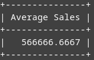
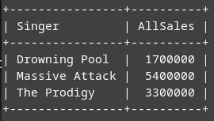

# Databases, tables, operators

- [Databases, tables, operators](#databases-tables-operators)
	- [Intro](#intro)
	- [Comments](#comments)
	- [Databases](#databases)
	- [Tables](#tables)
		- [`CREATE`](#create)
		- [`SHOW`](#show)
		- [`DESC`](#desc)
		- [`SHOW CREATE TABLE`](#show-create-table)
		- [`ALTER`](#alter)
	- [Operators](#operators)
	- [`AUTO_INCREMENT`](#auto_increment)
	- [Aliases](#aliases)
	- [Aggregate functions](#aggregate-functions)
		- [`COUNT()`](#count)
		- [`AVG()`](#avg)
		- [`SUM()`](#sum)
		- [`MIN()`, `MAX()`](#min-max)
		- [](#)

***

## Intro

All expressions can be written in a **single line or in multiple lines** - doesn't matter. 

Every expression should end with a semicolon `;`

All **commands** are case-**insensitive** (`SELECT === select`). Here we gonna write them in UPPERCASE for distinction.

All **names** of the tables, fields, etc. are case-**sensitive** (`Planets !== planets`)

***


## Comments

```sql
-- Single-line

/* Multi-
line */
```

***


## Databases

First, we create a database and switch to it:

```sql
/* create new database */
CREATE DATABASE test;

/* show all databases */
show databases;

/* select a database to not write its name over and over */
use test;
```

***


## Tables

Information is stored in tables. 

### `CREATE`

Create a table.

```sql
CREATE TABLE Person (
	person_id INT UNSIGNED AUTO_INCREMENT PRIMARY KEY,
	username VARCHAR(64),
	surname VARCHAR(64),
	father_name VARCHAR(64)
);
```

### `SHOW`

Show the list of your tables.

```sql
SHOW TABLES;
```

### `DESC`

Describe the structure of your table:

```sql
DESC person;
```


### `SHOW CREATE TABLE`

Show the instruction how to create such a table. 

**Be careful**: the result is **not** exactly what you need to type to create such a table. Particularly, you might need to delete **single quotes** around the table name and the field names. 

```sql
SHOW CREATE TABLE person;
```

***

### `ALTER`

Changes table or columns.

```sql
/* Add columns */

ALTER TABLE contacts
/* add after the column `contact_id` */
ADD last_name varchar(40) NOT NULL AFTER contact_id,	
/* make the 1st column */
ADD first_name varchar(35) NULL FIRST;	


/* Delete columns */

ALTER TABLE animals 
DROP COLUMN last_name, 
DROP COLUMN first_name;


/* Modify columns */

ALTER TABLE contacts
MODIFY last_name varchar(55) NULL AFTER contact_type,
MODIFY first_name varchar(30) NOT NULL;


/* Change the AUTO_INCREMENT default value */

ALTER TABLE test AUTO_INCREMENT = 100;


/* Rename columns */

ALTER TABLE table_name
CHANGE COLUMN old_name new_name 
	column_definition
	[ FIRST | AFTER column_name ]


/* Rename a table */

ALTER TABLE table_name 
RENAME TO new_table_name;


/* Add index */

ALTER TABLE person 
ADD INDEX (date_of_birth);
```

***


## Operators

https://www.w3schools.com/sql/sql_operators.asp

Arithmetic|Description
-|-
`+`|Add	
`-`|Subtract	
`*`|Multiply	
`/`|Divide	
`%`|Modulo

Compound|Description
-|-
`+=`|Add equals
`-=`|Subtract equals
`*=`|Multiply equals
`/=`|Divide equals
`%=`|Modulo equals

Bitwise|Bitwise
-|-
`&`|Bitwise AND
`|`|Bitwise OR
`^`|Bitwise exclusive OR
`&=`|Bitwise AND equals
`^-=`|Bitwise exclusive equals
`|*=`|Bitwise OR equals

Comparison|Description
-|-
`=`|Equal to	
`>`|Greater than	
`<`|Less than	
`>=`|Greater than or equal to	
`<=`|Less than or equal to	
`<>` or `!=`|Not equal to

Logical|Example|Description
-|-|-
`AND`||All the conditions separated by AND is TRUE
`ALL`|`WHERE Price > ALL (SELECT Price FROM Products WHERE Price > 500);`|All of the subquery values meet the condition
`ANY`|same|TRUE if any of the subquery values meet the condition	
`BETWEEN`|`BETWEEN 20 AND 30`|Inclusive. 
`EXISTS`|`WHERE EXISTS (SELECT Price FROM Products WHERE Price > 50);`|TRUE if the subquery returns one or more records. If the example subquery returns at least one record with `price > 50` = `EXISTS` is fulfilled.
`IN`|`IN ('Paris', 'London)`|In the list of multiple possible values
`LIKE`|`SELECT planet_name, opening_year, opener FROM Planets WHERE planet_name NOT LIKE '%s' AND planet_name NOT LIKE 'S%';`|The operand matches a pattern: select 3 fields of the records which planet_name does **not** ends or starts with 's'. 
`NOT`||Displays a record if the condition(s) is NOT TRUE	
`OR`||Any of the conditions separated by OR is TRUE	
`SOME`||Any of the subquery values meet the condition

***


## `AUTO_INCREMENT`

Allows a unique number to be generated automatically when a new record is inserted into the table. Often this is the **primary key** field that we would like to be created automatically every time a new record is inserted.

MySQL and MariaDB use the `AUTO_INCREMENT` keyword to perform an auto-increment feature.

It must be some kind of a **key** (`PRIMARY KEY`, `UNIQUE`, etc.)

Each table can only have **one** `AUTO_INCREMENT` column. 

```sql
CREATE TABLE animals (
	id MEDIUMINT NOT NULL AUTO_INCREMENT,
	name CHAR(30) NOT NULL,
	PRIMARY KEY (id)
 );

INSERT INTO animals (name) 
VALUES
	('dog'),('cat'),('penguin'),
	('fox'),('whale'),('ostrich');

SELECT * FROM animals;
```


The **default** value is 1 and will increment by 1 for each new record. You can set a **different** default value:

```sql
ALTER TABLE Persons AUTO_INCREMENT=100;
```

You **don't need** to set the value of the *auto increment* field when isert a new record into the table, it will be added automatically.

***


## Aliases

Aliases are used to give a table, or a column in a table, a temporary name.

An alias only exists for the duration of the query.

You may apply it to any columns in your search results you need.

Without alias:

```sql
SELECT planet_name, opener FROM Planets;
```


With alias:

```sql
SELECT planet_name AS Planet, opener FROM Planets;
```


Complex alias **combined** of 3 fields: 

```sql
SELECT 
	CustomerName, 
	Address + ', ' + PostalCode + ' ' + City + ', ' + Country AS Address
FROM Customers;
```


***


## Aggregate functions

Functions that return a **single** value after processing multiple records.

### `COUNT()`

The number of rows that matches a specified criterion

```sql
SELECT COUNT(Album) from Artists;
```


### `AVG()`

The average value of a numeric column

```sql
SELECT AVG(Sale) AS 'Average Sales' FROM Artists WHERE Singer = 'Drowning Pool';
```



***

### `SUM()`

The sum of a numeric column

```sql
SELECT Singer, SUM(Sale) AS AllSales 
FROM Artists 
GROUP BY Singer;
```



***

### `MIN()`, `MAX()`

The smallest and the largest value of the column

```sql
SELECT MIN(Sale) from Artists;
```


```sql
SELECT MAX(Sale) from Artists 
```

***

### 