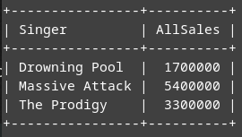
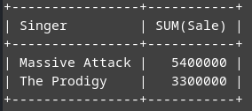
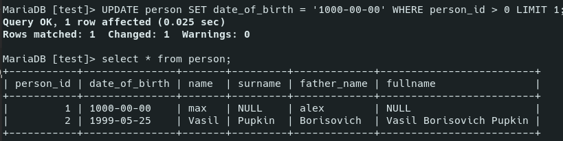
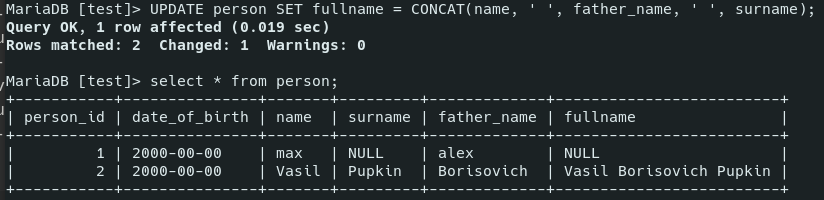

# Data manipulation, functions

- [Data manipulation, functions](#data-manipulation-functions)
	- [Test data](#test-data)
	- [Data manipulation](#data-manipulation)
		- [`INSERT INTO`](#insert-into)
		- [`SELECT`](#select)
		- [`WHERE`](#where)
		- [`GROUP BY`](#group-by)
			- [`HAVING`](#having)
		- [`LIMIT`](#limit)
		- [`ORDER BY`](#order-by)
		- [`JOIN`](#join)
		- [`UPDATE`](#update)
		- [`DROP`, `DELETE`, `TRUNCATE`](#drop-delete-truncate)

***

## Test data

We gonna use these (and other) examples, so here's the commands to quickly create and fill the test tables.

`Planets`:

```sql
CREATE TABLE Planets (
  id SMALLINT UNSIGNED AUTO_INCREMENT,
  planet_name VARCHAR(64),
  radius MEDIUMINT UNSIGNED,
  sun_season FLOAT,
  opening_year SMALLINT,
  has_rings BOOLEAN,
  opener VARCHAR(64),
  PRIMARY KEY (id)
);

INSERT INTO Planets 
	(planet_name, radius, sun_season, opening_year, has_rings, opener) 
VALUES 
	('Mars', 3396, 687, 1659, 0, 'Christiaan Huygens'),
	('Saturn', 60268, 10759.22, NULL, 1, NULL),
	('Neptune', 24764, 60190, 1846, 1, 'John Couch Adams'),
	('Mercury', 2439, 115.88, 1631, 0, 'Nicolaus Copernicus'),
	('Venus', 6051, 243, 1610, 0, 'Galileo Galilei');
```

`Planets2`:

```sql
CREATE TABLE Planets2 (
  id SMALLINT UNSIGNED AUTO_INCREMENT,
  planet_name VARCHAR(64),
  radius MEDIUMINT UNSIGNED,
  sun_season FLOAT,
  opening_year SMALLINT,
  has_rings BOOLEAN,
  opener VARCHAR(64),
  PRIMARY KEY (id)
);

INSERT INTO Planets2
	(planet_name, radius, sun_season, opening_year, has_rings, opener) 
VALUES 
	('Jupiter', 69911, 4380, 1610, 1, 'Galileo Galilei'),
	('Uranus', 25362, 30660, 1750, 1, NULL);
	
```

`Artists`:

```sql
CREATE TABLE Artists ( 
	Singer VARCHAR(64), 
	Album VARCHAR(64), 
	Year SMALLINT, 
	Sale INT UNSIGNED);

INSERT INTO Artists 
VALUES 
	('The Prodigy', 'Invaders Must Die', 2008, 1200000),
	('Drowning Pool', 'Sinner', 2001, 400000), 
	('Massive Attack', 'Mezzanine', 1998, 2300000), 
	('The Prodigy', 'Fat of the Land', 1997, 600000), 
	('The Prodigy', 'Music For The Jilted Generation', 1994, 1500000), 
	('Massive Attack', '100th Window', 2003, 1200000), 
	('Drowning Pool', 'Full Circle', 2007, 800000), 
	('Massive Attack', 'Danny The Dog', 2004, 1900000),('Drowning Pool', 'Resilience', 2013, 500000);
```

***

## Data manipulation

### `INSERT INTO`

Insert data to a table.

```sql
/* Insert one or multiple values */

INSERT INTO targetTable 
	(firstname, surname) 
VALUES 
	('max', 'bar'),
	('vlad', 'kravich'),
	('alina', 'nosova')
FROM sourceTable;

	
/* Clearer way of inserting one value */

INSERT INTO targetTable
SET 
	date_of_birth = '1999-05-25', 
	firstname = 'Vasil', 
	surname = 'Pupkin', 
	father_name = 'Borisovich';
FROM sourceTable;
```

Don't touch the **autoincrement** field - it will grow by itself. The rest of the missed fields (`data_of_birth` and `surname` here) will be filled with default values (that can be set upon the table creation).

***

### `SELECT`

Yout main tool for getting data from tables. 

Only `SELECT` and `FROM` are mandatory, the rest are optional.

```sql
SELECT
	<field1>
	<field2>
	<field3>
	...
FROM
	<table1>
	<table2>
	<table3>
	...		
GROUP BY
	<expression>
WHERE
	<cond>
ORDER BY
	<field1> ASC
	<field2> DESC
LIMIT
	N,M
```

Show all records, show selected fields:

```sql
SELECT * FROM Person;
SELECT id, username FROM Person;
```

***

### `WHERE`

Basically `if`. 

Text values mush be enclosed in single quotes `''`, numeric values must **not** be enclosed in quotes.

```sql
UPDATE Planets 
SET has_rings = 0 
WHERE planet_name IN ('Mars', 'Mercury' 'Venus');
```

***

### `GROUP BY`

Group by a column or several columns.

```sql
SELECT Singer, SUM(Sale) AS AllSales 
FROM Artists 
GROUP BY Singer;
```



#### `HAVING`

Always used after `GROUP BY` and works as `WHERE`. 

Example 1: find Singers who's total number os sales is > 2 000 000

```sql
SELECT Singer, SUM(Sale)
FROM Artists
GROUP BY Singer
	HAVING SUM(Sale) > 2000000;
```



Example 2: find Singers who had albums prior to 1995

```sql
SELECT Singer, MIN(Year) /* not `Year` but `MIN(Year)` ! */
FROM Artists 
GROUP BY Singer 
	HAVING MIN(Year) < 1995;
```

***

### `LIMIT`

Limits the amount of changed records. You can use it if you unsure of your changes.

```sql
UPDATE person SET date_of_birth = '1000-00-00' WHERE person_id > 0 LIMIT 1;
```

Only one record was changed despite having 2 matches:



***

### `ORDER BY`

Sort data. Can be `ASC` and `DESC`. 

Can be performed by several fields, in this case it sorts by the first field, then by the second (without breaking the first one), etc.

```sql
SELECT * FROM Planets 
ORDER BY 
	has_rings DESC, 
	radius ASC;
```

***

### `JOIN`

Combine rows from two or more tables, based on a related column between them:

- `(INNER) JOIN`: Returns records that have matching values in both tables
- `LEFT JOIN`: Returns all records from the left table, and the matched records from the right table
- `RIGHT JOIN`: Returns all records from the right table, and the matched records from the left table
- `FULL JOIN`: Returns all records when there is a match in either left or right table


```sql

```

***


### `UPDATE`

Update records. Don't use without `WHERE` or `LIMIT` or you will lose your data!

```sql
/* Update all records !!! */

UPDATE person 
SET date_of_birth = '2000-00-00';


/* Update records that meet the condition */

UPDATE person 
SET date_of_birth = '1999-05-25' 
WHERE person_id = 2;


/* Update a column */

UPDATE person 
SET fullname = CONCAT(name, ' ', father_name, ' ', surname);
```



***

### `DROP`, `DELETE`, `TRUNCATE`

Delete data in one way or another.

Don't use without `WHERE` or `LIMIT` or you will lose your data!

```sql
/* Delete the matching data */
DELETE FROM person WHERE person_id < 2;

/* Delete all the data */
TRUNCATE TABLE Persons;

/* Delete the table */
DROP TABLE test;
```

***