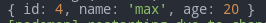
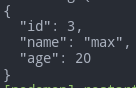
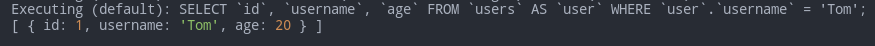

# Sequelize

Promise-based Node.js interface for Postgres, MySQL, MariaDB, SQLite and Microsoft SQL Server. It lets us use object-based interface instead of writing the actual DB queries ourselves.

- [Sequelize](#sequelize)
	- [Sources](#sources)
	- [Basics](#basics)
		- [Install & Run](#install--run)
		- [Logging](#logging)
		- [Models](#models)
			- [Models are ES6 classes](#models-are-es6-classes)
		- [Synchronization](#synchronization)
	- [Operators](#operators)
		- [Examples](#examples)
	- [Data manipulation](#data-manipulation)
		- [`console.log`](#consolelog)
		- [`INSERT`](#insert)
		- [`SELECT`](#select)
		- [Updating](#updating)
		- [Deleting](#deleting)
		- [Incrementing and decrementing integer values](#incrementing-and-decrementing-integer-values)
		- [Functions in queries](#functions-in-queries)
	- [Connections](#connections)
		- [One to One](#one-to-one)
		- [One to Many](#one-to-many)
		- [Many to Many](#many-to-many)
	- [Data Types](#data-types)
		- [Column options](#column-options)

***

## Sources

1. https://metanit.com/web/nodejs/9.1.php
2. https://sequelize.org/master/ - tutorial
3. https://sequelize.org/master/identifiers.html - ref

***

## Basics

### Install & Run

```bash
npm i sequelize

# And one of the following:
npm i mysql2	# needed to work with the 'mysql' dialect
npm i sqlite3	# the simplest for instant testing
# ...
```

`define` is an optional object with customizeable options.

```js
const options = {
	timestamps: true,	// by default adds 'createdAt' and 'updatedAt' fields to all tables
	createdAt: false,	// turn off `createdAt`
	updatedAt: 'updateTimestamp',	// rename `updatedAt`

	freezeTableName: false	// if `true`, modelName === tableName
}
	
const Sequelize = require('sequelize')
const sequelize = new Sequelize('test', 'root', 'Rfgkzrfgkz', {
	dialect: 'mysql',
	host: 'localhost',
	// port: 5000,
	define: options
})

// Or for the simplest testing:
// const sequelize = new Sequelize('sqlite::memory:')
```

***

### Logging

Logging to the console is turned **on** by default.

```js
const sequelize = new Sequelize('sqlite::memory:', {
  // Choose one of the logging options
  logging: console.log,                  // DEFAULT, displays the first parameter of the log function call
  logging: (...msg) => console.log(msg), // Displays all log function call parameters
  logging: false,                        // Disables logging
  logging: msg => logger.debug(msg),     // Use custom logger (e.g. Winston or Bunyan), displays the first parameter
  logging: logger.debug.bind(logger)     // Alternative way to use custom logger, displays all messages
})
```

***

### Models

Model is an abstraction (class) representing your table in the DB.

Usually models have **singular** names (`User`) while tables in the DB have their pluralized forms (`Users`).

If there's no table for the model in the DB, **it will be created**. And it will automatically make the **plural number** of your provided name (e.g. "users" from "user").

Defined models live in `sequelize.models`

There're **2 ways** (which are the same inside) to define a model:

1. `sequelize.define (modelName, modelStructure)`
2. Extend `Model` and `.init (modelStructure)`

```js
const { Sequelize, DataTypes, Model } = require('sequelize')

const modelName = 'user'
const modelStructure = {
	id: {
		type: Sequelize.INTEGER,
		autoIncrement: true,
		primaryKey: true,
		allowNull: false,
		unique: true
	},
	name: {
		type: Sequelize.STRING,
		allowNull: false,
		defaultValue: "John Doe"
	},
	age: {
		type: Sequelize.INTEGER,
		allowNull: false
	}
}

// 1st way
const User = sequelize.define(modelName, modelStructure)

// 2nd way
class User extends Model {}
User.init(modelStructure, { sequelize, modelName })
```

**NB**: many of the column options above are non actually needed here and are present only to demonstrate their existence. In many cases using `type` is enough. 

***

#### Models are ES6 classes

You can easily add custom instance or static methods.

To create instances, use one of the 2 methods from the [inserting](#inserting) chapter. Don't use `new User`!

Example:

```js
class User extends Model {
  static classLevelMethod() {
    return 'foo'
  }
  instanceLevelMethod() {
    return 'bar'
  }
  getFullname() {
    return [this.firstname, this.lastname].join(' ')
  }
}
User.init({
  firstname: Sequelize.TEXT,
  lastname: Sequelize.TEXT
}, { sequelize })

console.log(User.classLevelMethod())	// 'foo'
const user = User.build({ firstname: 'Jane', lastname: 'Doe' })
console.log(user.instanceLevelMethod())	// 'bar'
console.log(user.getFullname())	// 'Jane Doe'
```

***

### Synchronization

Before starting the work, we must make sure our tables in the DB **fit** our models.

`sequelize.sync (options)` creates tables if they didn't exist and does nothing if they did. 

We can also synchronize just the models we want: `User.sync (options)`

Options:

- `{ force: true }` - `DROP TABLE IF EXISTS` and then **recreate it** according to our model.
- `{ alter: true }` - tries to change the existing table to match our model.
- `{ match: /_test$/ }` - a safery check: in the current example `sync()` will only run if the DB name ends with `_test`.

Keep in mind 2 things:

- `await` before each query to the DB as these are **async** actions that take time.
- `try..catch` everything as you might encounter errors at any point making queries to the DB.

```js
sequelize
	.sync()
	.then((result) => {
		console.log(result)
	})
	.catch((err) => console.error(err))
```

So our table will be equivalent to this one: 

```sql
CREATE TABLE `users` (
  `id` int(11) NOT NULL AUTO_INCREMENT,
  `name` varchar(255) NOT NULL,
  `age` int(11) NOT NULL,
  `createdAt` datetime NOT NULL,
  `updatedAt` datetime NOT NULL,
  PRIMARY KEY (`id`)
)
```

We could avoid creating the `id`, `createdAt` and `updatedAt` fields as they would've been created automatically.

***

Drop tables:

```js
await User.drop()	// one table
await sequelize.drop()	// all tables
```

***


## Operators

All operators live as the `Op` object's properties.

```js
const { Op } = require('sequelize')

Post.findAll({
	where: {
		[Op.and]: [{ a: 5 }, { b: 6 }],	// (a = 5) AND (b = 6)
		[Op.or]: [{ a: 5 }, { b: 6 }],	// (a = 5) OR (b = 6)
		someAttribute: {
			// Basics
			[Op.eq]: 3,			// = 3
			[Op.ne]: 20,		// != 20
			[Op.is]: null,	// IS NULL
			[Op.not]: true,		// IS NOT TRUE
			[Op.or]: [5, 6],	// (someAttribute = 5) OR (someAttribute = 6)

			// Using dialect specific column identifiers (PG in the following example):
			[Op.col]: 'user.organization_id', // = "user"."organization_id"

			// Number comparisons
			[Op.gt]: 6,		// > 6
			[Op.gte]: 6,	// >= 6
			[Op.lt]: 10,	// < 10
			[Op.lte]: 10,	// <= 10
			[Op.between]: [6, 10],			// BETWEEN 6 AND 10
			[Op.notBetween]: [11, 15],	// NOT BETWEEN 11 AND 15

			// Other operators

			[Op.in]: [1, 2],		// IN [1, 2]
			id: [1,2,3] // Same as using `id: { [Op.in]: [1,2,3] }`
			[Op.notIn]: [1, 2],	// NOT IN [1, 2]

			[Op.like]: '%hat',	// LIKE '%hat'
			[Op.notLike]: '%hat',	// NOT LIKE '%hat'
			[Op.startsWith]: 'hat',	// LIKE 'hat%'
			[Op.endsWith]: 'hat',		// LIKE '%hat'
			[Op.substring]: 'hat',	// LIKE '%hat%'
			[Op.regexp]: '^[h|a|t]',	// REGEXP/~ '^[h|a|t]' (MySQL/PG only)
			[Op.notRegexp]: '^[h|a|t]',	// NOT REGEXP/!~ '^[h|a|t]' (MySQL/PG only)
		}
	}
})
```

***

There are some shortcuts available:

1. One value and no `[Op]` == `[Op.eq]` (equal).

```js
// This 
await User.create({ username: 'Max' })

// is a shortcut for this
await User.create({ 
	username: {
		[Op.eq]: 'Max'
	}
})
```
2. Several values in an array == `[Op.in]` (IN).

```js
// This
await User.findAll({
	where: {
		id: [1, 2, 3]
	}
})

// is a shortcut for this
await User.findAll({
	where: {
		id: {
			[Op.in]: [1, 2, 3]
		}
	}
})
```

3. Several conditions are provided == `[Op.and]` (AND) operator is inferred between them.

```js
// This
await User.findAll({
	where: {
		createdAt: {
			[Op.lt]: new Date(),
			[Op.gt]: new Date(new Date() - 24 * 60 * 60 * 1000)
		}
	}
})

// is a shortcut for this
await User.findAll({
	where: {
		createdAt: {
			[Op.and]: [
				[Op.lt]: new Date(),
				[Op.gt]: new Date(new Date() - 24 * 60 * 60 * 1000)
			]
		}
	}
})
```

***

### Examples

These queries produce the same output and demonstrate the ability to combine operators in any way:

```js
// Short version for a single field with a single operator
await User.findAll({
	where: {
		username: {	
			[Op.or]: ['Tom', 'Travis']
		}
	},
	raw: true
})

// Longer version allowing different operators to be applied
await User.findAll({
	where: {
		id: {
			[Op.or]: {
				[Op.lt]: 2,
				[Op.gt]: 2
			}
		}
	},
	raw: true
})

// Long query with many fields and many operators
User.findAll({
	where: {
		[Op.or]: [
			{ username: 'Tom' },
			{
				[Op.and]: [
					{
						age: {
							[Op.lt]: 24
						}
					},
					{
						id: {
							[Op.not]: [2, 4]
						}
					}
				]
			}
		]
	},
	raw: true
})
```


***


## Data manipulation

### `console.log`

Further you'd want to log some data to the console. There are 2 ways of doing this nice, without clutter - both of them are based on `JSON`.

```js
const max = await User.create({ name: 'max', age: 20 })
```

1. `instance.toJSON()`

```js
console.log(max.toJSON())
```



2. `console.log(JSON.stringify(max, null, 2))`

```js
console.log(JSON.stringify(max, null, 2))
```




***

### `INSERT`

2 ways to insert data:

Either `build()` + `save()`

```js
const user = User.build({ name: 'Tom', age: 35 })
await user.save()
```

Or a shortcut `create()`

```js
const user = await User.create({
	name: 'Tom',
	age: 35
})
```


***

### `SELECT`

```sql
SELECT * FROM Users WHERE username = 'Tom' AND age = 20;
```

```js
const users = await User.findAll({
	where: {
		username: 'Tom',
		age: 20
	},
	raw: true
	// `raw: true` says we don't want additional metadata - just plain objects.
})
console.log(users)
```



***

We can also find **a single** result by Primary Key:

```js
const user = await User.findByPk(11)
if (!user) return		// if no user found - return
	console.log(user.name)	// 'Tom'
})
```

### Updating

After you created a record but **before you synchronized it** to the DB, you can update it as any other object: 

```js
const jane = await User.create({ name: "Jane" })
jane.name = "Ada"	// changed locally
await jane.save()	// synchronized changes with the DB
await jane.reload()	// optionally updated the local object to fit the DB if we want to continue working with it
```

And this is how you update your records that are already in the DB:

```js
const result = await User.update(
	{ id: 1, age: 36 },
	{
		where: { name: 'Tom' }
	}
)
console.log(result)
```

It returns an array with one element: the number of updated entries (e.g. `[0]` or `[3]`).

***

### Deleting

```js
const deleted = await User.destroy({
	where: {
		name: 'Bob'
	}
})
console.log(deleted)	// 1
```


The subsequent calls will return `0` - no more Bob to delete : (

***

### Incrementing and decrementing integer values

There's an easy way to change these values:

```js
await jane.increment('age')	// age ++
await jane.decrement('age', { by: 2 })	// age -= 2
// multiple fields at once
await jane.increment({
	age: 2,		// age += 2
	cash: 100	// cash += 100
})
```

***

### Functions in queries


***


## Connections

There are 3 ways to **set** a dependent record:

1. "One to One"- specific solution when you already have an **independent** record - update it to connect to the main one.

```js
const coach = await Coach.create({ name: 'Tom Smith' })
const team = await Team.create({ name: 'Real Madrid' })
// This fills the `coachId` field in `teams`
await coach.setTeam(team)	// UPDATE 'teams' SET coachId = ?
```

2. Universal: directly specify the main record - universal:

```js
const company = await Company.create({ name: 'Apple' })
await Product.create({
	name: 'iPhone XS',
	price: 400,
	companyId: company.id		// <--- Here
})
```

3. Universal: use the `create<DependentModel>` dynamic method.

```js
const company = await Company.create({ name: 'Apple' })
company.createProduct({ name: 'iPhone X', price: 350 })
```

4. "Many to Many"- specific solution:

```js
await travis.addSubject(ts, {
	through: {
		grade: 85
	}
})
```

***

To **get** connected records, use `<mainModel>.get<dependentModels>()`

```js
const result = await company.getProducts({ raw: true })
console.log(result)
```

***

### One to One

`<mainModel>.hasOne (<dependentModel>, options)`

Optional options: `{ onDelete: 'cascade', onUpdate: 'cascade' }`

And later we use any of the 3 methods above to set up the connection between the main and the dependent models.

```js
const Coach = sequelize.define('coach', {
	name: {
		type: Sequelize.STRING,
		allowNull: false
	}
})

const Team = sequelize.define('team', {
	name: {
		type: Sequelize.STRING,
		allowNull: false
	}
})

// This creates the `coachId` column in `teams`
Coach.hasOne(Team, { onDelete: 'cascade' })

run()

async function run() {
	try {
		// Recreate our tables according to our models
		await sequelize.sync({ force: true })	
		const coach = await Coach.create({ name: 'Tom Smith' })
		const team = await Team.create({ name: 'Real Madrid' })
		// This fills the `coachId` field in `teams`, the 1st method
		await coach.setTeam(team) // UPDATE 'teams' SET coachId = ?
	} catch (err) {
		console.error(err)
	}
}
```

Now the `teams` table will have an additional `coachId` field which connects it to the `coaches` table. 

**NB**: the **dependent** table gets an extra field, **not the main one**. This will be especially important further with other types of connections.

Example of getting the data:

```js
async function run() {
	try {
		// Create tables
		await sequelize.sync({ force: true })
		// Insert data into 2 tables
		const coach = await Coach.create({ name: 'Tom Smith' })
		const team = await Team.create({ name: 'Real Madrid' })
		// Connect the entries to each other
		const setResult = await coach.setTeam(team) // UPDATE 'teams' SET coachId = ?, updatedAt = ?
		console.log(setResult)

		console.log('\n')
		const getResult = await coach.getTeam()
		console.log(getResult)
	} catch (err) {
		console.error(err)
	}
}
```

The returned value of `set` and `get` is pretty similar and mosly differs in metadata. So you might even not need `get` if you've just used `set` and want to output some	 data.

Another example: find all coaches with their related data - the team name.

```js
async function run() {
	try {
		const coaches = await Coach.findAll({
			attributes: ['name'], // включаем столбец name из таблицы coaches
			include: [
				{
					model: Team,
					attributes: ['name'] // включаем столбец name из таблицы teams
				}
			]
		})
		for (coach of coaches) {
			console.log(coach.name, '-', coach.team.name)
		}
	} catch (err) {
		console.error(err)
	}
}
```

Result: an array of coaches + additional data attached (their teams) 


***

### One to Many

`<mainModel>.hasMany (<dependentModels>, options)`

Optional options: `{ onDelete: 'cascade', onUpdate: 'cascade' }`

```js
const Product = sequelize.define('product', {
	name: {
		type: Sequelize.STRING,
		allowNull: false
	},
	price: {
		type: Sequelize.INTEGER,
		allowNull: false
	}
})

const Company = sequelize.define('company', {
	name: {
		type: Sequelize.STRING,
		allowNull: false
	}
})

// This creates the `coachId` column in `teams`
Company.hasMany(Product, { onDelete: 'cascade' })

run()

async function run() {
	try {
		// Recreate our tables according to our models
		await sequelize.sync({ force: true })
		const company = await Company.create({ name: 'Apple' })
		// 2nd method
		await Product.create({
			name: 'iPhone XS',
			price: 400,
			companyId: company.id
		})
		// 3rd method
		company.createProduct({ name: 'iPhone X', price: 350 })
	} catch (err) {
		console.error(err)
	}
}
```

***

### Many to Many

`<mainModel>.belongsToMany (<dependentModel>, { through: <connectingModel> })`

On the DB level we must create an extra table to store the connections, so in Sequelize we create an extra model.

```js
const Student = sequelize.define('student', {
	name: {
		type: Sequelize.STRING,
		allowNull: false
	}
})

const Subject = sequelize.define('subject', {
	name: {
		type: Sequelize.STRING,
		allowNull: false
	}
})

// Connecting model
const Enrolment = sequelize.define('enrolment', {
	grade: {
		type: Sequelize.INTEGER,
		allowNull: false
	},
	enrolmentDate: {
		type: Sequelize.DATE
	},
	graduationDate: {
		type: Sequelize.DATE
	}
})

// This creates the `coachId` column in `teams`
Student.belongsToMany(Subject, { through: Enrolment })
Subject.belongsToMany(Student, { through: Enrolment })

run()

async function run() {
	try {
		await sequelize.sync({ force: true })

		await Subject.create({ name: 'JavaScript' })
		const ts = await Subject.create({ name: 'TypeScript' })
		await Subject.create({ name: 'Node.js' })

		await Student.create({ name: 'Tom' })
		await Student.create({ name: 'Mark' })
		const travis = await Student.create({ name: 'Travis' })

		// Set the connected data
		await travis.addSubject(ts, {
			through: {
				grade: 85
			}
		})

		// Get the connected data
		const travisSubjects = await travis.getSubjects()
		console.log(travisSubjects)

		// Delete the connected data
		for (subject of travisSubjects) {
			if (subject.name === 'TypeScript') await subject.enrolment.destroy()
		}
	} catch (err) {
		console.error(err)
	}
}
```

***


## Data Types

```js
const { DataTypes } = require("sequelize")

// Strings

DataTypes.STRING             // VARCHAR(255)
DataTypes.STRING(1234)       // VARCHAR(1234)
DataTypes.STRING.BINARY      // VARCHAR BINARY
DataTypes.TEXT               // TEXT
DataTypes.TEXT('tiny')       // TINYTEXT

// Boolean

DataTypes.BOOLEAN            // TINYINT(1)

// Numbers

DataTypes.INTEGER            // INTEGER
DataTypes.INTEGER.UNSIGNED	 // INTEGER UNSIGNED - MySQL only
DataTypes.BIGINT             // BIGINT
DataTypes.BIGINT(11)         // BIGINT(11)

DataTypes.FLOAT              // FLOAT
DataTypes.FLOAT(11)          // FLOAT(11)
DataTypes.FLOAT(11, 10)      // FLOAT(11,10)

DataTypes.DOUBLE             // DOUBLE
DataTypes.DOUBLE(11)         // DOUBLE(11)
DataTypes.DOUBLE(11, 10)     // DOUBLE(11,10)

DataTypes.DECIMAL            // DECIMAL
DataTypes.DECIMAL(10, 2)     // DECIMAL(10,2)

// Dates

DataTypes.DATE       // DATETIME
DataTypes.DATE(6)    // DATETIME(6) Fractional seconds support with up to 6 digits of precision
DataTypes.DATEONLY   // DATE without time

// UUID

DataTypes.UUID			
DataTypes.UUIDV1		
DataTypes.UUIDV4
```

***

### Column options

PRIMARY KEY, AUTO_INCREMENT and others are available:

```js
const Coach = sequelize.define('coach', {
	// `id` is created automatically by default
	id: {
		type: Sequelize.INTEGER,
		autoIncrement: true,
		primaryKey: true,
		allowNull: false,
		unique: true
	},
	name: {
		type: Sequelize.STRING,
		defaultValue: "John Doe"
	},
	// It is possible to create foreign keys:
  bar_id: {
    type: DataTypes.INTEGER,

    references: {
      // This is a reference to another model
      model: Bar,

      // This is the column name of the referenced model
			key: 'id'
		}
	}
})
```

***


