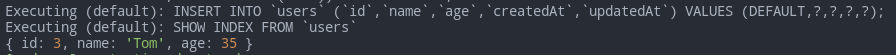
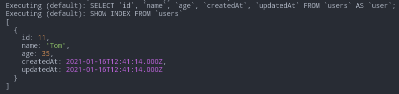
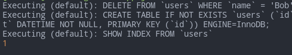
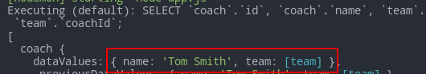

# Sequelize

Promise-based Node.js interface for Postgres, MySQL, MariaDB, SQLite and Microsoft SQL Server. It lets us use object-based interface instead of writing the actual DB queries ourselves.

- [Sequelize](#sequelize)
	- [Sources](#sources)
	- [Basics](#basics)
		- [Install & Run](#install--run)
		- [Logging](#logging)
		- [Models](#models)
		- [Synchronization](#synchronization)
	- [Data manipulation](#data-manipulation)
		- [Inserting](#inserting)
		- [Getting](#getting)
		- [Updating](#updating)
		- [Deleting](#deleting)
	- [Connections](#connections)
		- [One to One](#one-to-one)
		- [One to Many](#one-to-many)
		- [Many to Many](#many-to-many)

***

## Sources

1. https://metanit.com/web/nodejs/9.1.php
2. https://sequelize.org/master/ - tutorial
3. https://sequelize.org/master/identifiers.html - ref

***

## Basics

### Install & Run

```bash
npm i sequelize

# And one of the following:
npm i mysql2	# needed to work with the 'mysql' dialect
npm i sqlite3	# the simplest for instant testing
# ...
```

`define` is an optional object with customizeable options.

```js
const options = {
	timestamps: true,	// by default adds 'createdAt' and 'updatedAt' fields to all tables
	createdAt: false,	// turn off `createdAt`
	updatedAt: 'updateTimestamp',	// rename `updatedAt`

	freezeTableName: false	// if `true`, modelName === tableName
}
	
const Sequelize = require('sequelize')
const sequelize = new Sequelize('test', 'root', 'Rfgkzrfgkz', {
	dialect: 'mysql',
	host: 'localhost',
	// port: 5000,
	define: options
})

// Or for the simplest testing:
// const sequelize = new Sequelize('sqlite::memory:')
```

***

### Logging

Logging to the console is turned **on** by default.

```js
const sequelize = new Sequelize('sqlite::memory:', {
  // Choose one of the logging options
  logging: console.log,                  // DEFAULT, displays the first parameter of the log function call
  logging: (...msg) => console.log(msg), // Displays all log function call parameters
  logging: false,                        // Disables logging
  logging: msg => logger.debug(msg),     // Use custom logger (e.g. Winston or Bunyan), displays the first parameter
  logging: logger.debug.bind(logger)     // Alternative way to use custom logger, displays all messages
})
```

***

### Models

Model is an abstraction (class) representing your table in the DB.

Usually models have **singular** names (`User`) while tables in the DB have their pluralized forms (`Users`).

If there's no table for the model in the DB, **it will be created**. And it will automatically make the **plural number** of your provided name (e.g. "users" from "user").

Defined models live in `sequelize.models`

There're **2 ways** (which are the same inside) to define a model:

1. `sequelize.define (modelName, modelStructure)`
2. Extend `Model` and `.init (modelStructure)`

```js
const { Sequelize, DataTypes, Model } = require('sequelize')

const modelName = 'user'
const modelStructure = {
	id: {
		type: Sequelize.INTEGER,
		autoIncrement: true,
		primaryKey: true,
		allowNull: false
	},
	name: {
		type: Sequelize.STRING,
		allowNull: false
	},
	age: {
		type: Sequelize.INTEGER,
		allowNull: false
	}
}

// 1st way
const User = sequelize.define(modelName, modelStructure)

// 2nd way
class User extends Model {}
User.init(modelStructure, { sequelize, modelName })
```

***

### Synchronization

Before starting the work, we must make sure our tables in the DB **fit** our models.

`sequelize.sync (options)` creates tables if they didn't exist and does nothing if they did. 

We can also synchronize just the models we want: `User.sync (options)`

Options:

- `{ force: true }` - `DROP TABLE IF EXISTS` and then **recreate it** according to our model.
- `{ alter: true }` - tries to change the existing table to match our model.
- `{ match: /_test$/ }` - a safery check: in the current example `sync()` will only run if the DB name ends with `_test`.

Keep in mind 2 things:

- `await` before each query to the DB as these are **async** actions that take time.
- `try..catch` everything as you might encounter errors at any point making queries to the DB.

```js
sequelize
	.sync()
	.then((result) => {
		console.log(result)
	})
	.catch((err) => console.error(err))
```

So our table will be equivalent to this one: 

```sql
CREATE TABLE `users` (
  `id` int(11) NOT NULL AUTO_INCREMENT,
  `name` varchar(255) NOT NULL,
  `age` int(11) NOT NULL,
  `createdAt` datetime NOT NULL,
  `updatedAt` datetime NOT NULL,
  PRIMARY KEY (`id`)
)
```

We could avoid creating the `id`, `createdAt` and `updatedAt` fields as they would've been created automatically.

***

Drop tables:

```js
await User.drop()	// one table
await sequelize.drop()	// all tables
```

***


## Data manipulation

### Inserting

```js
const user = await User.create({
	name: 'Tom',
	age: 35
})
console.log({ id: user.id, name: user.name, age: user.age })
```



***

### Getting

Pay attention to the `where` clause === `WHERE` from `SQL`.

`raw: true` says we don't want additional metadata - just plain objects.

```js
const users = await User.findAll({ where: { name: 'Tom' }, raw: true })
console.log(users)
```

Returns an **array of objects** (records):



***

We can also find **a single** result by Primary Key:

```js
const user = await User.findByPk(11)
if (!user) return		// if no user found - return
	console.log(user.name)	// 'Tom'
})
```

### Updating

```js
const result = await User.update(
	{ id: 1, age: 36 },
	{
		where: {
			name: 'Tom'
		}
	}
)
console.log(result)
```

It returns an array `[1]` if there was a match, and `[0]` - if wasn't. You can use `Boolean(Number(res))` to convert it to `true/false` (works if array has a single number value).

***

### Deleting

```js
const deleted = await User.destroy({
	where: {
		name: 'Bob'
	}
})
console.log(deleted)	// 1
```



The subsequent calls will return `0` - no more Bob to delete : (

***


## Connections

There are 3 ways to **set** a dependent record:

1. "One to One"- specific solution when you already have an **independent** record - update it to connect to the main one.

```js
const coach = await Coach.create({ name: 'Tom Smith' })
const team = await Team.create({ name: 'Real Madrid' })
// This fills the `coachId` field in `teams`
await coach.setTeam(team)	// UPDATE 'teams' SET coachId = ?
```

2. Universal: directly specify the main record - universal:

```js
const company = await Company.create({ name: 'Apple' })
await Product.create({
	name: 'iPhone XS',
	price: 400,
	companyId: company.id		// <--- Here
})
```

3. Universal: use the `create<DependentModel>` dynamic method.

```js
const company = await Company.create({ name: 'Apple' })
company.createProduct({ name: 'iPhone X', price: 350 })
```

4. "Many to Many"- specific solution:

```js
await travis.addSubject(ts, {
	through: {
		grade: 85
	}
})
```

***

To **get** connected records, use `<mainModel>.get<dependentModels>()`

```js
const result = await company.getProducts({ raw: true })
console.log(result)
```

***

### One to One

`<mainModel>.hasOne (<dependentModel>, options)`

Optional options: `{ onDelete: 'cascade', onUpdate: 'cascade' }`

And later we use any of the 3 methods above to set up the connection between the main and the dependent models.

```js
const Coach = sequelize.define('coach', {
	id: {
		type: Sequelize.INTEGER,
		autoIncrement: true,
		primaryKey: true,
		allowNull: false,
		defaultValue: "John Doe"
	},
	name: {
		type: Sequelize.STRING,
		allowNull: false
	}
})

const Team = sequelize.define('team', {
	id: {
		type: Sequelize.INTEGER,
		autoIncrement: true,
		primaryKey: true,
		allowNull: false
	},
	name: {
		type: Sequelize.STRING,
		allowNull: false
	}
})

// This creates the `coachId` column in `teams`
Coach.hasOne(Team, { onDelete: 'cascade' })

run()

async function run() {
	try {
		// Recreate our tables according to our models
		await sequelize.sync({ force: true })	
		const coach = await Coach.create({ name: 'Tom Smith' })
		const team = await Team.create({ name: 'Real Madrid' })
		// This fills the `coachId` field in `teams`, the 1st method
		await coach.setTeam(team) // UPDATE 'teams' SET coachId = ?
	} catch (err) {
		console.error(err)
	}
}
```

Now the `teams` table will have an additional `coachId` field which connects it to the `coaches` table. 

**NB**: the **dependent** table gets an extra field, **not the main one**. This will be especially important further with other types of connections.

Example of getting the data:

```js
async function run() {
	try {
		// Create tables
		await sequelize.sync({ force: true })
		// Insert data into 2 tables
		const coach = await Coach.create({ name: 'Tom Smith' })
		const team = await Team.create({ name: 'Real Madrid' })
		// Connect the entries to each other
		const setResult = await coach.setTeam(team) // UPDATE 'teams' SET coachId = ?, updatedAt = ?
		console.log(setResult)

		console.log('\n')
		const getResult = await coach.getTeam()
		console.log(getResult)
	} catch (err) {
		console.error(err)
	}
}
```

The returned value of `set` and `get` is pretty similar and mosly differs in metadata. So you might even not need `get` if you've just used `set` and want to output some	 data.

Another example: find all coaches with their related data - the team name.

```js
async function run() {
	try {
		const coaches = await Coach.findAll({
			attributes: ['name'], // включаем столбец name из таблицы coaches
			include: [
				{
					model: Team,
					attributes: ['name'] // включаем столбец name из таблицы teams
				}
			]
		})
		for (coach of coaches) {
			console.log(coach.name, '-', coach.team.name)
		}
	} catch (err) {
		console.error(err)
	}
}
```

Result: an array of coaches + additional data attached (their teams) 



***

### One to Many

`<mainModel>.hasMany (<dependentModels>, options)`

Optional options: `{ onDelete: 'cascade', onUpdate: 'cascade' }`

```js
const Product = sequelize.define('product', {
	id: {
		type: Sequelize.INTEGER,
		autoIncrement: true,
		primaryKey: true,
		allowNull: false
	},
	name: {
		type: Sequelize.STRING,
		allowNull: false
	},
	price: {
		type: Sequelize.INTEGER,
		allowNull: false
	}
})

const Company = sequelize.define('company', {
	id: {
		type: Sequelize.INTEGER,
		autoIncrement: true,
		primaryKey: true,
		allowNull: false
	},
	name: {
		type: Sequelize.STRING,
		allowNull: false
	}
})

// This creates the `coachId` column in `teams`
Company.hasMany(Product, { onDelete: 'cascade' })

run()

async function run() {
	try {
		// Recreate our tables according to our models
		await sequelize.sync({ force: true })
		const company = await Company.create({ name: 'Apple' })
		// 2nd method
		await Product.create({
			name: 'iPhone XS',
			price: 400,
			companyId: company.id
		})
		// 3rd method
		company.createProduct({ name: 'iPhone X', price: 350 })
	} catch (err) {
		console.error(err)
	}
}
```

***

### Many to Many

`<mainModel>.belongsToMany (<dependentModel>, { through: <connectingModel> })`

On the DB level we must create an extra table to store the connections, so in Sequelize we create an extra model.

```js
const Student = sequelize.define('student', {
	name: {
		type: Sequelize.STRING,
		allowNull: false
	}
})

const Subject = sequelize.define('subject', {
	name: {
		type: Sequelize.STRING,
		allowNull: false
	}
})

// Connecting model
const Enrolment = sequelize.define('enrolment', {
	grade: {
		type: Sequelize.INTEGER,
		allowNull: false
	},
	enrolmentDate: {
		type: Sequelize.DATE
	},
	graduationDate: {
		type: Sequelize.DATE
	}
})

// This creates the `coachId` column in `teams`
Student.belongsToMany(Subject, { through: Enrolment })
Subject.belongsToMany(Student, { through: Enrolment })

run()

async function run() {
	try {
		await sequelize.sync({ force: true })

		await Subject.create({ name: 'JavaScript' })
		const ts = await Subject.create({ name: 'TypeScript' })
		await Subject.create({ name: 'Node.js' })

		await Student.create({ name: 'Tom' })
		await Student.create({ name: 'Mark' })
		const travis = await Student.create({ name: 'Travis' })

		// Set the connected data
		await travis.addSubject(ts, {
			through: {
				grade: 85
			}
		})

		// Get the connected data
		const travisSubjects = await travis.getSubjects()
		console.log(travisSubjects)

		// Delete the connected data
		for (subject of travisSubjects) {
			if (subject.name === 'TypeScript') await subject.enrolment.destroy()
		}
	} catch (err) {
		console.error(err)
	}
}
```

***

