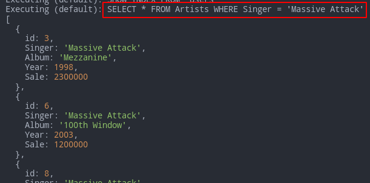

# Sequelize

Promise-based Node.js interface for Postgres, MySQL, MariaDB, SQLite and Microsoft SQL Server. It lets us use object-based interface instead of writing the actual DB queries ourselves.

- [Sequelize](#sequelize)
	- [Sources](#sources)
	- [Basics](#basics)
		- [Install & Run](#install--run)
		- [Logging](#logging)
		- [Models](#models)
			- [Models are ES6 classes](#models-are-es6-classes)
		- [Synchronization](#synchronization)
	- [Operators](#operators)
		- [Examples](#examples)
	- [Data manipulation](#data-manipulation)
		- [Pretty output](#pretty-output)
		- [Inserting](#inserting)
		- [Selecting](#selecting)
		- [Updating](#updating)
		- [Ordering](#ordering)
		- [Grouping](#grouping)
		- [Limiting](#limiting)
		- [Deleting](#deleting)
		- [Incrementing and decrementing](#incrementing-and-decrementing)
	- [Functions in queries](#functions-in-queries)
		- [Aggregate functions](#aggregate-functions)
	- [Getters, Setters and Virtuals](#getters-setters-and-virtuals)
	- [Validation](#validation)
	- [Raw Queries](#raw-queries)
		- [Replacements](#replacements)
		- [Bind parameters](#bind-parameters)
	- [Associations](#associations)
		- [One to One](#one-to-one)
		- [One to Many](#one-to-many)
		- [Many to Many](#many-to-many)
	- [Paranoid](#paranoid)
	- [Eager Loading vs Lazy Loading](#eager-loading-vs-lazy-loading)

***

## Sources

1. https://metanit.com/web/nodejs/9.1.php
2. https://sequelize.org/master/ - tutorial
3. https://sequelize.org/master/identifiers.html - ref

***

## Basics

### Install & Run

```bash
npm i sequelize

# And one of the following:
npm i mysql2	# needed to work with the 'mysql' dialect
npm i sqlite3	# the simplest for instant testing
# ...
```

`define` is an optional object with customizeable options.

```js
const options = {
	timestamps: true,	// by default adds 'createdAt' and 'updatedAt' fields to all tables
	createdAt: false,	// turn off `createdAt`
	updatedAt: 'updateTimestamp',	// rename `updatedAt`

	freezeTableName: false	// if `true`, modelName === tableName
}
	
const Sequelize = require('sequelize')
const sequelize = new Sequelize('test', 'root', 'Rfgkzrfgkz', {
	dialect: 'mysql',
	host: 'localhost',
	// port: 5000,
	define: options
})

// Or for the simplest testing:
// const sequelize = new Sequelize('sqlite::memory:')
```

***

### Logging

Automatic logging to the console is turned **on** by default.

```js
const sequelize = new Sequelize('sqlite::memory:', {
  // Choose one of the logging options
  logging: console.log,                  // DEFAULT, displays the first parameter of the log function call
  logging: (...msg) => console.log(msg), // Displays all log function call parameters
  logging: false,                        // Disables logging
  logging: msg => logger.debug(msg),     // Use custom logger (e.g. Winston or Bunyan), displays the first parameter
  logging: logger.debug.bind(logger)     // Alternative way to use custom logger, displays all messages
})
```

***

### Models

Model is an abstraction (class) representing your table in the DB.

Usually models have **singular** names (`User`) while tables in the DB have their pluralized forms (`Users`).

If there's no table for the model in the DB, **it will be created**. And it will automatically make the **plural number** of your provided name (e.g. "users" from "user").

Defined models live in `sequelize.models`

There're **2 ways** (which are the same inside) to define a model:

1. `sequelize.define (modelName, modelStructure)`
2. Extend `Model` and `.init (modelStructure)`

```js
const { Sequelize, DataTypes, Model } = require('sequelize')

const modelName = 'user'
const modelStructure = {
	id: {
		type: Sequelize.INTEGER,
		autoIncrement: true,
		primaryKey: true,
		allowNull: false,
		unique: true
	},
	name: {
		type: Sequelize.STRING,
		allowNull: false,
		defaultValue: "John Doe"
	},
	age: {
		type: Sequelize.INTEGER,
		allowNull: false
	}
}

// 1st way
const User = sequelize.define(modelName, modelStructure)

// 2nd way
class User extends Model {}
User.init(modelStructure, { sequelize, modelName })
```

**NB**: many of the column options above are non actually needed here and are present only to demonstrate their existence. In many cases using `type` is enough. 

***

#### Models are ES6 classes

You can easily add custom instance or static methods.

To create instances, use one of the 2 methods from the [inserting](#inserting) chapter. Don't use `new User`!

Example:

```js
class User extends Model {
  static classLevelMethod() {
    return 'foo'
  }
  instanceLevelMethod() {
    return 'bar'
  }
  getFullname() {
    return [this.firstname, this.lastname].join(' ')
  }
}
User.init({
  firstname: Sequelize.TEXT,
  lastname: Sequelize.TEXT
}, { sequelize })

console.log(User.classLevelMethod())	// 'foo'
const user = User.build({ firstname: 'Jane', lastname: 'Doe' })
console.log(user.instanceLevelMethod())	// 'bar'
console.log(user.getFullname())	// 'Jane Doe'
```

***

### Synchronization

Before starting the work, we must make sure our tables in the DB **fit** our models.

`sequelize.sync (options)` creates tables if they didn't exist and does nothing if they did. 

We can also synchronize just the models we want: `User.sync (options)`

Options:

- `{ force: true }` - `DROP TABLE IF EXISTS` and then **recreate it** according to our model.
- `{ alter: true }` - tries to change the existing table to match our model.
- `{ match: /_test$/ }` - a safery check: in the current example `sync()` will only run if the DB name ends with `_test`.

Keep in mind 2 things:

- `await` before each query to the DB as these are **async** actions that take time.
- `try..catch` everything as you might encounter errors at any point making queries to the DB.

```js
sequelize
	.sync()
	.then((result) => {
		console.log(result)
	})
	.catch((err) => console.error(err))
```

So our table will be equivalent to this one: 

```sql
CREATE TABLE `users` (
  `id` int(11) NOT NULL AUTO_INCREMENT,
  `name` varchar(255) NOT NULL,
  `age` int(11) NOT NULL,
  `createdAt` datetime NOT NULL,
  `updatedAt` datetime NOT NULL,
  PRIMARY KEY (`id`)
)
```

We could avoid creating the `id`, `createdAt` and `updatedAt` fields as they would've been created automatically.

***

Drop tables:

```js
await User.drop()	// one table
await sequelize.drop()	// all tables
```

***


## Operators

All operators live as the `Op` object's properties.

```js
const { Op } = require('sequelize')

Post.findAll({
	where: {
		[Op.and]: [{ a: 5 }, { b: 6 }],	// (a = 5) AND (b = 6)
		[Op.or]: [{ a: 5 }, { b: 6 }],	// (a = 5) OR (b = 6)
		someAttribute: {
			// Basics
			[Op.eq]: 3,			// = 3
			[Op.ne]: 20,		// != 20
			[Op.is]: null,	// IS NULL
			[Op.not]: true,		// IS NOT TRUE
			[Op.or]: [5, 6],	// (someAttribute = 5) OR (someAttribute = 6)

			// Using dialect specific column identifiers (PG in the following example):
			[Op.col]: 'user.organization_id', // = "user"."organization_id"

			// Number comparisons
			[Op.gt]: 6,		// > 6
			[Op.gte]: 6,	// >= 6
			[Op.lt]: 10,	// < 10
			[Op.lte]: 10,	// <= 10
			[Op.between]: [6, 10],			// BETWEEN 6 AND 10
			[Op.notBetween]: [11, 15],	// NOT BETWEEN 11 AND 15

			// Other operators

			[Op.in]: [1, 2],		// IN [1, 2]
			id: [1,2,3] // Same as using `id: { [Op.in]: [1,2,3] }`
			[Op.notIn]: [1, 2],	// NOT IN [1, 2]

			[Op.like]: '%hat',	// LIKE '%hat'
			[Op.notLike]: '%hat',	// NOT LIKE '%hat'
			[Op.startsWith]: 'hat',	// LIKE 'hat%'
			[Op.endsWith]: 'hat',		// LIKE '%hat'
			[Op.substring]: 'hat',	// LIKE '%hat%'
			[Op.regexp]: '^[h|a|t]',	// REGEXP/~ '^[h|a|t]' (MySQL/PG only)
			[Op.notRegexp]: '^[h|a|t]',	// NOT REGEXP/!~ '^[h|a|t]' (MySQL/PG only)
		}
	}
})
```

***

There are some shortcuts available:

1. One value and no `[Op]` == `[Op.eq]` (equal).

```js
// This 
await User.create({ username: 'Max' })

// is a shortcut for this
await User.create({ 
	username: {
		[Op.eq]: 'Max'
	}
})
```
2. Several values in an array == `[Op.in]` (IN).

```js
// This
await User.findAll({
	where: {
		id: [1, 2, 3]
	}
})

// is a shortcut for this
await User.findAll({
	where: {
		id: {
			[Op.in]: [1, 2, 3]
		}
	}
})
```

3. Several conditions are provided == `[Op.and]` (AND) operator is inferred between them.

```js
// This
await User.findAll({
	where: {
		createdAt: {
			[Op.lt]: new Date(),
			[Op.gt]: new Date(new Date() - 24 * 60 * 60 * 1000)
		}
	}
})

// is a shortcut for this
await User.findAll({
	where: {
		createdAt: {
			[Op.and]: [
				[Op.lt]: new Date(),
				[Op.gt]: new Date(new Date() - 24 * 60 * 60 * 1000)
			]
		}
	}
})
```

***

### Examples

These queries produce the same output and demonstrate the ability to combine operators in any way:

```js
// Short version for a single field with a single operator
await User.findAll({
	where: {
		username: {	
			[Op.or]: ['Tom', 'Travis']
		}
	},
	raw: true
})

// Longer version allowing different operators to be applied
await User.findAll({
	where: {
		id: {
			[Op.or]: {
				[Op.lt]: 2,
				[Op.gt]: 2
			}
		}
	},
	raw: true
})

// Long query with many fields and many operators
User.findAll({
	where: {
		[Op.or]: [
			{ username: 'Tom' },
			{
				[Op.and]: [
					{
						age: {
							[Op.lt]: 24
						}
					},
					{
						id: {
							[Op.not]: [2, 4]
						}
					}
				]
			}
		]
	},
	raw: true
})
```


***


## Data manipulation

### Pretty output

Further you'd want to log some data to the console. There are 2 ways based on `JSON` of doing this nice, without clutter:

- `<instance>.toJSON ()`
- `JSON.stringify (<instance>, null, 2))`


```js
const max = await User.create({ name: 'max', age: 20 })
// 1
console.log(max.toJSON())
// 2
console.log(JSON.stringify(max, null, 2))
```


***

### Inserting

Simple insert include creating instances of the model-class:

- `<model>.build (input)` + `<instance>.save ()`
- `<model>.create (input)` - the shortcut

Validation is enabled by default - if the input fields don't fit the model, the instance won't be created.

```js
// This
const user = User.build({ name: 'Tom', age: 35 })
await user.save()
// is the same as this
const user = await User.create({
	name: 'Tom',
	age: 35
})
```


***

Bulk insert (multiple records at once): 

- `<model>.bulkCreate (input, options)`

Options :

- `validate: true` - nothing is validated by default.
- `fields: ['username']` - the list of fields that will actually be inserted (ther others are ignored). This is useful when we accept input from user.

```js
const captains = await User.bulkCreate(
	[
		{ name: 'Jack Sparrow' }, 
		{ name: 'Davy Jones', age: 999 }
	],
	{ validate: true, fields: ['name'] }	// 'age' input won't be accepted
)
```

***

### Selecting

- `<model>.findAll (options)` - standard `SELECT` 
- `<model>.findOne (options)` - returns the first match
- `<model>.findOrCreate (options)` - returns the match that might already exist or not (in which case it gets created)
- `<model>.findByPk (value)` - finds a **single** record by the Primary Key field value

There are **a lot** of options available. See [here](https://sequelize.org/master/class/lib/model.js~Model.html#static-method-findAll)

```sql
SELECT Album, Year as `Release year` FROM Users
WHERE 
```

```js
await User.findAll({
	attributes: ['Album', ['Year', 'Release year']]
	where: {
		age: { 
			[Op.gt]: 20
		}
	},
	limit: 3,
	order: [['age', 'DESC'], ['name']],
	
	raw: true
	// `raw: true` says we don't want additional metadata - just plain result.
})
```

***

We can also find **a single** result by Primary Key:

```js
const user = await User.findByPk(11)
if (!user) return		// if no user found - return
	console.log(user.name)	// 'Tom'
})
```

### Updating

`<model>.update (options)`

After you created a record but **before you synchronized it** to the DB, you can update it as any other object: 

```js
const jane = await User.create({ name: "Jane" })
jane.name = "Ada"	// changed locally
await jane.save()	// synchronized changes with the DB
await jane.reload()	// optionally updated the local object to fit the DB if we want to continue working with it
```

And this is how you update your records that are already in the DB:

```js
const result = await User.update(
	{ id: 1, age: 36 },
	{
		where: { name: 'Tom' }
	}
)
console.log(result)
```

It returns an array with one element: the number of updated entries (e.g. `[0]` or `[3]`).

***

### Ordering

`<model>.order (options)`

Options is an **array of arrays**. Inner arrays represent items in the form of `[column, direction]`.

The column are escaped correctly and the direction is checked in a whitelist of valid directions: `ASC | DESC | NULLS FIRST`

```js
const User = sequelize.define('user', {
	name: {
		type: Sequelize.STRING,
		allowNull: false
	},
	age: {
		type: Sequelize.INTEGER
	},
	alignment: {
		type: Sequelize.STRING
	}
})

run()

async function run() {
	try {
		await sequelize.sync({ force: true })
		const captains = await User.bulkCreate(
			[
				{ name: 'Sorsha', age: 34, alignment: 'good' },
				{ name: 'Fiona', age: 66, alignment: 'evil' },
				{ name: 'Solmyr', age: 999, alignment: 'neutral' },
				{ name: 'Clavius', age: 354, alignment: 'evil' },
				{ name: 'Erdamon', alignment: 'neutral' },
				{ name: 'Melodia', alignment: 'good' }
			]
		)

		console.log('\nCustom\n')
		let heroes = await User.findAll({
			order: [
				['alignment'], 
				['name', 'DESC']
			]
		})
		console.log(JSON.stringify(heroes, null, 2))

		console.log('\nRandom\n')
		heroes = await User.findAll({
			order: sequelize.random()
		})
		console.log(JSON.stringify(heroes, null, 2))

	} catch (err) {
		console.error(err)
	}
}
```

***

### Grouping

The same syntax as for **ordering** but without the second parameter (direction). See [Functions in queries](#functions-in-queries) for the example.

***

### Limiting

Use `offset` and `limit` parameters.

```js
// Grab the first 3 matches
Project.findAll({ limit: 3 })
// Skip 5 instances and fetch the 5 after that
Project.findAll({ offset: 5, limit: 5 })
```

***

### Deleting

`<model>.destroy (options)`

```js
const deleted = await User.destroy({
	where: {
		name: 'Bob'
	}
})
console.log(deleted)	// 1
```


The subsequent calls will return `0` - no more Bob to delete : (

***

Truncating (deleting all data) the table:

```js
await User.destroy({
  truncate: true
})
```

***

### Incrementing and decrementing

There's an easy way to change integer values:

```js
// age ++
await jane.increment('age')
// age -= 2
await jane.decrement('age', { by: 2 })
// multiple decrement with a condition
await jane.decrement(['age', 'salary'], { by: 2, where: { foo: 'bar' }})
// multiple increment/decrement for different values
await jane.increment({
	age: 2,		// age += 2
	cash: -100	// cash -= 100
})
```

***


## Functions in queries

`sequelize.fn (fnName, sequelize.col (colname))`

Don't use the column's plain name, use `sequelize.col` - it will escape everything correctly. 


Example 1. Insert values from the [MySQL.md](01.MySQL.md#artists) lesson. And we make [this](01.MySQL.md#group-by) example:

```sql
SELECT Singer, SUM(Sale) AS `All Sales` 
FROM Artists 
GROUP BY Singer;
```

```js
const Artist = sequelize.define('Artist', {
	Singer: Sequelize.STRING,
	Album: Sequelize.STRING,
	Year: Sequelize.SMALLINT,
	Sale: Sequelize.INTEGER
})

run()

async function run() {
	try {
		await sequelize.sync({ alter: true })

		const result = await Artist.findAll({
			attributes: [
				'Singer',
				[sequelize.fn('sum', sequelize.col('Sale')), 'All Sales']
			],
			group: 'singer'
		})
		console.log(JSON.stringify(result, null, 2))
	} catch (err) {
		console.error(err)
	}
}
```

Example 2

```sql
SELECT
  ...
FROM "posts" AS "post"
WHERE (
  char_length("content") = 7
  OR
  "post"."content" LIKE 'Hello%'
  OR (
    "post"."status" = 'draft'
    AND
    char_length("content") > 10
  )
);
```

```js
Post.findAll({
  where: {
    [Op.or]: [
      sequelize.where(sequelize.fn('char_length', sequelize.col('content')), 7),
      {
        content: {
          [Op.like]: 'Hello%'
        }
      },
      {
        [Op.and]: [
          { status: 'draft' },
          sequelize.where(sequelize.fn('char_length', sequelize.col('content')), {
            [Op.gt]: 10
          })
        ]
      }
    ]
  }
})
```

***

### Aggregate functions

All functions are available through the usual `sequelize.fn( fnName, fnCol)` interface. But there are shortcuts for the aggregate functions: `min`, `max`, `count`, `sum`. 

```js
const count = await Artist.count({
	where: {
		Sale: {
			[Op.gte]: 1700000
		}
	}
})
console.log(count) // 2

const minSale = await Artist.min('Sale')
console.log(minSale) // 400000

const sum = await Artist.sum('Sale', { where: { Singer: 'Drowning Pool' } })
console.log(sum) // 400k + 800k + 500k = 1.7kk
```

The only one **missing** is `average`, you'll have to do it the classic way: 

```js
const avgSales = await Artist.findAll({
	attributes: [
		'Singer',
		[sequelize.fn('AVG', sequelize.col('Sale')), 'Average Sales']
	],
	group: 'Singer',
	raw: true
})
console.log(avgSales)
```


***


## Getters, Setters and Virtuals

**Setters** and **getters** are the same as everywhere - functions that get called when you read/write to the field. 

**Virtual** fields only exist in your model and **dno't** exist in the DB. 

We can combine these 3 any way we want (in the same or different fields).

Example: virtual `fullname` field

```js
const User = sequelize.define('user', {
	firstname: Sequelize.STRING,
	lastname: Sequelize.STRING,
	fullname: {
		type: Sequelize.VIRTUAL,
		get() {
			return this.firstname + ' ' + this.lastname
		},
		set(value) {
			throw new Error("Don't try to set the fullname!")
		}
	}
})

run()

async function run() {
	try {
		await sequelize.sync({ force: true })
		const user = await User.build({ firstname: 'Max', lastname: 'Bar' })
		console.log(user.toJSON())
	} catch (err) {
		console.error(err)
	}
}
```


Note that the values in the DB haven't changed. 

***


## Validation

Validations automatically run on `create`, `update` and `save`. You can also `validate()` to manually validate an instance.

```js
sequelize.define('foo', {
	bar: {
		type: DataTypes.STRING,
		validate: {
			is: /^[a-z]+$/i, // matches this RegExp
			is: ['^[a-z]+$', 'i'], // same as above, but constructing the RegExp from a string
			not: /^[a-z]+$/i, // does not match this RegExp
			not: ['^[a-z]+$', 'i'], // same as above, but constructing the RegExp from a string
			isEmail: true, // checks for email format (foo@bar.com)
			isUrl: true, // checks for url format (http://foo.com)
			isIP: true, // checks for IPv4 (129.89.23.1) or IPv6 format
			isIPv4: true, // checks for IPv4 (129.89.23.1)
			isIPv6: true, // checks for IPv6 format
			isAlpha: true, // will only allow letters
			isAlphanumeric: true, // will only allow alphanumeric characters, so "_abc" will fail
			isNumeric: true, // will only allow numbers
			isInt: true, // checks for valid integers
			isFloat: true, // checks for valid floating point numbers
			isDecimal: true, // checks for any numbers
			isLowercase: true, // checks for lowercase
			isUppercase: true, // checks for uppercase
			notNull: true, // won't allow null
			isNull: true, // only allows null
			notEmpty: true, // don't allow empty strings
			equals: 'specific value', // only allow a specific value
			contains: 'foo', // force specific substrings
			notIn: [['foo', 'bar']], // check the value is not one of these
			isIn: [['foo', 'bar']], // check the value is one of these
			notContains: 'bar', // don't allow specific substrings
			len: [2, 10], // only allow values with length between 2 and 10
			isUUID: 4, // only allow uuids
			isDate: true, // only allow date strings
			isAfter: '2011-11-05', // only allow date strings after a specific date
			isBefore: '2011-11-05', // only allow date strings before a specific date
			max: 23, // only allow values <= 23
			min: 23, // only allow values >= 23
			isCreditCard: true, // check for valid credit card numbers

			// Examples of custom validators:
			isEven(value) {
				if (parseInt(value) % 2 !== 0) {
					throw new Error('Only even values are allowed!')
				}
			},
			isGreaterThanOtherField(value) {
				if (parseInt(value) <= parseInt(this.otherField)) {
					throw new Error('Bar must be greater than otherField.')
				}
			}
		}
	}
})
```

Note that **arrays** are interpreted as collections of separate values rather than arrays. So to pass an array, you should **double square bracket** it as shown above. 

You can pass a **custom error message**: 

```js
isIn: {
  args: [['en', 'zh']],
  msg: "Must be English or Chinese"
}
```

***

**Model-wide** validation is performed **after** field-specific validators have run.

Example: we want either both latitude and longitude or none of them at all

```js
class Place extends Model {}
Place.init({
  name: Sequelize.STRING,
  address: Sequelize.STRING,
  latitude: {
    type: DataTypes.INTEGER,
    validate: {
      min: -90,
      max: 90
    }
  },
  longitude: {
    type: DataTypes.INTEGER,
    validate: {
      min: -180,
      max: 180
    }
  },
}, {
  sequelize,
  validate: {
    bothCoordsOrNone() {
      if ((this.latitude === null) !== (this.longitude === null)) {
        throw new Error('Either both latitude and longitude, or neither!');
      }
    }
  }
})
```

Such validation could have also been done with a custom validator on a single attribute but model-wide validation approach is cleaner.

***


## Raw Queries

You can use raw `SQL` queries using `sequelize.query (str, options)`. 

Returns `results` and `metadata` objects (for MySQL this is the same object).

```js
const [results, metadata] = await sequelize.query("SELECT * FROM Artists")
```

See the [docs](https://sequelize.org/master/manual/raw-queries.html) for the options. Usually you don't need them.


***

### Replacements

Replacements are escaped and inserted into the query by sequelize **before the query is sent** to the database.

There are 2 ways of doing them: unnamed (`?`) and named (`:`).

```js
const { QueryTypes } = require('sequelize')

await sequelize.query('SELECT * FROM projects WHERE status = ?', {
	replacements: ['active'],
	// Optional param to tell Sequelize how to format the output (without metadata)
	type: QueryTypes.SELECT
})

await sequelize.query('SELECT * FROM projects WHERE status = :status', {
	replacements: { status: 'active' },
	type: QueryTypes.SELECT
})
```



**NB**: They are **not** prepared statements and **don't protect** from SQL injections. Bind parameters do.

***

### Bind parameters

Parameters are sent to the database **outside** the SQL query text. 

**Do** protect from SQL injections as parameters **cannot** be SQL keywords, table or column names. 

A query can have either bind parameters or replacements, **not both**.

2 ways of referring them:

- numeric: `$1`, `$2`
- alpha-numeric: `$key`

Use `$$` to escape the dollar sign in the query (that should not be treated as a parameter).

```js
let result = await sequelize.query(
	'SELECT * FROM Artists WHERE Singer = $1',
	{
		bind: ['Massive Attack'],
		type: QueryTypes.SELECT
	}
)
console.log(result)

result = await sequelize.query(
	'SELECT * FROM Artists WHERE Singer = $singerName',
	{
		bind: { singerName: 'Drowning Pool' },
		type: QueryTypes.SELECT
	}
)
console.log(result)
```


***


## Associations

There are 4 methods in Sequelize for the 3 standard associations: 

Association|Sequelize
-|-
One-to-One|`A.hasOne(B)` & `B.belongsTo(A)`
One-to-Many|`A.hasMany(B)` & `B.delongsTo(A)`
Many-to-Many|`A.belongsToMany(B)` & `B.belongsToMany(A)`


```js
const A = sequelize.define('A' /* ... */)
const B = sequelize.define('B' /* ... */)

A.hasOne(B)
B.belongsTo(A)
A.hasMany(B)
A.belongsToMany(B, { through: C }) // A BelongsToMany B through the junction table C
```

Here A is a **source** model and B is a **target** model.

***

There are 3 ways to **set** a dependent record:

1. "One to One"-specific solution when you already have an **independent** record - update it to connect to the main one.

```js
const coach = await Coach.create({ name: 'Tom Smith' })
const team = await Team.create({ name: 'Real Madrid' })
// This fills the `coachId` field in `teams`
await coach.setTeam(team)	// UPDATE 'teams' SET coachId = ?
```

1. Universal: directly specify the main record:

```js
const company = await Company.create({ name: 'Apple' })
await Product.create({
	name: 'iPhone XS',
	price: 400,
	companyId: company.id		// <--- Here
})
```

3. Universal: use the `<mainModel>create<DependentModel>` dynamic method.

```js
const company = await Company.create({ name: 'Apple' })
company.createProduct({ name: 'iPhone X', price: 350 })
```

4. "Many to Many"- specific solution:

```js
await travis.addSubject(ts, {
	through: {
		grade: 85
	}
})
```

***

To **get** connected records, use `<mainModel>.get<dependentModels>()`

```js
const result = await company.getProducts({ raw: true })
console.log(result)
```

***

### One to One

When we establish One-to-One association, we can set table A to to have the foreign key of table B, vise versa or both of them having keys of each other. 

`<mainModel>.hasOne (<dependentModel>, options)`

Options:

- `onDelete`
- `onUpdate`
- `foreignKey`

Option values for `onDelete` and `onUpdate`:

- `cascade`
- `restrict`
- `set default`
- `set null`
- `no action`

And later we use any of the 3 methods above to set up the connection between the main and the dependent models.

```js
const Coach = sequelize.define('coach', {
	name: {
		type: Sequelize.STRING,
		allowNull: false
	}
})

const Team = sequelize.define('team', {
	name: {
		type: Sequelize.STRING,
		allowNull: false
	}
})

// This creates the `coachId` column in `teams`
Coach.hasOne(Team, { onDelete: 'cascade' })
Team.belongsTo(Coach, { onDelete: 'cascade' })

run()

async function run() {
	try {
		// Recreate our tables according to our models
		await sequelize.sync({ force: true })	
		const coach = await Coach.create({ name: 'Tom Smith' })
		const team = await Team.create({ name: 'Real Madrid' })
		// This fills the `coachId` field in `teams`, the 1st method
		await coach.setTeam(team) // UPDATE 'teams' SET coachId = ?
	} catch (err) {
		console.error(err)
	}
}
```

Now the `teams` table will have an additional `coachId` field which connects it to the `coaches` table. 

**NB**: the **dependent** table gets an extra field, **not the main one**. This will be especially important further with other types of connections.

Example of getting the data:

```js
async function run() {
	try {
		// Create tables
		await sequelize.sync({ force: true })
		// Insert data into 2 tables
		const coach = await Coach.create({ name: 'Tom Smith' })
		const team = await Team.create({ name: 'Real Madrid' })
		// Connect the entries to each other
		const setResult = await coach.setTeam(team) // UPDATE 'teams' SET coachId = ?, updatedAt = ?
		console.log(setResult)

		console.log('\n')
		const getResult = await coach.getTeam()
		console.log(getResult)
	} catch (err) {
		console.error(err)
	}
}
```

The returned value of `set` and `get` is pretty similar and mosly differs in metadata. So you might even not need `get` if you've just used `set` and want to output some	 data.

Another example: find all coaches with their related data - the team name.

```js
async function run() {
	try {
		const coaches = await Coach.findAll({
			attributes: ['name'], // включаем столбец name из таблицы coaches
			include: [
				{
					model: Team,
					attributes: ['name'] // включаем столбец name из таблицы teams
				}
			]
		})
		for (coach of coaches) {
			console.log(coach.name, '-', coach.team.name)
		}
	} catch (err) {
		console.error(err)
	}
}
```

Result: an array of coaches + additional data attached (their teams) 


***

### One to Many

`<mainModel>.hasMany (<dependentModels>, options)`

Options are the same as above (`onDelete`, `onUpdate`)

```js
const Product = sequelize.define('product', {
	name: {
		type: Sequelize.STRING,
		allowNull: false
	},
	price: {
		type: Sequelize.INTEGER,
		allowNull: false
	}
})

const Company = sequelize.define('company', {
	name: {
		type: Sequelize.STRING,
		allowNull: false
	}
})

// This creates the `coachId` column in `teams`
Company.hasMany(Product, { onDelete: 'cascade' })

run()

async function run() {
	try {
		// Recreate our tables according to our models
		await sequelize.sync({ force: true })
		const company = await Company.create({ name: 'Apple' })
		// 2nd method
		await Product.create({
			name: 'iPhone XS',
			price: 400,
			companyId: company.id
		})
		// 3rd method
		company.createProduct({ name: 'iPhone X', price: 350 })
	} catch (err) {
		console.error(err)
	}
}
```

***

### Many to Many

`<mainModel>.belongsToMany (<dependentModel>, { through: <connectingModel> })`

On the DB level we must create an **extra table** to store the connections, so in Sequelize we create an extra model.

```js
const Student = sequelize.define('Student', {
	name: {
		type: Sequelize.STRING,
		allowNull: false
	}
})

const Subject = sequelize.define('Subject', {
	name: {
		type: Sequelize.STRING,
		allowNull: false
	}
})

// Connecting model
const Enrolment = sequelize.define('Enrolment', {
	grade: {
		type: Sequelize.INTEGER,
		allowNull: false
	},
	enrolmentDate: {
		type: Sequelize.DATE
	},
	graduationDate: {
		type: Sequelize.DATE
	}
})

// This creates the `coachId` column in `teams`
Student.belongsToMany(Subject, { through: Enrolment })
Subject.belongsToMany(Student, { through: Enrolment })

run()

async function run() {
	try {
		await sequelize.sync({ force: true })

		await Subject.create({ name: 'JavaScript' })
		const ts = await Subject.create({ name: 'TypeScript' })
		await Subject.create({ name: 'Node.js' })

		await Student.create({ name: 'Tom' })
		await Student.create({ name: 'Mark' })
		const travis = await Student.create({ name: 'Travis' })

		// Set the connected data
		await travis.addSubject(ts, {
			through: {
				grade: 85
			}
		})

		// Get the connected data
		const travisSubjects = await travis.getSubjects()
		console.log(travisSubjects)

		// Delete the connected data
		for (subject of travisSubjects) {
			if (subject.name === 'TypeScript') await subject.enrolment.destroy()
		}
	} catch (err) {
		console.error(err)
	}
}
```

***


## Paranoid

Paranoid table, when told to delete a record, instead sets a timestamp in the special column `deletedAt` - "soft deletion".

To use it, set `paranoid: true` in the model definition.

Also requires timestamps to work (`timestamps: true`).

To **restore** soft-deleted records, use the `restore()` method which comes both in the **static** and the **instance** versions. 

```js
const User = sequelize.define(
	'User',
	{ username: Sequelize.STRING },
	{ paranoid: true, deletedAt: 'destroyTime' }
)

run()

async function run() {
	try {
		await sequelize.sync({ force: true })
		const user = await User.bulkCreate([
			{ username: 'Max' },
			{ username: 'Vlad' }
		])

		// 1. Try to delete - got update instead
		await user[0].destroy()

		// Restore - choose any
		// 2a. Restore instance
		await user[0].restore()
		// 2b. Restore static
		// await User.restore(user[0])

		// 3a. Actually hard-delete
		await user[0].destroy({ force: true })
	} catch (err) {
		console.error(err)
	}
}
```

Results after steps:

1) 
2) 
3) 

All Sequelize queries **ignore** soft-deleted records (as if they don't exist) and will return `null`. To overcome it, use `paranoid: false` option:

```js
console.log(await User.findAll({ paranoid: false, raw: true }))	// 2 records
```

***


## Eager Loading vs Lazy Loading

Lazy Loading refers to the technique of fetching the associated data only when you really want it; Eager Loading, on the other hand, refers to the technique of fetching everything at once, since the beginning, with a larger query.

