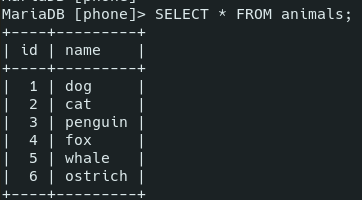
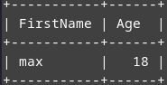
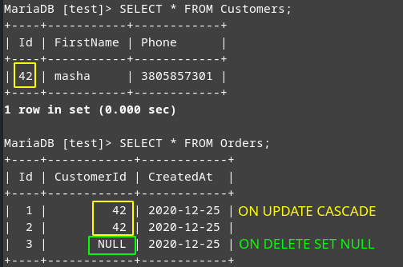

# Attributes, Keys

- [Attributes, Keys](#attributes-keys)
	- [Attributes](#attributes)
		- [`PRIMARY KEY`](#primary-key)
		- [`AUTO_INCREMENT`](#auto_increment)
		- [`UNIQUE`](#unique)
		- [`NOT NULL`](#not-null)
		- [`DEFAULT`](#default)
		- [`CHECK`](#check)
		- [`CONSTRAINT`](#constraint)
	- [`FOREIGN KEY`](#foreign-key)

***

## Attributes

### `PRIMARY KEY`

Serves as a unique identifier of each record in the table. 

It's always `UNIQUE` and `NOT NULL`.

There're 2 ways of setting it: right near the field and later.

```sql
-- 1
CREATE TABLE Customers (
  UserID INT PRIMARY KEY,
	Age INT 
);

-- 2
CREATE TABLE Customers (
  Id INT,
	Age INT,
	PRIMARY KEY(Id)
);
```

It can be **composite** and use several fields to identify the record. The following table can't have records with the same 'OrderId' and 'ProductId' values pair:

```sql
CREATE TABLE OrderLines (
	OrderId INT,
	ProductId INT,
	Quantity INT,
	Price DECIMAL,
	PRIMARY KEY(OrderId, ProductId)
);

-- OrderId = 33, ProductId = 42 -> OK
INSERT INTO OrderLines 
VALUES (33, 42, 1, 100);

-- `OrderId` = 33, different ProductId -> OK
INSERT INTO OrderLines 
VALUES (33, 64, 1, 125);

-- Again OrderId = 33, ProductId = 42 -> FAIL
INSERT INTO OrderLines 
VALUES (33, 42, 1, 125);
```

***

### `AUTO_INCREMENT`

Automatically **increments** the value of the new inserted records. 

Works only for **numeric types**. 

It must be some kind of a **key** (`PRIMARY KEY`, `UNIQUE`, etc.)

Each table can only have **one** `AUTO_INCREMENT` column. 

You **don't need** to set the value of the *auto increment* field when isert a new record into the table, it will be added automatically.

```sql
CREATE TABLE animals (
	ID INT PRIMARY KEY AUTO_INCREMENT,
	petName CHAR(30)
 );

INSERT INTO animals (petName) 
VALUES
	('dog'),('cat'),('penguin'),
	('fox'),('whale'),('ostrich');

SELECT * FROM animals;
```



***

### `UNIQUE`

Indicates that the field can only store unique values. 

Any number of fields can be `UNIQUE`.

```sql
-- 1st way
CREATE TABLE Customers (
	ID INT PRIMARY KEY AUTO_INCREMENT,
	Phone VARCHAR(20) UNIQUE
);

-- 2nd way
CREATE TABLE Customers (
	ID INT,
	Phone VARCHAR(20),
	UNIQUE(ID, Phone)
);
```

***

### `NOT NULL`

By default, fields will allow `NULL` values if no data was provided. 

We can set some fields to `NOT NULL`. This way you won't be able to insert new records skipping these values. 

`PRIMARY KEY` is always `NOT NULL`. 

```sql
CREATE TABLE Customers
(
    Id INT PRIMARY KEY AUTO_INCREMENT,
    Age INT,	-- NULL
    FirstName VARCHAR(20) NOT NULL,	-- NOT NULL
    LastName VARCHAR(20) NOT NULL,	-- NOT NULL
    Email VARCHAR(30) NULL,		-- NULL
    Phone VARCHAR(20) NULL		-- NULL
);

INSERT INTO Customers 
SET FirstName = 'Max', Email = 'max@bar.com';
```

We couldn't insert a new record:


***

### `DEFAULT`

Sets default values for new records. 

```sql
CREATE TABLE Customers (
	FirstName VARCHAR(20),
	Age INT DEFAULT 18
);

INSERT INTO Customers 
SET FirstName = 'max';

SELECT * FROM Customers;
```



***

### `CHECK`

Sets a restriction for the possible values range.

```sql
CREATE TABLE Customers (
    firstName VARCHAR(20),
    Age INT DEFAULT 18 CHECK(Age > 0 AND Age < 100)
);

INSERT INTO Customers
SET Age = 121;	-- Error!
```


As usual, the 2nd way of using it:

```sql
( 
	-- ...
	CHECK((Age > 0 AND Age < 100) AND (Email !='') AND (Phone !=''))
);
```

***

### `CONSTRAINT`

Using it, we can set names for our constraints. We can use them to delete or change these restrictions later.

```sql
CREATE TABLE Customers (
	Id INT AUTO_INCREMENT,
	Age INT,
	FirstName VARCHAR(20) NOT NULL,
	LastName VARCHAR(20) NOT NULL,
	Email VARCHAR(30),
	Phone VARCHAR(20) NOT NULL,
	CONSTRAINT customers_pk PRIMARY KEY(Id),
	CONSTRAINT customer_phone_uq UNIQUE(Phone),
	CONSTRAINT customer_age_chk CHECK(Age > 0 AND Age < 100)
);

-- Success
INSERT INTO Customers 
SET 
	FirstName = 'max', 
	LastName = 'bar', 
	Phone = 3805984723;

-- Fail
INSERT INTO Customers 
SET 
	FirstName = 'max', 
	LastName = 'bar', 
	Phone = 3805984723, 
	Age = 121;
```

***


## `FOREIGN KEY`

Establishes connections between tables and prevents invalid data insertion into the `FOREIGN KEY` column (it has to be one of the values contained in the referenced/parent table). 

`FOREIGN KEY` is set in the **child** table and refers to the `PRIMARY KEY` of the **parent** table.  

The tables are connected through their **constraints**:

- you **can't** update/delete the parent table if it breaks the link between the tables
- you **can't** insert a value into the child table that refers to a non-existent value in the parent table

***

`ON DELETE` and `ON UPDATE` directives set up actions to perform when the connected column from the parent table is changed or deleted:

- `CASCADE` - automatically change or delete records from the child table right after the parent table
- `SET NULL` - self-explainatory (the field should allow NULL)
- `RESTRICT` - rejects deleting or changing records in the parent table if they are referred in the child table
- `NO ACTION` - the same
- `SET DEFAULT` - sets the default value for the current column

***

Example:

```sql
-- Create the parent and the child table

CREATE TABLE Customers (
	Id INT PRIMARY KEY AUTO_INCREMENT,
	FirstName VARCHAR(20) NOT NULL,
	Phone VARCHAR(20) NOT NULL UNIQUE
);

CREATE TABLE Orders (
	Id INT PRIMARY KEY AUTO_INCREMENT,
	CustomerId INT,
	CreatedAt Date,
	CONSTRAINT FK_CustomerOrder FOREIGN KEY (CustomerId) REFERENCES Customers (Id) 
	ON UPDATE CASCADE ON DELETE SET NULL
);

-- Fill the tables with data:

INSERT INTO Customers 
	(FirstName, Phone)
VALUES 
	('petya', 3805984723),
	('masha', 3805857301);

INSERT INTO Orders 
	(CustomerId, CreatedAt)
VALUES 
	(2, NOW()),
	(2, NOW()),
	(1, NOW());

-- See the results

SELECT * FROM Customers;
SELECT * FROM Orders;

-- Error - no CustomerId = 3 in the parent table yet

INSERT INTO Orders 
	(CustomerId, CreatedAt)
VALUES 
	(3, NOW());
```

That's what we have now:


Now let's delete and update the referred records from the **parent** table:

```sql
-- Update one parent record

UPDATE Customers 
SET Id = 42
WHERE Id = 2;

-- Delete another parent record

DELETE FROM Customers 
WHERE Id = 1;

-- See the results

SELECT * FROM Customers;
SELECT * FROM Orders;
```



***

To add `FOREIGN KEY` afther the table is already created:

```sql
ALTER TABLE Orders
ADD 
	CONSTRAINT FK_CustomerOrder	/* optional */
	FOREIGN KEY (CustomerId) REFERENCES Customers(Id)
	ON MODIFY RESTRICT;
```

To drop it:

```sql
ALTER TABLE Orders
DROP FOREIGN KEY FK_CustomerOrder;
```

To change it, just drop + add.

***

