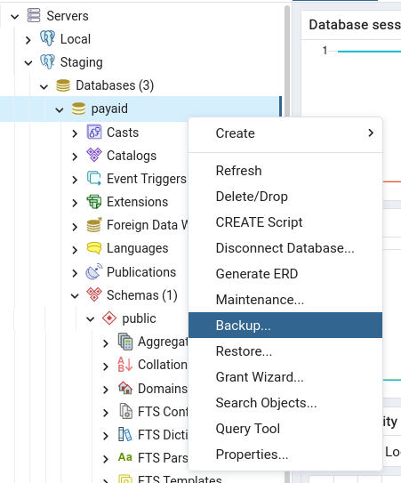
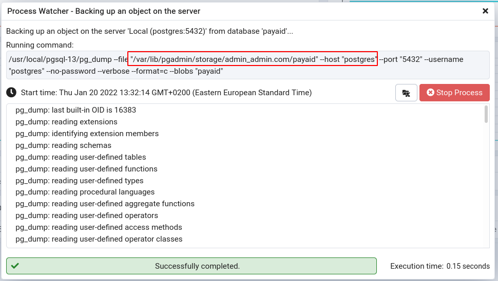

# Postgres & pgadmin

- [Postgres & pgadmin](#postgres--pgadmin)
  - [pgadmin](#pgadmin)
    - [Database dump](#database-dump)

***

## pgadmin

### Database dump

We're using `pgadmin` here. 

1. Dump (copy) your databse.

Leave the dump options default. The copy of your DB is saved in your Docker `pgadmin` container.

2. (Optional) **Access/copy** your DB dump if you need.
   1. Connect to your `pgadmin` container.
   2. Enter the `postgres` container.
   3. Enter the path you saw while the dump was creating: `/var/lib/pgadmin/storage/admin_admin.com`. There you can find the copies of your DB.
   4. In another Terminal - copy your file from the Docker container: `ocker cp 4e890ef1a556:/var/lib/pgadmin/storage/admin_admin.com/payaid-staging-new /home/max/`

3. **Restore** using `pgadmin`: 
   1. Click the `Restore` button (just below `Backup`) and choose your file. You may also want to to add "Clean before insert" option. Sometimes you would need to drop your existing schema completely, recreate `public` schema and `rdsadmin` Login/Group role (below).

