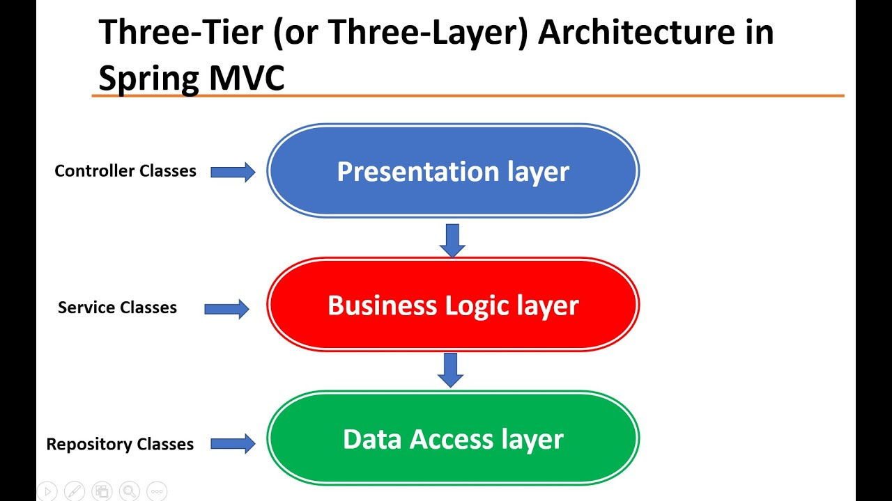
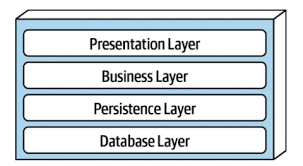

# Types of architecture

- [Types of architecture](#types-of-architecture)
  - [Multi-layered architecture](#multi-layered-architecture)
    - [Theory](#theory)
    - [Example](#example)
    - [Pros and Cons](#pros-and-cons)
  - [Clean Architecture](#clean-architecture)
    - [Sources](#sources)


***


## Multi-layered architecture

### Theory



The most common and obvious type. Usually consists of 3-5 layers, such as: 

- presentation (responsible for getting requests and sending responses to clients)
- logic (the main logic of the application/feature)
- persistence (here we usually make the DB-retreived data mapping) - this level is often united with the previous one
- database (handles database interaction and nothing else)



Each level can only communicate with its neighbors. 

The lower layers cannot access the higher ones (you shouldn't call an endpoint service from the database repository). 

Sometimes some layers can be considered **open** - means they can be skipped. For example, if we only need to retreive the user from the DB, we can skip the logic level (as there is no logic).

***

### Example

```ts
// Presentation layer
app.post('/send-letter', async (req, res, next) => {
  const { body } = req;
  
  // Don't handle anything on the presentation level, pass the control to the business logic layer!
  const response = await SendLetterService.sendLetter(body);

  return response;
})
```

```ts
// Logic layer
const SendLetterService = {
  sendLetter: async (postInput) => {
    // Some business logic
    if (body.user.isBlocked) {
      throw new Error("The blocked user can't post");
    }
    
    // Pass the database intefaction to another layer
    await PostModel.createPost(postInput);
  }
}
```

```ts
// Database layer
await PostModel.create(input);
```

The persistence layer, if present, contains the infrastructure - Sendgrid, Twilio and other specific services for example. 

```ts
// Persistence layer
const SendgridService = {
  sendEmail: async (input) => {
    await sendgridSdk.send(input);
  }
}
```

***

### Pros and Cons

**Pros**:

- Each level is **independent** from the others and is only responsible for its own set of functions. This gives us the needed level of abstraction (which can be increased by adding more layers). E.g. Presentation doesn't care __how__ the data is retreived from the database it just asks __what__ it wants to receive.
- The abstraction we have allows us to change each layer the way we want without any risks (as long as we maintain the API which connects them).
- Easy to understand.
- Easy to work in team with.

**Cons**:

- If we have too many layers, the application can become excessively complex.
- The application can become slower as the control has to pass through all the layers each time.

***


## Clean Architecture

Based on assumptions that the architecture should: 

- don't depend on the UI
- don't depend on the DB, frameworks or libs
- be testable

This is achieved by using separate **layers** and the `dependency rule`.


The `dependency rule` says that the inner layers are independent from the outer ones. Business logic doesn't know anything about the DB, the UI or the frameworks used. 

The layer structure:

- `Core` or `Entities` - models and abstractions
- `Use cases` (interactors) - business logic
- `Adapters` - map incoming and outcoming data (usually implemented together in `controllers`)
- `Frameworks` - the outer layer with the UI, DB, http-client, etc.

This might seem counterintuitive: the DB is not the core layer but the outer layer? Yes, this is because this architecture aims to be as much **framework-independent** as possible, so it wouldn't matter which database, ORM, UI or framework you're using - the `Entities` and `Use cases` will stay the same. 

The transition between the layers is made using **two interfaces** (boundaries) that both belong to the inner layer:

- one for the request
- one for the response

They are needed for the inner layer to be able to pass data to the outer one without depending on it.

**Example:**

1. `Core`. Only contains abstractions and entity classes that are never going to change. They depend on nothing but everybody depends on them.

```ts
// Entities
export class Author {
  firstName: string;
  lastName: string;
}

export class Book {
  title: string;
  author: Author;
  publishDate: Date;
}
```

```ts
// Abstractions
export abstract class ICrmServices {
  abstract bookAdded(book: Book): Promise<boolean>;
}
  
export abstract class IGenericRepository<T> {
  abstract getAll(): Promise<T[]>;
  abstract get(id: string): Promise<T>;
  abstract create(item: T): Promise<T>;
  abstract update(id: string, item: T);
}

export abstract class IDataServices {
  abstract authors: IGenericRepository<Author>;
  abstract books: IGenericRepository<Book>;
}
```

2. `Use cases`. 

For example, 'add new book' use case consists of such actions:

- check that the book doesn't exist in the DB
- create a new book object
- put this object into the DB
- notify the CRM system about the new book

Such use case will have 2 dependencies: 

- DB service
- CRM service

But we cannot on our 2nd layer depend on the 4th layer - this will break the `dependency rule`. So instead, we will depend on some abstractions around these services. These abstractions will never change, even if the specific DB or ORM changes. So now we are going to depend on:

- Data service abstraction
- CRM service abstraction

```ts
import { Injectable } from '@nestjs/common';
import { Book } from '../../core/entities';
import { IDataServices, ICrmServices } from '../../core/abstracts';

@Injectable()
export class BookUseCases {
  constructor(
    private dataServices: IDataServices,
    private crmServices: ICrmServices,
  ) {}

  getAllBooks(): Promise<BookDbModel[]> {
    return this.dataServices.books.getAll();
  }

  getBookById(id: any): Promise<BookDbModel> {
    return this.dataServices.books.get(id);
  }

  async createBook(book: Book): Promise<BookDbModel> {
    try {
      // calls to our abstract dependencies
      const createdBook = await this.dataServices.books.create(book); // BookDbModel
      await this.crmServices.bookAdded(createdBook);

      return createdBook;
    } catch (error) {
      throw error;
    }
  }

  updateBook(bookId: string, book: Book): Promise<BookDbModel> {
    return this.dataServices.books.update(bookId, book);
  }
}
```

3. `Adapters` are:

- `controllers` - input mappers:
  - receive the user input (some pre-defined DTO)
  - validate and sanitize it
  - convert it into a model that the `use case` expect
  - call the `use case` with this prepared model
- `presenters` - output mappers

Often they are implemented together in controllers.

We don't have any business logic here, only data formatting.

```ts
// Input
import { IsString, IsNotEmpty, IsDate } from 'class-validator';

export class CreateBookDto {
  @IsString()
  @IsNotEmpty()
  title: string;

  @IsNotEmpty()
  authorId: any;

  @IsNotEmpty()
  genreId: any;

  @IsDate()
  publishDate: Date;
}
```

```ts
// Output
import { Book } from '../entities';

export class CreateBookResponseDto {
  success: boolean;
  createdBook: Book;
}
```

```ts
// Controller
import { Controller, Post, Body } from '@nestjs/common';
import { CreateBookDto, CreateBookResponseDto } from './dtos';
import { BookUseCases, BookFactoryService } from '../services/use-cases/book';

@Controller('api/book')
export class BookController {
  constructor(
    private bookUseCases: BookUseCases,
    private bookFactoryService: BookFactoryService,
  ) {}

  @Post()
  async createBook(@Body() bookDto: CreateBookDto) {
    const createBookResponse = new CreateBookResponseDto();

    try {
      const book = this.bookFactoryService.createNewBook(bookDto);  // Book
      await this.bookUseCases.createBook(book); // BookDbModel

      createBookResponse.success = true;
      createBookResponse.createdBook = book;
      
    } catch (error) {
      createBookResponse.success = false;
    }

    return createBookResponse;
  }
}
```

4. `Frameworks`. Specific database, framework, error handling, logging etc.

```ts
// Mongoose models
import { Prop, Schema, SchemaFactory } from '@nestjs/mongoose';
import * as mongoose from 'mongoose';
import { Author, Genre } from './';

export type BookDocument = BookSchemaTemplate & Document;

@Schema()
export class BookSchemaTemplate {
  @Prop({ required: true, unique: true })
  title: string;

  @Prop({ type: mongoose.Schema.Types.ObjectId, ref: 'Author', required: true })
  author: Author;

  @Prop({ type: mongoose.Schema.Types.ObjectId, ref: 'Genre', required: true })
  genre: Genre;

  @Prop()
  publishDate: Date;
}

export const BookSchema = SchemaFactory.createForClass(BookSchemaTemplate);
```

```ts
// Mongo generic repository
import { Model } from 'mongoose';
import { IGenericRepository } from '../../../core';

export class MongoGenericRepository<T> implements IGenericRepository<T> {
  private _repository: Model<T>;
  private _populateOnFind: string[];

  constructor(repository: Model<T>, populateOnFind: string[] = []) {
    this._repository = repository;
    this._populateOnFind = populateOnFind;
  }

  getAll(): Promise<T[]> {
    return this._repository.find().populate(this._populateOnFind).exec();
  }

  get(id: any): Promise<T> {
    return this._repository.findById(id).populate(this._populateOnFind).exec();
  }

  create(item: T): Promise<T> {
    return this._repository.create(item);
  }

  update(id: string, item: T) {
    return this._repository.findByIdAndUpdate(id, item);
  }
}
```

```ts
// Mongo data service
@Injectable()
export class MongoDataServices implements IDataServices, OnApplicationBootstrap {
  authors: MongoGenericRepository<Author>;
  books: MongoGenericRepository<Book>;

  constructor(
    @InjectModel(Author.name)
    private AuthorRepository: Model<AuthorDocument>,
    @InjectModel(Book.name)
    private BookRepository: Model<BookDocument>,
  ) {
    this.authors = new MongoGenericRepository<AuthorSchemaTemplate>(this.AuthorRepository);
    this.books = new MongoGenericRepository<BookSchemaTemplate>(this.BookRepository, ['author']);
  }
}
```

```ts
// Mongo data module
@Module({
  imports: [
    MongooseModule.forFeature([
      { name: Author.name, schema: AuthorSchema },
      { name: Book.name, schema: BookSchema },
    ]),
    MongooseModule.forRoot(DATA_BASE_CONFIGURATION.mongoConnectionString),
  ],
  providers: [
    {
      provide: IDataServices,
      useClass: MongoDataServices,  // Change this for a different service (using the different DB or ORM) if you need
    },
  ],
  exports: [IDataServices],
})
export class MongoDataServicesModule { }  
```

If we want to change our ORM or even the DB itself, we need to:

- write the new **data repository** and **data service** that follow the `IDataServices` abstract that we have defined earlier,
- provide this new data service to data module (in `useClass` in the exsmple above)

***

### Sources

1. [The article](https://betterprogramming.pub/clean-node-js-architecture-with-nestjs-and-typescript-34b9398d790f)


