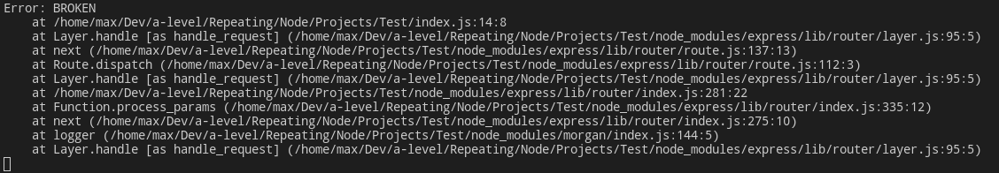
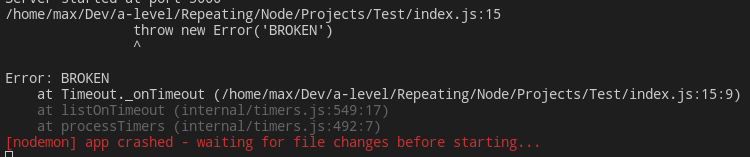
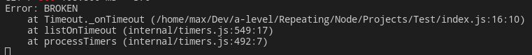

# Error handling

- [Error handling](#error-handling)
	- [Sync Errors](#sync-errors)
	- [Async Errors](#async-errors)
	- [Custom error-handling middleware](#custom-error-handling-middleware)

Express catches all errors that occur while running route handlers and middleware. 


## Sync Errors

Express has a default handler that will automatically catch and process sync errors inside route handlers and middleware:

```javascript
app.get('/', function (req, res) {
  	throw new Error('BROKEN') // Express will catch this on its own.
})
```



***


## Async Errors

Async errors should be caught manually and thrown using `next(err)` for the Express default handler to be able to process them. 

Unhandled error chashes the app:

```javascript
// Oops! An error happened!
app.get('/', (req, res, next) => {
	setTimeout(() => {
		throw new Error('BROKEN')
	}, 100)
})
```



To handle async errors use `try..catch`. The Express default handler will catch the error and your app will survive:

```javascript
// Oops! An error occured! But now we caught it. 
app.get('/', (req, res, next) => {
	setTimeout(() => {
		try {
			throw new Error('BROKEN')
		} catch (err) {
			next(err)
		}
	}, 100)
})
```



***

For errors returned from asynchronous functions invoked by route handlers and middleware, you must pass them to the next() function, where Express will catch and process them.

```javascript
app.get('/', function (req, res, next) {
	fs.readFile('/file-does-not-exist', /*async callback */ function (err, data) {
		if (err) {
			next(err) // Pass errors to Express.
		} else {
			res.send(data)
		}
	})
})
```
***

If the callback in a sequence provides no data, only errors, you can simplify the code. `next()` will be called as a callback and this will automatically delegate the possible errors to the Express default handler. 

```javascript
app.get('/', [
	function (req, res, next) {
		fs.writeFile('/inaccessible-path', 'data', next)
	},
	function (req, res) {
		res.send('OK')
	}
])
```

You could also use a chain of handlers to rely on synchronous error catching, by reducing the asynchronous code to something trivial.

```javascript
app.get('/', [
	function (req, res, next) {
		fs.readFile('/maybe-valid-file', 'utf-8', function (err, data) {
			res.locals.data = data
			next(err)
		})
	},
	function (req, res) {
		res.locals.data = res.locals.data.split(',')[1]
		res.send(res.locals.data)
	}
])
```

If `readFile` causes an error, then it passes the error to Express, otherwise you quickly return to the world of synchronous error handling in the next handler in the chain. Then, the example above tries to process the data. If this fails then the synchronous error handler will catch it. If you had done this processing inside the readFile callback then the application might exit and the Express error handlers would not run.

***

For `Promises` just pass `next` to the last `catch()` for Express to catch errors.

```javascript
app.get('/', function (req, res, next) {
	Promise.resolve().then(function () {
		throw new Error('BROKEN')
	}).catch(next) // Errors will be passed to Express.
})
```
***


## Custom error-handling middleware 

Put your custom error handling middleware at the end of your app. 

```javascript
// Emulate error
app.use((req, res, next) => {
	// create an error object
	const error = new Error('Not found')
	error.status = 404
	// and throw it further
	next(error)
})

// Ultimate catcher returning JSON with a message
app.use((error, req, res, next) => {
	// This line delegates to the default Express error handler and helps avoid errors in case when we've already started to write a response when error occured. 
	if (res.headersSent) {
		return next(error)
	}

	res.status(error.status || 500)
	res.json({
		error: {
			message: error.message
		}
	})
})

/* Response: 
{
    "error": {
        "message": "Not found"
    }
}
*/
```