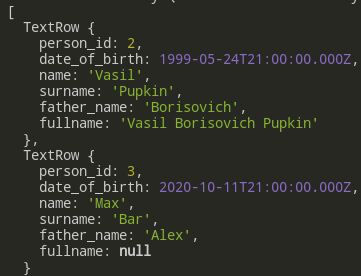

# MySQL & Node

- [MySQL & Node](#mysql--node)
	- [Sources](#sources)
	- [Install & Run](#install--run)
		- [`mysql.`**`createConnection`**` (options)`](#mysqlcreateconnection-options)
		- [`connection.`**`connect`**` (err => {})`](#connectionconnect-err--)
		- [`connection.`**`end`**` (err => {})`](#connectionend-err--)
		- [`connection.`**`destroy`**` ()`](#connectiondestroy-)
		- [Promisification](#promisification)
	- [Methods](#methods)
		- [`connection.`**`query`**` (sqlString, (err, result, metadata) => {})`](#connectionquery-sqlstring-err-result-metadata--)

***

## Sources

1. ku

***


## Install & Run

```bash
npm i mysql2
```

```js
const mysql = require('mysql2')
```

***

### `mysql.`**`createConnection`**` (options)`

Returns the `connection` object.

```js
const connection = mysql
	.createConnection({
		host: 'localhost',
		user: 'root',
		database: 'test',
		password: 'Rfgkzrfgkz'
	})
```

***

### `connection.`**`connect`**` (err => {})`

```js
connection.connect((err) => {
	if (err) {
		return console.error(err)
	}
	console.log('Connected to the MySQL server successfully')
})
```

***

### `connection.`**`end`**` (err => {})`

Regular connection closing (will let the DB finish tasks in the queue).

```js
connection.end((err) => {
	if (err) {
		return console.error(err)
	}
	console.log('Connected to the MySQL server closed.')
})
```

### `connection.`**`destroy`**` ()`

Kill the connection immediately.

```js
connection.destroy()
```

***

### Promisification

Calling `promise()` is optional and promisifies the `connection` making it return `Promise`. This way you can get rid of callbacks.

```js
const connection = mysql
	.createConnection({
		host: 'localhost',
		user: 'root',
		database: 'test',
		password: 'Rfgkzrfgkz'
	})
	.promise()			// <--- Promisify

const sql =
	'INSERT INTO person (date_of_birth, name, surname, father_name) values (?, ?, ?, ?)'
const user = ['2000-00-01', 'Alice', 'Warner', 'Jack']

connection
	.query(sql, user)	// <--- No callback anymore, it doesn't work
	.then((result) => console.log(result))
	.catch((err) => console.error(err))
```

***


## Methods

### `connection.`**`query`**` (sqlString, (err, result, metadata) => {})`

```js
connection.query('Select * from person', (err, result, fields) => {
	if (err) {
		return console.error(err)
	}
	console.log(result)
	console.log(fields) // fields meta-data
})
```



`query()` also sets the **connection** so you can even do without `connect()`. 

***

The better practice is to use **parameters** defined by the **question marks `?`**. This can help against sql-injections **(??? clarify ??)**

```js
const user = ['2000-00-01', 'Alice', 'Warner', 'Jack']
const sql =
	'INSERT INTO person (date_of_birth, name, surname, father_name) values (?, ?, ?, ?)'

connection.query(sql, user, (err, result, fields) => {
	if (err) {
		return console.error(err)
	}
	console.log(result)
})
```

***


