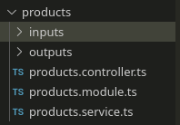

# Nest
- [Nest](#nest)
  - [Links](#links)
  - [Intro](#intro)
    - [Install & Run](#install--run)
  - [Entities](#entities)
    - [Modules](#modules)
  - [Top API](#top-api)

***

## Links

- [Video tutorial](https://youtu.be/abdgy72csaA)

***

## Intro

### Install & Run

```bash
npm i -g @nestjs/cli

nest new test
```

You can generate entities:

```bash
# Help
nest generate --help

# Controller
nest generate controller products
nest g co products

# Services
nest g s products
```

***


## Entities

- **Modules**
  - `nest g mo module_name`
  - wrapped in `@Module()` wrapper
  - contain metadata that is used to organize the app structure
  - connect controllers and services to each other and other modules
- **Controllers**
  - `nest g co controller_name`
  - wrapped in `@Controller()` wrapper
  - manage routing and set certain parameters
  - call Services to handle requests
- **Services** 
  - `nest g s service_name`
  - wrapped in `@Injectable()` wrapper
  - store all the logic
  - if you want to use them in other modules, you need to **inject** them in the `constructor` (see further)

Example of a typical feature structure:



***

### Modules

`@Module({})` decorator takes a single object whose properties descibe the module:

- `imports` - an array of Modules that you import. Their providers (Services) will be automatically available in the current module once you **inject** them in Services.
- `controllers` - Controller(-s) of the current module (if any)
- `providers` - Services of the current module. Services of other modules that you already mentioned in `imports` are already available - no need to mention them here.
- `exports` - providers (Services) of this Module that should be available (public) in other modules that import this Module. 

Example `cats.module`:

```ts
import { Module } from '@nestjs/common';
import { CatsController } from './cats.controller';
import { CatsService } from './cats.service';

@Module({
  imports: [
    ConfigModule,
    JwtModule,
  ]
  controllers: [CatsController],
  providers: [CatsService],
  exports: [CatsService]
})
export class CatsModule {}
```

Now every module that imported `CatsModule`, has access to `CatsService`. 

***

Global modules are accessible anywhere without the need to import them:

```ts
@Global
@Module({
  imports: [],
  controllers: [AppController],
  providers: [AppService],
})
export class MyModule {}
```

Modules are **singletons** by default, so the same instance can be shared between modules effortlessly.

***

Dynamic modules.

###

***


## Top API

Example project.

```bash
nest new top-api
cd top-api
tsc --init
```


