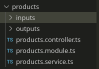

# Nest
- [Nest](#nest)
  - [Links](#links)
  - [Intro](#intro)
    - [Install & Run](#install--run)
  - [Basics](#basics)
    - [Inversion of control and Dependency injection](#inversion-of-control-and-dependency-injection)
    - [Basic architecture](#basic-architecture)
  - [Modules](#modules)
    - [Intro](#intro-1)
    - [Global modules](#global-modules)
    - [Dynamic modules](#dynamic-modules)
  - [Providers](#providers)
    - [Types](#types)
      - [`useClass`](#useclass)
      - [`useValue`](#usevalue)
      - [`useFactory`](#usefactory)
      - [`useExisting`](#useexisting)
  - [Controllers](#controllers)
    - [Scope](#scope)
  - [Other concepts](#other-concepts)
    - [DTO](#dto)
    - [Pipes](#pipes)
      - [Intro](#intro-2)
      - [Binding pipes](#binding-pipes)
      - [Custom pipes](#custom-pipes)
      - [Providing defaults](#providing-defaults)
  - [Middleware](#middleware)
  - [Exception Filters](#exception-filters)
    - [Catch everything](#catch-everything)
      - [`HttpAdapter`](#httpadapter)
  - [Guards](#guards)

***

## Links

- [Video tutorial](https://youtu.be/abdgy72csaA)

***

## Intro

### Install & Run

```bash
npm i -g @nestjs/cli

nest new test
``` 

You can generate entities:

```bash
# Help
nest generate --help

# Controller
nest generate controller products
nest g co products

# Services
nest g s products
```

***

## Basics

### Inversion of control and Dependency injection

1. [Video](https://youtu.be/EPv9-cHEmQw)
2. [Good explanation](https://stackoverflow.com/a/3108/12166570)

**Inversion of control** (IOC) to create instances of dependencies first and latter instance of a class (optionally injecting them through constructor). Instead of creating an instance of the class first and then the class instance creating instances of dependencies. 

Thus, inversion of control inverts the flow of control of the program. Instead of the callee controlling the flow of control (while creating dependencies), the caller controls it.

This is what `D` in `SOLID` is.

```ts
// Direct control - WE call Client and IT calls Service
class Service { }

class Client {
  constructor() {
    const service = new Service();
  }
}

const client = new Client();
```

```ts
// IOC with DI - WE call Service and then WE call Client
class Service {}

class Client {
  constructor(service) {
    const service = service;
  }
}

const service = new Service();
const client = new Client(service);
```


***

**Dependency injection** (DI) generally means passing a dependent object as a parameter to a method, rather than having the method create the dependent object. This is often used to implement IOC.

Here we **rely on abstractions rather than concrete implementations.** Any implementation the meets the requirements (__implements__ some interface) can be passed as a parameter.

***

Direct flow with concrete instances **(BAD)**:

```ts
class User {
  // Concrete database - hard to change to Oracle everywhere if we needed
  database: PostgresDatabase;

  // No injection - virtually impossible to test as we can't easily mock the PostgresDatabase instance
  constructor() {
    // Concrete Database
    this.database = new PostgresDatabase();
  }

  async add(data: string) {
    this.database.persist(data);
  }
}


class PostgresDatabase {
  async persist(data: string) {
    console.log(`Postgres has inserted ${data}`);
  }
}

class OracleDatabase {
  async persist(data: string) {
    console.log(`Oracle has inserted ${data}`);
  }
}


const user = new User();
```

***

IOC with DI **(GOOD)**:

```ts
class User {
  // Abstract database
  database: Database;

  // Inject a dependency
  constructor(database: Database) {
    this.database = database;
  }

  async add(data: string) {
    this.database.persist(data);
  }
}


interface Database {
  persist: (data: string) => void;
}

class PostgresDatabase implements Database {
  async persist(data: string) {
    console.log(`Postgres has inserted ${data}`);
  }
}

class OracleDatabase implements Database {
  async persist(data: string) {
    console.log(`Oracle has inserted ${data}`);
  }
}


const postgres = new PostgresDatabase():
const user = new User(postgres);
```

***

### Basic architecture

- **Modules**
  - `nest g mo module_name`
  - wrapped in `@Module()` wrapper
  - contains metadata that is used to organize the app structure
  - connects controllers and services to each other and other modules
- **Controllers**
  - `nest g co controller_name`
  - wrapped in `@Controller()` wrapper
  - manage routing and set certain parameters
  - call Services to handle requests
- **Services** 
  - `nest g s service_name`
  - wrapped in `@Injectable()` wrapper
  - store all the logic
  - if you want to use them in other modules, you need to **inject** them in the `constructor` (see further)

Example of a typical feature structure:



The full component can be generated using `nest g resource component_name`

***

## Modules

### Intro

`@Module({})` decorator takes a single object whose properties descibe the module:

- `imports` - an array of Modules that you import. Their providers (Services) will be automatically available in the current module once you **inject** them.
- `controllers` - Controller(-s) of the current module (if any)
- `providers` - Services of the current module. Services of other modules that you already mentioned in `imports` are already available - no need to include them here.
- `exports` - providers (Services) of this Module that should be available (public) in other modules that import this Module. 

Modules are **singletons** by default, so the same instance can be shared between modules effortlessly.

Example `cats.module`:

```ts
import { Module } from '@nestjs/common';
import { CatsController } from './cats.controller';
import { CatsService } from './cats.service';

@Module({
  imports: [
    ConfigModule,
    JwtModule,
  ]
  controllers: [CatsController],
  providers: [CatsService], // to make it available within this module
  exports: [CatsService]    // to make it available outside
})
export class CatsModule {}
```

Now every module that imported `CatsModule`, has access to `CatsService`. 

***

### Global modules

You need to import them in the `app.module` once, and they will be accessible throughout the app:

- either `@Global` decorator for regular Modules
- or `global: true` field in dynamic Modules

```ts
@Global
@Module({
  providers: [CoffeeService],
  exports: [CoffeeService],
})
export class CoffeeModule {}
```

Now you don't need to import `CoffeeModule` to inject `CoffeeService`.

This is useful for **configs** and **database connections**.

***

### Dynamic modules

Classes that have **static methods** that return the same object with `providers`, `exports`, etc. 

By convention, methods are often called: 

- `forRoot` - global ones
- `forFeature` - local ones

```ts
// database.module
import { Module, DynamicModule } from '@nestjs/common';
import { createDatabaseProviders } from './database.providers';
import { Connection } from './connection.provider';

@Module({
  providers: [Connection],
})
export class DatabaseModule {
  static forRoot(entities = [], options?): DynamicModule {
    const providers = createDatabaseProviders(options, entities);
    return {
      module: DatabaseModule,
      providers: providers,
      exports: providers,
    };
  }
}

// app.module
@Module({
  imports: [
    DatabaseModule.forRoot([UserEntity]),
  ]
})
```

***

## Providers

Providers are classes that can be **injected as dependencies**. In practice, these are Services, Factories, Repositories etc.

Use `private` TypeScript shorthand in the `constructor` to both **declare** and **initialize** your providers.

```ts
@Controller('coffee')
export class CoffeeController {
  constructor(
    private readonly coffeeService: CoffeeService,
  ) { }
}
```

Nest resolves dependencies by their **types** (injects the instance of `CoffeeService` in the example above).

If your class extends another provider, it may be more convenient to use this (generally not recommended) approach:

```ts

import { Injectable, Inject } from '@nestjs/common';

@Injectable()
export class HttpService<T> {
  @Inject('HTTP_OPTIONS')
  private readonly httpClient: T;
}
```

***

### Types

There're 4 types of Providers (F12 to `providers` and then `Provider` to see all of them):

- `useClass`
- `useFactory`
- `useValue`
- `useExisting` - use the existing provider under an alias

#### `useClass`

This notation

```ts
@Module({
  providers: [AppService],
})
export class AppModule {}
```

... is a full equivalent of this

```ts
@Module({
  providers: [{
    provide: AppService,
    useClass: AppService,
  }],
})
export class AppModule {}
```

#### `useValue`

Can be useful for mocking:

Try changing this

```ts
@Module({
  controllers: [ProductsController],
  providers: [ProductsService],
})
export class ProductsModule {}
```

... to this: 

```ts
@Module({
  controllers: [ProductsController],
  providers: [{
    provide: ProductsService,
    useValue: {
      getAll() {
        return 'mocked getAll';
      }
    },
  }],
})
export class ProductsModule {}
```

#### `useFactory`

Useful when we want to provide a service with some arguments attached (e.g. configs).

```ts
@Module({
  providers: [
    {
      provide: SendGridService, // The name of the provider that will be used in the outside world
      inject: [ConfigService],  // Arguments for the factory function below
      useFactory: (configService: ConfigService) => { // The factory function that should return an instance of a Service or other provider
        const sendGridOptions = configService.get<ISendgridOptions>('sendgrid');
        if (!sendGridOptions) {
          throw new Error("Couldn't load Sendgrid configs");
        }
        return new SendGridService(sendGridOptions);
      },
    },
  ],
})
export class ProductsModule {}
```

#### `useExisting`

Provides new name for an existing Provider.

```ts
@Module({
  provider: [{
    provide: 'CoolService',
    useExisting: ProductsService,
  }]
})
export class ProductsModule {}
```

***

## Controllers

You need to **inject** Providers (Services) into the `constructor` of your controllers. 

Nest uses **types** (or alternatively - strings and Symbols) to recognize what to inject. 

```ts
@Controller('products')
export class ProductsController {
  constructor(
    private readonly productsService: ProductsService,  // type says Nest what to inject
  ) { }

  // ...
}
```

```ts


@Module({
  controllers: [ProductController],
  providers: [{
    provide: 'products-service',
    useClass: ProductsService,
  }],
})
export class ProductsModule {}
```

```ts
@Controller('products')
export class ProductsController {
  constructor(
    @Inject('products-service') private productsService: any, // any works now because Nest uses the string to recognize the service
  ) { }

  // ...
}
```

***

### Scope

Nest has 3 [scopes](https://docs.nestjs.com/fundamentals/injection-scopes#injection-scopes):

- `DEFAULT` - Singleton. A single instance of the provider is shared across the entire application. All singleton providers are instantiated once the app bootstraps. 
- `REQUEST` - A new instance of the provider is created exclusively for each incoming request. The instance is garbage-collected after the request has completed processing.
- `TRANSIENT` - Each consumer that injects a transient provider will receive a new, dedicated instance.

**Local storage** is a good example of when to use a different Scope: each user needs to use its own instance of it, local storage should not be shared among all users. 

Another good example is a **chainable class**. It should be `REQUEST` to not create conflicts during chaining when different users send their requests. 

```ts
import { Injectable, Scope } from '@nestjs/common';

@Injectable({ scope: Scope.REQUEST })
export class LocalStorageService {}
```

And for custom providers:

```ts
{
  provide: 'CACHE_MANAGER',
  useClass: CacheManager,
  scope: Scope.TRANSIENT,
}
```

When you apply Scope to a Controller, you actually apply it all its handler methods. 

```ts
@Controller({
  path: 'cats',
  scope: Scope.REQUEST,
})
export class CatsController {}
```

***

Imagine the following dependency graph: `CatsController <- CatsService <- CatsRepository`.

If `CatsService` is defined as `REQUEST`-scoped, `CatsController` that depends on it, will also become one. `CatsRepository` will remain `DEFAULT` as it doesn't depend on Services that use it. 

***


## Other concepts

### DTO

**Data Transfer Object** is and object used to encapsulate data and send it from one application to another.

It helps us define input and output interfaces.

***

### Pipes

#### Intro

A [pipe](https://docs.nestjs.com/pipes#custom-pipes) is a class with the `@Injectable` decorator which `implements PipeTransform` interface.

Pipes have 2 use-cases:

- **transformation**: transform input data into the desired form (from string into number, from plain object into class, etc.)
- **validation**: pass the valid data through unchanged; throw an exception otherwise

Pipes operate on the **controller arguments**. The pipe is invoked just before the method invocation. 

If an **error** is thrown in the pipe, it's caught by the **exception filters** and **no controller is getting called**.

Nest comes with some out-of-the-box pipes (but you can also create your own ones):

- `ValidationPipe` (relies on `class-validator` and `class-transformer`)
- `ParseIntPipe`
- `ParseFloatPipe`
- `ParseBoolPipe`
- `ParseArrayPipe`
- `ParseUUIDPipe`
- `ParseEnumPipe`
- `DefaultValuePipe`
- `ParseFilePipe`

Some of them are clear transformation pipes (`ParseIntPipe`), others - validation pipes.

***

#### Binding pipes

To use a pipe, we need **to bind** an instance of the pipe class to the appropriate context.

There are several levels to bind the pipe to:

1. Parameter-scoped: pass the pipe as an argument to the `@Body()`, `@Param()`, `@Query`() decorators.

```ts
import { Get, Param, ParseIntPipe } from '@nestjs/common';

@Get(':id')
async findOne(@Param('id', ParseIntPipe) id: number) {
  return this.catsService.findOne(id);
}
```

In the example above:

- either `typeof id === 'number'`
- or an exception is thrown before the handler is called

We can pass either **a class**, or **an instance** (which allows us to customiza behavior):

```ts
@Get(':id')
async findOne(@Param('id', new ParseIntPipe({ errorHttpStatusCode: HttpStatus.GONE })) id: number) {
  return this.catsService.findOne(id);
}
```

2. Method-scoped

```ts
export class CreateCoffeeDto {
  @IsString()
  @IsNotEmpty()
  readonly name: string;

  @IsString()
  @IsNotEmpty()
  readonly brand: string;

  @IsOptional()
  @IsString({ each: true })
  readonly flavors: string[];
}

@Post()
@UsePipes(ValidationPipe)
create(@Body() createCoffeeDto: CreateCoffeeDto) {
  return createCoffeeDto;
}
```

3. Controller-scoped - applied to every route handler within the controller

```ts
@Controller('coffee')
@UsePipes(ValidationPipe)
```

4. Global-scoped - applied to every route handler within the application

```ts
// main.ts
const app = await NestFactory.create(AppModule);
app.useGlobalPipes(new ValidationPipe());   // <--- here
```

With some options:

```ts
// main.ts
app.useGlobalPipes(
  new ValidationPipe({
    whitelist: true,
    transform: true,
    forbidNonWhitelisted: true,
    forbidUnknownValues: true,
  }),
);
```

***

#### Custom pipes

Any pipe should `implement PipeTransform`:

```ts
import { ArgumentMetadata, Injectable, PipeTransform } from '@nestjs/common';

@Injectable()
export class CustomValidationPipe implements PipeTransform {
  transform(value: any, metadata: ArgumentMetadata) {
    // Place your validation/sanitization logic here
    return value;
  }
}
```

The `transform` method has 2 arguments:

- `value` - currently processed controller's argument
- `metadata` - its metadata

The `metadata` object has such properties:

```ts
export interface ArgumentMetadata {
  // @Body(), @Query(), @Param()
  type: 'body' | 'query' | 'param' | 'custom';
  // CreateCoffeeDto | String | etc. | undefined (if nothing is specified as type)
  metatype?: Type<unknown>;
  // `id` for `update(@Param('id') coffeeId: string)` | undefined 
  data?: string;
}
```

Example implementation of `ValidationPipe`:

```ts
import { ArgumentMetadata, BadRequestException, Injectable, PipeTransform } from '@nestjs/common';
import { plainToInstance } from 'class-transformer';
import { validate } from 'class-validator';

@Injectable()
export class ValidationPipe implements PipeTransform {
  async transform(value: any, metadata: ArgumentMetadata) {
    // You can't check primitive types as they are not assigned any decorators, use either `ParseIntPipe` and such built-in pipes, or built your own classes with decorator validation for primitives
    const types: Function[] = [String, Boolean, Number, Array, Object];

    if (!metadata.metatype || types.includes(metadata.metatype)) {
      return value;
    }

    // It compares the passed object to its type class (which, if you use class-validator, includes decorators)
    const errors = await validate(plainToInstance(metadata.metatype, value));

    if (errors.length) {
      // Customize it the way you want
      throw new BadRequestException(errors);
    }

    return value;
  }
}
```

#### Providing defaults

Built-in pipes expect `value` to be defined. so if there's a risk or receiving `undefined | null` use `DefaultValuePipe`:

```ts
@Get()
async findAll(
  @Query('activeOnly', new DefaultValuePipe(false), ParseBoolPipe) activeOnly: boolean,
  @Query('page', new DefaultValuePipe(0), ParseIntPipe) page: number,
) { }
```

***


## Middleware

- Middleware is a function which is called **before the route handler** (and before pipes) 
- It has access to `req, res, next`
- Can change `req, res`
- Should call `next` at the end (or end the request-response cycle)

Middleware is **unaware of the execution context**, including the handler that will be called and any of its parameters.

To write and use middleware:

- `Injectable` class that `implements NestMiddleware`
- `app.module` (or other module) `implements NestModule`

```ts
// logger.middleware.ts
import { Injectable, NestMiddleware } from '@nestjs/common';
import { NextFunction, Request, Response } from 'express';

@Injectable()
export class LoggerMiddleware implements NestMiddleware {
  use(req: Request, res: Response, next: NextFunction) {
    console.log('Request...');
    next();
  }
}

// app.module.ts
@Module({
  imports: [CoffeeModule],
  controllers: [AppController],
  providers: [AppService],
})
export class AppModule implements NestModule {
  configure(consumer: MiddlewareConsumer) {
    consumer.apply(LoggerMiddleware).forRoutes(
      {
        method: RequestMethod.ALL,
        path: '*', // express
      },
      {
        method: RequestMethod.ALL,
        path: '.*', // fastify
      },
    );
  }
}
```

Also, you can set middleware for a specific controller. Also, you can **exclude** some paths:

```ts
consumer
  .apply(
    cors(),
    helmet(),
    LoggerMiddleware,
  )
  .exclude({ path: 'cats', method: RequestMethod.GET })
  .forRoutes(CatsController);
```

***

If your middleware doesn't have dependencies, it's easier to define it as **functions**. In this case there's also a shortcut for applying it globally (but you can still apply it the usual way).

```ts
// logger.miggleware.ts
import { NextFunction, Request, Response } from 'express';

export function LoggerMiddleware(req: Request, res: Response, next: NextFunction) {
  console.log('Loggger middleware...');
  next();
}


// main.ts
const app = await NestFactory.create(AppModule);
app.use(LoggerMiddleware);  // <---
```

***

## Exception Filters

Nest had a built-in **execptions layer** which processes all unhandled rejections and replies with error messages to the clients.

If you want to override the default error handling behavior, you can use `@Catch()` and `implement ExceptionFilter`.

```ts
// http-exception.filter.ts
import { ExceptionFilter, Catch, ArgumentsHost, HttpException } from '@nestjs/common';
import { Request, Response } from 'express';

@Catch(HttpException) // handles the selected types of exceptions
export class HttpExceptionFilter implements ExceptionFilter {
  catch(exception: HttpException, host: ArgumentsHost) {
    const ctx = host.switchToHttp();
    const response = ctx.getResponse<Response>();
    const request = ctx.getRequest<Request>();
    const status = exception.getStatus();

    response
      .status(status)
      .json({
        statusCode: status,
        timestamp: new Date().toISOString(),
        path: request.url,
      });
  }
}

// coffee.controller.ts
@Post()
@UseFilters(HttpExceptionFilter)  // can also be used on the controller-level
create(@Body() createCoffeeDto: CreateCoffeeDto) {
  throw new ForbiddenException('ro');
}

// Output:
{
  "statusCode": 403,
  "timestamp": "2022-08-13T17:59:01.015Z",
  "path": "/coffee"
}
```

To use filters **globally**:

```ts
// main.ts
const app = await NestFactory.create(AppModule);
app.useGlobalFilters(new HttpExceptionFilter());  // <---
```

But this way you register the filter **outside the context of any module**, so you **can't inject dependencies**. To address this issue, you can register filters **in any module** this way:

```ts
import { APP_FILTER } from '@nestjs/core';
import { HttpExceptionFilter } from './shared/filters';

@Module({
  providers: [
    {
      provide: APP_FILTER,
      useClass: HttpExceptionFilter,
    },
  ],
})
export class AppModule {}

// NOTE: this notation registers the filter globally, so technically it can be done in any module, not just AppModule (e.g. in the module where the filter is defined)
```

***

### Catch everything

In order to catch every unhandled exception, leave `@Catch()` empty (without parameters).

Platform-agnostic solution uses `HttpAdapter`:

```ts
// main.ts
import { HttpAdapterHost } from '@nestjs/core';

app.useGlobalFilters(new AllExceptionsFilter(app.get(HttpAdapterHost)));

// all-exceptions.filter.ts
import { ArgumentsHost, Catch, ExceptionFilter, HttpException, HttpStatus } from '@nestjs/common';
import { HttpAdapterHost } from '@nestjs/core';

@Catch()
export class AllExceptionsFilter implements ExceptionFilter {
  constructor(private readonly httpAdapterHost: HttpAdapterHost) { }

  catch(exception: HttpException, host: ArgumentsHost) {
    const { httpAdapter } = this.httpAdapterHost;

    const ctx = host.switchToHttp();
    const statusCode = exception instanceof HttpException
      ? exception.getStatus()
      : HttpStatus.INTERNAL_SERVER_ERROR;

    const responseBody = {
      statusCode: statusCode,
      messages: [exception.message],
    };

    httpAdapter.reply(ctx.getResponse(), responseBody, statusCode);
  }
}
```

***

#### `HttpAdapter`

The underlying platform-specific (Express or Fastify) http server, i.e. `express()` or `fastify()` are wrapped in a universal [adapter](https://docs.nestjs.com/faq/http-adapter). It's registered as a **global provider** that can be retreived from the application context.

```ts
// main.ts
import { HttpAdapterHost, NestFactory } from '@nestjs/core';

const app = await NestFactory.create(AppModule);
const httpAdapterHost = app.get(HttpAdapterHost);

// some consumer
@Catch()
export class AllExceptionsFilter implements ExceptionFilter {
  constructor(private readonly httpAdapterHost: HttpAdapterHost) { }

  catch(exception: HttpException, host: ArgumentsHost) {
    // extract it here as it can sometimes be inaccessible in the constructor
    const { httpAdapter } = this.httpAdapterHost;

    // httpAdapter === express()

    httpAdapter.post((req, res, next) => {});
    httpAdapter.getRequestUrl();
    httpAdapter.reply();
    httpAdapter.redirect();
    // etc.
  }
}
```

You can use it to perform **platform-independent** actions like retreiving info about the request or sending a response in **guards**, **filters**, etc.

***

## Guards

Guard is `Injectable` class that `implements CanActivate` interface.

They determine whether a given request will be handled by the route handler or not. 

They are great for **authentication and authorization**. They are better than middleware at this because they know what's going to happen `next` (thanks to `ExecutionContext`). ALso, they are distinctive and help keep the code declarative.

The order of execution: **Middleware -> guards -> interceptors -> pipes**

Guard's `catActivate` method should return:

- `true` - **allow** processing the request
- `false` - **deny** 

```ts

```