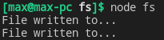
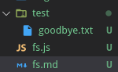

# File System

- [File System](#file-system)
	- [callback](#callback)
	- [mkdir (path, options, callback)](#mkdir-path-options-callback)
	- [writeFile (file, data[, options], callback)](#writefile-file-data-options-callback)
	- [appendFile (path, data[, options], callback)](#appendfile-path-data-options-callback)
	- [readFile (path[, options], callback(err, data) )](#readfile-path-options-callbackerr-data)
	- [rename (oldPath, newPath, callback)](#rename-oldpath-newpath-callback)

***

```javascript
const fs = require('fs')
const path = require('path')
```
***


## callback

For many methods below `callback` functions will usually take one argument - possible error object. 

```javascript
function callback(err){
	if(err) throw err
}
```
***


## mkdir (path, options, callback)

Create a folder asynchronously. 

```javascript
const fs = require('fs')
const path = require('path')

fs.mkdir(path.join(__dirname, '/test'), {}, err => {
	if(err) throw err
	console.log('Folder created!')
})

// (Delete already existing folder if you have this error)
```

For sync folder creation use `mkdirSync`
***


## writeFile (file, data[, options], callback)

When file is a filename, asynchronously writes data to the file, replacing the file if it already exists. data can be a string or a buffer.

When file is a file descriptor, the behavior is similar to calling `fs.write()` directly (which is recommended).

```javascript
const fs = require('fs')
const path = require('path')

fs.mkdir(path.join(__dirname, '/test'), {}, err => {
	if(err) throw err
	console.log('Folder created!')
})

fs.writeFile(path.join(__dirname, '/test', 'hello.txt'), 'Hello, world!', {}, err => {
	if(err) throw err
	console.log('File written to...')
})
```


***


## appendFile (path, data[, options], callback)

Asynchronously append data to a file, creating the file if it does not yet exist. data can be a string or a Buffer.

```javascript
const fs = require('fs')
const path = require('path')

fs.writeFile(path.join(__dirname, '/test', 'hello.txt'), 'Hello, world!', {}, err => {

	fs.appendFile(path.join(__dirname, '/test', 'hello.txt'), '\nAppended text', {}, err => {
		if(err) throw err
		console.log('File written to...')	// triggers
	})
	
	if(err) throw err
	console.log('File written to...')	// also triggers
})

/* Output: 
Hello, world!
Appended text */
```


So, we `writeFile` and then afterwards (in the callback) we `appendFile` to the already existing file.
***


## readFile (path[, options], callback(err, data) )

Asynchronously reads the entire contents of a file.

```javascript
const fs = require('fs')
const path = require('path')

fs.readFile(path.join(__dirname, '/test/hello.txt'), 'utf8', (err, data) => {
	if(err) throw err
	console.log(data)
})
```


***


## rename (oldPath, newPath, callback)

Asynchronously rename file at oldPath to the pathname provided as newPath. In the case that newPath already exists, it will be overwritten. If there is a directory at newPath, an error will be raised instead. 

```javascript
const fs = require('fs')
const path = require('path')

fs.rename(path.join(__dirname, '/test/hello.txt'), path.join(__dirname, '/test/goodbye.txt'), err => {
	if(err) throw err
	console.log('File renamed!')
})
```



