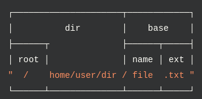

# Path

- [Path](#path)
	- [basename (path)](#basename-path)
	- [dirname (path)](#dirname-path)
	- [extname (path)](#extname-path)
	- [parse (path)](#parse-path)
	- [join (path1, path2, ... )](#join-path1-path2)
	- [relative (path1, path2)](#relative-path1-path2)
Core module for working with directory and file paths.
***

```javascript
const path = require('path')

console.log(__filename)		// /home/max/Dev/a-level/Repeating/Node/modules-reference/path/path.js
```




## basename (path)

File name

```javascript
console.log(path.basename(__filename))	// path.js
```


## dirname (path)

Directory name

```javascript
console.log(path.dirname(__filename))	// /home/max/Dev/a-level/Repeating/Node/modules-reference/path/path.js
```


## extname (path)

Extension

```javascript
console.log(path.extname(__filename))	// .js
```


## parse (path)

Create path object

```javascript
console.log(path.parse(__filename))
```


## join (path1, path2, ... )

Concatenate paths

```javascript
console.log(path.join(__dirname, 'NEW', 'hello.html'))	// /home/max/Dev/a-level/Repeating/Node/modules-reference/path/NEW/hello.html
```


## relative (path1, path2)

Returns a relative path from one path to another

```javascript
path.relative('/data/orandea/test/aaa', '/data/orandea/impl/bbb')
// Returns: '../../impl/bbb'
```