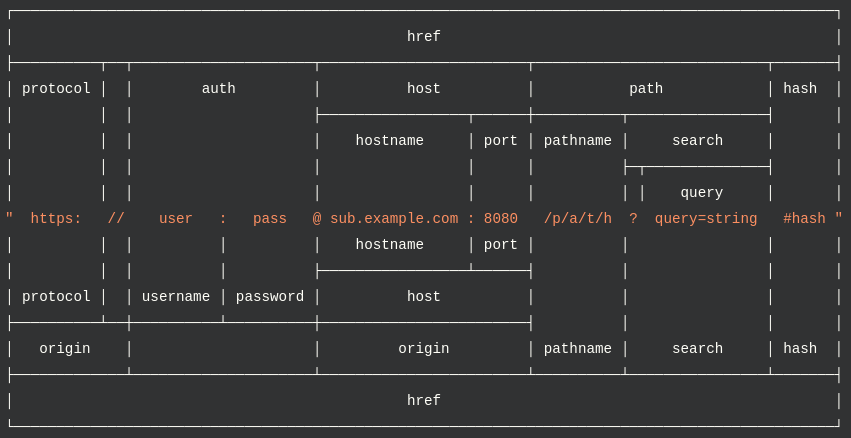
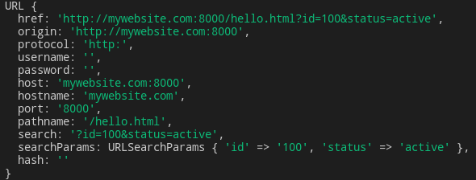

# URL





Basics: 

```javascript
const myUrl = new URL('http://mywebsite.com:8000/hello.html?id=100&status=active')

console.log(myUrl)			// Url object

console.log(myUrl.host)			// mywebsite.com:8000
console.log(myUrl.hostname)		// mywebsite.com
console.log(myUrl.pahtname)		// /hello.html
console.log(myUrl.origin)		// http://mywebsite.com:8000

myUrl.port = '777'		// must be a string!
console.log(myUrl.port)			// 777
```

URLSearchParams object has many known methods (the same as `Map`: set, append, delete get, has, keys, values, etc.)

```javascript
const myUrl = new URL('http://mywebsite.com:8000/hello.html?id=100&status=active')

console.log(myUrl.search)		// ?id=100&status=active
console.log(myUrl.searchParams)		// URLSearchParams { 'id' => '100', 'status' => 'active' }

myUrl.searchParams.append('key', 'value')	// add new search params
console.log(myUrl.search)	// ?id=100&status=active&key=value

// looping over search params
myUrl.searchParams.forEach((value, key) => console.log(`value = ${value}, key = ${key}`))

// Output:
// value = 100, key = id
// value = active, key = status


// if '?' is present at the start, it's ignored
let params = new URLSearchParams('user=abc&query=xyz')

console.log(params.has('user'))		// true
console.log(params.get('user'))		// abc
console.log(params.delete('user'))
console.log(params.toString())		// query=xyz


// Can also accept an object
params = new URLSearchParams({
  user: 'abc',
  query: ['first', 'second']
});
console.log(params.getAll('query'));
// Prints [ 'first,second' ]
console.log(params.toString());
// Prints 'user=abc&query=first%2Csecond'
```